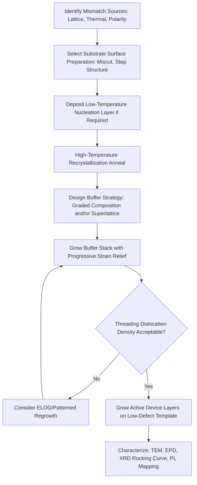

## Defect Control in Heteroepitaxy

### Overview and Fundamental Principle

Heteroepitaxy involves growing a crystalline layer on a substrate of a different material, inevitably introducing lattice mismatch, thermal expansion coefficient mismatch, and often polarity/symmetry mismatch between film and substrate. These mismatches drive the formation of extended crystallographic defects—primarily dislocations, but also stacking faults, antiphase domains, and cracks—that degrade electrical and optical device performance. Defect control encompasses the full suite of substrate engineering, buffer layer design, and growth process strategies used to minimize defect density and confine defects away from active device regions.

**Key Points**

- Heteroepitaxial defects arise from three principal mismatch sources: lattice constant mismatch, thermal expansion coefficient mismatch, and (for dissimilar crystal structures) polarity or symmetry mismatch
- Threading dislocations are the most performance-limiting defect type, as they propagate vertically through the entire epitaxial stack into the active device region
- Defect densities in highly mismatched systems (e.g., GaN-on-sapphire, ~16% mismatch) can be orders of magnitude higher than in near-lattice-matched systems (e.g., AlGaAs-on-GaAs), directly motivating specialized defect-reduction strategies
- Defect control is a first-order determinant of device reliability, minority carrier lifetime, and achievable performance in nearly all heteroepitaxial device technologies

### Defect Taxonomy in Heteroepitaxy

**Key Points**

- **Misfit dislocations**: Form at or near the film/substrate interface, lying largely within the interface plane, and directly relieve accumulated lattice mismatch strain
- **Threading dislocations**: Dislocation segments that propagate from the interface vertically (or at an angle) through the growing film thickness, terminating at or near the growth surface; these are the primary defects of device concern since they intersect active device layers
- **Stacking faults**: Planar defects representing a local disruption in the normal stacking sequence of crystal planes, often nucleating at the heterointerface in zinc-blende/wurtzite or cubic/hexagonal polytype mismatches
- **Antiphase domains (APDs)**: Occur when a polar semiconductor (e.g., GaAs, with distinct Ga and As sublattices) is grown on a non-polar substrate (e.g., Si), where atomic steps of odd height on the substrate surface cause adjacent growth domains to nucleate with inverted sublattice occupation, creating antiphase boundaries where like atoms bond directly (e.g., Ga-Ga or As-As bonds)
- **Cracks**: Arise primarily from thermal expansion coefficient mismatch during post-growth cooldown, particularly significant in thick heteroepitaxial layers (e.g., GaN-on-sapphire or GaN-on-Si) where accumulated thermal stress can exceed the fracture strength of the film

### Thermal Expansion Mismatch Effects

**Key Points**

- Even in a fully relaxed epitaxial film grown at high temperature, cooldown to room temperature introduces additional strain if the film and substrate have different thermal expansion coefficients $\alpha$
- The thermally induced strain upon cooling from growth temperature $T_g$ to room temperature $T_r$ can be approximated as:

$$\varepsilon_{thermal} \approx (\alpha_{film} - \alpha_{substrate})(T_g - T_r)$$

- For GaN-on-sapphire, sapphire's larger thermal expansion coefficient relative to GaN induces compressive strain in the GaN film upon cooldown, which can promote wafer bowing or, in thick films, cracking
- Thermal mismatch effects compound with lattice mismatch effects, meaning growth temperature selection is itself a defect-control lever, trading off dislocation glide mobility (favoring higher temperature for defect glide/annihilation) against thermal strain accumulation on cooldown

### Buffer Layer Engineering Strategies

#### 1. Low-Temperature Nucleation Layers

**Process Sequence:**

1. A thin (typically tens of nanometers) nucleation layer is deposited at substantially lower temperature than the main growth temperature, promoting a high density of small, randomly oriented nucleation islands rather than large, well-ordered crystallites
2. The wafer is subsequently annealed at higher temperature, causing the nucleation layer to partially recrystallize and coalesce into larger-grained, better-oriented crystallites
3. Main high-temperature epitaxial growth proceeds atop this recrystallized nucleation layer, which serves to absorb much of the initial lattice/thermal mismatch before the bulk of the device-quality material is grown

**Key Points**

- This approach is the standard method for GaN-on-sapphire growth, using thin AlN or low-temperature GaN nucleation layers
- The nucleation layer thickness, growth temperature, and post-deposition anneal conditions are critical, empirically optimized parameters that strongly influence final threading dislocation density
- Coalescence of nucleation islands during high-temperature overgrowth is itself a dislocation-generating process, since adjacent islands with slightly misoriented crystal axes create dislocations at their coalescence boundaries

#### 2. Compositionally Graded Metamorphic Buffers

**Key Points**

- Rather than an abrupt heterointerface, composition is ramped gradually over a thick buffer layer (e.g., linearly increasing indium content in InGaAs grown on GaAs), distributing total lattice mismatch across a greater growth thickness
- Gradual grading reduces the local mismatch increment at any given growth stage, favoring dislocation nucleation and glide over a longer effective interaction length, which increases the probability that dislocations annihilate or glide out to the wafer edge rather than threading vertically
- A final constant-composition "relaxed template" layer, matched to the target device layer lattice constant, caps the graded buffer and provides the growth surface for subsequent device layers
- Grading rate (composition change per unit thickness) is a key optimization parameter: too rapid a grade concentrates strain and increases threading dislocation density; too gradual a grade increases buffer thickness and associated cost/thermal budget

#### 3. Superlattice and Strained-Layer Superlattice Buffers

**Key Points**

- Periodic superlattice structures (alternating thin layers of two different compositions) inserted within or atop a buffer layer can bend propagating threading dislocations via the alternating strain fields at each superlattice interface, redirecting dislocations toward the wafer edge rather than continuing vertically
- Strained-layer superlattices (SLS) are commonly used in combination with graded buffers, particularly in III-V and III-nitride systems, to further reduce threading dislocation density beyond what grading alone achieves
- The mechanism relies on dislocation line energy minimization: a threading dislocation encountering an interface with a favorable strain field can lower its total energy by bending to lie partially within the interface plane, converting part of its length into a (less harmful) misfit segment

#### 4. Epitaxial Lateral Overgrowth (ELOG/ELO)

**Process Sequence:**

1. A thin initial epitaxial layer is grown, then patterned with a dielectric mask (typically SiO₂ stripes), exposing only narrow stripe-shaped growth windows
2. Growth resumes selectively within the exposed stripe windows, where threading dislocations from the underlying layer propagate vertically as expected
3. As growth continues, the film grows laterally over the adjacent dielectric mask regions (which cannot support nucleation), and threading dislocations propagating into this laterally overgrown region bend approximately 90° to follow the lateral growth direction rather than continuing vertically
4. The laterally overgrown regions above the dielectric mask therefore exhibit dramatically reduced threading dislocation density compared to the original stripe window regions, and device layers are subsequently grown preferentially using these low-defect-density laterally overgrown areas

**Key Points**

- ELOG was historically critical in enabling commercially viable GaN-based laser diodes, where the very high threading dislocation densities of direct GaN-on-sapphire growth (often >10⁹ cm⁻²) were incompatible with acceptable laser diode lifetime
- Variants include Pendeo-epitaxy (lateral growth from sidewalls of etched substrate pillars, avoiding a foreign dielectric mask entirely) and Facet-Controlled ELOG (deliberately shaping the lateral growth front to maximize dislocation bending efficiency)
- Trade-offs include added process complexity (patterning and regrowth steps) and non-uniform defect density across the wafer (low-defect regions above the mask vs. higher-defect regions above the original growth windows), requiring device layout to align active regions with low-defect areas

### Defect Reduction Strategy Comparison

| Strategy | Primary Mechanism | Typical Application | Key Trade-off |
| --- | --- | --- | --- |
| Low-temperature nucleation layer | Small-grain nucleation + recrystallization | GaN-on-sapphire, GaN-on-Si | Empirically sensitive; coalescence itself generates some dislocations |
| Compositionally graded buffer | Distributes mismatch over thickness | InGaAs-on-GaAs, metamorphic HEMTs | Buffer thickness/cost vs. grading rate |
| Strained-layer superlattice | Dislocation bending via alternating strain fields | III-V and nitride buffer stacks | Added structural complexity |
| Epitaxial lateral overgrowth (ELOG) | Dislocations bend at lateral growth front | GaN laser diodes, high-reliability nitride devices | Patterning/regrowth complexity, non-uniform defect distribution |

### Antiphase Domain Suppression (Polar-on-Nonpolar Heteroepitaxy)

**Key Points**

- Growing polar III-V materials (GaAs, GaP) on non-polar silicon substrates requires substrate surface preparation to ensure single-height atomic steps, since double-height steps on the silicon surface are the primary trigger for antiphase domain nucleation
- Miscut (intentionally off-axis) silicon substrates, combined with specific pre-growth annealing procedures, promote uniform single-height step formation, suppressing APD nucleation
- Two-step growth procedures (a low-temperature initial nucleation step followed by higher-temperature main growth) are also used to favor single-domain nucleation before APD-prone conditions can develop
- Residual antiphase boundaries act as non-radiative recombination centers and can locally short p-n junctions if they intersect device-critical interfaces, making APD suppression particularly critical for III-V-on-Si photonic integration

### Defect Reduction Process Flow

### Characterization Techniques for Defect Density

**Key Points**

- **Etch Pit Density (EPD)**: Selective chemical etching reveals dislocation termination points at the surface as visible pits under optical or electron microscopy, providing a statistically representative areal dislocation density measurement
- **Cross-sectional Transmission Electron Microscopy (TEM)**: Direct imaging of dislocation type, density, and spatial distribution through the layer stack, including visualization of dislocation bending at superlattice or ELOG interfaces
- **X-ray Diffraction (XRD) Rocking Curve Analysis**: Full-width-half-maximum (FWHM) broadening of diffraction peaks correlates with mosaic spread and dislocation density, providing a rapid, non-destructive, wafer-scale defect quality metric
- **Cathodoluminescence (CL) and Photoluminescence (PL) Mapping**: Dark spot density in CL/PL maps correlates with non-radiative recombination centers, typically associated with threading dislocations, providing spatially resolved defect mapping particularly valuable for optoelectronic material qualification
- **Plan-view TEM**: Provides areal dislocation density counts directly comparable to EPD measurements, useful for cross-validating etch-based defect counting techniques

### Applications and Device Impact

**Key Points**

- **GaN-based LEDs and laser diodes**: Defect control via nucleation layers and (for laser diodes) ELOG is essential to achieving acceptable device lifetime, since threading dislocations directly reduce minority carrier lifetime and accelerate degradation under current injection
- **Metamorphic HEMTs**: Graded InGaAs/InAlAs buffers on GaAs substrates rely on defect control to achieve InP-like channel transport properties while confining threading dislocations away from the active channel
- **III-V-on-silicon photonic integration**: Combines antiphase domain suppression, dislocation filtering via strained-layer superlattices, and sometimes ELOG to achieve device-quality III-V material on low-cost, large-diameter silicon substrates
- **Power GaN-on-Si devices**: Requires simultaneous management of lattice mismatch, thermal expansion mismatch (particularly significant given large GaN-on-Si wafer diameters), and crack suppression via engineered AlGaN/AlN transition layers

### Next Steps

- **Epitaxial Lateral Overgrowth (ELOG) Process Variants in Depth**
- **Antiphase Domain Suppression via Substrate Miscut Engineering**
- **Strained-Layer Superlattice Design for Dislocation Filtering**
- **GaN-on-Silicon Power Device Buffer Stack Design**
- **Cathodoluminescence and Photoluminescence Defect Mapping Methods**
- **Metamorphic Buffer Grading Rate Optimization**
- **Thermal Expansion Mismatch and Wafer Bow/Crack Management**
- **Threading Dislocation Impact on Minority Carrier Lifetime and Device Reliability**