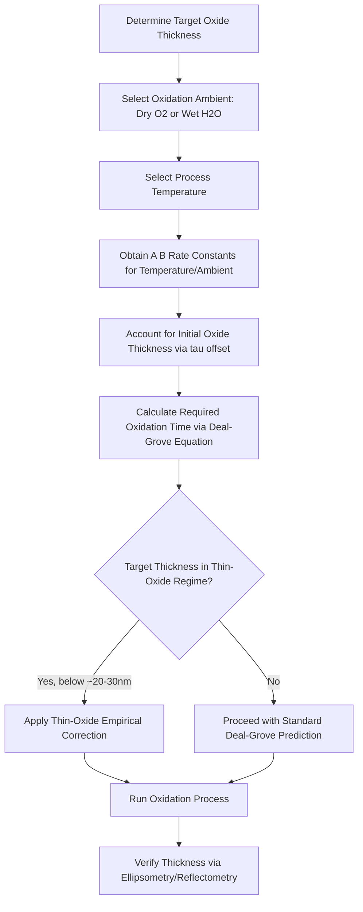

## Oxide Growth Kinetics and the Deal Grove Model

### Overview and Fundamental Principle

The Deal-Grove model, published by Bruce Deal and Andrew Grove in 1965, is the foundational analytical framework describing the kinetics of thermal oxidation of silicon. It models oxide growth as a sequential process involving oxidant transport through the ambient gas, diffusion through the already-formed oxide layer, and chemical reaction at the silicon/oxide interface, yielding a widely used relationship between oxide thickness and oxidation time.

**Key Points**

- Applicable to both dry oxidation (O₂ ambient) and wet oxidation (H₂O/steam ambient), with different rate constants for each
- Accurately describes oxide growth kinetics for oxide thicknesses roughly above 20–30 nm; requires empirical correction terms for very thin oxides where the model's assumptions break down
- Provides the basis for process engineers to predict and control oxide thickness via time-temperature recipes across a wide range of oxidation conditions
- Remains the standard pedagogical and practical starting point for thermal oxidation process design despite known limitations at thin-oxide regimes

### Physical Picture: Three Sequential Transport Steps

**Key Points**

- **Step 1 — Gas-phase transport**: Oxidant species (O₂ or H₂O) are transported from the bulk ambient gas to the outer oxide surface, characterized by a gas-phase mass transfer coefficient $h_g$
- **Step 2 — Diffusion through existing oxide**: Oxidant molecules diffuse through the already-grown SiO₂ layer to reach the silicon/oxide interface, characterized by the diffusivity $D$ of the oxidant species in SiO₂
- **Step 3 — Interface reaction**: At the silicon/oxide interface, the oxidant reacts chemically with silicon to form new oxide, characterized by a surface reaction rate constant $k_s$
- As oxide thickness increases during growth, Step 2 (diffusion through the growing oxide) becomes progressively more rate-limiting, since the diffusion path length increases while the interface reaction step's characteristics remain largely constant

### Oxidation Reactions

**Dry oxidation:**

$$Si(s) + O_2(g) \rightarrow SiO_2(s)$$

**Wet oxidation:**

$$Si(s) + 2H_2O(g) \rightarrow SiO_2(s) + 2H_2(g)$$

**Key Points**

- Wet oxidation proceeds substantially faster than dry oxidation at a given temperature due to the higher solubility and diffusivity of H₂O compared to O₂ in SiO₂
- Dry oxidation produces denser, higher-quality oxide with fewer defects, making it preferred for critical applications such as gate oxides, despite its slower growth rate
- Wet oxidation is typically used for thicker field oxides (e.g., isolation structures) where growth rate and throughput are prioritized over the highest oxide quality

### Deal-Grove Governing Equation

**Key Points**

- The Deal-Grove model yields the general relationship between oxide thickness $x_o$ and oxidation time $t$:

$$x_o^2 + Ax_o = B(t + \tau)$$

where $A$ and $B$ are temperature-dependent rate constants, and $\tau$ is a time offset accounting for any initial oxide thickness present before the modeled oxidation segment begins (e.g., a native oxide or a prior oxidation step)

- $B$ is referred to as the **parabolic rate constant**, and $B/A$ is referred to as the **linear rate constant**
- Solving the quadratic equation for $x_o$ explicitly:

$$x_o = \frac{A}{2}\left[\sqrt{1 + \frac{t+\tau}{A^2/4B}} - 1\right]$$

### Limiting Regimes: Linear and Parabolic Growth

**Example**

For very short oxidation times (thin oxide, where $t + \tau \ll A^2/4B$), the governing equation simplifies to a **linear growth regime**:

$$x_o \approx \frac{B}{A}(t+\tau)$$

In this regime, oxide thickness grows linearly with time, and growth is limited by the interface reaction rate ($k_s$) since the thin oxide presents negligible diffusion resistance.

For long oxidation times (thick oxide, where $t + \tau \gg A^2/4B$), the equation simplifies to a **parabolic growth regime**:

$$x_o^2 \approx Bt$$

In this regime, oxide thickness growth rate progressively slows as $\sqrt{t}$, since diffusion of oxidant through the increasingly thick existing oxide becomes the dominant rate-limiting step.

**Key Points**

- The transition between linear and parabolic behavior is governed by the characteristic thickness scale $A/2$ and characteristic time scale $A^2/4B$, both of which are temperature- and oxidant-species-dependent
- This regime transition explains the commonly observed process behavior where oxide growth rate is fast initially and progressively slows as oxide thickness accumulates, for a fixed oxidation temperature and ambient

### Rate Constant Temperature Dependence

**Key Points**

- Both the linear rate constant $B/A$ and parabolic rate constant $B$ follow Arrhenius-type temperature dependence:

$$B = B_0 \exp\left(-\frac{E_{A,B}}{k_BT}\right)$$

$$\frac{B}{A} = C_0 \exp\left(-\frac{E_{A,B/A}}{k_BT}\right)$$

where $E_{A,B}$ and $E_{A,B/A}$ are the respective activation energies for the parabolic and linear rate processes

- Typical activation energies (dry O₂ oxidation) are approximately 1.2 eV for the parabolic rate constant $B$ (reflecting the activation energy of oxidant diffusivity in SiO₂) and approximately 2.0 eV for the linear rate constant $B/A$ (reflecting the activation energy of the silicon oxidation surface reaction) [Behavior may vary somewhat depending on crystallographic orientation and specific process conditions]
- Higher oxidation temperatures increase both rate constants, enabling either faster growth at fixed thickness targets or the achievement of thicker oxides within practical process time budgets

### Crystallographic Orientation Dependence

**Key Points**

- The linear rate constant $B/A$ (interface-reaction-limited regime) exhibits measurable dependence on silicon crystallographic orientation, since the surface reaction rate depends on the density of available silicon bonds at the oxidizing surface
- (111)-oriented silicon oxidizes faster than (100)-oriented silicon in the linear regime, attributable to the higher density of silicon atoms available for reaction at the (111) surface
- The parabolic rate constant $B$ (diffusion-limited regime) is essentially independent of crystallographic orientation, since bulk oxide diffusivity is a property of the amorphous SiO₂ layer rather than the underlying crystal structure
- This orientation dependence has historically been a consideration in process design, though its practical significance diminishes for thicker oxides where parabolic (orientation-independent) kinetics dominate

### Growth Kinetics Diagram (svg_diagram)

<svg xmlns="http://www.w3.org/2000/svg" viewBox="0 0 640 380">
<text x="320" y="24" font-size="15" font-family="sans-serif" text-anchor="middle" font-weight="bold">Deal-Grove Oxide Thickness vs. Time (svg_diagram)</text>

<line x1="80" y1="320" x2="580" y2="320" stroke="#000" stroke-width="1.5" />
<line x1="80" y1="320" x2="80" y2="60" stroke="#000" stroke-width="1.5" />
<text x="330" y="355" font-size="12" text-anchor="middle" font-family="sans-serif">Oxidation Time (t)</text>
<text x="30" y="190" font-size="12" text-anchor="middle" font-family="sans-serif" transform="rotate(-90 30 190)">Oxide Thickness (x_o)</text>

<path d="M 80 320 Q 200 220 320 170 T 580 90" fill="none" stroke="#2980b9" stroke-width="3" />

<line x1="80" y1="320" x2="200" y2="220" stroke="#c0392b" stroke-width="1.5" stroke-dasharray="5,3" />
<text x="150" y="290" font-size="10" font-family="sans-serif" fill="#c0392b">Linear regime</text>
<text x="150" y="303" font-size="9" font-family="sans-serif" fill="#c0392b" font-style="italic">x_o ~ (B/A)(t+tau)</text>

<text x="450" y="130" font-size="10" font-family="sans-serif" fill="`#27ae60`">Parabolic regime</text>

<text x="450" y="143" font-size="9" font-family="sans-serif" fill="`#27ae60`" font-style="italic">x_o^2 ~ Bt</text>

<circle cx="320" cy="170" r="4" fill="#000" />
<text x="320" y="155" font-size="9" text-anchor="middle" font-family="sans-serif">Transition ~ A²/4B</text>
</svg>

### Thin Oxide Regime Deviations

**Key Points**

- The classical Deal-Grove model systematically underpredicts oxide growth rate for very thin oxides (typically below approximately 20–30 nm), a discrepancy first characterized experimentally by Massoud and others
- Empirical correction terms have been developed (often referred to as "thin oxide enhancement" corrections) adding an additional exponentially decaying growth-rate term active only at small thicknesses, to better fit observed rapid initial growth
- Several physical mechanisms have been proposed for this enhancement, including stress effects near the growing interface, an initial space-charge-enhanced transport regime, and structural relaxation effects in the immediate vicinity of the silicon/oxide interface [Inference: the precise dominant mechanism remains an area of ongoing modeling refinement rather than a single settled explanation]
- This limitation is particularly relevant for ultra-thin gate oxide processes, where accurate thickness control at nanometer-scale dimensions is critical, motivating supplementary empirical models beyond baseline Deal-Grove for advanced process nodes

### Effect of Doping and Pressure on Oxidation Kinetics

**Key Points**

- Heavily doped silicon substrates exhibit modified oxidation rates compared to lightly doped substrates, since high dopant concentrations affect the point defect concentrations and vacancy-mediated transport processes at the oxidizing interface
- Oxidation under elevated ambient pressure (high-pressure oxidation, HIPOX) increases both linear and parabolic rate constants, since the increased oxidant partial pressure raises oxidant solubility in the growing oxide, enabling faster growth or lower-temperature processing for a given target thickness
- High-pressure oxidation is used industrially to reduce thermal budget (lower temperature or shorter time for a given oxide thickness target) while still achieving desired oxide thickness, which is particularly valuable when subsequent thermal budget constraints limit allowable process temperature/time

### Practical Process Design Application

**Example**

Given target oxide thickness $x_o$ and a known oxidation temperature (hence known $A$ and $B$ from tabulated or measured process data), the required oxidation time is obtained by rearranging the Deal-Grove equation:

$$t = \frac{x_o^2 + Ax_o}{B} - \tau$$

A process engineer uses this relationship, combined with characterized $A$, $B$, and $\tau$ values for a given furnace and oxidation ambient, to select the time-temperature recipe achieving a specified target oxide thickness, then verifies actual grown thickness via ellipsometry or reflectometry metrology.

**Key Points**

- $\tau$ must account for any pre-existing oxide (native oxide, or oxide from a prior process step) present at the start of the modeled oxidation segment, since the Deal-Grove model describes incremental growth from an existing thickness rather than growth from a bare silicon starting condition
- Multi-step oxidation processes (e.g., oxidize, anneal in inert ambient, oxidize further) require careful tracking of the effective starting oxide thickness at each step transition to correctly apply the model

### Comparison: Dry vs. Wet Oxidation

| Attribute | Dry Oxidation (O₂) | Wet Oxidation (H₂O) |
| --- | --- | --- |
| Growth rate | Slower | Faster (typically several times higher) |
| Oxide density/quality | Higher, fewer defects | Lower density, more defects/hydrogen incorporation |
| Typical application | Thin, critical oxides (gate oxide) | Thick field/isolation oxides |
| Parabolic rate constant $B$ | Lower | Higher |
| Linear rate constant $B/A$ | Lower | Higher |

### Deal-Grove Application Process Flow

### Applications in Process Technology

**Key Points**

- **Gate oxide formation**: Dry oxidation is standard for thin, high-quality gate dielectrics in CMOS transistor fabrication, where oxide integrity directly determines device reliability and leakage characteristics
- **Field oxide (isolation) formation**: Wet oxidation, historically used in LOCOS (Local Oxidation of Silicon) isolation processes, leverages faster growth rates to achieve the thicker oxides needed for electrical isolation between devices
- **Sacrificial oxide layers**: Thermal oxides grown and subsequently stripped are used to consume a controlled amount of silicon surface (removing implant damage or contamination) or to round sharp corners in trench isolation structures
- **Furnace process recipe design**: Deal-Grove kinetics underpin time-temperature recipe calculations across virtually all thermal oxidation steps in a semiconductor fabrication flow

### Next Steps

- **LOCOS and Shallow Trench Isolation (STI) Process Flows**
- **Gate Oxide Reliability: Time-Dependent Dielectric Breakdown**
- **High-Pressure Oxidation (HIPOX) Process Engineering**
- **Thin Oxide Growth Enhancement Models Beyond Deal-Grove**
- **Ellipsometry and Reflectometry for Oxide Thickness Metrology**
- **Oxidation-Induced Stacking Faults (OISF) Formation Mechanisms**
- **Doping Effects on Silicon Oxidation Kinetics**
- **Furnace Oxidation Equipment: Horizontal Tube vs. Vertical Furnace Design**