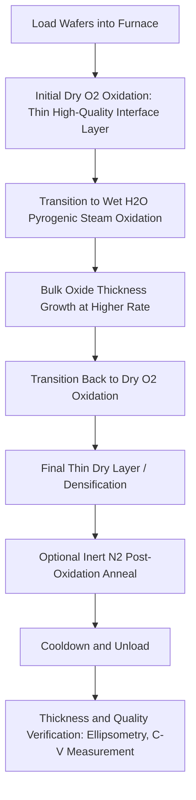

## Dry versus Wet Oxidation

### Overview and Fundamental Principle

Dry and wet oxidation are the two principal thermal oxidation methods used to grow silicon dioxide (SiO₂) on silicon substrates, distinguished by the oxidizing species delivered to the wafer surface: molecular oxygen (O₂) for dry oxidation, and water vapor (H₂O, typically as steam) for wet oxidation. The choice between these two methods represents a fundamental process trade-off between oxide growth rate and oxide quality, governing their respective roles across a semiconductor fabrication flow.

**Key Points**

- Both methods are described within the Deal-Grove kinetic framework, but with distinct linear ($B/A$) and parabolic ($B$) rate constants due to the differing solubility and diffusivity of O₂ versus H₂O in SiO₂
- Dry oxidation produces denser, higher-quality, lower-defect oxide but grows slowly, making it preferred for thin, critical dielectrics such as gate oxides
- Wet oxidation grows substantially faster but yields comparatively lower-density oxide, making it preferred for thick field/isolation oxides where growth rate and throughput matter more than the highest achievable oxide quality
- Many practical process flows combine both methods sequentially (e.g., dry-wet-dry oxidation) to balance growth rate and oxide quality within a single thermal step

### Reaction Chemistry

**Dry oxidation:**

$$Si(s) + O_2(g) \rightarrow SiO_2(s)$$

**Wet oxidation:**

$$Si(s) + 2H_2O(g) \rightarrow SiO_2(s) + 2H_2(g)$$

**Key Points**

- Wet oxidation is typically performed by bubbling an inert carrier gas or O₂ through heated deionized water (or, in modern high-throughput furnaces, via in-situ pyrogenic steam generation from combusting H₂ and O₂ directly within the furnace) to deliver a controlled steam ambient to the wafer
- Pyrogenic oxidation (in-situ combustion of H₂ and O₂ within the furnace tube to generate steam) is the dominant modern industrial wet oxidation method, offering superior moisture content control and purity compared to older bubbler-based steam delivery
- The hydrogen byproduct of wet oxidation must be safely managed via furnace exhaust design, given its flammability

### Growth Rate Comparison

**Key Points**

- Wet oxidation achieves substantially higher growth rates than dry oxidation at a given temperature, generally attributed to the higher solubility and diffusivity of H₂O species compared to O₂ molecules within the amorphous SiO₂ network
- Within the Deal-Grove framework, both the parabolic rate constant $B$ and the linear rate constant $B/A$ are larger for wet oxidation than for dry oxidation at equivalent temperature
- This growth rate difference means that achieving a given target oxide thickness requires substantially less process time under wet conditions, directly benefiting fabrication throughput for thick oxide requirements
- The growth rate advantage of wet oxidation becomes particularly pronounced for thicker oxide targets, where the parabolic (diffusion-limited) regime dominates and the higher oxidant diffusivity of H₂O provides compounding time savings

### Oxide Quality and Structural Differences

**Key Points**

- Dry-grown oxide exhibits a denser, more stoichiometric SiO₂ network with fewer structural defects, correlating with superior electrical characteristics: lower fixed charge density, lower interface trap density, and higher dielectric breakdown strength
- Wet-grown oxide incorporates residual hydrogen-related species (e.g., silanol groups, Si-OH bonds) within the oxide network, arising from the water-based oxidation chemistry, which can act as weak points affecting long-term dielectric reliability and are associated with a somewhat lower oxide density than dry-grown material
- These structural differences make dry oxidation the standard choice wherever oxide electrical quality is a primary device performance or reliability driver, most notably gate dielectrics
- Post-oxidation annealing in an inert ambient (e.g., N₂ anneal) is commonly used after wet oxidation to help density the oxide network and reduce trapped hydrogen-related defects, partially narrowing the quality gap with dry oxide

### Growth Rate vs. Temperature Comparison Chart (svg_diagram)

<svg xmlns="http://www.w3.org/2000/svg" viewBox="0 0 640 360">
<text x="320" y="24" font-size="15" font-family="sans-serif" text-anchor="middle" font-weight="bold">Relative Oxide Growth Rate: Dry vs Wet (svg_diagram)</text>

<line x1="90" y1="300" x2="580" y2="300" stroke="#000" stroke-width="1.5" />
<line x1="90" y1="300" x2="90" y2="60" stroke="#000" stroke-width="1.5" />
<text x="335" y="335" font-size="12" text-anchor="middle" font-family="sans-serif">Oxidation Time</text>
<text x="40" y="180" font-size="12" text-anchor="middle" font-family="sans-serif" transform="rotate(-90 40 180)">Oxide Thickness</text>

<path d="M 90 300 Q 200 150 350 100 T 580 70" fill="none" stroke="#2980b9" stroke-width="3" />
<text x="440" y="90" font-size="11" font-family="sans-serif" fill="#2980b9" font-weight="bold">Wet Oxidation (faster growth)</text>

<path d="M 90 300 Q 250 270 400 230 T 580 190" fill="none" stroke="#c0392b" stroke-width="3" />
<text x="420" y="215" font-size="11" font-family="sans-serif" fill="#c0392b" font-weight="bold">Dry Oxidation (slower, denser)</text>
</svg>

### Applications and Process Selection Criteria

**Key Points**

- **Gate oxides**: Dry oxidation is the standard choice for gate dielectric formation, where low interface trap density, high breakdown strength, and long-term reliability under electric field stress are paramount, and where oxide thicknesses (nanometer scale) are thin enough that dry oxidation's slower growth rate is not a significant throughput concern
- **Field oxide / isolation structures**: Wet oxidation is standard for LOCOS-based isolation and other thick oxide isolation structures, where oxide thicknesses of hundreds of nanometers to over a micron would require impractically long process times under dry conditions
- **Sacrificial oxides**: Either method may be used depending on the specific purpose (surface damage removal, corner rounding in trench structures, screening oxide for implantation), with selection driven by required thickness and available thermal budget rather than electrical quality requirements
- **Combined dry-wet-dry processes**: A common industrial strategy grows a thin high-quality dry oxide layer first (establishing a clean, low-defect interface), followed by a faster wet oxidation to build up bulk thickness efficiently, and concludes with a final thin dry oxidation and/or anneal step to improve the outer oxide surface/interface quality — balancing throughput and electrical performance within a single thermal budget

### Comparison Table: Dry vs. Wet Oxidation

| Attribute | Dry Oxidation (O₂) | Wet Oxidation (H₂O) |
| --- | --- | --- |
| Oxidant species | Molecular oxygen | Water vapor (steam) |
| Growth rate | Slower | Substantially faster |
| Oxide density | Higher | Lower |
| Interface trap density | Lower | Higher (without post-anneal) |
| Dielectric breakdown strength | Higher | Lower (without post-anneal) |
| Parabolic rate constant B | Lower | Higher |
| Linear rate constant B/A | Lower | Higher |
| Typical thickness range | Thin (gate oxides, nm scale) | Thick (field oxides, 100s of nm to >1 μm) |
| Hydrogen byproduct | None | Yes (H₂ gas, requires exhaust management) |
| Typical delivery method | Direct O₂ gas flow | Pyrogenic steam generation (in-situ H₂/O₂ combustion) |

### Process Flow: Combined Dry-Wet-Dry Oxidation

### Metrology and Quality Verification

**Key Points**

- **Ellipsometry and reflectometry**: Standard non-destructive optical techniques for verifying grown oxide thickness against the target Deal-Grove-predicted value, applicable to both dry and wet oxide films
- **Capacitance-Voltage (C-V) measurements**: MOS capacitor test structures reveal fixed oxide charge density and interface trap density, providing direct electrical quality comparison between dry- and wet-grown oxides
- **Time-Dependent Dielectric Breakdown (TDDB) testing**: Accelerated reliability testing under elevated electric field and temperature quantifies long-term oxide reliability differences, particularly relevant for distinguishing dry versus wet (or dry-wet-dry) gate oxide processes
- **Fourier-Transform Infrared Spectroscopy (FTIR)**: Can detect residual Si-OH (silanol) bonding characteristic of wet-grown oxide, providing a structural fingerprint distinguishing wet from dry oxide composition

### Next Steps

- **Deal-Grove Kinetic Model: Rate Constants and Growth Regimes**
- **Pyrogenic Steam Generation Furnace Design**
- **LOCOS Isolation Process Flow Using Wet Field Oxidation**
- **Gate Oxide Reliability and Time-Dependent Dielectric Breakdown**
- **Post-Oxidation Annealing for Hydrogen-Related Defect Reduction**
- **MOS Capacitor C-V Characterization Methodology**
- **High-Pressure Oxidation for Combined Rate and Quality Optimization**
- **Furnace Oxidation Equipment: Horizontal Tube vs. Vertical Furnace Architecture**