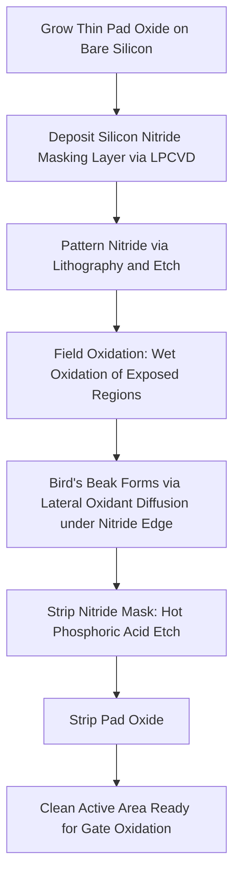

## Local Oxidation of Silicon

### Overview and Fundamental Principle

Local Oxidation of Silicon (LOCOS) is a semiconductor isolation technology in which thick field oxide regions are selectively grown only in designated isolation areas of a wafer, while active device regions are protected from oxidation by a patterned masking layer. LOCOS was the dominant electrical isolation technique for separating adjacent transistors in integrated circuits for several decades before being largely superseded by Shallow Trench Isolation (STI) at more advanced technology nodes.

**Key Points**

- LOCOS exploits the fact that silicon nitride (Si₃N₄) is highly impermeable to oxidizing species (O₂, H₂O), allowing it to serve as an effective local oxidation mask
- Enables selective thick oxide growth in field regions while leaving active device areas as thin, unoxidized (or thinly pad-oxidized) silicon
- Historically used from early integrated circuit generations through roughly the 0.25 μm–0.18 μm technology nodes, after which STI became standard due to LOCOS's inherent lateral encroachment limitations
- Understanding LOCOS remains foundational for appreciating the isolation scaling challenges that motivated the transition to trench-based isolation

### Standard LOCOS Process Sequence

**Process Sequence:**

1. **Pad oxide growth**: A thin (typically 10–50 nm) thermal "pad" oxide is grown across the entire wafer, serving as a stress-relief buffer between the silicon substrate and the subsequently deposited nitride layer
2. **Nitride deposition**: A layer of silicon nitride (typically 100–200 nm, deposited via LPCVD) is deposited over the pad oxide, serving as the oxidation-masking layer
3. **Nitride patterning**: Photolithography and plasma etching pattern the nitride layer, removing it from field (isolation) regions while retaining it over active device areas
4. **Field oxidation**: The wafer undergoes a thermal oxidation step (typically wet oxidation for growth rate efficiency) at elevated temperature; oxide grows rapidly in the exposed field regions where nitride has been removed, while the nitride-protected active areas remain essentially unoxidized
5. **Nitride and pad oxide strip**: Following field oxidation, the remaining nitride mask is removed (typically via hot phosphoric acid etch), followed by removal of the underlying pad oxide, exposing clean active area silicon ready for subsequent gate oxidation and device fabrication

### LOCOS Cross-Section Diagram (svg_diagram)

<svg xmlns="http://www.w3.org/2000/svg" viewBox="0 0 640 340">
<text x="320" y="24" font-size="15" font-family="sans-serif" text-anchor="middle" font-weight="bold">LOCOS Field Oxide Formation (svg_diagram)</text>

<rect x="60" y="180" width="520" height="100" fill="#c9c9c9" stroke="#000" stroke-width="1.5" />
<text x="320" y="255" font-size="11" text-anchor="middle" font-family="sans-serif">Silicon Substrate</text>

<path d="M 60 180 L 200 180 Q 230 175 240 155 Q 245 145 245 135 L 245 130 Q 175 130 160 155 Q 150 170 150 180 Z" fill="#f7d6a3" stroke="#000" stroke-width="1.2" />
<path d="M 420 180 L 580 180 L 580 130 Q 510 130 440 155 Q 425 170 420 180 Z" fill="#f7d6a3" stroke="#000" stroke-width="1.2" />
<text x="500" y="160" font-size="10" text-anchor="middle" font-family="sans-serif">Field Oxide</text>

<rect x="245" y="120" width="175" height="15" fill="#7fb3d5" stroke="#000" />
<text x="330" y="112" font-size="10" text-anchor="middle" font-family="sans-serif">Si3N4 Mask</text>

<rect x="245" y="135" width="175" height="8" fill="#f0c987" stroke="#000" stroke-width="0.5" />
<text x="330" y="150" font-size="8" text-anchor="middle" font-family="sans-serif">Pad Oxide</text>

<text x="180" y="105" font-size="9" text-anchor="middle" font-family="sans-serif" font-style="italic">Bird's Beak</text>

<line x1="180" y1="110" x2="190" y2="150" stroke="#000" stroke-width="0.8" marker-end="url(#arrow3)" />

<text x="480" y="105" font-size="9" text-anchor="middle" font-family="sans-serif" font-style="italic">Bird's Beak</text>

<line x1="470" y1="110" x2="455" y2="150" stroke="#000" stroke-width="0.8" marker-end="url(#arrow3)" />

</svg>

### The Bird's Beak Effect

**Key Points**

- The "bird's beak" refers to the tapered, wedge-shaped encroachment of field oxide laterally underneath the edge of the nitride mask, occurring because oxidant can diffuse laterally through the thin pad oxide layer beneath the nitride edge even though the nitride itself blocks direct vertical oxidant penetration
- This lateral oxidant diffusion causes oxide growth to begin at the nitride edge and progressively extend inward beneath the mask, lifting the nitride edge upward and creating the characteristic tapered profile resembling a bird's beak in cross-section
- Bird's beak length (lateral encroachment distance) typically scales with field oxide thickness and pad oxide thickness; thicker pad oxides and thicker target field oxide both tend to increase bird's beak extent
- Bird's beak directly consumes usable active area, since the encroachment reduces the effective active device area available within a given lithographically defined active area opening — this became the primary scaling limitation driving the eventual transition to STI

### Bird's Beak Mitigation Strategies

**Key Points**

- **Thinner pad oxide**: Reduces the lateral diffusion path for oxidant beneath the nitride edge, shortening bird's beak length, though excessively thin pad oxide increases stress-induced defect generation in the underlying silicon
- **Poly-buffered LOCOS (PBL)**: Inserts a thin polysilicon layer between the pad oxide and nitride, which absorbs mechanical stress more effectively than pad oxide alone, permitting a thinner or eliminated pad oxide and correspondingly reduced bird's beak
- **Sealed-interface local oxidation (SILO) and related nitride-sidewall approaches**: Add a thin nitride sidewall spacer or direct nitride-to-silicon contact at the mask edge to further impede lateral oxidant diffusion
- Despite these refinements, bird's beak could never be fully eliminated in LOCOS-based approaches, representing an inherent geometric limitation of the local-oxidation-through-a-mask-edge mechanism itself

### White Ribbon (Nitride-Induced Defect) Effect

**Key Points**

- Mechanical stress generated at the nitride/pad-oxide/silicon interface during high-temperature field oxidation can induce a thin region of retarded oxide growth immediately adjacent to the active area edge, historically termed the "white ribbon" or Kooi effect, visible as a thin strip of reduced oxide thickness near the active area boundary
- This stress-induced defect region can affect the electrical characteristics of transistors placed very close to the active area edge, historically a design rule consideration in LOCOS-based processes
- Various process modifications (e.g., stress-relief oxide/nitride stack optimization, sacrificial oxidation and strip steps) were developed to mitigate this effect within conventional LOCOS process flows

### LOCOS Scaling Limitations and Transition to STI

**Key Points**

- As transistor gate lengths scaled below approximately 0.35–0.25 μm, the fixed geometric bird's beak encroachment consumed an increasingly significant fraction of the shrinking active area, since bird's beak length did not scale down proportionally with overall device dimensions
- LOCOS also provides comparatively poor planarity across the wafer surface (the tapered field oxide profile creates topography), complicating subsequent lithography as depth-of-focus requirements tightened with each scaling generation
- Field oxide thinning at very narrow active area spacings (the "narrow-width effect" in nMOS threshold voltage, related to encroaching bird's beak from both sides of a narrow active region) further degraded isolation quality control at scaled dimensions
- These combined limitations motivated the industry-wide transition to Shallow Trench Isolation (STI), which uses an anisotropically etched trench filled with deposited (rather than locally grown) oxide, providing bird's-beak-free, highly planar isolation structures suitable for continued scaling

### Comparison: LOCOS vs. STI

| Attribute | LOCOS | Shallow Trench Isolation (STI) |
| --- | --- | --- |
| Isolation formation mechanism | Selective local thermal oxidation | Etched trench filled with deposited oxide |
| Lateral encroachment | Present (bird's beak) | Minimal (near-vertical trench sidewalls) |
| Surface planarity | Poor (tapered field oxide profile) | Good (planarized via CMP) |
| Active area scaling compatibility | Limited below ~0.25 μm nodes | Compatible with continued scaling |
| Process complexity | Moderate (oxidation-based) | Higher (etch, fill, and CMP steps required) |
| Historical usage era | Early ICs through ~0.25–0.18 μm nodes | 0.25 μm node onward, standard in modern CMOS |

### LOCOS Process Flow Diagram

### Characterization and Process Control

**Key Points**

- **Cross-sectional SEM/TEM**: Directly measures bird's beak length and field oxide profile shape, essential for process qualification and design rule verification
- **Ellipsometry**: Verifies field oxide thickness across the wafer, confirming that the field oxidation step achieved the targeted thickness per Deal-Grove-based process design
- **Electrical isolation testing**: Measures leakage current between adjacent active areas separated by field oxide, verifying that isolation is electrically adequate at minimum design-rule spacing
- **Threshold voltage characterization near active area edges**: Detects narrow-width effects and white-ribbon-related electrical anomalies in devices placed close to the active area boundary

### Applications and Historical Context

**Key Points**

- **Early to mid-generation CMOS logic and memory**: LOCOS served as the standard isolation technology across multiple technology generations, from early integrated circuits through roughly the 0.25 μm node
- **Discrete and power device isolation**: LOCOS-based or LOCOS-derived local oxidation approaches remain relevant in some discrete power semiconductor and non-leading-edge analog/mixed-signal processes, where extreme scaling is not required and process simplicity/cost is prioritized [Inference: continued usage in specific niche/legacy process technologies should be verified against current foundry process offerings]
- **Pedagogical significance**: LOCOS remains a standard teaching example for illustrating masked selective oxidation principles, stress effects in thermal processing, and the general engineering trade-offs that motivate isolation technology evolution

### Next Steps

- **Shallow Trench Isolation (STI) Process Flow and CMP Planarization**
- **LPCVD Silicon Nitride Deposition for Masking Applications**
- **Deal-Grove Kinetics Applied to Selective Field Oxidation**
- **Narrow-Width Effect and Isolation-Related Threshold Voltage Shifts**
- **Poly-Buffered LOCOS and Advanced Bird's-Beak Suppression Techniques**
- **Stress Engineering in Thermal Oxidation Masking Stacks**
- **Chemical-Mechanical Polishing for Trench Isolation Planarization**
- **Isolation Technology Scaling History: LOCOS to STI to Advanced FinFET Isolation**