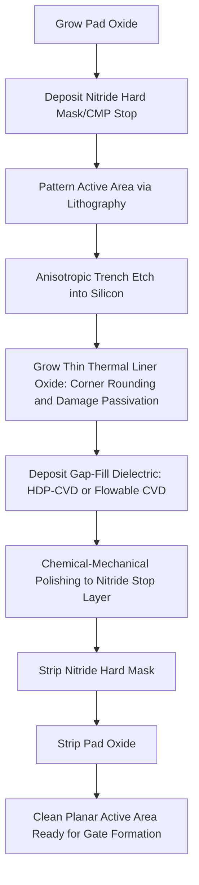

## Shallow Trench Isolation

### Overview and Fundamental Principle

Shallow Trench Isolation (STI) is the standard electrical isolation technology used in modern CMOS fabrication to separate adjacent active device regions. STI replaces the local thermal oxidation approach of LOCOS with a physically etched trench that is subsequently filled with deposited dielectric material, providing near-vertical isolation boundaries free of the lateral encroachment ("bird's beak") that limited LOCOS scalability.

**Key Points**

- STI became the industry-standard isolation technique starting around the 0.25 μm technology node and remains standard through advanced FinFET and gate-all-around process generations
- Eliminates bird's beak lateral encroachment, enabling more efficient use of active area and better compatibility with continued lithographic scaling
- Provides excellent surface planarity after chemical-mechanical polishing (CMP), critical for maintaining lithographic depth-of-focus margins at scaled dimensions
- Trench depth, width, fill material, and corner rounding are all independently engineerable parameters, offering isolation design flexibility unavailable in oxidation-based LOCOS

### Standard STI Process Sequence

**Process Sequence:**

1. **Pad oxide and nitride deposition**: A thin pad oxide (stress buffer) is grown, followed by deposition of a silicon nitride hard mask/CMP stop layer via LPCVD
2. **Trench patterning**: Photolithography defines the active area pattern; the nitride, pad oxide, and underlying silicon are sequentially etched anisotropically (typically via reactive ion etching) to form trenches of the target depth (commonly 200–500 nm, technology-node-dependent) in the field isolation regions
3. **Trench liner oxidation**: A thin thermal oxide liner is grown on the exposed trench sidewalls and bottom, serving to round sharp trench corners (reducing electric field concentration and associated leakage/reliability concerns) and to passivate etch-induced silicon surface damage
4. **Trench fill**: A dielectric gap-fill material—historically high-density plasma (HDP) CVD oxide, and in modern processes increasingly flowable CVD (FCVD) oxide for superior fill of high-aspect-ratio trenches—is deposited to completely fill the trench and overfill above the original wafer surface
5. **Chemical-mechanical polishing (CMP)**: The overfilled dielectric is planarized down to the nitride hard mask/CMP stop layer, removing excess fill material and achieving a globally planar wafer surface
6. **Nitride and pad oxide strip**: The remaining nitride CMP-stop layer and underlying pad oxide are removed (typically hot phosphoric acid for nitride, dilute HF for oxide), exposing clean active area silicon with the isolation trench recessed slightly or level with the original surface

### STI Cross-Section Diagram (svg_diagram)

<svg xmlns="http://www.w3.org/2000/svg" viewBox="0 0 640 320">
<text x="320" y="24" font-size="15" font-family="sans-serif" text-anchor="middle" font-weight="bold">STI Structure Cross-Section (svg_diagram)</text>

<rect x="60" y="150" width="520" height="120" fill="#c9c9c9" stroke="#000" stroke-width="1.5" />
<text x="320" y="240" font-size="11" text-anchor="middle" font-family="sans-serif">Silicon Substrate</text>

<path d="M 150 150 L 150 220 Q 150 230 160 230 L 220 230 Q 230 230 230 220 L 230 150 Z" fill="#f7d6a3" stroke="#000" stroke-width="1.5" />
<path d="M 410 150 L 410 220 Q 410 230 420 230 L 480 230 Q 490 230 490 220 L 490 150 Z" fill="#f7d6a3" stroke="#000" stroke-width="1.5" />

<path d="M 150 150 L 150 220 Q 150 228 158 230" fill="none" stroke="#e67e22" stroke-width="2" />
<path d="M 230 150 L 230 220 Q 230 228 222 230" fill="none" stroke="#e67e22" stroke-width="2" />

<text x="190" y="140" font-size="9" text-anchor="middle" font-family="sans-serif">STI Oxide Fill</text>

<text x="450" y="140" font-size="9" text-anchor="middle" font-family="sans-serif">STI Oxide Fill</text>

<rect x="230" y="150" width="180" height="15" fill="#a8d5ba" stroke="#000" />
<text x="320" y="145" font-size="9" text-anchor="middle" font-family="sans-serif">Active Area (planar surface)</text>

<text x="150" y="245" font-size="8" text-anchor="middle" font-family="sans-serif" font-style="italic">Rounded corner</text>

<line x1="150" y1="240" x2="158" y2="225" stroke="#000" stroke-width="0.7" marker-end="url(#arrow4)" />

</svg>

### Trench Etch Profile Engineering

**Key Points**

- Trench sidewall angle is deliberately engineered to be slightly tapered (near-vertical but not perfectly 90°, typically 85–89° from horizontal) rather than perfectly vertical, since a slight taper improves subsequent gap-fill quality by widening the trench opening relative to its base
- Trench corner rounding, both at the top (silicon surface/trench sidewall junction) and bottom (trench sidewall/trench floor junction) corners, is critical: sharp corners create localized electric field enhancement at the corner, leading to a parasitic "corner device" with anomalously low threshold voltage that can dominate off-state leakage current in narrow-width transistors
- Top corner rounding is typically achieved through a combination of etch process tuning and a sacrificial oxidation/strip step or the liner oxidation step itself, which preferentially oxidizes and consumes silicon more readily at convex corners
- Trench depth must be sufficient to prevent inversion-layer punch-through leakage beneath the trench bottom under worst-case bias conditions, while excessive depth increases aspect ratio challenges for void-free gap fill

### Gap-Fill Technology Evolution

**Key Points**

- **High-Density Plasma (HDP) CVD**: Historically the standard STI gap-fill method, combining simultaneous deposition and sputter-etch components within the plasma process to achieve improved gap-fill capability compared to conventional CVD, though HDP-CVD directional deposition can still form voids in very high-aspect-ratio trenches at advanced nodes
- **Flowable CVD (FCVD)**: A more recent gap-fill technology in which a flowable, liquid-like precursor film is deposited that can conformally flow into and fill very narrow, high-aspect-ratio trenches before being cured/converted into solid SiO₂ via subsequent thermal or plasma treatment, addressing the void-formation limitations of HDP-CVD at scaled trench dimensions
- Sub-atmospheric CVD (SACVD) with ozone/TEOS chemistry has also been used industrially, offering good conformality for moderate aspect ratios
- As technology nodes scale and trench aspect ratios increase, gap-fill technology selection becomes an increasingly critical process integration decision, since void formation within the trench fill directly creates reliability and yield risk (e.g., via subsequent process steps exposing or interacting with buried voids)

### Stress Effects and Mechanical Considerations

**Key Points**

- The trench fill oxide (particularly HDP-CVD oxide) is under inherent mechanical stress relative to the silicon substrate, arising from thermal expansion mismatch and the deposition process's intrinsic film stress characteristics
- This STI-induced stress mechanically couples into the adjacent active silicon region, influencing carrier mobility in nearby transistor channels — an effect that became significant enough at scaled dimensions to be deliberately incorporated into stress-engineering strategies (alongside deliberate strained source/drain SEG) for mobility enhancement or compensation
- STI-induced stress effects are geometry-dependent (varying with active area size, shape, and proximity to STI edges), requiring layout-aware design rules and simulation to manage device-to-device performance variation caused by differing local STI stress environments
- Trench liner oxidation conditions and fill material selection are both process levers available to tune the resulting stress magnitude and sign for a given technology's performance targets

### Narrow-Width and Corner Leakage Effects

**Key Points**

- The parasitic corner transistor formed at rounded (or insufficiently rounded) trench corners can exhibit a lower threshold voltage than the main planar channel, creating a leakage path that activates before the intended device channel as gate voltage increases from the off-state
- This effect becomes more pronounced as active area width narrows, since the relative contribution of corner-region parasitic conduction increases relative to the total channel width — an isolation-related manifestation conceptually analogous to (though mechanistically distinct from) the narrow-width effects observed in LOCOS-based isolation
- Mitigation strategies include optimized corner rounding process steps, dedicated corner-implant or halo-implant adjustments near the STI boundary, and design rule constraints on minimum active area width relative to a given technology's STI corner profile characteristics

### Comparison: STI vs. LOCOS

| Attribute | Shallow Trench Isolation (STI) | LOCOS |
| --- | --- | --- |
| Isolation formation | Etched trench + deposited dielectric fill | Selective local thermal oxidation |
| Lateral encroachment | Minimal (near-vertical sidewalls) | Significant (bird's beak) |
| Surface planarity | Excellent (post-CMP) | Poor (tapered oxide profile) |
| Scaling compatibility | Compatible through advanced nodes | Limited below ~0.25 μm |
| Key defect concerns | Corner leakage, gap-fill voids, STI stress | Bird's beak, white ribbon effect |
| Process complexity | Higher (etch, liner, fill, CMP) | Moderate (oxidation-based) |

### STI Process Flow Diagram

### Characterization and Process Control

**Key Points**

- **Cross-sectional SEM/TEM**: Verifies trench depth, sidewall angle, corner rounding profile, and detects gap-fill voids
- **CMP thickness and planarity metrology**: Confirms uniform post-CMP surface planarity across the wafer, essential for downstream lithography depth-of-focus margins
- **Electrical isolation and leakage testing**: Measures off-state leakage current in narrow-width test structures to detect corner leakage effects and verify isolation adequacy at minimum design-rule spacing
- **Stress mapping (e.g., via micro-Raman spectroscopy)**: Characterizes STI-induced mechanical stress in adjacent active silicon regions, informing stress-aware device and layout design

### Applications and Technology Evolution

**Key Points**

- **Standard CMOS logic and memory isolation**: STI is the universal isolation technology across essentially all modern planar and FinFET CMOS technology nodes
- **FinFET and Gate-All-Around (GAA) isolation**: STI concepts extend into three-dimensional transistor architectures, where trench isolation must additionally accommodate fin/nanosheet formation processes and associated aspect ratio and gap-fill challenges
- **Deep trench isolation (DTI) variants**: Related trench-based isolation concepts, using deeper trenches, are employed in specific applications such as image sensor pixel isolation and certain high-voltage/power device isolation requirements, extending the core STI concept to different depth/application regimes
- **Stress engineering integration**: Modern advanced-node processes deliberately co-optimize STI-induced stress alongside SEG-based source/drain stressors as part of an integrated overall channel strain engineering strategy

### Next Steps

- **LOCOS Isolation and Historical Comparison with STI**
- **High-Density Plasma CVD and Flowable CVD Gap-Fill Technologies**
- **Chemical-Mechanical Polishing (CMP) Process Fundamentals**
- **STI-Induced Stress Engineering for Channel Mobility Enhancement**
- **Corner Leakage and Narrow-Width Effects in Scaled Transistors**
- **FinFET Isolation and Fin Formation Process Integration**
- **Deep Trench Isolation for Image Sensors and Power Devices**
- **Selective Epitaxial Growth Strain Engineering (Complementary Stress Source)**