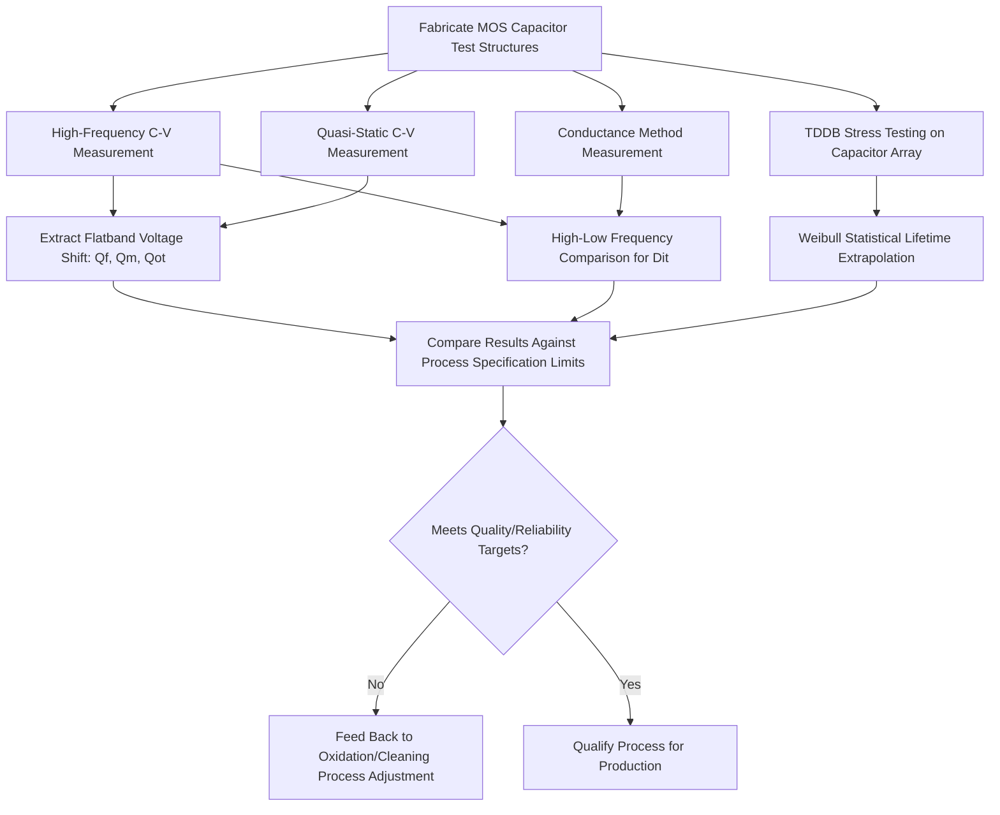

## Oxide Quality and Interface Characterization

### Overview and Fundamental Principle

The electrical and structural quality of thermally grown or deposited silicon dioxide, together with the quality of the Si/SiO₂ interface it forms, directly governs transistor threshold voltage stability, carrier mobility, leakage current, and long-term device reliability. Oxide quality and interface characterization encompasses the measurement techniques and physical defect models used to quantify charge trapped within the oxide bulk, charge and states localized at the Si/SiO₂ interface, and the oxide's ability to withstand electrical stress over device lifetime.

**Key Points**

- Oxide/interface quality is characterized primarily through electrical measurements on MOS capacitor test structures, supplemented by physical and chemical analysis techniques
- Four principal charge/defect categories are distinguished: fixed oxide charge, mobile ionic charge, oxide trapped charge, and interface trapped charge (interface states)
- These defects directly manifest as threshold voltage shifts, flatband voltage shifts, reduced channel mobility, and accelerated dielectric breakdown, making their characterization essential to process qualification
- Reliability characterization (time-dependent dielectric breakdown, hot-carrier degradation, bias-temperature instability) extends static quality characterization into predictive lifetime assessment

### The MOS Capacitor as the Standard Characterization Vehicle

**Key Points**

- A Metal-Oxide-Semiconductor (MOS) capacitor—a simple gate electrode, oxide dielectric, and silicon substrate stack—is the standard test structure for oxide/interface electrical characterization, since it isolates oxide and interface effects from the additional complexity of a full transistor
- Capacitance-Voltage (C-V) measurements, sweeping gate bias while measuring capacitance response, form the primary characterization methodology, since different defect types produce distinct, identifiable signatures in the resulting C-V curve
- Both high-frequency and quasi-static (low-frequency) C-V measurements are typically employed together, since interface trap response differs characteristically between these two measurement regimes, enabling their separation from fixed and bulk oxide charge contributions

### Classification of Oxide and Interface Charges

**Key Points**

- **Fixed oxide charge ($Q_f$)**: Positive charge located very close to the Si/SiO₂ interface (within roughly the first few nanometers of oxide), believed to originate from incomplete oxidation of silicon at the interface during thermal growth; does not exchange charge with the underlying silicon under normal bias conditions, and produces a bias-independent shift in the C-V curve
- **Mobile ionic charge ($Q_m$)**: Primarily alkali ion contamination (notably sodium, Na⁺) that can migrate through the oxide under applied electric field and elevated temperature (bias-temperature stress), causing threshold voltage instability over device operating life; controlled primarily through rigorous fab contamination control and gettering rather than intrinsic oxide growth process optimization
- **Oxide trapped charge ($Q_{ot}$)**: Charge trapped at defect sites distributed throughout the oxide bulk (not confined to the interface region), often associated with structural defects or damage introduced by radiation, hot-carrier injection, or high-field electrical stress during operation
- **Interface trapped charge ($Q_{it}$)**: Charge trapped at electronic states located precisely at the Si/SiO₂ interface, arising from the inherent structural discontinuity between crystalline silicon and amorphous SiO₂ (dangling bonds, strained bonds); unlike the other three charge types, interface traps can exchange charge with the silicon conduction/valence bands depending on the local Fermi level position, giving them a distinctive bias-dependent (rather than fixed) electrical signature

### Flatband Voltage and Charge Extraction

**Example**

The flatband voltage $V_{FB}$ of an ideal MOS capacitor (absent any oxide/interface charge) would equal the metal-semiconductor work function difference $\phi_{ms}$. In a real device, oxide and interface charges shift the measured flatband voltage according to:

$$V_{FB} = \phi_{ms} - \frac{Q_f}{C_{ox}} - \frac{1}{C_{ox}}\int_0^{t_{ox}} \frac{x}{t_{ox}}\rho(x)\,dx$$

where $C_{ox}$ is the oxide capacitance per unit area, $t_{ox}$ is oxide thickness, and $\rho(x)$ represents the spatial charge density distribution through the oxide bulk (capturing the effect of oxide trapped charge, weighted by its distance from the gate electrode). By measuring $V_{FB}$ on capacitors with varying oxide thickness (or comparing to a theoretical ideal $V_{FB}$), the effective areal charge densities $Q_f$ and $Q_{ot}$ can be extracted.

**Key Points**

- Interface trapped charge is extracted separately from $V_{FB}$ shift analysis, since its bias-dependent nature produces a distinct C-V curve distortion (stretch-out) rather than a simple parallel shift
- Comparing high-frequency and quasi-static C-V curves on the same capacitor is a standard technique for isolating and quantifying interface trap density $D_{it}$, since interface traps can follow the slow quasi-static voltage sweep (contributing additional capacitance) but generally cannot respond fast enough to follow a high-frequency small-signal probe

### C-V Curve Signatures Diagram (svg_diagram)

<svg xmlns="http://www.w3.org/2000/svg" viewBox="0 0 640 360">
<text x="320" y="24" font-size="15" font-family="sans-serif" text-anchor="middle" font-weight="bold">MOS C-V Curve Defect Signatures (svg_diagram)</text>

<line x1="80" y1="300" x2="580" y2="300" stroke="#000" stroke-width="1.5" />
<line x1="80" y1="300" x2="80" y2="60" stroke="#000" stroke-width="1.5" />
<text x="330" y="335" font-size="12" text-anchor="middle" font-family="sans-serif">Gate Voltage</text>
<text x="30" y="180" font-size="12" text-anchor="middle" font-family="sans-serif" transform="rotate(-90 30 180)">Capacitance</text>

<path d="M 100 90 Q 220 90 260 200 Q 300 290 500 290" fill="none" stroke="#333" stroke-width="2" />
<text x="480" y="270" font-size="9" font-family="sans-serif">Ideal</text>

<path d="M 150 90 Q 270 90 310 200 Q 350 290 550 290" fill="none" stroke="#2980b9" stroke-width="2" stroke-dasharray="6,3" />
<text x="530" y="255" font-size="9" font-family="sans-serif" fill="#2980b9">Shifted (Qf, Qm, Qot)</text>

<path d="M 100 90 Q 200 95 240 170 Q 280 240 320 260 Q 400 285 500 290" fill="none" stroke="#c0392b" stroke-width="2" stroke-dasharray="2,3" />
<text x="230" y="130" font-size="9" font-family="sans-serif" fill="#c0392b">Stretched-out (Dit)</text>
</svg>

### Interface Trap Density Measurement Techniques

**Key Points**

- **High-Low Frequency Method**: Compares high-frequency and quasi-static C-V curves at the same bias point; the capacitance difference between the two curves directly relates to interface trap density $D_{it}$ at the surface potential corresponding to that bias, providing a full $D_{it}$-versus-energy profile across the silicon bandgap
- **Conductance Method**: Measures the parallel conductance of the MOS capacitor as a function of both bias and small-signal AC frequency; interface trap capture/emission produces a characteristic frequency-dependent conductance peak whose magnitude and position yield $D_{it}$ and interface trap time constants, generally regarded as one of the more sensitive and reliable $D_{it}$ extraction methods
- **Charge Pumping**: Applied to full MOSFET transistor structures (rather than simple capacitors), this technique pulses the gate between accumulation and inversion, causing interface traps to alternately capture and emit carriers; the resulting substrate current directly quantifies interface trap density, and is widely used for characterizing localized interface trap generation (e.g., near the drain, associated with hot-carrier degradation)
- **Deep-Level Transient Spectroscopy (DLTS)**: Primarily used for characterizing discrete trap levels in bulk semiconductor material, but variants are applicable to interface and near-interface trap characterization in specific research contexts

### Dielectric Breakdown and Reliability Characterization

**Key Points**

- **Time-Dependent Dielectric Breakdown (TDDB)**: Accelerated stress testing applies a constant elevated electric field (and often elevated temperature) to a population of MOS capacitors, recording time-to-breakdown for each device; statistical analysis (typically Weibull distribution fitting) extrapolates expected oxide lifetime under normal operating field conditions
- **Percolation model**: The physical basis commonly used to explain TDDB behavior in thin oxides, in which defect generation under electrical stress is modeled as progressive random trap generation within the oxide, with breakdown occurring once a continuous percolation path of traps connects the two oxide interfaces
- **Stress-Induced Leakage Current (SILC)**: A gradual increase in oxide leakage current under electrical stress, preceding hard dielectric breakdown, attributed to trap-assisted tunneling through defects generated during stress; SILC monitoring serves as an early-warning reliability indicator distinct from catastrophic breakdown detection alone
- **Bias-Temperature Instability (BTI)**: Threshold voltage drift under combined electrical bias and elevated temperature stress over extended time, with Negative BTI (NBTI, affecting PMOS under negative gate bias) and Positive BTI (PBTI, affecting NMOS) both linked to interface trap generation and/or hole/electron trapping within the gate dielectric, representing a critical reliability characterization category for modern high-k/metal-gate stacks as well as conventional SiO₂

### Physical and Chemical Characterization Techniques

**Key Points**

- **Fourier-Transform Infrared Spectroscopy (FTIR)**: Detects characteristic vibrational bond signatures (Si-O-Si, Si-OH, Si-H) within the oxide film, distinguishing structural composition differences such as those between dry- and wet-grown oxide
- **X-ray Photoelectron Spectroscopy (XPS)**: Provides depth-resolved chemical bonding state information near the Si/SiO₂ interface, useful for characterizing interfacial sub-oxide states (Si in intermediate oxidation states between Si⁰ and Si⁴⁺) that contribute to interface trap formation
- **High-Resolution Transmission Electron Microscopy (HRTEM)**: Directly images the physical Si/SiO₂ interface roughness and oxide thickness at atomic-scale resolution, particularly critical for ultra-thin gate oxide and high-k dielectric stack characterization
- **Secondary Ion Mass Spectrometry (SIMS)**: Depth-profiles elemental and dopant concentration through the oxide and into the underlying silicon, useful for detecting contamination (e.g., mobile ion sources) or dopant penetration through thin gate oxides

### Extension to High-k Dielectric Stacks

**Key Points**

- Modern advanced CMOS gate stacks increasingly use high-k dielectric materials (e.g., hafnium-based oxides) rather than pure SiO₂, introducing additional characterization considerations beyond classical Si/SiO₂ interface theory
- High-k/silicon interfaces typically require an interfacial SiO₂ or SiON layer to maintain acceptable interface trap density, since direct high-k/silicon contact generally produces substantially higher interface state density than the well-optimized native Si/SiO₂ system
- Bias-temperature instability characterization becomes particularly critical for high-k/metal-gate stacks, since high-k dielectrics have historically exhibited more pronounced BTI degradation mechanisms compared to conventional SiO₂/polysilicon gate stacks [Inference: the precise magnitude of this difference is process- and material-specific and requires reference to current technology-specific reliability data]
- Characterization methodology (C-V, conductance method, charge pumping, TDDB) extends conceptually to high-k stacks, though extraction models require modification to account for the different dielectric constant, band offsets, and trap energy distributions involved

### Characterization Technique Summary Table

| Technique | Primary Information Extracted | Structure Required |
| --- | --- | --- |
| High-Frequency/Quasi-Static C-V | Flatband shift, fixed/trapped charge, $D_{it}$ profile | MOS capacitor |
| Conductance Method | $D_{it}$ and interface trap time constants | MOS capacitor |
| Charge Pumping | Localized $D_{it}$, hot-carrier-induced trap generation | Full MOSFET |
| TDDB | Time-to-breakdown, extrapolated oxide lifetime | MOS capacitor (stress array) |
| FTIR | Bulk oxide bonding structure (Si-O-Si, Si-OH) | Blanket oxide film |
| XPS | Interfacial sub-oxide bonding states | Blanket oxide film |
| HRTEM | Physical interface roughness, thickness | Cross-sectioned device/film |
| SIMS | Elemental/dopant depth profile, contamination | Blanket oxide film |

### Process Flow: Oxide Quality Qualification

### Applications in Process Qualification

**Key Points**

- **Gate oxide process qualification**: New or modified thermal oxidation, cleaning, or anneal process steps are qualified against established fixed charge, interface trap density, and TDDB lifetime specifications before release to production
- **Contamination monitoring**: Mobile ionic charge (particularly sodium) measurement via bias-temperature stress C-V testing serves as an ongoing fab contamination control monitor, detecting process excursions from metal contamination sources
- **Reliability qualification for new technology nodes**: TDDB, BTI, and hot-carrier characterization form the core reliability qualification dataset required before a new gate dielectric process (conventional SiO₂ or high-k) can be released for product use
- **Radiation-hardness characterization**: Oxide trapped charge and interface trap generation under ionizing radiation exposure are characterized for space and radiation-hardened electronics applications, using similar C-V-based methodologies adapted to pre/post-irradiation comparison

### Next Steps

- **Deal-Grove Oxidation Kinetics and Their Link to Interface Quality**
- **High-k Metal Gate Stack Integration and Interfacial Layer Engineering**
- **Bias-Temperature Instability (NBTI/PBTI) Mechanisms and Modeling**
- **Charge Pumping Methodology for Localized Interface Trap Characterization**
- **Time-Dependent Dielectric Breakdown and Percolation Modeling**
- **Contamination Control and Mobile Ion Gettering in Fab Processes**
- **MOS Capacitor C-V Measurement Theory and Practice**
- **Hot-Carrier Injection and Degradation Mechanisms in Scaled MOSFETs**