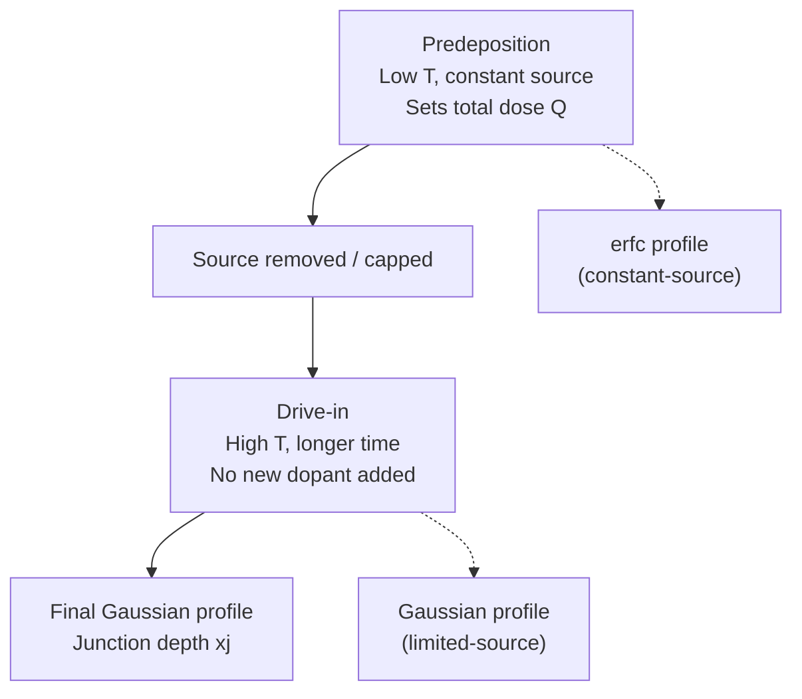

## Predeposition and Drive-In Diffusion

### Overview

Predeposition and drive-in diffusion is a classic two-step thermal doping process used to introduce controlled quantities of dopant atoms into a semiconductor substrate and then redistribute them to a desired junction depth and profile. Although largely superseded by ion implantation combined with anneal/drive steps in modern high-precision processes, this technique remains foundational to understanding diffusion physics and is still used in simpler or legacy fabrication flows, as well as being the conceptual basis for post-implant anneal/drive steps used today.

The process separates dopant **introduction** (predeposition) from dopant **redistribution** (drive-in), allowing independent control over total dopant dose and final junction depth/profile shape — something a single diffusion step cannot achieve as precisely.

### Step 1: Predeposition

**Purpose**: Introduce a fixed, controlled quantity of dopant into the near-surface region of the wafer.

Predeposition is performed at a relatively low temperature (typically 900-1000°C for silicon) with the wafer exposed to a dopant source (solid, liquid, or gaseous — e.g., BBr₃ for boron, POCl₃ for phosphorus) that maintains a constant surface concentration equal to the **solid solubility limit** $C_s$ of the dopant in the substrate at that temperature.

Because the surface concentration is held fixed by the external source throughout this step, the resulting dopant profile follows the **complementary error function (erfc)** solution to the diffusion equation:

$$C(x,t) = C_s \cdot \text{erfc}\left(\frac{x}{2\sqrt{D_{pre}t_{pre}}}\right)$$

where $D_{pre}$ is the diffusion coefficient at the predeposition temperature and $t_{pre}$ is the predeposition time.

**Key Points**

- This is a **constant-source diffusion** boundary condition (infinite source).
- Surface concentration $C_s$ remains fixed at the solid solubility limit regardless of time — the source can always supply more dopant than the surface consumes.
- The total dose introduced (dopant atoms per unit area) is:

$$Q_{pre} = \frac{2}{\sqrt{\pi}}C_s\sqrt{D_{pre}t_{pre}}$$

This dose $Q_{pre}$ is the critical quantity carried forward into the drive-in step — predeposition's main job is to precisely fix this total dose, not to determine final junction depth.

### Step 2: Drive-In

**Purpose**: Redistribute the fixed dose $Q_{pre}$ deeper into the substrate and shape the final profile, without adding additional dopant.

Drive-in is performed at a higher temperature (typically 1000-1200°C) for a longer time, often in an oxidizing ambient (which simultaneously grows a passivating oxide layer over the junction). Since the dopant source is removed (or the surface dose is finite and fixed), this step is treated as a **limited-source diffusion** with a fixed total dose $Q_{pre}$, no longer replenished. The resulting profile follows a **Gaussian distribution**:

$$C(x,t) = \frac{Q_{pre}}{\sqrt{\pi D_{drive}t_{drive}}}\exp\left(-\frac{x^2}{4D_{drive}t_{drive}}\right)$$

**Key Points**

- This is a **limited-source (finite-dose) diffusion** boundary condition.
- The dose $Q_{pre}$ is conserved (assuming negligible dopant loss to the growing oxide or evaporation), only its spatial distribution changes.
- Surface concentration now **decreases** over time as more of the fixed dose spreads deeper:

$$C_s(t_{drive}) = \frac{Q_{pre}}{\sqrt{\pi D_{drive}t_{drive}}}$$

### Process Flow Diagram

### Junction Depth Determination

The junction depth $x_j$ is the point where the diffused dopant concentration equals the background (substrate) doping concentration $C_B$. For the drive-in Gaussian profile:

$$x_j = 2\sqrt{D_{drive}t_{drive}}\sqrt{\ln\left(\frac{Q_{pre}}{C_B\sqrt{\pi D_{drive}t_{drive}}}\right)}$$

This equation is typically solved iteratively or graphically in practice, since $x_j$ appears both explicitly and inside the logarithm's argument (through the $C_s(t_{drive})$ term).

### Why Two Steps Instead of One

**Key Points**

- **Dose control**: Predeposition at fixed solid solubility gives extremely reproducible total dose regardless of minor process variations, since the surface concentration is pinned to a known physical constant (the solubility limit) rather than depending sensitively on source flow rates or exposure time precision.
- **Independent profile shaping**: Drive-in time and temperature can be tuned independently to achieve a desired junction depth and surface concentration without needing to re-control the dopant source delivery.
- **Deep junctions with low surface concentration**: A single erfc-only process struggles to simultaneously achieve deep junctions and low surface doping (needed to control threshold voltage, contact behavior, etc.), whereas separating the steps allows the drive-in stage to spread a fixed dose deeply while surface concentration naturally drops.

### The Diffusion Coefficient and Its Temperature Dependence

Both diffusion coefficients ($D_{pre}$, $D_{drive}$) follow an Arrhenius relationship:

$$D(T) = D_0 \exp\left(-\frac{E_a}{kT}\right)$$

where $D_0$ is a pre-exponential factor and $E_a$ is the activation energy for that dopant-substrate system (e.g., boron and phosphorus in silicon have well-characterized $D_0$ and $E_a$ values documented in standard semiconductor processing references). Because $D$ depends exponentially on temperature, drive-in temperature is the most sensitive lever for controlling final junction depth — small temperature variations produce disproportionately large changes in $x_j$.

### Dopant Segregation at the Oxide Interface

**Key Points**

When drive-in occurs in an oxidizing ambient (common, since oxide growth conveniently passivates the junction), dopants redistribute at the Si-SiO₂ interface according to the **segregation coefficient** $m = C_{Si}/C_{ox}$ at equilibrium:

- **Boron** ($m < 1$): Boron preferentially partitions into the growing oxide, depleting the silicon surface region ("boron depletion" or "boron pile-up in oxide") — this can push $C_s$ below the level predicted by the pure Gaussian drive-in equation.
- **Phosphorus** ($m > 1$): Phosphorus tends to pile up at the silicon surface (rejected from the growing oxide), potentially increasing near-surface concentration above the simple model's prediction.

This segregation effect means real predep/drive-in profiles deviate from the idealized erfc/Gaussian equations near the surface, and accurate process modeling requires segregation-corrected boundary conditions (captured in process simulators like SUPREM/TCAD tools) rather than the analytical formulas alone. [Inference: the magnitude of deviation from ideal Gaussian/erfc behavior is process-condition-dependent (oxidation rate, ambient, temperature) and cannot be quantified generally without simulation or process-specific data.]

### Worked Example

**Example**

Given: Boron predeposition at 950°C for 30 minutes, $D_{pre} = 5\times10^{-15}\ \text{cm}^2/\text{s}$, $C_s = 2\times10^{20}\ \text{cm}^{-3}$ (approximate solid solubility of boron at this temperature). Drive-in at 1150°C for 60 minutes, $D_{drive} = 8\times10^{-13}\ \text{cm}^2/\text{s}$. Background doping $C_B = 1\times10^{15}\ \text{cm}^{-3}$.

Step 1 — Predeposition dose:

$$t_{pre} = 30\times60 = 1800\ \text{s}$$

$$\sqrt{D_{pre}t_{pre}} = \sqrt{(5\times10^{-15})(1800)} = \sqrt{9\times10^{-12}} = 3\times10^{-6}\ \text{cm}$$

$$Q_{pre} = \frac{2}{\sqrt{\pi}}(2\times10^{20})(3\times10^{-6}) \approx 1.13(2\times10^{20})(3\times10^{-6}) \approx 6.77\times10^{14}\ \text{cm}^{-2}$$

Step 2 — Drive-in parameters:

$$t_{drive} = 60\times60 = 3600\ \text{s}$$

$$\sqrt{D_{drive}t_{drive}} = \sqrt{(8\times10^{-13})(3600)} = \sqrt{2.88\times10^{-9}} \approx 5.37\times10^{-5}\ \text{cm}$$

Step 3 — New surface concentration after drive-in:

$$C_s(t_{drive}) = \frac{6.77\times10^{14}}{\sqrt{\pi}(5.37\times10^{-5})} = \frac{6.77\times10^{14}}{9.52\times10^{-5}} \approx 7.11\times10^{18}\ \text{cm}^{-3}$$

Step 4 — Junction depth:

$$x_j = 2(5.37\times10^{-5})\sqrt{\ln\left(\frac{7.11\times10^{18}}{1\times10^{15}}\right)} = (1.074\times10^{-4})\sqrt{\ln(7110)}$$

$$\ln(7110) \approx 8.87 \Rightarrow \sqrt{8.87}\approx 2.98$$

$$x_j \approx (1.074\times10^{-4})(2.98) \approx 3.2\times10^{-4}\ \text{cm} = 3.2\ \mu\text{m}$$

This junction depth and surface concentration are consistent with the expected order of magnitude for a two-step boron diffusion at these thermal budgets, though real fabrication would refine these values against measured solid-solubility and diffusivity data tables and segregation effects. [Inference: solid solubility and diffusivity values used here are representative textbook figures; precise values depend on the referenced dataset and specific ambient conditions.]

### Comparison: Predep/Drive-in vs. Ion Implantation + Anneal

| Aspect | Predep/Drive-in | Ion Implant + Anneal |
| --- | --- | --- |
| Dose control | Set by solid solubility (fixed per temperature) | Directly controlled by beam current/time — arbitrary dose |
| Profile shape | erfc (predep) then Gaussian (drive-in) | As-implanted Gaussian/Pearson-IV, refined by anneal diffusion |
| Depth control | Coupled to high-temperature, long-time budget | Controlled independently via implant energy |
| Lateral spread | Significant (isotropic diffusion under masks) | Minimal (nearly vertical implantation) |
| Modern usage | Legacy/simple processes | Standard in modern VLSI |

### Related Topics

- Fick's laws of diffusion and boundary condition solutions (erfc vs. Gaussian)
- Solid solubility limits and dopant-specific diffusion coefficients
- Ion implantation range straggling and as-implanted profiles
- Rapid thermal annealing (RTA) and dopant activation
- Segregation coefficients and dopant redistribution during oxidation
- Sheet resistance and four-point-probe characterization of diffused layers
- TCAD process simulation (SUPREM, Sentaurus Process)