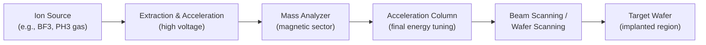
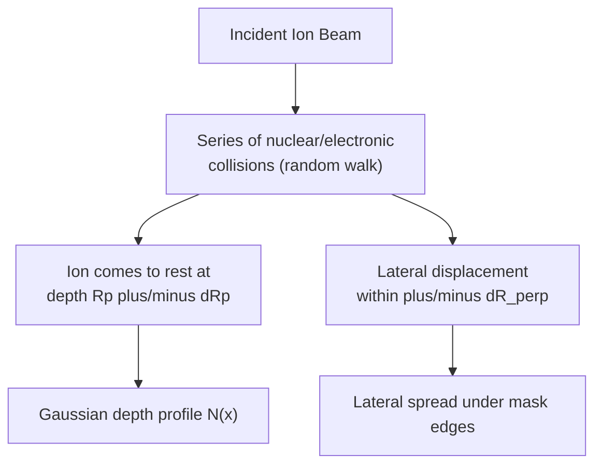

## Ion Implantation Physics and Range Distribution

### Overview

Ion implantation is the dominant doping technique in modern semiconductor fabrication, in which accelerated dopant ions are directed into a target substrate with a controllable energy and dose. Unlike thermal diffusion, implantation decouples dopant introduction from thermal budget, allows precise, independently tunable control of both dose (via beam current and time) and depth (via acceleration energy), and produces highly directional, near-vertical doping profiles suitable for fine-geometry devices. The technique's physics centers on how energetic ions lose energy to the target lattice and come to rest, producing a statistical distribution of final ion positions rather than a single fixed depth.

### Basic System Architecture

An ion implanter generates ions from a source gas, mass-analyzes them (using a magnetic field to select only the desired ion species/charge state by mass-to-charge ratio, rejecting contaminants), accelerates them to the target energy, and scans the beam (or the wafer) to achieve uniform dose coverage across the wafer surface.

### Energy Loss Mechanisms

As an energetic ion penetrates the target, it loses energy through two competing mechanisms:

**1. Nuclear Stopping**

Energy loss via elastic collisions with target atomic nuclei, causing significant angular deflection of the ion path and displacement of target atoms from their lattice sites (the primary source of implant-induced crystal damage).

$$-\left(\frac{dE}{dx}\right)_n = N \cdot S_n(E)$$

where $N$ is the target atomic density and $S_n(E)$ is the nuclear stopping cross-section, which is significant at low ion velocities (low energy or heavy ions).

**2. Electronic Stopping**

Energy loss via inelastic interactions with the target's electron cloud (exciting/ionizing electrons), which causes minimal angular deflection and dominates at high ion velocities.

$$-\left(\frac{dE}{dx}\right)_e = N \cdot S_e(E) \propto \sqrt{E}$$

**Key Points**

- At high implant energies (or for light ions like boron), electronic stopping dominates, and the ion path is relatively straight until it slows enough for nuclear stopping to take over.
- At low energies (or for heavy ions like arsenic/antimony), nuclear stopping dominates throughout much of the trajectory, producing more lateral scattering and shallower, more damage-intensive profiles.
- Total stopping power is the sum: $-dE/dx = N[S_n(E)+S_e(E)]$, and the ion's total path length (range) is found by integrating $dE$ over this combined stopping power from initial energy down to zero.

### The Gaussian Range Distribution Model

Because each ion undergoes a statistically random sequence of collisions, ions of identical initial energy come to rest at a distribution of depths rather than a single depth. The simplest and most widely used first-order model treats the implanted profile as Gaussian:

$$N(x) = N_p \exp\left(-\frac{(x-R_p)^2}{2\Delta R_p^2}\right)$$

where:

- $R_p$ = **projected range** — the mean total depth (measured along the original beam direction) at which ions come to rest
- $\Delta R_p$ = **projected straggle** — the standard deviation of the range distribution, capturing the statistical spread due to the random nature of the collision cascade
- $N_p$ = peak concentration at $x = R_p$

The peak concentration relates to total implant dose $Q$ (ions/cm²) by:

$$N_p = \frac{Q}{\sqrt{2\pi}\Delta R_p}$$

This is the direct implantation analog of the drive-in diffusion Gaussian, but here the profile arises from ion stopping statistics rather than thermal diffusion, and $R_p$, $\Delta R_p$ are functions of ion species, ion energy, and target material rather than of diffusion time and temperature.

### Lateral Straggle

In addition to depth spread, ions also scatter laterally (perpendicular to the beam direction), characterized by the **lateral straggle** $\Delta R_\perp$. This becomes significant in determining the effective doping profile underneath mask edges (important for source/drain extension design and short-channel effect control), since dopants implanted near a mask opening's edge spread sideways underneath the mask by an amount comparable to $\Delta R_\perp$.

### Dependence of Rp and ΔRp on Ion Species and Energy

**Key Points**

- $R_p$ increases roughly monotonically with implant energy for a given ion/target combination, though not perfectly linearly, since stopping power itself is energy-dependent.
- For a fixed energy, lighter ions (e.g., boron, atomic mass ~11) penetrate deeper than heavier ions (e.g., arsenic, atomic mass ~75) because lighter ions lose energy more slowly per unit path length via nuclear stopping.
- $\Delta R_p$ generally scales with $R_p$ but the ratio $\Delta R_p/R_p$ varies by species — light ions like boron tend to have proportionally larger straggle relative to their range compared to heavy ions like arsenic, which are more sharply confined near $R_p$.
- These parameters are tabulated from simulation (e.g., SRIM/TRIM Monte Carlo calculations) or experimental SIMS (Secondary Ion Mass Spectrometry) profiling for standard ion-target-energy combinations used in industry, rather than derived from a single closed-form analytical expression in practice. [Fact: SRIM/TRIM-based lookup tables are standard practice in process design; exact tabulated $R_p$/$\Delta R_p$ values for a specific ion/energy/target combination should be verified against current SRIM data or foundry PDK documentation rather than assumed from memory.]

### Beyond the Simple Gaussian: Higher-Order Corrections

The single Gaussian model is a first-order approximation and becomes increasingly inaccurate for describing the profile tails (important for junction leakage and channeling-related defects). More accurate models include:

**Pearson-IV Distribution**

Adds skewness and kurtosis correction terms beyond the basic Gaussian, using four moments (mean, variance, skewness, kurtosis) fitted to Monte Carlo or experimental data. This captures the characteristic asymmetric tail — typically extending deeper than a pure Gaussian would predict — observed in most real implant profiles.

**Dual-Pearson or Joined Half-Gaussian Models**

Some process simulators use two different half-Gaussian or Pearson functions on either side of $R_p$ to separately fit the shallower "front" side and the deeper "tail" side of the profile, which behave asymmetrically due to the physics of the slowing-down process.

[Inference: the specific choice between Pearson-IV, dual-Pearson, or other higher-order models in a given process simulator is a modeling/software implementation detail, and results can differ slightly between tools such as SRIM, SUPREM, and Sentaurus for the same nominal implant conditions.]

### Channeling Effects

**Key Points**

If the ion beam is aligned closely with a major crystallographic axis of the single-crystal target (e.g., along a `<110>` or `<100>` direction in silicon), ions can travel through open channels between atomic planes with dramatically reduced nuclear stopping, penetrating far deeper than the random (amorphous-equivalent) Gaussian model predicts. This is called **channeling** and produces a long, difficult-to-control deep tail in the implant profile.

Standard mitigation techniques include:

- **Tilting the wafer** (typically 7° off the major crystal axis) so the beam does not align with an open channel
- **Screen oxide layer**: A thin oxide (or nitride) layer grown/deposited before implant randomizes the ion trajectory slightly before it enters the crystalline substrate, reducing channeling probability
- **Pre-amorphization implant**: A heavy, electrically inactive species (e.g., germanium or silicon self-implant) is implanted first to amorphize the near-surface region, eliminating crystalline channels entirely for the subsequent dopant implant

### Implant-Induced Damage and Amorphization

Nuclear stopping displaces target atoms from lattice sites, creating point defects (vacancies and interstitials) and, at sufficiently high dose, complete amorphization of the implanted region. This damage must be repaired and dopants electrically activated via a post-implant thermal anneal (e.g., rapid thermal annealing, RTA, or spike/laser annealing in advanced processes), which also causes some additional diffusion/redistribution of the as-implanted profile — meaning the final as-fabricated profile is a combination of the implant's Gaussian/Pearson-IV distribution and subsequent anneal-driven diffusion. [Inference: the degree of additional diffusion during anneal depends heavily on anneal thermal budget and is a separate process step whose magnitude cannot be predicted from implant physics alone.]

### Worked Example

**Example**

Given: Boron implant into silicon at $E = 50\ \text{keV}$, dose $Q = 1\times10^{14}\ \text{cm}^{-2}$. Using representative SRIM-tabulated values for this ion/energy/target combination: $R_p \approx 0.18\ \mu\text{m}$, $\Delta R_p \approx 0.06\ \mu\text{m}$. [Unverified: these specific numeric values are illustrative/representative figures for this worked example and should be confirmed against current SRIM output or a specific process reference before use in an actual design.]

Step 1 — Peak concentration:

$$N_p = \frac{Q}{\sqrt{2\pi}\Delta R_p} = \frac{1\times10^{14}}{\sqrt{2\pi}(0.06\times10^{-4}\ \text{cm})} = \frac{1\times10^{14}}{(2.507)(6\times10^{-6})} \approx 6.65\times10^{18}\ \text{cm}^{-3}$$

Step 2 — Concentration at the surface ($x=0$):

$$N(0) = N_p\exp\left(-\frac{R_p^2}{2\Delta R_p^2}\right) = 6.65\times10^{18}\exp\left(-\frac{(0.18)^2}{2(0.06)^2}\right) = 6.65\times10^{18}\exp(-4.5)$$

$$N(0) \approx 6.65\times10^{18}\times 0.0111 \approx 7.4\times10^{16}\ \text{cm}^{-3}$$

This shows the characteristic "buried" implant profile — peak concentration occurs below the surface at $R_p$, not at the surface itself, unlike the constant-source predeposition diffusion profile, which peaks exactly at $x=0$. This is a key qualitative distinction between the two doping techniques.

### Comparison: Implantation vs. Diffusion Profiles

| Aspect | Ion Implantation | Predep/Drive-in Diffusion |
| --- | --- | --- |
| Peak location | Buried, at $R_p$ below surface | At the surface ($x=0$) |
| Depth control | Independent via beam energy | Coupled to time/temperature |
| Dose control | Direct, precise (beam current × time) | Indirect (solid solubility limited) |
| Lateral spread | Small (controlled by $\Delta R_\perp$) | Larger (isotropic diffusion) |
| Damage | Significant lattice damage, requires anneal | None (purely thermal process) |
| Profile shape | Gaussian / Pearson-IV (with possible channeling tail) | erfc or Gaussian |

### Range Distribution Profile (SVG)

<svg xmlns="http://www.w3.org/2000/svg" viewBox="0 0 700 400">
<title>Ion Implantation Gaussian Range Distribution (svg_diagram)</title>
<rect x="0" y="0" width="700" height="400" fill="#ffffff" />
<line x1="70" y1="350" x2="650" y2="350" stroke="#333" stroke-width="2" />
<line x1="70" y1="350" x2="70" y2="30" stroke="#333" stroke-width="2" />
<text x="360" y="385" font-size="15" fill="#333" text-anchor="middle">Depth x (into substrate)</text>
<text x="25" y="190" font-size="15" fill="#333" text-anchor="middle" transform="rotate(-90 25 190)">Concentration N(x)</text>
<path d="M 70 345 C 150 340, 220 340, 260 200 C 300 60, 340 60, 380 200 C 420 340, 490 345, 650 348" fill="none" stroke="#1f77b4" stroke-width="3" />
<line x1="330" y1="350" x2="330" y2="60" stroke="#999" stroke-width="1" stroke-dasharray="4,4" />
<text x="330" y="368" font-size="12" fill="#666" text-anchor="middle">Rp</text>
<line x1="260" y1="200" x2="400" y2="200" stroke="#d62728" stroke-width="1" />
<text x="405" y="204" font-size="11" fill="#d62728">Width related to ΔRp</text>
<path d="M 70 345 C 150 342, 200 335, 230 280 C 260 220, 290 130, 330 60" fill="none" stroke="#2ca02c" stroke-width="2" stroke-dasharray="6,3" />
<text x="150" y="270" font-size="11" fill="#2ca02c">Channeling tail (if unmitigated)</text>
<text x="0" y="15" font-size="0" fill="none" />
</svg>

### Related Topics

- SRIM/TRIM Monte Carlo simulation of ion stopping and range
- Post-implant annealing techniques (RTA, spike anneal, laser anneal)
- Channeling suppression: tilt angle, screen oxide, pre-amorphization
- Pearson-IV and dual-Pearson distribution fitting for implant profiles
- Predeposition and drive-in diffusion (comparison of doping techniques)
- Halo and source/drain extension implants in short-channel MOSFETs
- SIMS (Secondary Ion Mass Spectrometry) profile characterization