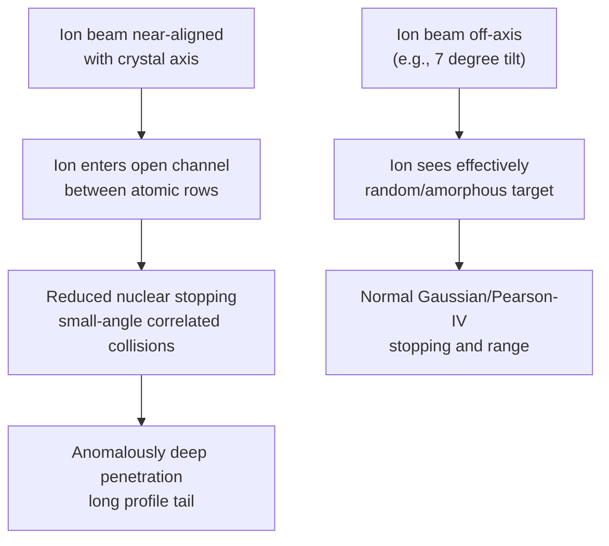

## Channeling and Implant Damage

### Overview

Channeling and implant damage are two closely linked phenomena that occur during ion implantation into crystalline substrates. Channeling refers to the anomalous, deep penetration of ions traveling along open crystallographic directions with sharply reduced nuclear stopping, while implant damage refers to the lattice disruption caused by displaced atoms as energetic ions collide with the crystal. Both effects must be understood and controlled to produce predictable, well-behaved dopant profiles and functional devices, since uncontrolled channeling ruins profile predictability and unrepaired damage prevents dopant electrical activation.

### Channeling Physics

**Origin**

A single-crystal lattice such as silicon contains open geometric "channels" along certain low-index crystallographic directions (e.g., `<110>`, `<100>`) where rows of atoms are spaced such that a traveling ion sees mostly open space rather than a dense, randomly encountered atomic arrangement. If an ion enters the crystal nearly parallel to one of these channel directions, it experiences a "billiard-like" series of small-angle, correlated collisions with the channel walls rather than the large-angle, energy-dissipating nuclear collisions assumed in the standard (amorphous-target) stopping-power model.

**Consequence**

Because nuclear stopping (the dominant energy-loss mechanism at low ion velocity, and the mechanism most sensitive to atomic arrangement) is drastically suppressed for channeled ions, these ions travel much farther into the substrate before losing enough energy to stop. This produces:

- A long, non-Gaussian tail extending well beyond the nominal projected range $R_p$ predicted by the amorphous-target Gaussian/Pearson-IV model
- Reduced reproducibility, since the fraction of ions that channel is highly sensitive to beam-to-crystal alignment angle, surface condition, and prior lattice damage
- Difficulty in modeling — channeled tails require specialized Monte Carlo simulation (e.g., binary collision approximation codes with explicit lattice geometry) rather than the simple analytical Gaussian/Pearson formulas used for amorphous-equivalent implants

### The Critical Channeling Angle

Channeling occurs only within a narrow angular window around the exact crystallographic axis, characterized by a critical angle $\psi_c$ (Lindhard critical angle), approximately:

$$\psi_c \approx \sqrt{\frac{2Z_1Z_2e^2}{4\pi\varepsilon_0 E d}}$$

where $Z_1$, $Z_2$ are the atomic numbers of the ion and target atoms, $E$ is the ion energy, and $d$ is the atomic spacing along the channel direction. [Inference: this Lindhard formula gives the qualitative scaling behavior — critical angle decreases with increasing ion energy — but precise numeric values for a specific ion/energy/crystal combination are typically obtained from tabulated or simulated data rather than hand-calculated from this simplified expression alone, since real crystal thermal vibration and surface effects also influence the effective critical angle.]

**Key Points**

- $\psi_c$ decreases as implant energy increases — meaning channeling risk generally exists across a range of process energies but the required alignment tolerance tightens as energy rises.
- $\psi_c$ is typically a few degrees for common ion/silicon combinations at typical implant energies, which is why deliberate wafer tilting by several degrees is an effective and standard mitigation.

### Mitigation Techniques

**1. Wafer Tilt**

The most common and simplest mitigation: the wafer is tilted (commonly ~7°, and often also rotated in-plane/"twisted" by a specific angle) relative to the beam so the beam does not align with any major low-index crystallographic axis. This forces the beam to see an effectively randomized (amorphous-like) arrangement of atoms, restoring standard Gaussian/Pearson-IV stopping behavior. **Key Points:**

- 7° is a widely used industry-standard tilt angle for many implants, chosen because it exceeds typical critical angles for common species/energies while remaining a modest, manageable equipment/process parameter. [Inference: the specific optimal tilt/twist angle combination can vary by implanter geometry, wafer orientation, and specific process recipe, and should be confirmed against the applicable process specification rather than assumed universally fixed at exactly 7° in all cases.]
- Even with tilting, some residual channeling tail often remains, especially for lighter ions (e.g., boron) which channel more readily than heavier ions.

**2. Screen Oxide (or Screen Nitride) Layer**

A thin (typically tens of nanometers) amorphous oxide or nitride layer is grown or deposited on the wafer surface before implantation. As ions pass through this amorphous layer, they undergo initial random scattering that randomizes their trajectory angle before they reach the crystalline substrate, significantly reducing the probability that any given ion enters the crystal within the critical channeling angle. This also has the secondary benefit of reducing surface sputtering and contamination during implant.

**3. Pre-Amorphization Implant (PAI)**

A heavy, typically electrically inert or self-species ion (commonly germanium, silicon, or occasionally argon) is implanted at high dose specifically to destroy the crystalline order of the near-surface region before the actual dopant implant. Once the target region is fully amorphous, there is no crystallographic channel structure at all, so the subsequent dopant implant behaves according to standard amorphous-target stopping physics with no channeling tail. This technique is especially valuable for very shallow, sharply defined junctions (e.g., source/drain extensions in advanced CMOS) where any channeling tail would be particularly detrimental to short-channel control.

### Implant-Induced Lattice Damage

**Mechanism**

Independent of channeling, every implanted ion that undergoes nuclear stopping transfers enough energy to displace target atoms from their equilibrium lattice sites (a "collision cascade"), if the transferred energy exceeds the displacement threshold energy (roughly 15-25 eV for silicon, depending on crystallographic direction). Each displaced atom becomes an interstitial, leaving behind a vacancy — a Frenkel pair. At sufficiently high local damage density, overlapping collision cascades convert the crystalline region into an amorphous layer.

**Damage Regimes**

- **Low dose**: Isolated point defects (vacancies, interstitials, small defect clusters) distributed through the damaged region; the lattice remains crystalline overall.
- **Intermediate dose**: Damage clusters grow and begin to overlap, forming extended defects (dislocation loops, stacking faults) upon subsequent annealing.
- **High dose (above the amorphization threshold)**: Continuous overlapping damage converts the implanted region into a fully amorphous layer, with a sharp interface to the underlying undamaged crystal.

The amorphization dose threshold depends on ion mass (heavier ions amorphize at lower dose due to more concentrated nuclear energy deposition per ion), implant energy, and substrate temperature during implant (elevated substrate temperature allows some in-situ defect annealing/recombination, raising the effective amorphization threshold — this is the basis of "hot implant" techniques used deliberately to avoid amorphization in some process flows).

### End-of-Range (EOR) Damage

**Key Points**

A particularly important damage feature is **end-of-range (EOR) defect formation**, which occurs specifically at the boundary between an amorphized region (if amorphization occurred) and the underlying undamaged crystal, or at the tail of the damage distribution for sub-amorphizing implants. Excess interstitial atoms that were pushed beyond the original damage region during the implant cascade accumulate at this boundary and, upon annealing, coalesce into extended defects such as `{311}` defects and dislocation loops.

These EOR defects are a major concern in modern shallow-junction technology because:

- They act as a reservoir of excess interstitials that enhance dopant diffusion during subsequent anneals — a phenomenon called **transient enhanced diffusion (TED)**, particularly significant for boron, which diffuses via an interstitial-mediated mechanism.
- They can act as generation-recombination centers, contributing to junction leakage current if located within or near the depletion region of the final device.
- Their density and depth are sensitive to implant species, energy, dose, and whether pre-amorphization was used — PAI implants tend to push EOR damage to a well-defined, controllable depth (at the original amorphous/crystalline interface) rather than leaving it distributed through a broader, less predictable damage profile.

### Damage Repair: Annealing

Implant damage must be repaired, and implanted dopants must be moved onto substitutional lattice sites to become electrically active, via a post-implant thermal anneal. **Key Points:**

- **Solid-phase epitaxial regrowth (SPER)**: For fully amorphized regions, annealing at moderate temperatures (500-600°C range) causes the amorphous layer to recrystallize epitaxially from the underlying crystalline seed, typically with high dopant activation and relatively low additional diffusion — a technique deliberately exploited via pre-amorphization for shallow, highly activated junctions.
- **Rapid thermal annealing (RTA)**: Short, high-temperature (900-1100°C range) anneals used broadly to repair damage and activate dopants while limiting diffusion-driven profile spreading compared to older furnace-anneal approaches.
- **Spike/millisecond/laser annealing**: Advanced techniques using extremely short thermal cycles (milliseconds or less) to maximize dopant activation while minimizing diffusion even further, important for the ultra-shallow junctions required in deep-submicron and nanoscale CMOS.

[Inference: the specific anneal recipe (temperature, time, technique) needed to fully repair damage while limiting TED and dopant diffusion is highly process- and node-specific, and general guidance here should not be treated as a substitute for the qualified thermal budget specified by a given fabrication process.]

### Trade-Off Summary

**Key Points**

| Technique | Reduces Channeling | Side Effects |
| --- | --- | --- |
| Wafer tilt (~7°) | Yes, substantially | Slight shadowing effects near mask edges/steep topography |
| Screen oxide/nitride | Yes | Adds a process step; slightly reduces effective implant energy reaching substrate |
| Pre-amorphization (PAI) | Yes, most completely | Introduces its own EOR damage; adds a full extra implant step |

### Worked Conceptual Example

**Example**

Consider a shallow boron source/drain extension implant at low energy (e.g., 2 keV) into `<100>` silicon with no tilt and no screen oxide. Because boron is light and 0° tilt aligns the beam with the `<100>` channel axis, a significant fraction of the implanted ions channel deeply, producing a long tail that extends well beyond the intended shallow junction depth — potentially causing excessive off-state leakage or degraded short-channel control once the device is fabricated. Applying a 7° tilt (or better, a pre-amorphization implant of germanium before the boron implant) suppresses this channeling tail, keeping the profile confined near the intended shallow depth consistent with the amorphous-target Pearson-IV model. This qualitative outcome — untilted light-ion shallow implants being especially channeling-prone — is a well-established process engineering concern; specific quantitative leakage or short-channel-control impact would require device-level simulation for a given technology. [Inference: this example illustrates a generally recognized process risk pattern, not a specific quantitative prediction for any particular implant recipe.]

### Related Topics

- Ion implantation physics and range distribution (Gaussian/Pearson-IV models)
- Transient enhanced diffusion (TED) and interstitial-mediated boron diffusion
- Solid-phase epitaxial regrowth and pre-amorphization implant techniques
- Rapid thermal annealing (RTA) and millisecond/laser annealing
- {311} defects and dislocation loop formation
- Halo and source/drain extension implant engineering in short-channel MOSFETs
- SRIM/TRIM Monte Carlo simulation and binary collision approximation codes