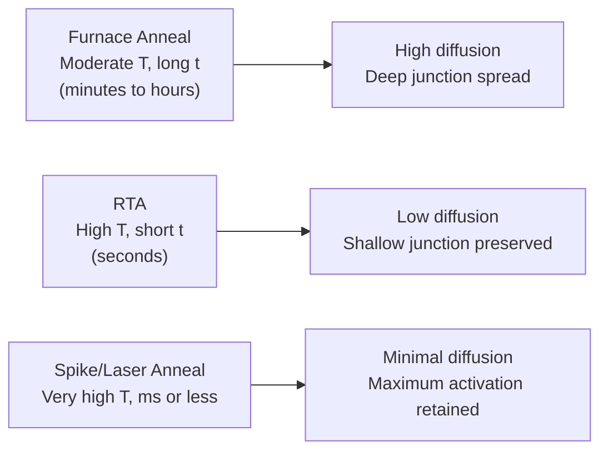
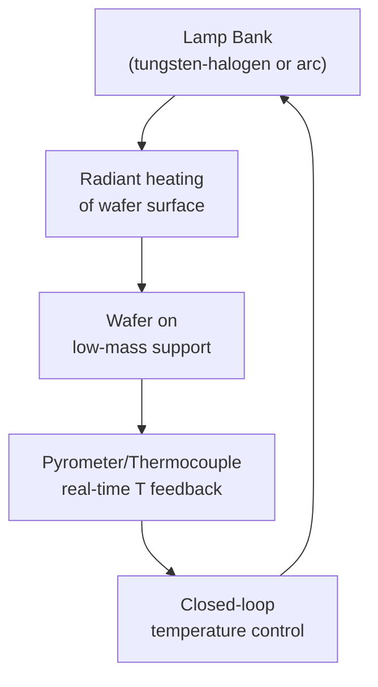

## Rapid Thermal Annealing and Dopant Activation

### Overview

Rapid thermal annealing (RTA) is a post-implant (or post-diffusion) thermal processing technique that uses short, high-intensity heating cycles — typically seconds rather than the tens of minutes to hours of traditional furnace annealing — to repair ion-implantation lattice damage and move implanted dopant atoms onto substitutional lattice sites where they become electrically active. RTA's defining advantage is decoupling dopant activation and damage repair (which require high temperature) from dopant diffusion/profile spreading (which is proportional to total thermal budget, i.e., time integrated at temperature), enabling the formation of shallow, well-controlled junctions that furnace annealing cannot achieve.

### Why Annealing Is Necessary

As-implanted dopant atoms are not immediately electrically active. Two distinct problems must be solved:

**Key Points**

- **Lattice damage repair**: Ion implantation displaces host atoms from lattice sites (vacancies, interstitials, and at high dose, full amorphization). This damage must be annealed out to restore crystal quality; unrepaired damage acts as generation-recombination centers, increasing leakage current and degrading carrier mobility.
- **Dopant activation**: Most implanted dopant atoms initially sit in interstitial or otherwise non-substitutional lattice positions where they do not contribute a free carrier. Only dopant atoms on substitutional sites (where they can donate/accept an electron/hole via the normal doping mechanism) are electrically active. Thermal energy is required to move dopants onto these sites, typically via solid-phase epitaxial regrowth (for amorphized regions) or defect-mediated diffusion-based activation (for non-amorphized damage).

### The Thermal Budget Problem

Every thermal process a wafer experiences contributes to a cumulative "thermal budget," which drives dopant diffusion via the same physics as intentional drive-in diffusion:

$$\Delta x_j \propto \sqrt{D(T)\cdot t}$$

Since $D(T)$ is exponentially temperature-dependent (Arrhenius behavior), unwanted diffusion during activation annealing becomes a critical concern once junction depths shrink into the tens-of-nanometers range required by modern CMOS. Conventional furnace annealing, even at moderate temperature, applies a temperature for long enough that diffusion-driven junction spreading (and dopant loss into any oxide via segregation) becomes unacceptable for shallow-junction technology.

**RTA's core value proposition**: reach the high temperature needed for damage repair and activation, but hold it for only a very short time, minimizing the $\sqrt{D \cdot t}$ diffusion term while still achieving sufficient activation.

### RTA System Architecture

A typical RTA system heats the wafer using banks of high-intensity lamps (tungsten-halogen or arc lamps) rather than a resistively heated furnace chamber, allowing much faster ramp rates:

**Key Points**

- **Ramp rates**: RTA systems achieve heating rates on the order of tens to over one hundred °C/second, versus furnace ramp rates typically well under 10°C/minute.
- **Low thermal mass wafer support**: Wafers are held on minimal-contact supports (pins or edge rings) rather than massive quartz boats, since the wafer itself — not a large thermal mass — must heat and cool quickly.
- **Temperature monitoring**: Pyrometry (optical, non-contact) is commonly used for real-time feedback given the speed of the process, though calibration challenges exist due to emissivity changes as surface films or dopant concentration change during processing. [Inference: specific pyrometry calibration challenges and their magnitude are equipment- and process-condition-dependent, and should be addressed via the specific tool vendor's calibration procedures rather than generalized.]

### RTA Process Types by Timescale

**1. Conventional RTA**

Temperatures typically 900-1100°C, hold times of a few seconds to tens of seconds. Widely used for general damage repair and activation across a broad range of implant conditions, and for silicide formation, oxide densification, and other back-end-of-line steps beyond just dopant activation.

**2. Spike Anneal**

An extreme case of RTA where the hold time at peak temperature approaches zero — the wafer is ramped to peak temperature and immediately ramped back down, such that peak temperature is reached only momentarily rather than sustained. This further minimizes the diffusion-driving thermal budget while still achieving the instantaneous high temperature needed for defect annealing kinetics, making it a standard technique for sub-100nm-generation shallow junction formation. [Inference: the specific technology generation at which spike annealing became standard practice, and the exact peak temperatures used, are process-node- and foundry-specific details that vary across the literature.]

**3. Millisecond Annealing (Flash Lamp Annealing)**

Uses an intense flash lamp (or laser) pulse lasting on the order of milliseconds to heat only the near-surface region of the wafer to very high temperature (approaching or exceeding 1300°C) while the bulk of the wafer remains near a lower base temperature (often pre-heated by a separate, slower stage). Because the heated volume and duration are both minimized, diffusion is suppressed even further than spike annealing while achieving very high peak activation.

**4. Laser Annealing**

Uses a scanned or pulsed laser to melt or near-melt the implanted surface region for an extremely short duration (nanoseconds to microseconds), enabling extremely high dopant activation — in some cases exceeding the equilibrium solid solubility limit ("super-activation") because the ultra-fast process can trap dopants in the lattice before they can precipitate out or diffuse — while essentially eliminating diffusion-driven junction spread, since the underlying substrate barely heats at all.

### Solid-Phase Epitaxial Regrowth (SPER)

For implants that amorphize the near-surface region (either directly at high dose, or via a deliberate pre-amorphization implant), annealing at relatively modest temperatures (around 500-600°C) causes the amorphous layer to recrystallize epitaxially, using the underlying undamaged crystal as a template ("solid-phase epitaxy").

**Key Points**

- SPER proceeds via a well-defined amorphous/crystalline interface that moves through the material at a temperature-dependent regrowth velocity.
- Dopant atoms present within the amorphous region at the time of regrowth are largely incorporated onto substitutional sites as the crystal lattice reforms around them, often achieving activation levels close to or above the equilibrium solid solubility limit — a key reason pre-amorphization plus low-temperature SPER is used deliberately for very shallow, highly activated junctions.
- SPER alone typically does not fully repair End-of-Range (EOR) defects located beyond the original amorphous/crystalline interface; a subsequent higher-temperature anneal step is often still needed to address these residual defects, introducing a secondary source of transient enhanced diffusion.

### Transient Enhanced Diffusion (TED) During Annealing

**Key Points**

A critical complication in dopant activation annealing, especially for boron, is **transient enhanced diffusion (TED)**: excess silicon interstitial atoms generated by the implant damage (and concentrated at End-of-Range defect bands) dramatically accelerate interstitial-mediated dopant diffusion during the early moments of annealing, before these excess interstitials are consumed by recombination or defect annealing. This produces diffusion rates far exceeding the equilibrium diffusion coefficient predicted from steady-state $D(T)$ values, particularly for boron, which is well known to diffuse primarily via an interstitial (kick-out) mechanism rather than a vacancy mechanism.

Because TED occurs on a fast, transient timescale tied to interstitial supersaturation decay (not the total anneal time in the way conventional diffusion scales), it is one of the primary reasons that even very short RTA/spike anneals can still produce measurable, sometimes disproportionate, junction depth increases relative to what equilibrium diffusion models alone would predict. [Inference: the precise quantitative magnitude of TED for a given implant/anneal combination is strongly dependent on implant damage level, anneal ramp rate, and prior process history, and is generally characterized empirically or via TCAD process simulation rather than predicted from a simple closed-form formula.]

Mitigation strategies for TED include:

- **Pre-amorphization** to push EOR damage to a well-controlled, deeper location away from the shallow active junction region
- **Co-implantation** of species like carbon or fluorine, which can trap or reduce the mobility of excess interstitials, suppressing boron TED
- **Millisecond/laser annealing**, which reduces the time window available for TED to act before the anneal cycle completes

### Dopant Activation vs. Solid Solubility

**Key Points**

The maximum achievable substitutional (active) dopant concentration under equilibrium conditions is bounded by the **solid solubility limit** at the anneal temperature — a temperature-dependent material property. Implanting dopant above this concentration does not increase active carrier concentration proportionally; excess dopant beyond solid solubility tends to remain electrically inactive (clustered, precipitated, or otherwise non-substitutional) unless a non-equilibrium technique (such as laser annealing's rapid quench, which can trap supersaturated dopant on lattice sites) is used to achieve "super-activation" beyond the equilibrium limit.

### Worked Conceptual Comparison

**Example**

Consider a shallow boron source/drain extension implant requiring a final junction depth under 20 nm with high active dopant concentration:

- **Furnace anneal** (e.g., 900°C for 30 minutes): Would produce far more diffusion than the junction budget allows — $\sqrt{Dt}$ at this temperature and time would spread the profile well beyond the target depth. Not viable for this application.
- **Conventional RTA spike** (peak ~1050°C, effectively zero hold time): Achieves good activation and damage repair with much less diffusion, but TED effects during the ramp may still contribute measurable spreading, especially for boron.
- **Millisecond flash or laser anneal**: Minimizes diffusion the most, potentially achieving near-abrupt as-implanted profiles with high activation, at the cost of more specialized/expensive equipment and tighter process control requirements.

The general engineering trend — that shallower target junctions push process selection toward shorter and more localized thermal cycles — is a well-established principle in the field; the specific anneal recipe chosen for any real junction depth target depends on the qualified process flow for that technology node. [Inference: this is a generalized process-selection trend, not a specific recommendation for any particular fabrication line.]

### Comparison Table

| Technique | Timescale | Diffusion Control | Typical Use Case |
| --- | --- | --- | --- |
| Furnace anneal | Minutes-hours | Poor (high diffusion) | Legacy/deep-junction processes |
| Conventional RTA | Seconds | Good | General damage repair, silicidation |
| Spike anneal | ~0 s hold at peak | Very good | Sub-100nm shallow junction activation |
| Millisecond/flash anneal | Milliseconds | Excellent | Advanced shallow junction/ultra-shallow extensions |
| Laser anneal | ns-µs | Best (near-zero bulk diffusion) | Ultra-shallow, super-activated junctions |

### Related Topics

- Ion implantation physics and range distribution
- Channeling and implant damage
- Transient enhanced diffusion and interstitial-mediated boron diffusion
- Solid-phase epitaxial regrowth and pre-amorphization implants
- Solid solubility limits and dopant activation
- Silicide formation (a common secondary application of RTA)
- Ultra-shallow junction formation for advanced CMOS nodes