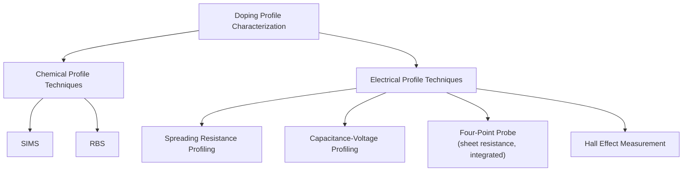

## Doping Profile Characterization Techniques

### Overview

Doping profile characterization encompasses the analytical techniques used to measure how dopant concentration (or, more precisely, either chemical dopant concentration or electrically active carrier concentration) varies with depth or position in a semiconductor sample. Because implantation and diffusion processes are modeled theoretically (Gaussian, Pearson-IV, erfc, etc.), characterization techniques are essential to validate these models against real fabricated profiles, calibrate process simulators, and provide feedback for process control. Different techniques measure fundamentally different physical quantities — total chemical dopant concentration versus electrically active carrier concentration versus sheet resistance — and understanding this distinction is critical to correctly interpreting and combining results.

### The Central Distinction: Chemical vs. Electrical Profiles

**Key Points**

- **Chemical (total) dopant profile**: The total concentration of dopant atoms present, regardless of whether they occupy substitutional (electrically active) or non-substitutional (electrically inactive — interstitial, clustered, precipitated) lattice positions. Measured by techniques like SIMS.
- **Electrically active (carrier) profile**: The concentration of dopant atoms actually contributing a free carrier (electron or hole) at a given depth, which can be significantly lower than the chemical concentration if activation is incomplete or if concentration exceeds solid solubility. Measured by techniques like spreading resistance profiling or capacitance-voltage profiling.

These two profiles coincide only when all implanted/diffused dopant is fully activated — a common approximation for well-annealed, moderately doped regions, but a poor approximation for as-implanted material, heavily doped regions above solid solubility, or regions with significant residual defects.

### Secondary Ion Mass Spectrometry (SIMS)

**Principle**

SIMS is the workhorse technique for measuring chemical dopant depth profiles. A focused primary ion beam (commonly Cs⁺ or O₂⁺) sputters material from the sample surface layer by layer; a fraction of the sputtered atoms are ionized (secondary ions) and are analyzed by a mass spectrometer to identify their elemental species and count their abundance. By continuously sputtering and analyzing, SIMS builds up a depth profile of elemental (dopant) concentration versus depth (converted from sputter time via a calibrated sputter rate).

**Key Points**

- Extremely high sensitivity — can detect dopant concentrations down to roughly $10^{14}$–$10^{16}\ \text{cm}^{-3}$ depending on species and matrix, well below concentrations detectable by most electrical techniques at shallow depth.
- Depth resolution can reach a few nanometers under optimized conditions, though resolution degrades somewhat with increasing depth due to ion mixing effects induced by the sputtering process itself.
- Measures **total chemical concentration**, not electrical activation — cannot distinguish substitutional from interstitial/clustered dopant.
- Quantification requires calibration standards (implanted reference samples of known dose) since secondary ion yield depends strongly on the sample matrix (matrix effect).
- Destructive technique — the sample is physically sputtered away during measurement.

[Fact: SIMS is the standard reference technique for chemical dopant profiling across the semiconductor industry; specific sensitivity/resolution figures vary by instrument, species, and matrix and should be confirmed against the specific instrument's documented performance for precise specifications.]

### Spreading Resistance Profiling (SRP)

**Principle**

SRP measures the local electrical resistivity as a function of depth by beveling the sample at a shallow, precisely known angle (to mechanically magnify depth into a measurable lateral distance) and stepping a pair of closely spaced metal probes along the beveled surface, measuring the spreading resistance at each point. The measured resistance at each position is converted to resistivity, and then to carrier concentration, using calibration curves relating resistivity to known-doping reference samples.

**Key Points**

- Directly measures **electrically active carrier concentration** as a function of depth — the profile most relevant to actual device electrical behavior.
- Can resolve very high dynamic range in concentration (multiple orders of magnitude) across a single profile, useful for characterizing full junction profiles from surface to substrate.
- Requires careful sample preparation (precise, damage-free beveling) and calibration, and involves an inherent conversion from measured resistance to concentration that depends on mobility models, introducing some model dependence into absolute accuracy.
- Destructive technique.

### Capacitance-Voltage (C-V) Profiling

**Principle**

Building on the fundamental MOS capacitor C-V relationship, C-V profiling extracts local doping concentration from the depletion-region capacitance response to applied bias, using the relation:

$$N(x) = -\frac{2}{q\varepsilon_s A^2}\left[\frac{d(1/C^2)}{dV}\right]^{-1}, \qquad x = \frac{\varepsilon_s A}{C}$$

This method is typically applied either on an existing MOS capacitor test structure or via an electrolytic contact (electrochemical C-V, ECV), which allows profiling into the bulk substrate by alternating small-area anodic etching (via electrochemical dissolution) with C-V measurement at each newly exposed depth, enabling profiling well beyond the depletion width achievable in a single fixed MOS structure.

**Key Points**

- Directly measures electrically active net carrier concentration ($N_D - N_A$ or $N_A - N_D$, depending on majority carrier type) as a function of depth — not total chemical dose, and not able to separately resolve donor and acceptor concentrations where both are present (only their net difference).
- Electrochemical C-V (ECV) extends profiling depth substantially beyond conventional MOS C-V's inherent depletion-width limit by physically removing material between measurements.
- Sensitive to interface trap and series resistance artifacts (as discussed in general MOS C-V theory), which must be accounted for to avoid profile distortion, especially near the surface.
- ECV is effectively destructive (the etching step removes material), while conventional single-structure MOS C-V is non-destructive but limited in depth range.

### Four-Point Probe and Sheet Resistance

**Principle**

The four-point probe technique passes a known current through two outer probes and measures the resulting voltage across two inner probes, from which sheet resistance $R_s$ (in ohms per square) is calculated:

$$R_s = \frac{V}{I}\times CF$$

where $CF$ is a geometric correction factor dependent on probe spacing and sample geometry (commonly $CF = \pi/\ln 2 \approx 4.532$ for an infinite sheet with standard equally spaced probes).

**Key Points**

- Measures a single integrated value — the total sheet resistance of a doped layer — rather than a depth-resolved profile.
- Widely used for rapid, non-destructive, in-line process monitoring (e.g., verifying that a diffusion or implant/anneal process produced the expected sheet resistance across a wafer or across process lots) rather than for detailed profile characterization.
- Sheet resistance relates to the full depth-integrated conductivity profile:

  $$\frac{1}{R_s} = q\int_0^{x_j}\mu(x)N(x)\,dx$$

  meaning $R_s$ alone cannot distinguish between different profile shapes that happen to integrate to the same total sheet conductance — it must be combined with a depth-profiling technique (SRP, C-V, or SIMS plus an activation/mobility model) to fully characterize a junction.

### Hall Effect Measurement

**Principle**

By applying a magnetic field perpendicular to current flow in a doped layer and measuring the resulting transverse (Hall) voltage, the Hall effect measurement determines carrier type (sign of Hall voltage indicates electrons vs. holes), carrier concentration, and, combined with sheet resistance, Hall mobility:

$$R_H = \frac{V_H t}{IB}, \qquad n = \frac{1}{qR_H}$$

**Key Points**

- Provides a single, depth-integrated (sheet) carrier concentration and mobility value for a doped layer, similar in spirit to four-point probe sheet resistance but with the added ability to independently extract carrier concentration and mobility (rather than just their product, conductivity).
- Not inherently depth-resolved unless combined with sequential layer removal (similar in concept to ECV profiling), making it primarily a bulk/integrated characterization tool rather than a fine depth-profiling technique on its own.
- Particularly valuable for extracting Hall mobility, which can reveal scattering mechanism information (ionized impurity scattering, etc.) not directly available from resistivity alone.

### Rutherford Backscattering Spectrometry (RBS)

**Principle**

A beam of high-energy ions (typically He⁺) is directed at the sample, and the energy spectrum of backscattered ions is analyzed. Because backscattered ion energy depends on both the mass of the target atom (heavier atoms backscatter with characteristically higher energy for a given scattering angle) and the depth at which the collision occurred (ions lose energy traveling into and back out of the sample), RBS can in principle provide compositional and depth information simultaneously.

**Key Points**

- Best suited for **heavy dopants in a lighter matrix** (e.g., arsenic or antimony in silicon), since RBS mass resolution and sensitivity for a dopant close in mass to the host matrix (e.g., boron in silicon, where boron is lighter than silicon) is poor.
- Also widely used in **channeling-RBS** mode (aligning the analysis beam with a crystal axis) specifically to study residual lattice damage and dopant lattice-site location (substitutional vs. interstitial) — a unique capability among these techniques for directly probing crystallographic dopant placement.
- Generally non-destructive, though less commonly used for routine dopant profiling compared to SIMS due to more limited sensitivity for common light dopants like boron and phosphorus.

### Comparison Table

| Technique | Measures | Depth-Resolved? | Destructive? | Best For |
| --- | --- | --- | --- | --- |
| SIMS | Chemical (total) concentration | Yes | Yes | Absolute chemical dose/profile, any dopant |
| Spreading Resistance (SRP) | Active carrier concentration | Yes | Yes | Full electrical profile, wide dynamic range |
| C-V / ECV | Net active carrier concentration | Yes (ECV: deep) | ECV: yes; MOS C-V: no | Electrical profile validation, junction depth |
| Four-Point Probe | Sheet resistance (integrated) | No | No (non-invasive) | Rapid in-line process monitoring |
| Hall Effect | Sheet carrier conc. + mobility | Generally no | No | Mobility/scattering analysis |
| RBS (+ channeling) | Composition, lattice location | Yes (moderate) | No | Heavy dopants, lattice-site/damage studies |

### Choosing a Technique in Practice

**Key Points**

- **Process calibration / TCAD model validation**: SIMS is typically the reference technique, since it directly measures the total implanted/diffused dose and profile shape independent of activation state, providing ground truth for comparison against simulated as-implanted or as-diffused profiles.
- **Device electrical behavior validation**: SRP or C-V/ECV are preferred, since these measure the electrically active profile that actually determines the device's electrical characteristics (threshold voltage, junction depth as seen electrically, series resistance).
- **Routine wafer-to-wafer or lot-to-lot process monitoring**: Four-point probe sheet resistance is the standard rapid, non-destructive tool, often supplemented by periodic SIMS or SRP profiling for deeper validation when a process drifts or a new process is being qualified.
- **Combining chemical and electrical data**: Comparing SIMS (chemical) and SRP/C-V (electrical) profiles for the same sample is a standard practice to directly quantify the activation fraction (active/chemical concentration ratio) as a function of depth, revealing regions of incomplete activation or clustering that neither technique alone would clearly show.

### Worked Conceptual Example

**Example**

Suppose a SIMS profile of a boron implant shows a chemical peak concentration of $5\times10^{20}\ \text{cm}^{-3}$ at a given depth, while an SRP measurement on an identically processed sample shows an active carrier concentration of only $1\times10^{20}\ \text{cm}^{-3}$ at the same depth. This discrepancy indicates that roughly 80% of the boron at this depth is electrically inactive — most plausibly because the chemical concentration exceeds the solid solubility limit of boron in silicon at the anneal temperature used, leaving excess boron clustered or otherwise non-substitutional. This is a textbook example of why combining chemical and electrical profiling techniques reveals process information (activation efficiency, solubility limits) that neither measurement alone would show. [Inference: this specific numeric scenario is illustrative of a well-known qualitative effect (solid-solubility-limited activation); actual activation fractions in a real process depend on the specific anneal conditions and would need to be measured, not assumed from this example.]

### Related Topics

- Rapid thermal annealing and dopant activation
- Solid solubility limits and dopant activation efficiency
- Capacitance-voltage characteristics of MOS structures
- Ion implantation physics and range distribution
- Transient enhanced diffusion and defect characterization
- TCAD process simulation calibration workflows
- Junction depth and sheet resistance process control metrics