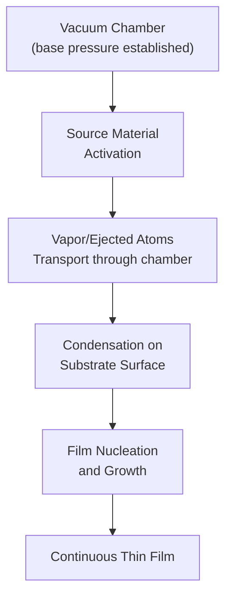
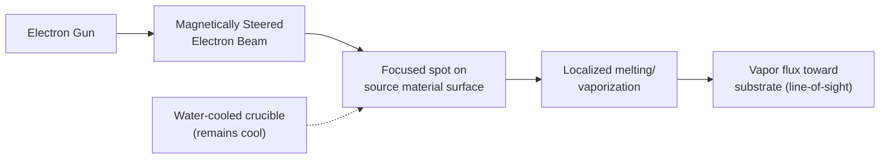

## Physical Vapor Deposition and Evaporation

### Overview

Physical vapor deposition (PVD) encompasses a family of thin-film deposition techniques in which material is physically removed (vaporized or ejected) from a solid or liquid source and transported through a vacuum environment to condense as a thin film on a substrate, without a chemical reaction driving film formation (in contrast to chemical vapor deposition, CVD). Thermal evaporation and sputtering are the two dominant PVD techniques used in semiconductor fabrication, primarily for depositing metals and metal alloys for interconnects, contacts, and various functional layers.

### General PVD Process Flow

**Key Points**

- All PVD techniques require a vacuum environment, both to provide a sufficiently long mean free path for vaporized/ejected atoms to travel from source to substrate without excessive gas-phase collisions, and to minimize film contamination from residual gases (oxygen, water vapor, hydrocarbons).
- PVD is inherently a **line-of-sight** deposition process — atoms travel in relatively straight paths from source to substrate — which has significant implications for step coverage on topographically complex (high aspect ratio) surfaces, generally producing poorer sidewall/via coverage than chemical vapor deposition techniques that rely on surface reaction chemistry rather than direct line-of-sight arrival.

### Thermal Evaporation

**Principle**

In thermal evaporation, the source material is heated (via resistive heating, or via a focused electron beam in e-beam evaporation) until its vapor pressure becomes high enough to produce a significant vapor flux, which then travels across the vacuum chamber and condenses on the cooler substrate.

**Resistive (Filament/Boat) Evaporation**

The source material is placed in or on a resistively heated filament, boat, or crucible (typically tungsten, tantalum, or molybdenum, chosen for high melting point and low reactivity with common source materials) and heated by passing current directly through the support structure.

**Key Points**

- Simple, relatively low-cost equipment.
- Limited to materials with reasonably low melting/evaporation temperatures compatible with the boat/filament material's thermal limits, and can suffer from contamination if the source material reacts with or alloys with the heated support structure.
- Limited control over deposition rate compared to e-beam methods, and can struggle with uniform evaporation of alloys due to differing vapor pressures of constituent elements (preferential evaporation of the higher-vapor-pressure component).

**Electron-Beam (E-Beam) Evaporation**

A focused, high-energy electron beam is directed at the source material (held in a water-cooled crucible), locally heating and vaporizing only a small region of the source directly under the beam, while the crucible itself remains relatively cool.

**Key Points**

- Can evaporate high-melting-point materials (e.g., refractory metals, some dielectrics) that resistive evaporation cannot practically reach.
- Reduced contamination from the crucible/support structure, since only the source material itself (not the crucible) is heated to high temperature.
- Enables higher, more controllable deposition rates and better film purity than typical resistive evaporation.
- Can generate X-rays as a byproduct of the electron beam striking the source (from electron deceleration/bremsstrahlung), which can cause radiation-induced damage to sensitive underlying device structures (e.g., charge trapping in gate oxides) — a specific concern for evaporation performed after gate oxide formation in a device flow. [Inference: the magnitude of X-ray-induced damage risk depends on beam energy, exposure time, and the sensitivity of the specific device structures present at that point in the process flow, and is generally mitigated via process sequencing or shielding rather than eliminated outright.]

### Evaporation Rate and the Vapor Pressure Relationship

The evaporation rate from a source is governed by the source material's temperature-dependent vapor pressure, following the Hertz-Knudsen relation for the mass flux from a free evaporating surface:

$$\Phi = \alpha_v \frac{P_v(T)}{\sqrt{2\pi m k T}}$$

where $\Phi$ is the evaporation flux (atoms per unit area per unit time), $\alpha_v$ is the evaporation (sticking) coefficient of the source surface, $P_v(T)$ is the material's equilibrium vapor pressure at temperature $T$, $m$ is the atomic/molecular mass, and $k$ is Boltzmann's constant. Because $P_v(T)$ depends exponentially on temperature (following an Arrhenius-like relation tied to the material's heat of vaporization), evaporation rate is extremely sensitive to small changes in source temperature, making precise temperature (or, more commonly, direct rate) control essential for reproducible film thickness.

### Angular Distribution and Directionality

**Key Points**

Evaporated flux from a small source area follows a cosine-law angular distribution (for an idealized point or small-area source):

$$\Phi(\theta) \propto \cos\theta$$

where $\theta$ is the angle from the surface normal of the source. This directional emission, combined with the line-of-sight nature of PVD transport, means that:

- Film thickness uniformity across a large substrate (or across a wafer batch positioned at different points relative to the source) requires careful source-to-substrate geometry design, often using rotating substrate holders ("planetary" fixtures) to average out angular non-uniformity.
- Step coverage over topography (trenches, vias, contact holes) is generally poor for pure evaporation, since sidewalls not in direct line-of-sight of the source receive little to no deposited material, and overhangs at the top of high-aspect-ratio features can further shadow the sidewalls and bottom below them.

### Film Nucleation and Growth Modes

Once vapor atoms arrive at the substrate, film formation proceeds through nucleation and growth, generally described by one of three classical growth modes:

**Key Points**

- **Volmer-Weber (island growth)**: Adatoms preferentially bond to each other rather than to the substrate, forming isolated 3D islands that eventually coalesce into a continuous film — common when film-substrate interaction is weak relative to film-film cohesion (e.g., many metals on oxide or other dissimilar substrates).
- **Frank-van der Merwe (layer-by-layer growth)**: Adatoms preferentially bond to the substrate, forming complete atomic layers before the next layer begins — occurs when film-substrate interaction is strong relative to film-film cohesion, generally producing smoother, more uniform films (relevant to certain epitaxial and highly wetting metal-substrate combinations).
- **Stranski-Krastanov (layer-plus-island growth)**: An initial layer-by-layer growth phase transitions to island growth after a few monolayers, often due to accumulating strain (e.g., lattice mismatch in heteroepitaxial systems) — a mixed mode important in certain epitaxial thin-film and quantum-dot-forming systems.

The chosen growth mode significantly affects final film morphology (grain size, roughness, continuity), which in turn affects electrical properties (resistivity, especially at very thin film thicknesses where grain boundary and surface scattering dominate).

### Applications in Semiconductor Processing

**Key Points**

- **Metal contacts and interconnects**: Historically, evaporation (particularly e-beam) was widely used for depositing metals such as aluminum for interconnect and contact layers, though sputtering has become more dominant in mainstream high-volume CMOS due to better step coverage and process compatibility.
- **Lift-off patterning**: Evaporation's strongly directional, line-of-sight deposition characteristic is specifically exploited in lift-off processes, where a photoresist pattern with re-entrant (undercut) sidewalls is used so that evaporated metal deposits discontinuously on the resist top surface versus the exposed substrate — a discontinuity that sputtering's more conformal, less directional deposition would tend to bridge, making sputtering generally less suitable for lift-off.
- **Contact metallization and specialty layers**: Certain specialty metal stacks, adhesion layers, and research/prototype device fabrication continue to use evaporation where its high purity and directionality are advantageous, even where sputtering dominates mainstream manufacturing.

### Comparison: Evaporation vs. Sputtering (Brief)

| Aspect | Thermal/E-Beam Evaporation | Sputtering |
| --- | --- | --- |
| Directionality | Highly directional (line-of-sight) | More conformal (though still limited vs. CVD) |
| Step coverage | Generally poor | Generally better, tunable via process conditions |
| Alloy composition control | Difficult (differential vapor pressures) | Better (though still non-trivial) |
| Substrate heating | Generally lower | Can be higher due to energetic particle bombardment |
| Suitability for lift-off | Well-suited | Generally less suited |
| Deposition rate for refractory materials | Limited (resistive); good (e-beam) | Generally good across a wide material range |

[Inference: this comparison reflects generally recognized process trade-offs; specific performance for a given tool, material, and process recipe should be validated against actual process characterization data rather than assumed universally.]

### Worked Conceptual Example

**Example**

Consider depositing a 100 nm aluminum contact layer via e-beam evaporation onto a wafer with moderately high-aspect-ratio contact vias (e.g., aspect ratio around 2:1). Due to the line-of-sight nature of evaporation and the cosine angular emission profile, the via sidewalls and especially the via bottom corners will receive substantially less deposited aluminum than the flat field regions of the wafer, potentially resulting in thin, discontinuous, or high-resistance metal coverage at the via bottom corners. This is a well-recognized qualitative limitation motivating the industry's general shift toward sputtering (and ultimately CVD/ALD for the most demanding contact/via fill applications) as aspect ratios increased with technology scaling. [Inference: the specific degree of coverage degradation at a given aspect ratio is geometry- and process-condition-dependent and would require simulation or direct measurement (e.g., cross-sectional SEM) to quantify for a specific case.]

### Related Topics

- Sputtering deposition (DC, RF, and magnetron sputtering)
- Step coverage and conformality in thin-film deposition
- Lift-off patterning process integration
- Chemical vapor deposition (CVD) fundamentals
- Thin-film growth modes and morphology control
- Metal interconnect and contact metallization schemes
- Atomic layer deposition (ALD) for high-aspect-ratio conformal films