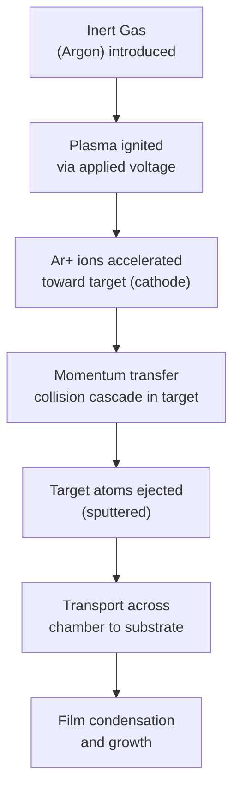
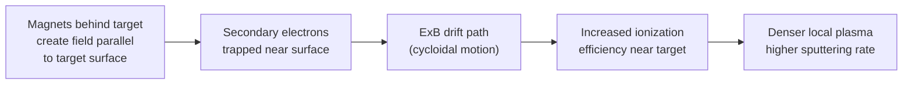

## Sputtering Techniques

### Overview

Sputtering is a physical vapor deposition (PVD) technique in which energetic ions (typically from an inert gas plasma, most commonly argon) bombard a solid target material, physically ejecting ("sputtering") target atoms through momentum transfer, which then travel to and condense on a substrate as a thin film. Unlike thermal evaporation, sputtering does not rely on vaporizing the source through heating; instead, film material is removed via kinetic collision processes, giving sputtering distinct advantages in alloy composition control, step coverage, and compatibility with high-melting-point and compound materials.

### Basic Sputtering Mechanism

**Key Points**

- The target material is held at a negative potential (cathode), attracting positively charged argon ions from the plasma.
- Ejected target atoms carry higher kinetic energy on average than thermally evaporated atoms, which affects film density, adhesion, and morphology (generally producing denser, better-adhered films than comparable evaporated films).
- Sputtering yield (atoms ejected per incident ion) depends on ion energy, ion mass, target material, and angle of incidence, and is a key process parameter governing deposition rate.

### DC Sputtering

**Principle**

A DC voltage (typically several hundred to a few thousand volts) is applied between the target (cathode) and substrate/chamber (anode), sustaining a glow-discharge plasma in a low-pressure inert gas ambient.

**Key Points**

- Works well for **electrically conductive target materials** (metals), since a continuous DC current must flow through the target to sustain the discharge.
- **Cannot sputter insulating targets**: An insulating target would rapidly accumulate positive charge from incident ions (since electrons cannot flow through it to neutralize this charge), causing the target surface potential to rise until the plasma discharge is extinguished — a fundamental limitation motivating the development of RF sputtering.

### RF Sputtering

**Principle**

An alternating RF voltage (industry-standard frequency of 13.56 MHz) is applied to the target instead of DC, allowing the target's surface charge to be alternately built up and discharged each half-cycle, which prevents the charge accumulation problem that blocks DC sputtering of insulators.

**Key Points**

- Enables sputtering of **insulating and dielectric target materials** (SiO₂, Si₃N₄, various oxide/nitride compounds) directly, which DC sputtering cannot achieve.
- Generally operates at lower deposition rates than DC sputtering for a given power level, due to the fundamentally different discharge dynamics.
- Requires an impedance-matching network between the RF power supply and the plasma/target system to maximize power transfer efficiency, since the plasma's impedance can vary and is generally not matched to standard 50-ohm RF transmission line impedance without active tuning.

### Magnetron Sputtering

**Principle**

Magnetron sputtering adds a magnetic field (via permanent magnets or electromagnets positioned behind the target) arranged such that the magnetic field lines run parallel to the target surface. This magnetic field traps secondary electrons emitted from the target in a cycloidal path close to the target surface (via the $\vec{E}\times\vec{B}$ drift), dramatically increasing the local electron path length and, consequently, the probability of ionizing collisions with the inert gas before those electrons are lost to the chamber walls or anode.

**Key Points**

- Can be combined with either DC or RF power (DC magnetron sputtering and RF magnetron sputtering are both common).
- **Significantly higher deposition rates** than non-magnetron sputtering at equivalent power, since the enhanced ionization efficiency near the target sustains a denser local plasma.
- **Lower operating pressure** possible (since ionization efficiency no longer depends as heavily on longer mean free paths through higher pressure gas), which reduces gas-phase scattering of sputtered atoms in transit to the substrate, improving film purity and allowing somewhat more directional deposition than non-magnetron sputtering.
- **Target erosion non-uniformity ("racetrack" erosion)**: The trapped-electron region concentrates sputtering in a ring-shaped zone on the target surface, leading to characteristic non-uniform target erosion (a "racetrack" groove) that limits target material utilization efficiency and requires periodic target replacement once the racetrack erodes through.
- Is the dominant sputtering configuration used in modern semiconductor manufacturing due to its combination of high rate, good uniformity (with proper magnet and substrate motion design), and compatibility with both conductive and (via RF) insulating targets.

### Reactive Sputtering

**Principle**

A reactive gas (e.g., nitrogen, oxygen) is introduced into the chamber alongside the inert sputtering gas, reacting with sputtered target atoms either in the gas phase or upon arrival at the substrate to form a compound film — for example, sputtering a titanium target in an argon/nitrogen mixture to deposit titanium nitride (TiN), a common barrier/adhesion layer material in interconnect metallization.

**Key Points**

- Allows deposition of compound films (nitrides, oxides) from a simple elemental (often metallic, easily DC-sputterable) target, avoiding the need for a compound target and its associated RF sputtering rate limitations.
- Introduces process control challenges, most notably **target poisoning**: if the reactive gas flow is too high, the reactive compound can form directly on the target surface itself (not just at the substrate), changing the target's effective sputtering yield and potentially causing hysteresis and instability in the relationship between reactive gas flow and film stoichiometry/deposition rate — a well-documented phenomenon requiring careful process control (often closed-loop plasma emission monitoring) to maintain stable, reproducible film composition. [Inference: the specific process window and control strategy for avoiding target poisoning is highly system- and material-specific, and should be established via the specific tool/recipe's characterized process window rather than assumed generally.]

### Ion Beam Sputtering

**Principle**

Rather than generating a plasma in direct contact with the target, ion beam sputtering uses a separate, self-contained ion source (e.g., a Kaufman-type ion gun) to generate and accelerate a collimated ion beam that is directed at the target from outside the main deposition chamber plasma environment.

**Key Points**

- Provides independent control over ion energy and flux, decoupled from the substrate/target voltage relationship inherent to plasma-immersion sputtering methods.
- Generally used for specialized, high-precision applications (e.g., optical coatings, research-scale deposition) requiring very tight control over film properties, rather than high-throughput mainstream semiconductor manufacturing.

### Bias Sputtering

**Key Points**

Applying a separate RF or DC bias to the substrate (in addition to the target sputtering power) allows independent control of ion bombardment energy at the growing film surface. This substrate-directed ion bombardment can be used to:

- Improve film density and reduce void formation by providing additional adatom mobility/energy at the surface during growth
- Achieve limited resputtering of the growing film, which can improve step coverage in certain geometries by preferentially removing material from overhangs and redistributing it into trenches/vias (a technique sometimes called self-ionized or bias-sputter deposition, historically explored for improving via fill before the widespread adoption of CVD/ALD for the most demanding fill applications)

### Sputtering Yield and Process Parameters

The sputtering yield $Y$ (atoms ejected per incident ion) depends on incident ion energy $E$, ion mass, and target material, and generally follows a relationship that increases with ion energy above a threshold (below which no sputtering occurs) up to a broad maximum, beyond which yield can decrease again at very high energies as ions implant more deeply rather than transferring momentum efficiently to surface atoms:

**Key Points**

- Sputtering threshold energies are typically in the range of tens of eV, below which insufficient momentum is transferred to eject target atoms.
- Practical sputtering processes typically operate with ion energies in the several-hundred-eV range, near the region of maximum yield for common target materials and argon ions.
- Heavier inert gases (e.g., krypton, xenon) can achieve higher sputtering yield than argon for a given ion energy on many target materials due to more efficient momentum transfer to similarly heavy target atoms, though argon remains the standard choice in most production settings due to cost and availability. [Inference: the specific yield advantage of heavier inert gases versus argon is material-pair-dependent and generally established via sputtering yield tables/data rather than a single universal ratio.]

### Step Coverage and Film Uniformity

**Key Points**

While sputtering is generally more conformal than simple thermal evaporation due to a broader angular distribution of ejected atoms and increased gas-phase scattering (especially at higher process pressure), it still falls short of the near-perfect conformality achievable with CVD or ALD, particularly for high-aspect-ratio contact/via structures. Techniques such as collimated sputtering (placing a honeycomb-like collimator between target and substrate to filter out off-axis atom trajectories) and long-throw sputtering (increasing target-to-substrate distance to favor more perpendicular atom arrival) were developed specifically to improve directionality and bottom coverage in vias for advanced interconnect applications, at some cost to overall deposition rate and target utilization efficiency.

### Applications in Semiconductor Processing

**Key Points**

- **Interconnect barrier/liner layers**: Ta/TaN, Ti/TiN stacks deposited via reactive and non-reactive sputtering, serving as diffusion barriers and adhesion layers for copper interconnects.
- **Metal gate electrodes and work-function metals**: Various metal and metal-nitride films for advanced transistor gate stacks.
- **Aluminum and copper seed layers**: Sputtered seed layers for subsequent electroplating in copper damascene interconnect processes.
- **Silicide formation precursor metals**: Sputtered titanium, cobalt, or nickel films subsequently annealed to form silicide contacts.

### Comparison Summary

| Technique | Conductive Targets | Insulating Targets | Deposition Rate | Key Advantage |
| --- | --- | --- | --- | --- |
| DC Sputtering | Yes | No | Moderate | Simplicity |
| RF Sputtering | Yes | Yes | Lower | Enables dielectric films |
| DC Magnetron | Yes | No | High | High rate, good efficiency |
| RF Magnetron | Yes | Yes | Moderate-High | Combines dielectric capability with improved rate |
| Reactive Sputtering | Yes (elemental target) | N/A | Variable | Compound films from simple targets |
| Ion Beam Sputtering | Yes | Yes | Low | Independent ion energy/flux control |

### Worked Conceptual Example

**Example**

Consider depositing a TiN barrier layer via reactive DC magnetron sputtering, using a titanium target in an Ar/N₂ gas mixture. As nitrogen flow increases from zero, the deposited film transitions from pure titanium metal, through a titanium-rich sub-stoichiometric TiNx phase, toward stoichiometric TiN as nitrogen flow increases further. If nitrogen flow is pushed too high, the titanium target surface itself begins reacting to form TiN (target poisoning), causing a sudden drop in deposition rate (since TiN sputters more slowly than metallic Ti) and process instability. Production processes typically operate in a carefully characterized flow window that achieves stoichiometric TiN film composition while staying below the target poisoning transition, often using real-time plasma emission monitoring to hold this operating point stably. [Inference: this describes a generally recognized reactive sputtering process behavior pattern; the exact flow rates and transition points are specific to the particular chamber, target size, and pumping configuration and must be empirically characterized rather than predicted generally.]

### Related Topics

- Physical vapor deposition and evaporation (comparison of PVD techniques)
- Step coverage and conformality in thin-film deposition
- Chemical vapor deposition (CVD) fundamentals
- Atomic layer deposition (ALD) for conformal barrier films
- Copper damascene interconnect process integration
- Silicide formation and contact metallization
- Plasma physics fundamentals for semiconductor processing