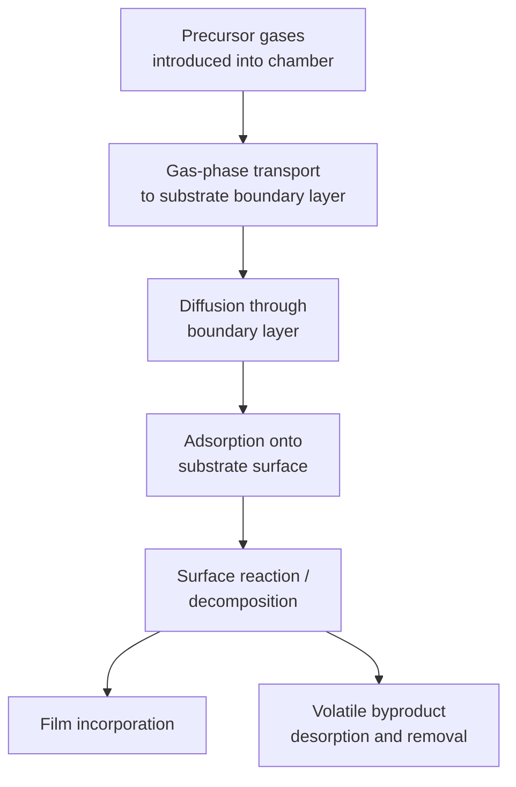
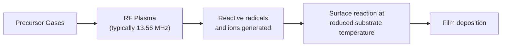
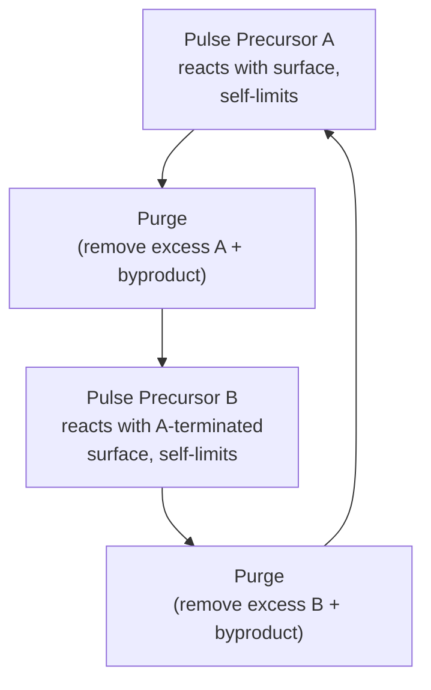

## Chemical Vapor Deposition Variants

### Overview

Chemical vapor deposition (CVD) is a thin-film deposition technique in which gaseous precursor molecules react chemically (via thermal decomposition, oxidation, reduction, or other reaction pathways), either in the gas phase or at the substrate surface, to deposit a solid film while releasing volatile byproducts that are pumped away. Unlike physical vapor deposition, CVD relies on surface-mediated chemical reactions rather than direct line-of-sight physical transport, giving it fundamentally better conformality and step coverage — critical advantages for filling and coating the high-aspect-ratio structures common in modern semiconductor devices.

### General CVD Reaction Sequence

**Key Points**

- CVD film growth involves both a gas-phase mass-transport-limited regime (at higher temperature, where reaction is fast and the rate-limiting step is precursor delivery through the boundary layer) and a surface-reaction-limited regime (at lower temperature, where the rate-limiting step is the chemical reaction kinetics at the surface itself). Process temperature determines which regime dominates, with significant implications for uniformity and conformality.
- Because reaction occurs at or near the surface itself rather than requiring direct line-of-sight arrival, CVD generally achieves substantially better step coverage into trenches, vias, and other high-aspect-ratio topography than PVD techniques.

### Atmospheric Pressure CVD (APCVD)

**Principle**

Deposition occurs at or near atmospheric pressure, with precursor gases flowing over a heated substrate in a simple reactor configuration.

**Key Points**

- Simplest and generally lowest-cost CVD configuration, since no vacuum pumping system is required.
- Operating at atmospheric pressure means gas-phase reactions and particle formation are more likely (shorter mean free path, more frequent gas-phase collisions), which can degrade film quality and introduce particulate contamination compared to lower-pressure variants.
- Step coverage tends to be less uniform than LPCVD due to a thicker gas boundary layer at atmospheric pressure, which can create localized mass-transport limitations over topography.
- Historically used for applications such as early oxide and doped-oxide (e.g., phosphosilicate glass) deposition, though largely superseded by lower-pressure variants for most modern applications requiring tighter process control.

### Low-Pressure CVD (LPCVD)

**Principle**

Deposition occurs at significantly reduced pressure (typically less than 1 Torr), which increases the mean free path of gas molecules and reduces gas-phase reactions, shifting the process toward the more controllable surface-reaction-limited regime.

**Key Points**

- Because surface reaction kinetics (rather than gas transport) becomes rate-limiting at low pressure, deposition rate becomes primarily a function of substrate temperature rather than gas flow/delivery geometry, enabling excellent uniformity across many wafers processed simultaneously in a single batch furnace.
- Batch processing capability (many wafers per run in a furnace-tube configuration) makes LPCVD attractive for high-throughput manufacturing of standard films such as polysilicon, silicon nitride, and undoped/doped silicon dioxide.
- Generally requires higher deposition temperatures than APCVD or PECVD to achieve practical deposition rates in the surface-reaction-limited regime, which can be a constraint for temperature-sensitive process steps later in a device flow.
- Widely used for depositing polysilicon (gate material in older/simpler processes, and still used for various structural and resistor applications), LPCVD silicon nitride, and doped oxide films.

### Plasma-Enhanced CVD (PECVD)

**Principle**

A plasma (typically RF-generated) is used to partially ionize and dissociate precursor gases, generating reactive radical species that can react and deposit a film at substrate temperatures substantially lower than required for purely thermally driven CVD reactions.

**Key Points**

- **Lower thermal budget**: The plasma supplies energy needed to drive precursor dissociation/reaction, allowing deposition at substrate temperatures often in the 200-400°C range, versus several hundred degrees higher for purely thermal CVD of comparable films — critical for depositing dielectrics and passivation layers over temperature-sensitive structures (e.g., after metallization, when high thermal budgets would damage metal interconnects or cause unwanted dopant diffusion).
- Widely used for depositing interlayer dielectrics, passivation nitride/oxide layers, and various back-end-of-line dielectric films where low thermal budget compatibility with underlying metal layers is essential.
- Film properties (stress, density, hydrogen content, etc.) are strongly influenced by plasma conditions (power, frequency, pressure) in addition to the usual thermal CVD parameters, giving PECVD additional process tuning flexibility but also additional complexity in process control.
- Films deposited via PECVD (e.g., silicon nitride) often contain significant incorporated hydrogen from the precursor chemistry (e.g., silane, ammonia), which can affect film electrical and mechanical properties compared to LPCVD films of nominally the same composition. [Inference: the specific hydrogen content and its precise impact on film properties depend on the specific precursor chemistry and plasma conditions used, and vary across specific process recipes.]

### Metal-Organic CVD (MOCVD)

**Principle**

Uses metal-organic precursor compounds (metal atoms bonded to organic ligands, chosen for sufficient volatility to be delivered in gas phase at practical temperatures) that thermally decompose at the substrate surface, depositing the metal or metal-compound film while releasing organic byproducts.

**Key Points**

- Primarily used for compound semiconductor epitaxial growth (e.g., III-V materials such as GaAs, GaN, InP for optoelectronic and RF devices) and for depositing certain metal and metal-oxide films where suitable volatile metal-organic precursors exist.
- Enables precise control of composition in multi-element compound films/alloys by independently controlling the flow of each metal-organic precursor species.
- Organic ligand byproducts and potential carbon incorporation into the film are process concerns requiring careful precursor chemistry selection and process condition optimization to minimize unwanted impurity incorporation. [Inference: the degree of carbon or other impurity incorporation is highly precursor- and process-condition-specific and should be evaluated for the specific chemistry in use rather than assumed as a fixed level.]

### Atomic Layer Deposition (ALD) — A CVD-Related Self-Limiting Variant

**Principle**

Although sometimes categorized as its own distinct technique, ALD is closely related to CVD and is often discussed alongside it as a self-limiting, sequential variant. Two (or more) precursor gases are introduced into the chamber in alternating pulses, separated by purge steps, such that each precursor reacts only with a specific surface-terminated species left by the previous pulse, and reaction self-terminates once the available surface sites are consumed — depositing a controlled, sub-monolayer-to-monolayer thickness increment per full pulse cycle.

**Key Points**

- The self-limiting nature of each half-reaction gives ALD exceptional thickness control (often cited at sub-angstrom-per-cycle precision for many chemistries) and, critically, near-perfect conformality even on extremely high-aspect-ratio structures, since the surface-saturation mechanism does not depend on line-of-sight or even uniform gas-phase concentration across the wafer, only on sufficient exposure time for each precursor to saturate all exposed surface area.
- Deposition rate is inherently low (a full A-purge-B-purge cycle is required per thin increment of film thickness), making ALD generally the slowest of the CVD-family techniques in terms of throughput, restricting its use largely to thin, high-value films (gate dielectrics, diffusion barriers, seed layers) rather than thick bulk dielectric or metal layers where LPCVD/PECVD remain preferred for throughput reasons.
- Has become increasingly critical in advanced technology nodes for depositing ultrathin, highly conformal high-k gate dielectrics (e.g., HfO₂) and conformal barrier/liner layers in shrinking interconnect and contact geometries where PVD and conventional CVD step coverage become insufficient.

### Comparison Table

| Variant | Pressure | Typical Temp Range | Conformality | Throughput | Typical Applications |
| --- | --- | --- | --- | --- | --- |
| APCVD | Atmospheric | Moderate | Fair | High | Early oxide/doped-glass films (legacy) |
| LPCVD | Low (<1 Torr) | High | Good | High (batch) | Polysilicon, nitride, doped oxides |
| PECVD | Low-moderate | Low | Good | High | ILD, passivation, back-end dielectrics |
| MOCVD | Varies | Moderate-High | Good | Moderate | III-V epitaxy, specialty metal/oxide films |
| ALD | Low | Low-Moderate | Excellent | Low | High-k gate dielectrics, thin conformal barriers |

[Inference: specific temperature ranges, throughput, and conformality ratings are generalized, commonly cited characterizations; exact values vary significantly by specific precursor chemistry, tool design, and target film, and should be confirmed against process-specific documentation for precise engineering decisions.]

### Selecting a CVD Variant in Practice

**Key Points**

- **Thermal budget constraints** (e.g., depositing after metallization) generally favor PECVD or, for the thinnest most critical layers, ALD, over high-temperature LPCVD or APCVD.
- **Throughput-driven, standard structural/dielectric films** (polysilicon, standard nitride/oxide layers earlier in the process flow where higher temperature is acceptable) generally favor LPCVD batch processing.
- **Extreme conformality requirements** (modern high-aspect-ratio contacts, vias, and gate stack dielectrics) increasingly favor ALD despite its throughput cost, since PVD and even standard CVD conformality become insufficient at the smallest geometries.
- **Compound semiconductor epitaxy** (III-V materials, certain oxide films) relies on MOCVD due to the need for precise multi-element composition control not readily achievable with simpler CVD precursor chemistries.

### Worked Conceptual Example

**Example**

Consider depositing a conformal silicon nitride liner into a contact structure with an aspect ratio of approximately 10:1. A PECVD process, while offering good thermal budget compatibility, would likely show measurably thinner deposition at the bottom of such a high-aspect-ratio feature compared to the top/field region, due to the practical limits of gas-phase transport and surface reaction kinetics reaching deep, narrow features uniformly. An ALD process, using the same general chemistry but exploiting the self-limiting saturation mechanism with sufficiently long exposure and purge steps, would be expected to achieve substantially more uniform thickness from top to bottom of the same feature, at the cost of significantly lower throughput per unit film thickness deposited. This qualitative trade-off — ALD's superior conformality at high aspect ratio versus PECVD's superior throughput — is a well-established engineering consideration; the specific numeric step coverage percentage achieved by either technique for a given aspect ratio depends on the specific tool, chemistry, and process conditions and would require direct measurement (e.g., cross-sectional SEM/TEM) to quantify. [Inference: this illustrates a generally recognized trade-off pattern rather than a specific quantitative prediction for any particular process.]

### Related Topics

- Atomic layer deposition (ALD) detailed mechanisms and precursor chemistry
- Physical vapor deposition and evaporation (comparison of deposition philosophy)
- Sputtering techniques (comparison of PVD variants)
- Step coverage and conformality in thin-film deposition
- High-k gate dielectric integration (HfO2 and related materials)
- Interlayer dielectric (ILD) and passivation layer engineering
- III-V compound semiconductor epitaxial growth