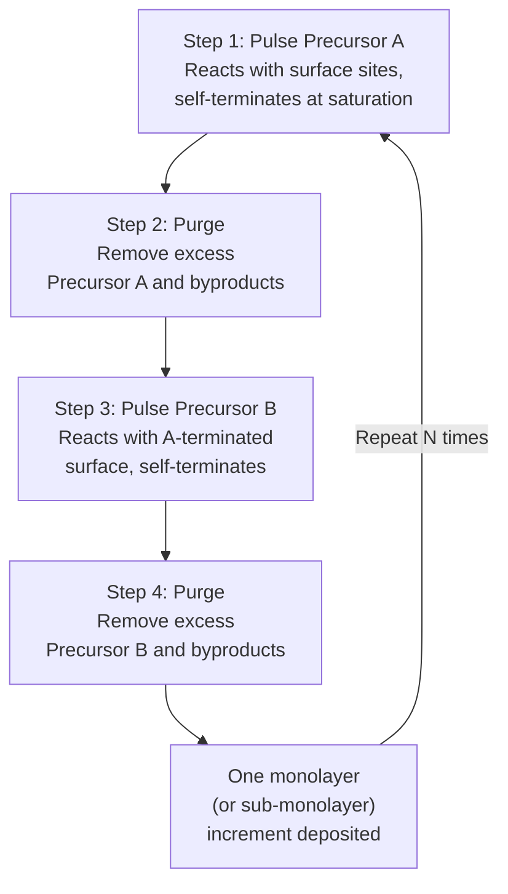

## Atomic Layer Deposition

### Overview

Atomic layer deposition (ALD) is a thin-film deposition technique built on sequential, self-limiting surface reactions between alternately pulsed gas-phase precursors. Each precursor reacts only with the specific chemical species left on the surface by the preceding precursor pulse, and the reaction naturally terminates once all available reactive surface sites are consumed — regardless of how much additional precursor is supplied. This self-limiting mechanism is the defining characteristic that distinguishes ALD from conventional CVD and gives it unmatched thickness precision and conformality, at the cost of significantly lower deposition throughput.

### The ALD Cycle

A single ALD cycle consists of four sequential steps, repeated as many times as needed to build up the target film thickness:

**Key Points**

- **Step 1 (Precursor A pulse)**: Precursor A molecules adsorb onto and chemically react with available surface sites (e.g., surface hydroxyl groups on an oxide surface). Once all accessible sites have reacted, further exposure to Precursor A produces no additional reaction — this self-limiting saturation is the core ALD mechanism.
- **Step 2 (Purge)**: An inert gas (commonly nitrogen or argon) flushes unreacted Precursor A and any gas-phase reaction byproducts out of the chamber, preventing direct gas-phase mixing of Precursor A and Precursor B (which would otherwise produce uncontrolled CVD-like reactions rather than the desired surface-limited ALD reaction).
- **Step 3 (Precursor B pulse)**: Precursor B reacts specifically with the new surface termination left by Precursor A, again self-limiting once all available sites are consumed, completing one full monolayer (or sub-monolayer) increment of the target film.
- **Step 4 (Purge)**: Removes excess Precursor B and byproducts before the cycle repeats.

### Growth Per Cycle (GPC)

The film thickness deposited per complete cycle — the growth per cycle (GPC) — is a defining metric for any given ALD chemistry, typically ranging from a fraction of an angstrom to roughly one angstrom per cycle, depending on precursor size, surface site density, and steric hindrance effects (larger precursor ligands can block adjacent surface sites, reducing the achievable site density per cycle below the theoretical maximum).

$$t_{film} = GPC \times N_{cycles}$$

**Key Points**

- Because GPC is a fixed, well-characterized value for a given chemistry and process condition (once established within the ALD process window), final film thickness is controlled simply by the number of cycles run — a highly linear and reproducible thickness-control mechanism, in contrast to CVD/PVD, where thickness depends on the product of a continuously varying deposition rate and time.
- GPC can vary with substrate temperature, precursor dose, and purge time, and identifying the process conditions where GPC becomes stable and temperature-independent (the "ALD window," discussed below) is a key part of ALD process development.

### The ALD Process Window

**Key Points**

A true self-limiting ALD process requires operating within a specific temperature range — the **ALD window** — where growth per cycle remains constant (temperature-independent) and each precursor pulse reliably saturates the surface without additional unwanted effects:

- **Below the ALD window**: Growth rate may be lower than the saturated value due to incomplete precursor reaction (insufficient thermal activation energy) or higher than expected due to precursor condensation/physisorption on the surface (multilayer adsorption rather than clean self-limiting chemisorption).
- **Within the ALD window**: GPC is stable and largely temperature-independent, indicating pure self-limiting chemisorption behavior — the ideal operating regime.
- **Above the ALD window**: Growth rate may increase due to onset of thermal precursor decomposition (behaving more like conventional CVD, losing the self-limiting characteristic) or decrease due to precursor desorption before reaction can occur, or due to loss of surface reactive sites (e.g., dehydroxylation of an oxide surface at high temperature).

Identifying and operating within this window for a given precursor pair and target film is a foundational step in ALD process development, and the window's temperature range is highly specific to the particular precursor chemistry and substrate material combination. [Inference: exact ALD window temperature ranges are chemistry-specific and must be determined experimentally or sourced from precursor-specific literature/vendor data rather than assumed generally.]

### Thermal ALD vs. Plasma-Enhanced ALD (PEALD)

**Thermal ALD**

Both precursor pulses rely purely on thermally driven surface chemistry to complete the self-limiting reaction, without any plasma assistance.

**Plasma-Enhanced ALD (PEALD)**

One of the two reactant steps (commonly the "B" reactant, often a plasma-activated species such as oxygen or nitrogen radicals generated in situ) uses a plasma to generate more reactive species than the purely thermal chemistry would provide.

**Key Points**

- PEALD can enable lower deposition temperatures than thermal ALD for a given chemistry, since plasma-generated radicals provide additional reactive energy that would otherwise require higher substrate temperature to achieve via thermal activation alone — valuable for depositing high-quality films over temperature-sensitive underlying structures.
- PEALD can also access film chemistries or achieve film properties (density, impurity content) not readily achievable via purely thermal ALD chemistry for a given precursor set.
- Plasma exposure introduces potential concerns around plasma-induced damage to underlying sensitive structures and can somewhat compromise conformality on the most extreme aspect-ratio features compared to purely thermal ALD, since plasma species (particularly ions, as opposed to purely thermal neutral radicals) may not penetrate as uniformly deep into very narrow, high-aspect-ratio features as a purely thermal gas-phase precursor would. [Inference: the degree of conformality degradation from plasma exposure in very high-aspect-ratio features is geometry- and plasma-condition-specific and is an active area of process engineering rather than a fixed universal penalty.]

### Why ALD Achieves Superior Conformality

**Key Points**

ALD's exceptional conformality — approaching perfectly uniform thickness even on extremely high-aspect-ratio (>50:1) structures — follows directly from its reaction mechanism rather than requiring precise gas-flow engineering:

- Because each half-reaction is self-limiting, it does not matter whether some parts of the wafer topography receive precursor slightly earlier or in slightly higher initial concentration than others — as long as sufficient exposure time is given for precursor to diffuse into and saturate every exposed surface, including deep within narrow trenches and vias, every surface location reaches the same fully reacted, self-terminated state.
- This decouples conformality from the gas-transport-dependent effects (line-of-sight limitations in PVD, boundary-layer/mass-transport limitations in conventional CVD) that fundamentally limit other deposition techniques' step coverage.
- The primary practical requirement to achieve this ideal conformality is sufficiently long precursor exposure (dose) and purge times to allow gas diffusion to fully saturate the entire feature depth — meaning very high-aspect-ratio features require longer per-cycle times (reducing effective throughput further) to maintain the same conformality advantage.

### Key Application: High-k Gate Dielectrics

**Key Points**

ALD became essential in mainstream CMOS manufacturing primarily due to the introduction of high-k gate dielectric materials (notably hafnium oxide, HfO₂, and related hafnium-silicate materials) replacing silicon dioxide/oxynitride as gate dielectrics once oxide scaling reached fundamental leakage limits. ALD's ability to deposit these materials with:

- Precise, sub-nanometer thickness control (critical since gate dielectric thickness directly sets threshold voltage and gate leakage characteristics)
- Excellent film uniformity across the wafer
- High conformality over the increasingly complex 3D transistor structures (e.g., FinFET fins, gate-all-around structures) that followed planar scaling

made it the preferred deposition technique for this critical layer, despite its throughput limitations relative to PVD/CVD alternatives, because the electrical performance requirements for this specific layer justified the throughput trade-off.

### Key Application: Conformal Barrier and Liner Layers

As interconnect and contact feature aspect ratios increased with technology scaling, ALD became increasingly important for depositing thin, highly conformal diffusion barrier and adhesion liner layers (e.g., TaN, TiN, WN variants) in copper and tungsten interconnect structures, where PVD's line-of-sight limitations and CVD's boundary-layer-driven non-uniformity became insufficient to reliably coat the bottom and sidewalls of increasingly narrow, deep via and contact structures.

### Throughput Limitations and Mitigation

**Key Points**

- Because each cycle deposits only a fraction of a nanometer and includes two purge steps in addition to the two precursor pulses, ALD cycle times (often several seconds to tens of seconds per cycle depending on chemistry and required exposure/purge durations) make total deposition time for even modest film thicknesses (tens of nanometers) substantially longer than comparable CVD or PVD processes.
- **Spatial ALD** is an alternative reactor architecture in which, instead of temporally sequencing precursor pulses in a single chamber, the substrate (or a rotating susceptor) is physically moved between separate, continuously flowing precursor zones separated by inert gas curtains — converting the time-sequential process into a spatially sequential one, which can substantially increase throughput for applications where this reactor geometry is compatible with the required process (notably explored for high-volume applications such as thin-film photovoltaics and certain flexible/roll-to-roll electronics manufacturing). [Inference: the applicability and throughput benefit of spatial ALD for any specific semiconductor manufacturing application depends on compatibility with wafer-based, single-substrate processing requirements, and adoption specifics should be verified against current industry practice rather than assumed universal.]

### Worked Conceptual Example

**Example**

Consider depositing a 3 nm HfO₂ high-k gate dielectric layer via thermal ALD, using a hafnium precursor (e.g., a hafnium amide compound) and water vapor as the oxygen source, with a characterized growth-per-cycle of approximately 1 Å (0.1 nm) per cycle within the established ALD window for this chemistry. [Unverified: this specific GPC figure is a representative illustrative value; actual GPC for a specific hafnium precursor/oxidant combination should be confirmed against the specific process characterization data for that chemistry.]

Step 1 — Required number of cycles:

$$N_{cycles} = \frac{t_{film}}{GPC} = \frac{3\ \text{nm}}{0.1\ \text{nm/cycle}} = 30\ \text{cycles}$$

Step 2 — Approximate total process time, assuming each cycle (pulse A + purge + pulse B + purge) takes roughly 5 seconds:

$$t_{total} \approx 30 \times 5\ \text{s} = 150\ \text{s} \approx 2.5\ \text{minutes}$$

This relatively short total time for a thin, critical gate dielectric layer illustrates why ALD's throughput limitation is generally acceptable for very thin, high-value films, even though the same per-cycle throughput would become prohibitively slow if applied to a much thicker bulk dielectric layer (e.g., a 500 nm interlayer dielectric, which would require roughly 5000 cycles under this same illustrative GPC assumption). [Inference: this worked example uses illustrative representative parameters to demonstrate the general throughput-scaling principle, not a specific validated process recipe.]

### Comparison: ALD vs. Conventional CVD

| Aspect | ALD | Conventional CVD |
| --- | --- | --- |
| Reaction mechanism | Self-limiting, sequential surface reactions | Continuous, often simultaneous precursor reaction |
| Thickness control | Digital (cycle count × fixed GPC) | Analog (rate × time, more variable) |
| Conformality | Excellent, even at extreme aspect ratio | Good, but degrades markedly at high aspect ratio |
| Throughput | Low | Higher |
| Typical film thickness range | Sub-nm to a few tens of nm | nm to microns |
| Typical applications | Gate dielectrics, thin conformal barriers | Bulk dielectrics, polysilicon, thicker structural films |

### Related Topics

- Chemical vapor deposition variants (CVD family comparison)
- High-k gate dielectric integration (HfO2 and metal gate stacks)
- Step coverage and conformality in thin-film deposition
- Copper damascene interconnect barrier/liner engineering
- FinFET and gate-all-around 3D transistor architectures
- Plasma-enhanced deposition techniques and plasma-induced damage
- Precursor chemistry selection and surface chemistry fundamentals