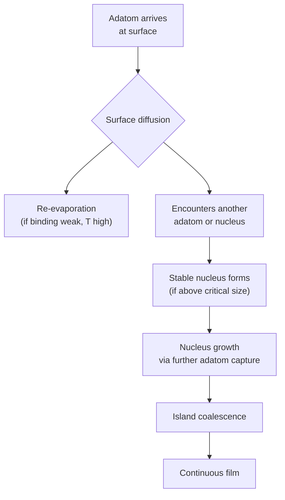
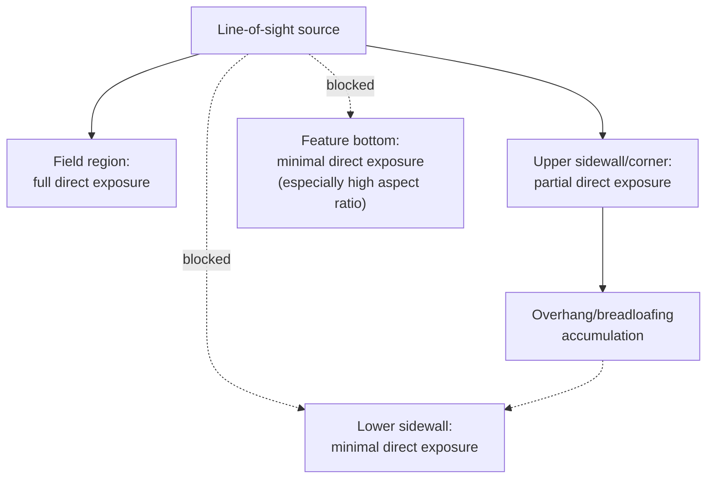

## Film Nucleation and Step Coverage

### Overview

Film nucleation and step coverage together describe two closely related aspects of how a thin film forms on a real substrate: nucleation concerns the atomic-scale process by which arriving adatoms organize into stable clusters and eventually a continuous film, while step coverage concerns how uniformly a film deposits across non-planar (topographic) surface features such as trenches, vias, and contact holes. Both are governed by the interplay of surface thermodynamics, adatom kinetics, and the specific transport mechanism (physical line-of-sight versus chemical surface reaction) of the deposition technique in use, and both directly determine whether a deposited film will meet the electrical, mechanical, and reliability requirements of a semiconductor device structure.

### Film Nucleation Fundamentals

**Adatom Arrival and Surface Diffusion**

When atoms arrive at a substrate surface (from any deposition technique), they initially exist as mobile "adatoms" that can diffuse across the surface, re-evaporate back into the gas/vacuum phase, or encounter and bond with other adatoms or existing surface features. The balance between these competing processes, governed by substrate temperature, arrival flux, and the specific adatom-substrate and adatom-adatom binding energies, determines the nucleation behavior.

**Critical Nucleus Size**

Classical nucleation theory describes a competing balance between the volume free energy released upon cluster formation (favoring larger clusters) and the surface/interface energy cost of creating new cluster boundaries (favoring smaller clusters, or none at all). This balance defines a **critical nucleus size** $r^*$ below which clusters are thermodynamically unstable (more likely to dissociate than grow) and above which clusters become stable and tend to grow further:

$$r^* = -\frac{2\gamma}{\Delta G_v}$$

where $\gamma$ is the relevant surface/interface energy term and $\Delta G_v$ is the volume free energy change per unit volume upon condensation (negative for a thermodynamically favorable phase transition). [Inference: this classical nucleation theory expression is a standard textbook relation providing qualitative and semi-quantitative understanding; real nucleation behavior in practical thin-film systems often deviates from ideal classical nucleation theory due to substrate heterogeneity, defects, and non-equilibrium kinetic effects.]

### Growth Modes Revisited in the Nucleation Context

The three classical thin-film growth modes (introduced in the context of evaporation but generally applicable across deposition techniques) arise directly from the relative magnitudes of adatom-adatom versus adatom-substrate binding energy:

**Key Points**

- **Volmer-Weber (island growth)**: Adatom-adatom binding exceeds adatom-substrate binding, favoring 3D cluster formation over surface wetting — common for many metal-on-oxide and metal-on-metal-oxide systems where the film material does not readily "wet" the substrate.
- **Frank-van der Merwe (layer-by-layer growth)**: Adatom-substrate binding exceeds adatom-adatom binding, favoring complete layer formation before subsequent layer nucleation — associated with strong wetting behavior and, in ideal cases, smoother resulting films.
- **Stranski-Krastanov (layer-plus-island)**: Initial layer-by-layer growth transitions to island growth after a critical thickness, typically driven by accumulating strain energy (e.g., lattice mismatch in heteroepitaxial systems) that eventually makes continued layer growth thermodynamically unfavorable relative to relaxation via island formation.

### Nucleation Density and Its Practical Consequences

**Key Points**

The density of stable nuclei formed per unit area (nucleation density) directly influences the final film's grain structure and the thickness at which the film becomes continuous (fully coalesced, without residual voids/gaps between islands):

- **Higher nucleation density** generally produces smaller average grain size and allows the film to reach full continuity/coalescence at a thinner overall film thickness — often desirable for applications requiring very thin, continuous, pinhole-free films (e.g., ultrathin barrier or seed layers).
- **Lower nucleation density** produces larger grains and requires greater film thickness before full coalescence, which can be problematic for applications requiring very thin continuous coverage but may be advantageous where larger grain size improves electrical conductivity (since grain boundary scattering is a significant resistivity contributor in very thin metal films).
- Nucleation density is influenced by substrate surface condition (cleanliness, native oxide presence, surface roughness, pre-existing defect density) and process parameters (substrate temperature, arrival flux/deposition rate), making substrate surface preparation (cleaning, pre-treatment) an important practical lever for controlling resulting film morphology.

### Step Coverage: Definitions and Metrics

**Key Points**

Step coverage quantifies how uniformly a film deposits across a topographic feature, typically expressed as the ratio of film thickness at a specific location (commonly the sidewall or bottom of a trench/via) relative to the film thickness on the flat, unobstructed field region:

$$\text{Step Coverage} = \frac{t_{feature}}{t_{field}}\times 100\%$$

Several specific step coverage metrics are commonly reported for a given feature:

- **Sidewall coverage**: Thickness on the vertical sidewall of a trench/via relative to the field thickness
- **Bottom coverage**: Thickness at the bottom of the feature relative to the field thickness
- **Conformality**: Often used loosely to describe overall uniformity across all feature surfaces (sidewall, bottom, top) relative to the field, approaching 100% for a perfectly conformal film

### Step Coverage in Line-of-Sight (PVD) Deposition

**Key Points**

For techniques such as thermal evaporation and, to a lesser extent, sputtering, atoms travel largely in straight-line trajectories from source to substrate. Consequently:

- Sidewalls not in direct line-of-sight of the source receive minimal direct deposition, relying instead on secondary, lower-probability mechanisms (surface diffusion of arriving adatoms, re-sputtering/redeposition in the case of sputtering) to achieve any sidewall coverage at all.
- **Overhang/breadloafing effect**: Material preferentially accumulates at the top corners of a feature (which have a wider unobstructed view of the source) faster than at the bottom, progressively narrowing the feature opening as deposition proceeds and further shadowing the lower sidewall and bottom regions from subsequent arriving material — a self-reinforcing effect that can lead to void formation if the feature closes off (pinches shut at the top) before the bottom is adequately filled.
- Techniques such as substrate rotation/tilting during deposition, and specialized sputtering configurations (collimated sputtering, long-throw sputtering, discussed under sputtering techniques), were developed specifically to mitigate these line-of-sight limitations, though generally at a cost to deposition rate or added equipment complexity.

### Step Coverage in Surface-Reaction-Limited (CVD) Deposition

**Key Points**

CVD's reliance on gas-phase transport followed by surface reaction (rather than direct line-of-sight arrival) generally improves step coverage relative to PVD, but the achievable conformality still depends critically on the reaction regime:

- **Reaction-rate-limited regime** (lower temperature, where surface reaction kinetics — not gas supply — is the bottleneck): Precursor gas has time to diffuse into and uniformly fill even deep, narrow features before reacting, generally producing good to excellent conformality since the reaction proceeds at essentially the same rate everywhere precursor has reached.
- **Mass-transport-limited regime** (higher temperature, where surface reaction is fast and gas-phase delivery becomes the bottleneck): Precursor is consumed near the feature opening/field region before it can diffuse deeply into narrow, high-aspect-ratio features, resulting in progressively thinner deposition deeper into the feature (a diffusion-limited-thickness gradient) — a significant potential problem for filling deep, narrow structures.
- This is a primary reason many CVD processes deliberately operate at lower temperature (favoring the reaction-rate-limited regime) specifically to maximize conformality for demanding topography, even at the cost of the higher deposition rates achievable in the mass-transport-limited regime.

### Step Coverage in ALD

As discussed in detail in the context of ALD's self-limiting mechanism, ALD achieves the best conformality among mainstream deposition techniques because its self-terminating surface reactions decouple film thickness from the local gas-phase transport dynamics entirely — the only requirement is sufficient time for precursor to diffuse into and saturate the entire feature depth before proceeding to the purge step, a requirement satisfiable for essentially any feature aspect ratio given sufficiently long (though correspondingly lower-throughput) exposure times.

### Comparison of Nucleation-Related Film Morphology and Step Coverage Effects

| Deposition Type | Nucleation Characteristics | Step Coverage Characteristic |
| --- | --- | --- |
| Thermal Evaporation | Growth mode strongly substrate/material dependent; often Volmer-Weber for metals on oxides | Poor; strong shadowing, overhang/breadloafing |
| Sputtering | Higher adatom energy can promote denser nucleation, smaller grains | Moderate; improved by collimation/long-throw, still limited at extreme AR |
| CVD (mass-transport limited) | Nucleation generally more uniform across field vs. line-of-sight PVD | Degrades with increasing aspect ratio (thickness gradient into feature) |
| CVD (reaction-limited) | Similar; more time for uniform precursor distribution | Good, but still gas-diffusion-time dependent |
| ALD | Nucleation delay effects can occur on dissimilar starting surfaces (discussed below) | Excellent, largely aspect-ratio-independent given sufficient exposure |

[Inference: these characterizations reflect generally recognized qualitative trends across deposition technique families; specific nucleation and step coverage outcomes for any given precursor/material/substrate/tool combination require direct experimental characterization.]

### ALD Nucleation Delay

**Key Points**

Even within ALD, an important nucleation-related phenomenon is **nucleation delay** (or incubation delay): on certain starting substrate surfaces that lack the specific chemical functional groups needed for the first precursor to react efficiently (e.g., attempting to grow an oxide directly on a hydrogen-terminated or otherwise unreactive starting surface), the first several ALD cycles may deposit substantially less material than the eventual steady-state growth-per-cycle value, until a sufficient initial coverage of reactive nucleation sites has been established. This means ultrathin ALD films (particularly the first few nanometers) can show non-linear thickness-versus-cycle-count behavior and potentially non-uniform initial coverage (isolated nucleation islands rather than a continuous layer) if nucleation delay is not accounted for or mitigated (e.g., via a substrate surface pre-treatment/functionalization step) — a particularly important consideration for the ultrathin gate dielectric and barrier layer applications where ALD is most critical. [Inference: the magnitude and practical significance of nucleation delay is highly specific to the particular precursor chemistry and starting substrate surface condition, and must be characterized experimentally for a given process rather than assumed as a fixed universal effect.]

### Worked Conceptual Example

**Example**

Consider two deposition scenarios for filling a contact via with aspect ratio 8:1: (1) sputtered titanium liner deposition, and (2) thermal ALD titanium nitride deposition using the same nominal target field thickness.

For the sputtered titanium case, line-of-sight limitations and the cosine-distributed angular emission from the sputtering target would be expected to produce measurably thinner coverage on the via sidewalls compared to the field region, with the via bottom likely showing the most significant thickness reduction due to the combined effects of limited direct arrival angle and potential shadowing from any overhang that develops near the via top during deposition.

For the ALD titanium nitride case, given sufficiently long precursor exposure and purge times to allow full gas diffusion into the 8:1 aspect ratio feature, thickness at the via bottom and sidewalls would be expected to closely approach the field thickness, since the self-limiting reaction mechanism does not depend on line-of-sight arrival angle or the same gas-phase transport limitations affecting sputtering.

This qualitative contrast reflects well-established, generally recognized behavior differences between the two deposition technique families; specific numeric step coverage percentages for either process at this aspect ratio would require direct process characterization (e.g., cross-sectional SEM/TEM measurement) for the specific tool and recipe in use. [Inference: this example illustrates recognized general trends rather than specific quantitative predictions for any particular fabrication process.]

### Related Topics

- Physical vapor deposition and evaporation (line-of-sight limitations)
- Sputtering techniques (collimation and long-throw approaches)
- Chemical vapor deposition variants (transport vs. reaction-limited regimes)
- Atomic layer deposition (self-limiting conformality mechanism)
- Thin film stress and adhesion characterization
- Grain boundary effects on thin-film electrical resistivity
- Via and contact fill process integration for advanced interconnects