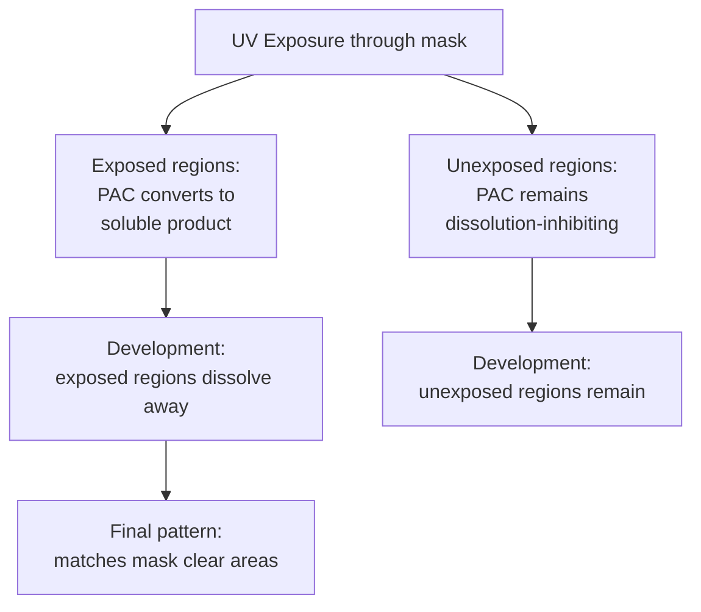
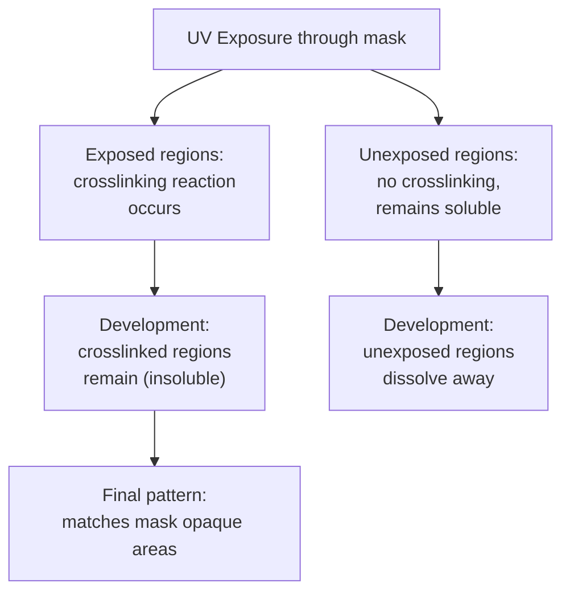
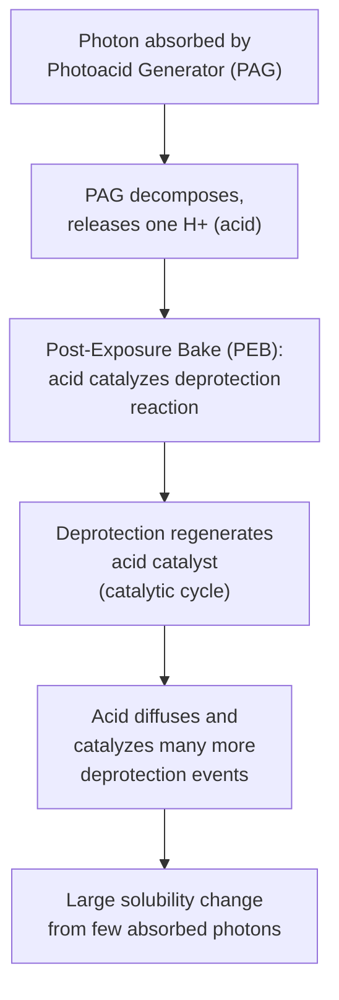

## Photoresist Chemistry and Tone

### Overview

Photoresist is a light-sensitive polymeric material used to transfer a pattern from a photomask (or, in modern lithography, a computer-generated exposure pattern) onto a semiconductor wafer. Upon exposure to light (or other radiation, such as electron beams or EUV photons) of the appropriate wavelength, the resist undergoes a chemical transformation that alters its solubility in a subsequent developer solution, allowing selective removal of exposed or unexposed regions to reveal the desired pattern. The resist's chemistry determines both its resolution capability and its **tone** — whether exposed regions become soluble (positive tone) or insoluble (negative tone) in the developer.

### Basic Photoresist Composition

**Key Points**

A typical photoresist formulation consists of three primary components dissolved in a casting solvent:

- **Base resin (polymer matrix)**: Provides the resist's mechanical, thermal, and etch-resistance properties, forming the bulk structural material of the film after solvent removal (softbake).
- **Photoactive compound (PAC) or photoacid generator (PAG)**: The light-sensitive component that undergoes a chemical transformation upon exposure, ultimately driving the solubility change that creates the pattern.
- **Solvent**: Allows the resist to be spin-coated as a thin, uniform liquid film; evaporates during the softbake step, leaving a solid resist film.

Additional additives (sensitizers, surfactants, dissolution inhibitors, quenchers) are commonly included to tune specific performance characteristics such as contrast, sensitivity, and line-edge roughness.

### Positive-Tone Photoresist

**Principle**

In positive-tone resist, exposure to light chemically transforms the photoactive compound such that exposed regions become **more soluble** in the developer than unexposed regions. After development, exposed areas are removed, leaving unexposed resist behind — meaning the developed resist pattern directly matches the transparent regions of the photomask.

**Classical DNQ-Novolac Chemistry**

The historically dominant positive-tone resist system uses a **diazonaphthoquinone (DNQ)** photoactive compound combined with a **novolac resin** base:

- In the unexposed state, the DNQ compound acts as a **dissolution inhibitor**, strongly suppressing the novolac resin's natural (moderate) solubility in aqueous base developer.
- Upon UV exposure, the DNQ compound undergoes a photochemical reaction (Wolff rearrangement) that converts it into an indene carboxylic acid, which is itself readily soluble in aqueous base developer and, critically, no longer inhibits — but actively promotes — dissolution of the surrounding novolac resin.
- This creates a large solubility contrast between exposed and unexposed regions, the basis of DNQ-novolac's practical usability for high-fidelity pattern transfer.

**Key Points**

- DNQ-novolac resist was the dominant resist technology for i-line (365 nm) and earlier optical lithography generations, valued for good resolution, excellent etch resistance (novolac resin is chemically robust), and mature, well-understood processing.
- Sensitivity (required exposure dose) is generally lower than more advanced chemically amplified resists, requiring longer exposure times/higher light intensity — a practical throughput consideration at more advanced lithography generations requiring higher-resolution but lower-transmission optical systems.

### Negative-Tone Photoresist

**Principle**

In negative-tone resist, exposure triggers a chemical transformation (typically a crosslinking reaction) that renders exposed regions **less soluble** (or entirely insoluble) in the developer, while unexposed regions remain relatively soluble and are removed during development. The final pattern is therefore the inverse of positive resist — matching the opaque (unexposed) regions of the mask rather than the clear regions.

**Key Points**

- Early negative-tone resists (e.g., cyclized rubber-bisazide systems) suffered from significant **swelling** during development — the crosslinked polymer network absorbs developer solvent and physically swells, distorting fine pattern geometry and fundamentally limiting achievable resolution, particularly for closely spaced features.
- This swelling limitation was a primary historical reason positive-tone DNQ-novolac resist became the dominant technology for higher-resolution applications, despite negative resist's other potential advantages (e.g., often better adhesion and etch resistance in some formulations).
- Modern chemically amplified negative-tone resists (discussed below) substantially mitigate the swelling problem through different, more resolution-friendly crosslinking chemistry, renewing negative-tone resist's relevance for specific advanced applications.

### Chemically Amplified Resist (CAR) Chemistry

**Principle**

Chemically amplified resists represent the dominant modern resist technology, particularly essential for deep-UV (248 nm, 193 nm) and EUV lithography, where available exposure source power is limited relative to the very high resolution/low defectivity requirements. Rather than each absorbed photon directly and stoichiometrically driving one solubility-switching chemical event (as in classical DNQ-novolac), CAR chemistry uses a catalytic amplification mechanism:

**Key Points**

- A **photoacid generator (PAG)** absorbs a photon and decomposes to release a single proton (acid catalyst molecule).
- During the critical **post-exposure bake (PEB)** step, this photogenerated acid catalyzes a deprotection reaction on the resist polymer's protecting groups (commonly tert-butyl ester or similar acid-labile groups), converting the polymer from a dissolution-inhibited state to a base-soluble state (for positive-tone CAR) — and critically, this deprotection reaction regenerates the acid catalyst, allowing it to diffuse and catalyze many additional deprotection events beyond the single photon absorption event that initially generated it.
- This catalytic chain reaction provides dramatically higher effective sensitivity (lower required exposure dose) than non-amplified resist chemistry, essential for practical throughput given the limited photon flux available from advanced (particularly EUV) exposure sources.
- **Acid diffusion length during PEB is a critical resolution-limiting parameter**: if the photogenerated acid diffuses too far during the post-exposure bake, it blurs the intended latent image, directly degrading achievable resolution and increasing line-edge roughness — making PEB time/temperature a critical, tightly controlled process parameter in CAR-based lithography. [Inference: the specific acid diffusion length and its precise resolution impact are formulation- and process-condition-specific, generally characterized empirically for a given resist system rather than predicted from a single general formula.]
- **Airborne base contamination sensitivity**: CAR chemistry's reliance on a small quantity of photogenerated acid makes it notably sensitive to trace airborne basic contaminants (e.g., amine compounds from cleanroom materials or ambient air), which can neutralize surface acid and cause resist "T-topping" or footing defects at the resist surface — a well-documented practical CAR processing concern requiring careful cleanroom environmental control.

### Tone Reversal and Negative-Tone Development (NTD)

**Key Points**

An important modern technique, particularly relevant to advanced immersion and EUV lithography, is **negative-tone development (NTD)**: a chemically positive-tone resist formulation (using standard deprotection-based CAR chemistry) is developed using an organic solvent developer rather than the standard aqueous-base developer, which reverses the effective pattern tone — the deprotected (exposed) regions, now more polar, become insoluble in the non-polar organic developer, while unexposed (still protected, less polar) regions dissolve away.

**Key Points**

- NTD allows leveraging the well-established, highly optimized positive-tone CAR polymer/PAG chemistry platform while achieving a negative-tone patterning outcome, which can be advantageous for specific mask/illumination optimization strategies in advanced lithography (e.g., certain contact-hole or trench-dominant layers benefit from the illumination/mask design freedom that negative-tone patterning provides for those particular geometries).
- This represents a practical convergence point where the traditional strict positive/negative resist chemistry distinction becomes somewhat blurred — the underlying resist chemistry is fundamentally the same positive-tone deprotection mechanism, with tone determined by the developer solvent choice rather than by fundamentally different resist chemistry.

### Resist Contrast

**Key Points**

Resist contrast $\gamma$ quantifies how sharply the resist's solubility response transitions as a function of exposure dose — a critical parameter for achieving steep, well-defined sidewall profiles rather than gradually sloped or rounded feature edges:

$$\gamma = \left[\log_{10}\left(\frac{D_{100}}{D_0}\right)\right]^{-1}$$

where $D_0$ is the dose at which the resist just begins to show measurable solubility change and $D_{100}$ is the dose at which the resist reaches its fully developed (saturated solubility change) state. Higher contrast values indicate a sharper, more step-function-like solubility response, generally correlating with steeper resist sidewall profiles and better resolution of closely spaced features — a key reason chemically amplified resist's catalytic amplification mechanism (which can achieve very high effective contrast) has been important for extending optical lithography resolution.

### Comparison: Positive vs. Negative Tone (Summary)

| Aspect | Positive Tone | Negative Tone |
| --- | --- | --- |
| Exposed region behavior | Becomes soluble | Becomes insoluble (crosslinks) |
| Pattern matches mask | Clear (transparent) areas | Opaque areas |
| Classic chemistry example | DNQ-Novolac | Cyclized rubber-bisazide |
| Historical resolution limitation | Generally favorable | Swelling-limited (classical systems) |
| Modern CAR availability | Well-established, dominant | Available, renewed relevance via NTD |

### Worked Conceptual Example

**Example**

Consider patterning a via-hole layer where the desired final pattern consists of small, isolated openings (holes) surrounded by a much larger area of remaining resist (a "dark field" mask scenario, where most of the mask is opaque except for the small via openings). Using a positive-tone resist and mask combination, only the small via-hole regions would be exposed and would need to be cleanly and completely dissolved during development — a scenario generally well-suited to positive-tone resist's typical strengths. Using negative-tone development (NTD) on an equivalent chemically amplified platform with an inverted (bright-field-equivalent) mask design could instead be chosen specifically because it allows different illumination/optical proximity correction strategies optimized for isolated dark features — a design trade-off decision made at the mask/illumination co-optimization level rather than being dictated purely by resist chemistry availability. [Inference: the specific choice between positive-tone and NTD approaches for any given layer/feature type is a process integration decision made based on the specific lithography generation, tool, and layer requirements, and this example illustrates a general strategic consideration rather than a universal rule for via-layer patterning.]

### Related Topics

- Photolithography exposure systems and resolution limits (diffraction, NA, k1 factor)
- Post-exposure bake and acid diffusion effects in chemically amplified resist
- Extreme ultraviolet (EUV) lithography resist challenges
- Optical proximity correction and resolution enhancement techniques
- Etch selectivity and resist as an etch mask material
- Line-edge roughness characterization and mitigation
- Double patterning and multiple exposure techniques