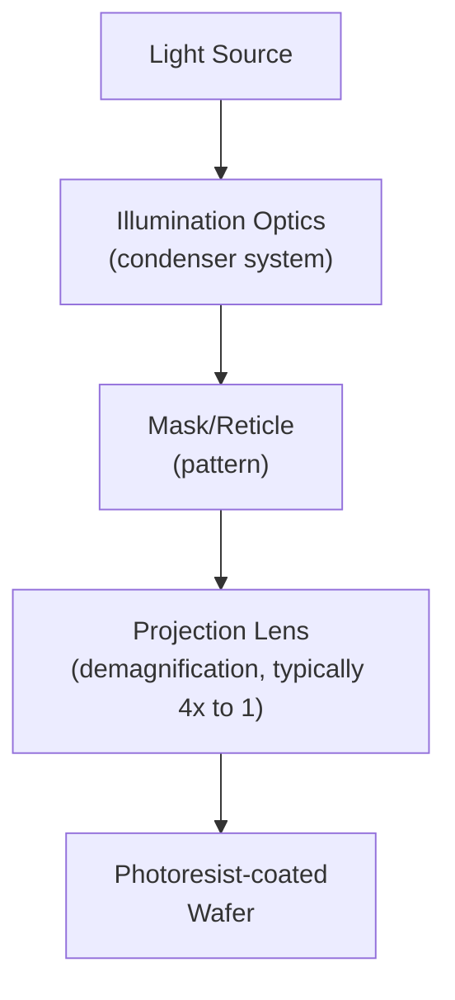

## Exposure Systems and Resolution Limits

### Overview

Exposure systems are the optical (or particle-beam) tools that transfer a mask or reticle pattern onto photoresist-coated wafers, and their fundamental resolution limits — governed primarily by diffraction physics — have driven the entire historical progression of lithography technology, from simple contact printing through advanced immersion and extreme ultraviolet (EUV) systems. Understanding the physical basis of resolution limits, and the various techniques developed to push practical resolution beyond naive diffraction-limited expectations, is essential to understanding how semiconductor feature sizes have continued shrinking across successive technology generations.

### Exposure System Architectures

**Contact and Proximity Printing**

The earliest lithography approach placed the mask in direct contact with (contact printing) or a small, controlled gap from (proximity printing) the resist-coated wafer, exposing the entire wafer through the mask simultaneously with a collimated light source.

**Key Points**

- Contact printing offers excellent theoretical resolution (limited primarily by diffraction at the mask-resist gap, which is minimized to near zero) but suffers from severe practical problems: direct mask-wafer contact causes mask damage and wafer particle contamination with repeated use, limiting mask lifetime and yield.
- Proximity printing reduces contact-related damage/contamination by introducing a small gap, but this gap directly introduces diffraction-limited resolution loss, since the pattern must now diffract across a finite gap distance before reaching the resist.
- Both approaches print the full wafer pattern in a single exposure (1:1 mask-to-wafer scale), meaning mask defects transfer directly and proportionally to the wafer pattern — a significant yield and mask-fabrication-cost concern that motivated the transition to projection-based systems.

**Projection Lithography (Steppers and Scanners)**

Modern lithography exclusively uses projection systems, in which a lens (or in the case of EUV, a system of curved mirrors) projects a demagnified image of the mask/reticle pattern onto the wafer, with no direct mask-wafer contact.

**Key Points**

- **Steppers** expose one field (die or group of dies) at a time, stepping the wafer stage between exposures across the full wafer, with the mask held stationary during each individual exposure.
- **Scanners** (step-and-scan systems) additionally scan both the mask and wafer synchronously during each field's exposure (typically through a narrow slit-shaped illumination field), allowing larger field sizes and generally better across-field uniformity/aberration correction than pure step-and-repeat exposure, and are the dominant architecture in modern high-resolution lithography.
- Standard demagnification ratio is commonly 4:1 (mask features are 4x larger than the corresponding printed wafer features), which relaxes mask fabrication resolution/defect requirements relative to a 1:1 system, since a given wafer-level defect size corresponds to a proportionally larger, easier-to-control mask-level feature/defect size.

### The Diffraction-Limited Resolution Equation

**Key Points**

The fundamental resolution limit of any projection optical system is governed by diffraction physics, commonly expressed via the **Rayleigh criterion**, adapted for lithography as:

$$R = k_1\frac{\lambda}{NA}$$

where:

- $R$ is the minimum resolvable feature half-pitch (or critical dimension)
- $\lambda$ is the exposure wavelength
- $NA$ is the numerical aperture of the projection lens system
- $k_1$ is a dimensionless process-dependent factor capturing all the practical process, resist, and illumination optimization effects that determine how close a real system can approach the fundamental diffraction limit

This equation is the single most important relationship in lithography resolution engineering, since it directly identifies the three independent levers — wavelength, numerical aperture, and process factor $k_1$ — available to improve resolution.

### Wavelength Reduction

**Key Points**

Historically, the most direct resolution improvement lever has been progressively reducing exposure wavelength across successive lithography generations:

- **g-line** (436 nm) and **i-line** (365 nm): Mercury-arc-lamp-based sources used for earlier technology generations.
- **KrF excimer laser** (248 nm): Deep-UV (DUV) source enabling a substantial resolution jump, requiring the transition to chemically amplified resist chemistry (discussed in the photoresist chemistry context) due to reduced available exposure dose/sensitivity requirements at this wavelength.
- **ArF excimer laser** (193 nm): The dominant DUV wavelength for advanced optical lithography for an extended period, extended significantly through immersion lithography and multiple patterning techniques (discussed below) well beyond its originally anticipated resolution limits.
- **Extreme ultraviolet (EUV)** (13.5 nm): A dramatic wavelength reduction requiring an entirely different optical architecture (reflective mirror-based optics rather than refractive lenses, since no practical transparent optical materials exist at this wavelength) and vacuum operating environment (since EUV radiation is strongly absorbed by essentially all gases, including air).

[Fact: this progression of standard lithography exposure wavelengths across technology generations is well-established industry history; specific technology-node-to-wavelength correspondences and transition timing details are best verified against current semiconductor industry roadmap documentation for precise claims.]

### Numerical Aperture and Immersion Lithography

**Key Points**

Numerical aperture is defined as:

$$NA = n\sin\theta$$

where $n$ is the refractive index of the medium between the final lens element and the wafer, and $\theta$ is the half-angle of the maximum cone of light the lens can capture/project.

**Dry Lithography**: With air ($n \approx 1$) as the medium, $NA$ is fundamentally limited to values below 1 (since $\sin\theta$ cannot exceed 1), placing a hard ceiling on achievable resolution at a given wavelength via the $NA$ lever alone.

**Immersion Lithography**: By introducing a high-refractive-index liquid (typically ultra-pure water, with $n \approx 1.44$ at 193 nm) between the final lens element and the wafer, effective $NA$ can exceed 1 (values around 1.35 being common for advanced 193nm immersion systems), directly improving resolution according to the Rayleigh equation without requiring a wavelength change.

**Key Points**

- Immersion lithography was a critical technique extending 193 nm ArF lithography's practical resolution capability well beyond what dry 193nm systems could achieve, delaying (and for many applications, substituting for) the need to transition to EUV for a significant span of technology generations.
- Introduces its own process engineering challenges, including managing the immersion fluid's interaction with the photoresist surface (requiring compatible resist topcoat layers or resist formulations resistant to fluid-induced defects such as leaching or watermark formation) and fluid delivery/removal system engineering to avoid bubble formation and contamination.

### The Process Factor k1

**Key Points**

The $k_1$ factor captures the gap between theoretical diffraction-limited resolution and what a real production process can practically achieve, and represents the primary lever for resolution improvement that does not require new exposure wavelength or numerical aperture hardware:

- $k_1 = 0.5$ represents (for standard coherent/partially coherent illumination without resolution enhancement techniques) approximately the classical diffraction-limited threshold for resolving a periodic (dense line/space) pattern.
- Modern advanced lithography routinely operates with $k_1$ values below 0.5 (sometimes referred to as achieving "sub-$k_1$" or "low-$k_1$" imaging), made possible only through the combination of resolution enhancement techniques discussed below — off-axis illumination, optical proximity correction, phase-shift masks, and multiple patterning — each contributing incrementally to closing the gap between diffraction theory's simplest prediction and achievable production resolution.
- Lower $k_1$ generally comes with reduced process latitude (smaller allowable variation in exposure dose and focus while still achieving acceptable pattern fidelity — discussed further below), meaning aggressive $k_1$ reduction trades resolution capability against manufacturing robustness/yield margin.

### Resolution Enhancement Techniques (Brief Survey)

**Key Points**

- **Off-Axis Illumination (OAI)**: Using annular, dipole, or quadrupole illumination shapes (rather than simple on-axis illumination) to preferentially enhance the diffraction orders most useful for resolving specific pattern geometries, effectively pushing achievable $k_1$ lower for those pattern types.
- **Optical Proximity Correction (OPC)**: Deliberately distorting mask pattern shapes (adding serifs, adjusting line-end extensions, etc.) to compensate for predictable optical proximity effects (diffraction-induced pattern distortion that depends on local pattern density/geometry), improving as-printed pattern fidelity relative to the intended design.
- **Phase-Shift Masks (PSM)**: Introducing controlled phase differences between adjacent mask transmission regions (rather than simple binary transparent/opaque mask regions) to exploit destructive interference effects that sharpen the printed image contrast at feature edges, enabling improved resolution particularly for specific pattern types (e.g., alternating phase-shift masks for dense line/space patterns).
- **Multiple Patterning**: Splitting a single target pattern layer into two or more separate exposure/etch steps (discussed in detail as its own topic area), directly circumventing single-exposure diffraction resolution limits by relaxing the minimum pitch required within any individual exposure step.

### Process Latitude: Depth of Focus and Exposure Latitude

**Key Points**

Beyond raw resolution, practical manufacturing requires sufficient **process latitude** — tolerance to real-world variation in exposure dose and focus position while still achieving acceptable pattern fidelity across the wafer and across process runs:

$$DOF \propto k_2\frac{\lambda}{NA^2}$$

where $DOF$ is depth of focus and $k_2$ is an analogous process-dependent factor for focus latitude. This relationship reveals a fundamental resolution-versus-process-latitude trade-off: increasing $NA$ to improve resolution simultaneously reduces depth of focus (since $DOF$ scales with $1/NA^2$, a stronger dependence than resolution's $1/NA$ scaling), meaning higher-resolution systems generally have less tolerance for wafer topography variation, stage focus error, and other real-world non-idealities — a critical practical constraint that must be balanced against pure resolution capability in real process and equipment design. [Inference: the specific $k_2$ proportionality and exact depth-of-focus values for a given tool/process combination depend on the specific optical system design and process conditions, and this relationship describes the general scaling trend rather than a universally fixed numeric formula.]

### EUV-Specific Resolution Considerations

**Key Points**

While EUV's dramatically shorter wavelength provides substantial resolution benefit via the basic Rayleigh relation, EUV lithography introduces resolution-relevant challenges not present (or much less significant) in optical lithography:

- **Stochastic effects**: At EUV's very high photon energy, a given exposure dose corresponds to a much smaller absolute number of photons than an equivalent dose at longer optical wavelengths, making shot-noise-driven stochastic variation in local exposure dose (and resulting stochastic defects such as random line-edge roughness, bridging, or missing contacts) a significant practical resolution-limiting concern distinct from the classical diffraction-limited framework. [Inference: the specific quantitative impact of stochastic effects at any given EUV dose/feature size combination is an active area of ongoing industry research and process characterization, and general statements here should not be treated as precise, current quantitative guidance.]
- **Mirror-based reflective optics**: Since no practical transmissive optical materials exist for 13.5 nm radiation, EUV systems use multilayer-coated reflective mirrors for both illumination and projection optics, introducing distinct optical design and mask (reticle) technology considerations (reflective masks rather than transmissive masks) compared to all prior optical lithography generations.

### Comparison Table: Exposure System Evolution

| System/Wavelength | Approx. NA Range | Key Resolution Enabler | Key Limitation Addressed |
| --- | --- | --- | --- |
| i-line (365 nm) | Moderate | Wavelength reduction from g-line | Basic diffraction limit at longer wavelength |
| KrF (248 nm) DUV | Moderate-High | Wavelength reduction, CAR chemistry | Sensitivity/throughput at shorter wavelength |
| ArF (193 nm) dry | High | Further wavelength reduction | Diffraction limit at 193nm dry NA ceiling |
| ArF immersion | Very High (NA>1) | Immersion fluid raising effective NA | Dry lithography's NA<1 hard ceiling |
| EUV (13.5 nm) | System-specific | Dramatic wavelength reduction | Optical (193nm-based) resolution/multi-patterning complexity limits |

[Inference: specific NA values and precise technology transition points vary by source and continue to be refined by ongoing industry developments; this table reflects generally recognized qualitative progression rather than precise current specifications.]

### Worked Conceptual Example

**Example**

Using the Rayleigh resolution equation, consider comparing achievable half-pitch resolution for ArF immersion lithography ($\lambda = 193\ \text{nm}$, $NA = 1.35$) versus EUV lithography ($\lambda = 13.5\ \text{nm}$, illustrative $NA = 0.33$ for an early-generation EUV system), assuming an illustrative $k_1 = 0.4$ for both:

$$R_{ArF} = 0.4\times\frac{193}{1.35} \approx 57\ \text{nm}$$

$$R_{EUV} = 0.4\times\frac{13.5}{0.33} \approx 16\ \text{nm}$$

This illustrates the substantial resolution advantage EUV's wavelength reduction provides even with a considerably lower numerical aperture than advanced ArF immersion systems, explaining why EUV became necessary for continued single-exposure resolution scaling once ArF immersion combined with multiple patterning approached its own practical and economic limits. [Unverified: the specific $NA$ and $k_1$ values used here are illustrative representative figures for demonstrating the scaling relationship; actual production system specifications and achieved resolution values should be confirmed against current, specific tool and process documentation rather than this simplified example.]

### Related Topics

- Photoresist chemistry and tone (resist requirements for different exposure wavelengths)
- Multiple patterning techniques (pitch-splitting beyond single-exposure limits)
- Optical proximity correction and resolution enhancement techniques
- Phase-shift mask technology
- EUV lithography source and mask technology
- Immersion lithography fluid and defect engineering
- Overlay and alignment metrology in multi-layer lithography