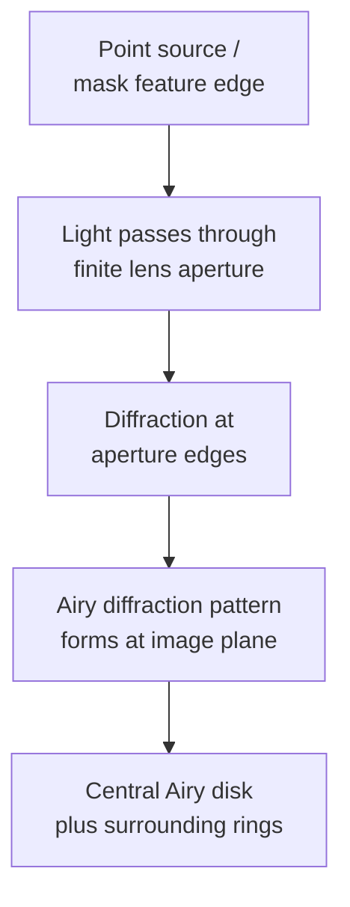
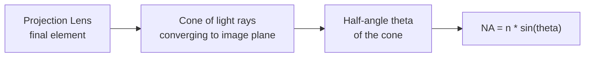
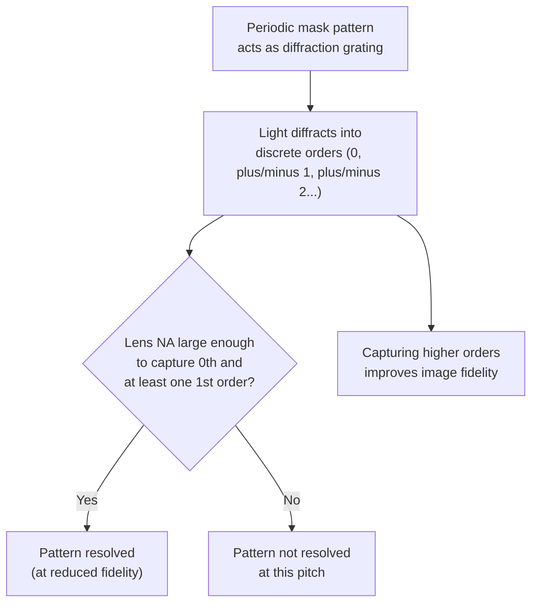

## The Rayleigh Criterion and Numerical Aperture

### Overview

The Rayleigh criterion and numerical aperture together form the physical and mathematical foundation for understanding resolution limits in optical lithography (and, more broadly, in any diffraction-limited imaging system). The Rayleigh criterion originates in classical optics as a resolvability standard for distinguishing two closely spaced point sources, and its lithography-adapted form directly links exposure wavelength, lens numerical aperture, and process conditions to the minimum feature size a projection system can resolve. Understanding these concepts at a fundamental physical level clarifies why each successive lithography generation has pursued shorter wavelengths, higher numerical apertures, or both.

### Diffraction and the Origin of Resolution Limits

**Key Points**

Any optical system with a finite aperture cannot form a perfect point image of a point source; instead, diffraction spreads the image into a characteristic pattern — the **Airy pattern** — consisting of a central bright disk (the Airy disk) surrounded by progressively weaker concentric rings. This diffraction spreading is the fundamental physical origin of all resolution limits in optical systems, including lithographic projection systems, since a mask feature's image on the wafer is never a perfectly sharp reproduction of the mask geometry but rather a diffraction-blurred version of it.

### The Classical Rayleigh Criterion

**Original Formulation**

In classical optics, the Rayleigh criterion defines two point sources as "just resolved" when the central maximum (peak) of one source's Airy diffraction pattern coincides with the first diffraction minimum (dark ring) of the adjacent source's Airy pattern:

$$\theta_{min} = 1.22\frac{\lambda}{D}$$

where $\theta_{min}$ is the minimum resolvable angular separation, $\lambda$ is wavelength, and $D$ is the aperture diameter. This criterion is somewhat arbitrary (a matter of convention rather than an absolute physical cutoff — closer spacings are technically still distinguishable with sufficient signal processing, just with reduced contrast), but it provides a widely accepted, physically motivated benchmark for practical resolvability.

### Adaptation to Lithography

**Key Points**

The lithography-specific adaptation of the Rayleigh criterion restates the underlying physics in terms of the minimum resolvable feature half-pitch on the wafer, replacing the classical point-source formulation with a periodic pattern (line/space) resolution context more directly relevant to semiconductor patterning:

$$R = k_1\frac{\lambda}{NA}$$

**Key Points**

- $R$ represents the minimum resolvable half-pitch (for a dense line/space pattern) or, more generally, critical dimension capability of the exposure system.
- $\lambda$ is the exposure wavelength used by the system.
- $NA$ is the numerical aperture of the projection lens (or mirror system, for EUV).
- $k_1$ is a dimensionless empirical/process factor (discussed in detail below) that absorbs all the practical departures from the idealized classical Rayleigh point-source derivation — including the finite contrast requirements of real photoresist, non-ideal illumination coherence, and the specific pattern geometry (isolated lines behave differently than dense line/space arrays).

This restated form preserves the same fundamental physical insight as the classical criterion — resolution improves (smaller $R$) with shorter wavelength and larger aperture — while being cast in a form directly usable for lithography process and equipment engineering.

### Numerical Aperture: Physical Definition

**Key Points**

Numerical aperture quantifies the light-gathering (and, by reciprocity, light-projecting) angular capability of an optical system:

$$NA = n\sin\theta$$

where $n$ is the refractive index of the medium immediately surrounding the point where the angle is measured (conventionally, the medium between the final optical element and the image plane for a projection system), and $\theta$ is the half-angle of the maximum cone of light rays the lens can accept or project.

**Key Points**

- A larger $NA$ corresponds to a wider light-collection/projection cone angle, which — via the diffraction physics underlying the Rayleigh relation — directly translates into finer resolvable detail, since a wider angular spread of diffracted light (containing higher spatial-frequency information about the mask pattern) can be captured and reconstructed into the image.
- Because $\sin\theta$ is mathematically bounded at a maximum value of 1 (corresponding to $\theta = 90°$, an physically unrealizable limiting case), $NA$ in a medium with $n=1$ (air/vacuum) is fundamentally bounded below 1, and practical dry lens systems typically achieve $NA$ values meaningfully below this theoretical ceiling due to additional practical lens design constraints.

### Immersion: Raising Numerical Aperture Beyond Unity

**Key Points**

Because $NA = n\sin\theta$ includes the refractive index $n$ of the medium at the image plane, introducing a medium with $n > 1$ between the final lens element and the wafer directly raises the achievable $NA$ beyond the dry (air, $n\approx1$) ceiling of 1, without requiring any change to the fundamental lens angular acceptance geometry:

$$NA_{immersion} = n_{fluid}\sin\theta$$

For 193 nm ArF immersion lithography, ultra-pure water ($n \approx 1.44$ at 193 nm) is the standard immersion fluid, enabling practical $NA$ values around 1.35 in advanced production immersion scanners — a direct, substantial resolution improvement via the Rayleigh relation without needing to move to a shorter exposure wavelength. [Fact: water immersion at 193nm is the well-established standard industry approach; specific achieved $NA$ values for particular tool generations should be confirmed against current equipment specifications for precise claims.]

### Depth of Focus and the NA Trade-Off

**Key Points**

Numerical aperture's resolution benefit comes with an important, physically linked trade-off in **depth of focus (DOF)** — the range of vertical (defocus) positions over which the projected image remains acceptably sharp:

$$DOF \propto k_2\frac{\lambda}{NA^2}$$

Because $DOF$ scales as $1/NA^2$ (a stronger, quadratic dependence) while resolution $R$ scales only as $1/NA$ (linear), increasing $NA$ to improve resolution reduces depth of focus disproportionately faster — meaning higher-$NA$ systems are progressively less tolerant of wafer topography variation, resist thickness non-uniformity, and stage focus positioning error. This fundamental physical trade-off is a central design and process engineering consideration at every lithography generation: raw resolution capability cannot be evaluated in isolation from the corresponding practical process latitude cost.

### The k1 Factor in Detail

**Key Points**

The $k_1$ factor is not a fixed physical constant but rather a process-and-technique-dependent parameter reflecting how closely a real production lithography process can approach the idealized diffraction-limited resolution implied by wavelength and $NA$ alone:

- **$k_1 = 0.61$**: Corresponds to the classical Rayleigh criterion's original resolvability threshold as directly translated to the lithography context (i.e., the point at which the criterion's defining condition — peak-to-first-minimum overlap — is satisfied for the specific dense-pattern imaging geometry relevant to lithography).
- **$k_1 = 0.5$**: Often cited as the approximate practical limit for straightforward projection imaging of dense periodic patterns without additional resolution enhancement techniques, representing roughly the point at which the two lowest diffraction orders needed to reconstruct a periodic pattern's fundamental spatial frequency can just be captured by the projection lens aperture.
- **$k_1 < 0.5$ ("low-$k_1$" imaging)**: Achievable only through the combined application of resolution enhancement techniques (off-axis illumination, optical proximity correction, phase-shift masks, multiple patterning), each of which manipulates the diffraction pattern, illumination geometry, or exposure sequence to extract additional resolvable information beyond what a simple, unenhanced imaging system could achieve at the same wavelength and $NA$.

[Inference: the specific $k_1$ value considered a practical minimum or standard benchmark can vary somewhat depending on the specific pattern type, illumination scheme, and resist process under discussion, and general numeric benchmarks cited here should be understood as commonly referenced approximate values rather than universal fixed thresholds.]

### Diffraction Orders and Pattern Reconstruction

**Key Points**

A more physically detailed picture of why $NA$ and $k_1$ matter as they do comes from considering a periodic mask pattern (e.g., a dense line/space grating) as a diffraction grating: illuminated light diffracts into discrete orders (0th, ±1st, ±2nd, etc.) at angles determined by the pattern pitch and illumination wavelength. To reconstruct any image of the periodic pattern at all, the projection lens must capture at minimum the 0th order and at least one ±1st order; capturing higher orders progressively improves image fidelity (sharper, more accurate edge reproduction) but is not strictly required for basic pattern resolvability.

This diffraction-order picture directly explains the physical basis of the $k_1 = 0.5$ approximate practical threshold: it corresponds closely to the minimum $NA$ (at a given wavelength and pattern pitch) required to just capture the necessary 0th and 1st diffraction orders for basic pattern reconstruction, and it also explains why off-axis illumination (which shifts the diffraction order angles relative to the lens aperture in a way that can allow smaller-pitch patterns to still have their necessary orders captured within a fixed $NA$) is such an effective resolution enhancement technique.

### Worked Numerical Example

**Example**

Given: ArF immersion lithography system, $\lambda = 193\ \text{nm}$, $NA = 1.35$, targeting a dense line/space pattern with an assumed practical $k_1 = 0.35$ (representative of an aggressively optimized low-$k_1$ process using resolution enhancement techniques).

Step 1 — Minimum resolvable half-pitch:

$$R = k_1\frac{\lambda}{NA} = 0.35\times\frac{193\ \text{nm}}{1.35} \approx 50\ \text{nm}$$

Step 2 — Compare to a less aggressive process at $k_1 = 0.5$ (no advanced resolution enhancement):

$$R_{k1=0.5} = 0.5\times\frac{193}{1.35} \approx 71\ \text{nm}$$

This comparison illustrates that, for the same wavelength and numerical aperture hardware, moving from $k_1 = 0.5$ to $k_1 = 0.35$ through resolution enhancement techniques alone (no wavelength or $NA$ change) improves resolvable half-pitch by roughly 30% — a substantial capability gain achievable purely through process/illumination/mask optimization rather than new exposure tool hardware, illustrating why $k_1$ reduction has been such a heavily pursued lever throughout the extended lifetime of 193nm immersion lithography. [Inference: the specific $k_1$ values used in this example are illustrative representative figures chosen to demonstrate the scaling relationship; actual achievable $k_1$ for any specific production process depends on the full combination of illumination, mask technology, and resist process in use and should be confirmed against specific process characterization data.]

### Related Topics

- Exposure systems and resolution limits (broader system-level context)
- Off-axis illumination and resolution enhancement techniques
- Optical proximity correction and phase-shift mask technology
- Immersion lithography fluid and defect engineering
- Multiple patterning techniques for sub-diffraction-limit pitch
- Depth of focus and process window characterization
- EUV lithography optical system design