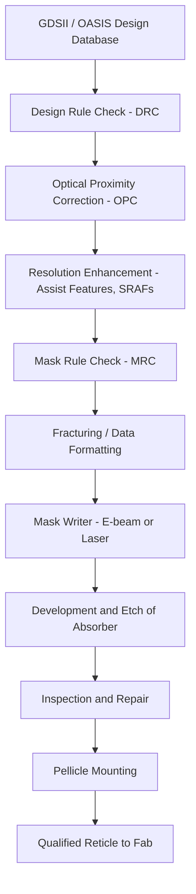
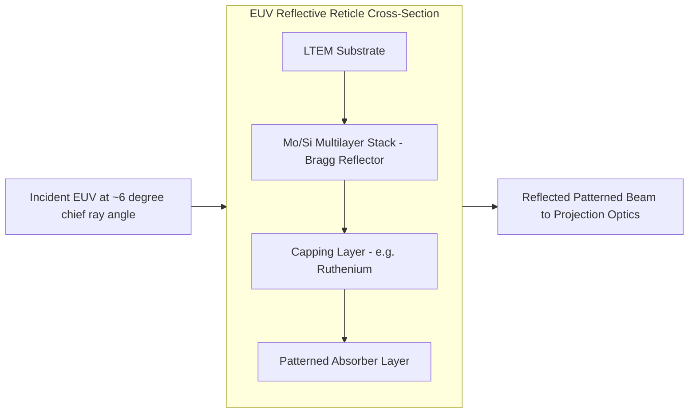

## Mask and Reticle Design

### Overview

Photomasks (masks) and reticles are the master templates that carry circuit pattern geometry, transferring it onto photoresist-coated wafers during photolithography. The terms are often used interchangeably, but a technical distinction exists: a **mask** contains a 1:1 pattern that contacts or is proximate to the wafer (contact/proximity printing), while a **reticle** contains a magnified pattern (commonly 4x or 5x) used in projection steppers/scanners, where a reduction lens demagnifies the image onto the wafer. Modern high-volume manufacturing (HVM) almost universally uses 4x reticles with projection optics.

### Physical Construction

**Substrate**

- Typically high-purity fused silica (quartz), chosen for excellent transmission at deep-UV wavelengths (365 nm, 248 nm, 193 nm), low thermal expansion coefficient (CTE), and mechanical flatness.
- Standard reticle format: 6-inch square (152.4 mm × 152.4 mm), 6.35 mm thick, per SEMI standards, enabling compatibility across scanner platforms.

**Absorber Layer**

- A thin film patterned atop the substrate to block or phase-shift light.
- Common absorber: chromium (Cr), often with an anti-reflective coating (CrON/CrO) on top to suppress unwanted reflections during patterning and exposure.
- Absorber thickness is tuned to achieve high optical density (OD > 3) with minimal pattern-edge diffraction effects.

**Pellicle**

- A thin, transparent membrane (nitrocellulose or fluoropolymer for ArF) stretched over a frame, mounted several millimeters above the mask surface.
- Function: keeps particles out of the focal plane of the imaging system. A particle landing on the pellicle is far enough out of focus that it does not print, whereas a particle directly on the mask surface would transfer a defect to every exposed die.

### Mask Types by Function

**Binary Intensity Mask (BIM)**

- Simplest type: opaque chrome regions block light entirely; clear (quartz) regions transmit light fully.
- Produces a simple 0/1 (dark/light) intensity pattern at the wafer plane.
- [Inference] Sufficient for less aggressive pitches but increasingly supplemented by resolution enhancement techniques (RET) as feature sizes shrink below the wavelength of exposing light.

**Phase-Shift Mask (PSM)**

- Exploits the wave nature of light: introducing a controlled phase shift (typically 180°) between adjacent transparent regions causes destructive interference at the boundary, sharpening the aerial image and improving resolution and depth of focus (DOF).
- **Alternating PSM (AltPSM / Levenson type)**: etches the quartz substrate to a precise depth in alternating clear apertures so light passing through is shifted 180° relative to neighboring apertures. Offers the strongest resolution enhancement but is complex to design (phase conflict resolution) and manufacture.
- **Attenuated PSM (AttPSM / EAPSM)**: replaces opaque chrome with a partially transmissive absorber (commonly MoSi-based, ~6% transmission) that also imparts a 180° phase shift. The partial transmission sharpens edge contrast (increases image slope) without the phase-conflict routing complexity of AltPSM. This is the dominant PSM type in production due to easier mask design and compatibility with standard mask-making flows.

**Optical Proximity Correction (OPC) Enhanced Masks**

- Not a distinct mask "type" but a design-stage modification applied to virtually all masks used at sub-wavelength nodes.
- Compensates for diffraction-induced pattern distortion (line-end shortening, corner rounding, pitch-dependent CD variation) by pre-distorting the mask geometry so the printed wafer pattern matches the intended design.
- **Rule-based OPC**: applies correction based on lookup tables of geometric context (line width, spacing, proximity to neighboring features).
- **Model-based OPC (MB-OPC)**: uses calibrated optical and resist models to simulate the printed image and iteratively adjust mask edges (edge segments moved via "jogs") until simulated output matches target CD within tolerance.
- Adds "assist features" or "scattering bars": sub-resolution features placed near isolated lines to mimic the diffraction environment of dense patterns, improving process-window consistency between isolated and dense features. These assist features are sized below the printing threshold so they influence the aerial image without themselves resolving on the wafer.

### Reticle Enhancement Technologies (RET) Ecosystem

**Off-Axis Illumination (OAI)**

- Not part of the mask itself, but co-designed with mask patterns. Illuminating at oblique angles (annular, dipole, quadrupole source shapes) improves the contrast of specific pitch/orientation combinations captured by the mask design; mask OPC is calibrated against the specific illumination source shape used.

**Inverse Lithography Technology (ILT)**

- A computational design approach where the mask pattern is derived by solving an inverse optimization problem: given the desired wafer pattern, compute the mask geometry (often complex, curvilinear shapes rather than Manhattan rectilinear shapes) that best reproduces it through the optical system.
- Produces highly non-intuitive, "free-form" mask shapes, requiring specialized mask-writing tools capable of curvilinear pattern generation (e.g., multi-beam mask writers).
- [Inference] Adoption has grown alongside multi-beam mask writer availability, since variable-shaped-beam writers are less efficient at curvilinear shape fracturing.

**Source Mask Optimization (SMO)**

- Co-optimizes the illumination source shape and the mask pattern simultaneously, rather than treating them as sequential, independent design steps. Used heavily at advanced nodes (see EUV section) to maximize process window for critical layers.

### Mask Data Preparation (MDP) Flow

**Fracturing**

- The corrected, curvilinear/rectilinear design polygons must be decomposed ("fractured") into primitive shapes (trapezoids, rectangles) that the mask writer's exposure system can address, since most e-beam and laser writers expose one primitive shape at a time (or, for multi-beam systems, per-pixel dose maps).
- Output format historically MEBES; modern flows commonly use industry-standard formats before conversion to tool-specific machine formats.

**Mask Writing**

- **Variable Shaped Beam (VSB) e-beam writers**: shoot a sequence of rectangular/trapezoidal electron beam shots, each exposing one fractured primitive. Write time scales with shot count, which grows rapidly with OPC complexity.
- **Multi-beam mask writers (MBMW)**: use an array of thousands to millions of individually blanked electron beamlets, exposing via a pixelated dose map rather than discrete shots. Write time becomes largely independent of pattern complexity, which is a key enabler for curvilinear ILT-derived masks and complex EUV mask patterns.
- **Laser writers**: used for less critical layers or larger feature masks where e-beam resolution is not required, offering higher throughput at coarser resolution.

**Mask Rule Check (MRC)**

- Analogous to wafer-level DRC but for the mask itself: verifies minimum feature size, spacing, and other manufacturability constraints specific to the mask-making process (etch bias, writer grid, phase-shift region sizing) are satisfied.

### EUV Reticles: A Structurally Different Paradigm

Extreme ultraviolet lithography (13.5 nm wavelength) cannot use transmissive masks because virtually all materials absorb strongly at this wavelength. EUV reticles are therefore **reflective**.

- **Substrate**: low-thermal-expansion material (LTEM) glass, coated with a **multilayer stack** of alternating molybdenum (Mo) and silicon (Si) layers (typically ~40–50 bilayer pairs), engineered as a Bragg reflector to achieve ~65–70% peak reflectivity at 13.5 nm via constructive interference.
- **Capping layer**: protects the Mo/Si stack from oxidation and contamination (e.g., ruthenium).
- **Absorber**: a patterned layer (historically tantalum-boron-nitride based; newer low-n absorber materials are an active R&D area) deposited atop the multilayer stack; regions without absorber reflect light back into the projection optics, patterned regions do not.
- **Reflective, off-axis geometry**: because EUV optics are all-reflective (no transmissive lens material is transparent at 13.5 nm) and the reticle is illuminated at a slight non-normal angle (chief ray angle, typically ~6°) to physically separate incoming and reflected light, EUV masks exhibit **shadowing effects**: absorber topography casts an asymmetric shadow depending on pattern orientation relative to the illumination azimuth, causing pattern placement and CD asymmetries not present in transmissive lithography.
- **Defectivity challenge**: buried, "phantom" defects within the multilayer stack (introduced during substrate/multilayer deposition, before absorber patterning) cannot be repaired conventionally and can print even though the defect is not on the visible top surface. EUV blank inspection and defect mitigation (e.g., strategic pattern placement to shift a known defect location to a non-critical area) is a major cost and yield driver.
- **Pellicle**: EUV pellicles are extremely challenging because most materials absorb EUV strongly; thin (tens of nanometers) polysilicon or carbon-nanotube-based membranes have been developed to achieve acceptable transmission (~85–90%) while still blocking particles. [Unverified] Industry-wide pellicle adoption timelines and material choices continue to evolve as of the most recent public roadmaps.

### Aerial Image Formation (svg_diagram)

<svg xmlns="http://www.w3.org/2000/svg" viewBox="0 0 640 260" font-family="sans-serif">
<text x="320" y="20" text-anchor="middle" font-size="14" font-weight="bold">Aerial Image Formation Through Projection Optics (svg_diagram)</text>
<line x1="60" y1="50" x2="60" y2="90" stroke="black" stroke-width="2" />
<text x="60" y="45" text-anchor="middle" font-size="11">Illumination</text>
<rect x="20" y="90" width="80" height="10" fill="#333" />
<rect x="120" y="90" width="30" height="10" fill="#333" />
<rect x="170" y="90" width="80" height="10" fill="#333" />
<text x="135" y="115" text-anchor="middle" font-size="10">Reticle (4x pattern)</text>
<line x1="20" y1="100" x2="90" y2="150" stroke="#888" stroke-width="1" />
<line x1="100" y1="100" x2="140" y2="150" stroke="#888" stroke-width="1" />
<line x1="120" y1="100" x2="145" y2="150" stroke="#888" stroke-width="1" />
<line x1="150" y1="100" x2="155" y2="150" stroke="#888" stroke-width="1" />
<line x1="170" y1="100" x2="160" y2="150" stroke="#888" stroke-width="1" />
<line x1="250" y1="100" x2="220" y2="150" stroke="#888" stroke-width="1" />
<ellipse cx="150" cy="160" rx="70" ry="15" fill="none" stroke="black" stroke-width="1.5" />
<text x="150" y="185" text-anchor="middle" font-size="10">Projection Lens (reduction, e.g. 4:1)</text>
<line x1="90" y1="170" x2="290" y2="220" stroke="#888" stroke-width="1" />
<line x1="140" y1="170" x2="300" y2="220" stroke="#888" stroke-width="1" />
<line x1="150" y1="170" x2="305" y2="220" stroke="#888" stroke-width="1" />
<line x1="160" y1="170" x2="310" y2="220" stroke="#888" stroke-width="1" />
<rect x="270" y="220" width="20" height="8" fill="#555" />
<rect x="298" y="220" width="8" height="8" fill="#555" />
<rect x="312" y="220" width="20" height="8" fill="#555" />
<text x="300" y="245" text-anchor="middle" font-size="10">Aerial Image at Wafer Plane (1x, demagnified)</text>
<rect x="260" y="228" width="90" height="6" fill="none" stroke="#aa0000" stroke-width="1" />
<text x="450" y="130" font-size="10" fill="#aa0000">Diffraction spreads edges;</text>
<text x="450" y="145" font-size="10" fill="#aa0000">OPC/PSM sharpen resulting</text>
<text x="450" y="160" font-size="10" fill="#aa0000">intensity profile at wafer</text>
</svg>

### Mask Defects and Inspection

- **Particle contamination**: mitigated primarily by the pellicle, plus cleanroom protocols and mask pod handling.
- **Repeater vs. random defects**: a mask defect prints identically on every die exposed by that reticle (a "repeater" defect across the wafer), unlike random wafer-level particle defects — making mask cleanliness disproportionately high-leverage for overall yield.
- **Repair techniques**:
  - Focused ion beam (FIB) or e-beam-induced deposition/etch for localized absorber addition (opaque defect repair) or removal (clear defect repair).
  - [Inference] EUV mask repair is markedly more constrained than optical mask repair because the multilayer reflector cannot tolerate the same repair chemistries without degrading reflectivity.
- **Mask inspection**: performed with dedicated high-NA optical or e-beam inspection tools, comparing die-to-die or die-to-database to flag deviations exceeding a defined sensitivity threshold.
- **Aerial Image Measurement System (AIMS)**: a metrology tool that reproduces the actual scanner's optical conditions (NA, illumination shape, wavelength) on a small mask region to directly assess whether a detected defect will actually print at the wafer, avoiding costly false-positive repairs.

### Reticle Handling and Metrology in the Fab

- Reticles are stored and transported in sealed pods (reticle SMIF pods) to preserve pellicle integrity and prevent particle ingress.
- **Registration/overlay metrology**: precise mask pattern placement (registration error, typically specified in single-digit nanometers at advanced nodes) is critical since placement error on the reticle directly translates (scaled by demagnification factor) into wafer-level overlay error between lithography layers.
- **CD uniformity (CDU)**: variation in critical dimension across the reticle field must be tightly controlled, as it directly convolves with wafer-level CDU budgets.

### Related Topics

- Optical Proximity Correction (OPC) modeling and simulation
- Resolution Enhancement Techniques (RET): OAI, SMO, multiple patterning
- EUV multilayer mirror fabrication and pellicle development
- Mask defect inspection and repair (FIB, AIMS)
- Multi-beam mask writer architecture
- Overlay and registration metrology
- Multiple patterning (LELE, SADP, SAQP) and its interaction with mask design