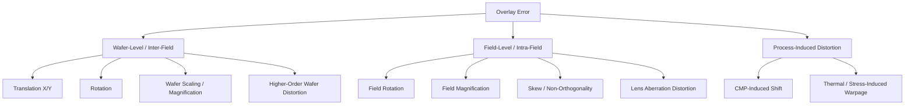
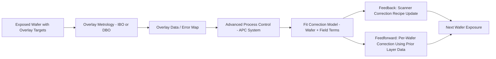

## Alignment and Overlay Control

### Overview

Overlay is the measure of how accurately a given lithography layer's pattern is positioned relative to the pattern(s) already present on the wafer from previous process steps. Alignment is the real-time process by which the lithography tool (stepper/scanner) locates the wafer's existing pattern and positions it correctly beneath the reticle before exposure. As device features shrink and layer counts grow, the overlay budget (allowable misregistration) shrinks proportionally, making alignment and overlay control among the most demanding metrology and control problems in semiconductor manufacturing.

### Why Overlay Matters

- Each lithography layer must land precisely atop prior layers so that structures like contacts, vias, and gate-to-source/drain regions connect correctly.
- Overlay error directly reduces the process window for subsequent etch, implant, or deposition steps and can cause opens, shorts, or parametric yield loss even when each individual layer is printed with good CD (critical dimension) control.
- **Overlay budget** is typically allocated as a fraction (historically ~1/3 to 1/5, tightening further at advanced nodes) of the minimum half-pitch of the layers being aligned, following an extension of Rayleigh-type scaling logic used across lithography.
- [Inference] As device pitches have scaled into the sub-20 nm regime, total overlay budgets across a full process flow have compressed to the single-digit nanometer range, making overlay control one of the primary gating factors for node scaling, alongside resolution itself.

### Alignment Marks (Fiducials)

Alignment relies on dedicated marks patterned onto the wafer, distinct from the functional circuit pattern, that the scanner's alignment sensors can locate optically.

**Common mark types**

- **Box-in-box**: a mark consisting of nested rectangular frames from different layers; overlay is measured as the offset between the inner and outer box centers.
- **Bar-in-bar / segmented gratings**: linear grating structures optimized for high-precision optical diffraction-based alignment sensors.
- **AIM (Advanced Imaging Metrology) marks**: multi-segment grating marks designed to reduce sensitivity to processing-induced mark asymmetry (e.g., from chemical-mechanical polishing, CMP).

**Placement considerations**

- Marks are placed in scribe lines (kerf) between dies to avoid consuming active die area, and sometimes within die for local, high-density overlay sampling at advanced nodes.
- Mark design must balance robustness to downstream process steps (etch bias, CMP dishing, deposition) against optical/mark real estate constraints.

### Alignment Systems in the Scanner

**Wafer alignment (global and local)**

- **Global alignment**: the scanner measures a small subset of alignment marks across the wafer (e.g., a handful of fields) and fits a mathematical model (translation, rotation, wafer scaling, and higher-order terms) to predict the position of every field on the wafer, rather than measuring every single field directly. This is far faster than measuring every field but assumes the wafer's distortion is well captured by the model's polynomial order.
- **Die-by-die alignment**: measures alignment marks at every field (or a much denser sampling), correcting for local, higher-order distortions the global model would miss, at the cost of throughput. Used selectively for critical layers or wafers exhibiting significant non-uniform distortion.

**Reticle alignment**

- Before exposure, the scanner also aligns the reticle itself to the projection optics' optical axis using reticle alignment marks, ensuring the reticle pattern is correctly centered and oriented relative to the illumination and lens system.

**Sensor technologies**

- **Through-the-lens (TTL) alignment**: alignment marks are imaged through the same projection lens used for exposure, minimizing systematic offset between the alignment measurement and the actual exposure position.
- **Off-axis alignment (OAA)**: uses a separate optical path (not through the main projection lens) to measure mark position, offering more flexibility in wavelength choice (can use non-actinic light) and typically higher throughput; requires careful calibration (baseline correction) to a common coordinate reference with the exposure system.

### The Overlay Error Model

Overlay error is conventionally decomposed into a hierarchy of spatial-frequency components, each attributable to different physical sources and corrected by different control mechanisms:

**Wafer-level (inter-field) errors**

- Translation (X/Y shift), rotation, and wafer-scale magnification/scaling errors — corrected via the global alignment model's linear/low-order terms.
- Higher-order wafer distortion (non-linear across the wafer) — requires higher-order polynomial terms in the alignment model or per-field correction.

**Field-level (intra-field) errors**

- Field rotation, field magnification, and skew (non-orthogonality) within a single exposure field — arise from lens distortion, reticle placement error, or thermal/mechanical effects within the scanner, and are corrected via scanner-specific intra-field correction terms (sometimes called "K-parameters" in industry vocabulary).
- Lens aberrations contribute field-dependent, often non-linear distortion components.

**Process-induced errors**

- Wafer processing steps (deposition stress, CMP, thermal cycling, etch) can physically warp or shift the wafer pattern between lithography layers in ways the alignment model at exposure time cannot directly observe, since alignment marks are measured just before exposure but the reference layer's marks may have shifted since they were originally printed.
- [Inference] These process-induced, layer-specific distortions are a primary reason overlay control has moved toward more localized and higher-order correction terms over successive technology generations, rather than relying solely on wafer-level linear models.

### Overlay Metrology Techniques

**Image-based overlay (IBO)**

- Uses optical microscopy to directly image box-in-box or similar target structures and measure the geometric offset between layers via image processing.
- [Inference] Susceptible to target asymmetry from process steps (e.g., asymmetric etch or CMP of the mark itself), which can introduce a systematic measurement bias distinct from the true pattern-to-pattern overlay ("tool-induced shift," TIS, and "wafer-induced shift," WIS, are the terms typically used to characterize this).

**Diffraction-based overlay (DBO) / scatterometry overlay**

- Uses specially designed grating targets where diffraction efficiency is sensitive to the relative offset between overlapping gratings on two layers; a spectroscopic or angle-resolved measurement infers overlay from the diffraction signal rather than a direct image.
- Generally offers better precision and is less susceptible to certain asymmetry effects than image-based methods, and has become the dominant overlay metrology approach at advanced nodes.

**Overlay sampling strategy**

- Overlay is measured at a sampled subset of fields/dies across the wafer (not every die), and the correction model is fit from these sampled measurements; sampling density and target placement strategy directly affect how well the fitted model captures true higher-order distortion versus interpolation error.

### Correction and Control Loop

Overlay control operates as a feedback (and increasingly feedforward) loop between metrology and the lithography tool:

- **Advanced Process Control (APC)**: a run-to-run control system that ingests overlay metrology data, fits the wafer-level and field-level correction terms, and automatically updates the scanner's exposure correction recipe for subsequent wafers or lots, reducing the need for manual intervention.
- **Feedforward correction**: increasingly, per-wafer (not just per-lot, run-to-run) correction data — sometimes derived from the specific wafer's own prior-layer measured distortion — is fed forward to correct that same wafer's exposure, rather than waiting for a downstream run-to-run update.
- **Higher-order control (HOC / HOPC)**: scanners now support correction models with many more degrees of freedom (higher-order polynomial or even per-field, non-uniform correction), which the APC system fits and applies as feature pitches drive overlay budgets tighter.

### Overlay and Multiple Patterning

Multiple-patterning schemes (LELE, SADP, SAQP, etc., covered elsewhere) introduce an especially demanding overlay requirement: **pitch-splitting overlay**, where two separate lithography exposures must be aligned to each other with high accuracy to form a single, uniform final pitch.

- Any overlay error between the two component exposures in a litho-etch-litho-etch (LELE) scheme directly translates into pitch-walking (alternating line spacing) in the final pattern, which can degrade both electrical uniformity and downstream process margin.
- [Inference] This overlay-sensitive pitch-splitting requirement was a significant driver behind the industry's development of self-aligned (spacer-based) multiple patterning techniques (SADP/SAQP), since spacer-defined pitch splitting removes reliance on lithography-to-lithography overlay for the split, replacing it with deposition thickness control, which can often be controlled more tightly.

### Practical Example: Estimating Overlay Budget

Consider a layer with a minimum half-pitch of 20 nm, where the process allocates roughly one-third of the half-pitch to total overlay budget as a simplified rule-of-thumb allocation:

$$\text{Overlay Budget} \approx \frac{1}{3} \times \text{Half-Pitch}$$

$$\text{Overlay Budget} \approx \frac{1}{3} \times 20\ \text{nm} \approx 6.7\ \text{nm}$$

This total budget must then be apportioned (via root-sum-square, RSS, combination as errors are generally treated as statistically independent) across all contributing sources: scanner matched-machine overlay (MMO), metrology tool measurement uncertainty, reticle registration error, and process-induced distortion:

$$\sigma_{total} = \sqrt{\sigma_{scanner}^2 + \sigma_{metrology}^2 + \sigma_{reticle}^2 + \sigma_{process}^2}$$

[Inference] In practice, fabs work backward from this kind of budget allocation to set specification limits on each contributing tool and process step, since exceeding the RSS-combined budget at $\sigma_{total}$ risks yield-impacting misregistration even if each individual contributor is within its own nominal spec.

### Related Topics

- Advanced Process Control (APC) and run-to-run control systems
- Scatterometry and diffraction-based metrology fundamentals
- Multiple patterning: LELE, SADP, SAQP overlay implications
- Mask and reticle registration error (see Mask and Reticle Design)
- CMP-induced wafer distortion and its effect on lithography
- Statistical process control (SPC) for lithography overlay