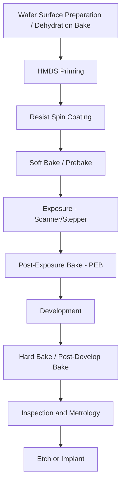

## Resist Processing Steps and Defects

### Overview

Photoresist processing is the sequence of coating, exposure-adjacent, and development operations that transform a spin-coated polymer film into a patterned mask for subsequent etch or implant steps. Each sub-step has its own process window and characteristic defect modes, and the entire sequence is typically integrated into a single automated **track** (coater/developer) system directly coupled to the exposure tool (scanner) to minimize airborne contamination and time-dependent effects between steps.

### Process Flow Overview

### Surface Preparation and Priming

**Dehydration bake**

- A high-temperature bake (typically well above 100°C) drives residual moisture off the wafer surface prior to coating, since adsorbed water degrades resist adhesion.

**HMDS (hexamethyldisilazane) priming**

- HMDS vapor treatment converts the hydrophilic, hydroxylated silicon/oxide surface into a hydrophobic surface by reacting with surface silanol (Si-OH) groups, improving resist wetting and adhesion.
- Typically applied as a vapor-phase treatment in a dedicated vapor prime oven or chamber immediately before coating, since the hydrophobic surface state degrades over time upon re-exposure to ambient moisture.

### Resist Spin Coating

- Resist (dissolved polymer, photoactive compound, and solvent) is dispensed onto the wafer center, and the wafer is spun at high speed (typically on the order of 1,000–5,000 rpm depending on target thickness and resist viscosity) to spread the resist into a thin, uniform film via centrifugal force and solvent evaporation.
- Film thickness is governed approximately by:

$$t \propto \frac{\eta^{a}}{\omega^{b}}$$

where $t$ is film thickness, $\eta$ is resist viscosity, $\omega$ is spin speed, and $a$, $b$ are empirically determined exponents specific to the resist formulation. [Inference] Because the relationship depends on resist-specific rheology and solvent evaporation kinetics, production thickness targeting is generally established empirically via a spin-speed curve for each specific resist/track combination rather than derived purely analytically.

**Common coating defects**

- **Striations**: radial thickness variations from non-uniform solvent evaporation during spin, often linked to airflow or edge-bead removal timing.
- **Comets**: streak-like defects trailing from a particle or resist gel caught during spin, dragging a visible tail in the film.
- **Edge bead**: a thickened resist ring at the wafer periphery from surface tension effects; typically removed intentionally via **edge bead removal (EBR)**, a solvent rinse targeted at the wafer edge, since an untreated edge bead can flake and generate particles or interfere with wafer handling/clamping downstream.
- **Voids/bubbles**: trapped air or degassing artifacts in the resist film, often from resist dispense issues or contamination.

### Soft Bake (Prebake)

- Drives off residual casting solvent from the as-coated resist film, hardening it sufficiently to be handled and exposed without excessive tackiness or solvent-related exposure artifacts.
- Typically performed on a hotplate (proximity or contact) rather than a convection oven, for tighter thermal uniformity and faster, more repeatable processing integrated into track throughput.
- Underbaking leaves excess solvent, which can cause scumming, poor adhesion, or intermixing effects; overbaking can degrade the photoactive compound or reduce photospeed. [Inference] Because bake temperature and time directly affect both residual solvent content and photoactive compound stability, soft bake conditions are generally tightly specified and monitored as part of the qualified process recipe rather than treated as a loosely bounded parameter.

### Exposure-Adjacent Considerations

While exposure itself (aerial image formation) is covered under mask/reticle design and imaging topics, several resist-side effects are directly tied to the exposure step:

- **Standing wave effects**: thin-film interference between incident and substrate-reflected exposure light creates periodic intensity variations through the resist depth, potentially causing scalloped sidewalls after development. Mitigated by bottom anti-reflective coatings (BARC) applied beneath the resist, or by post-exposure bake diffusion (below).
- **Airborne molecular contamination (AMC)**: chemically amplified resists (CARs, the dominant resist chemistry at deep-UV and EUV wavelengths) are sensitive to airborne basic contaminants (e.g., amines) that can neutralize the photogenerated acid at the resist surface, causing a characteristic **T-topping** defect (footing/necking profile distortion at the resist top surface). Fabs control this via chemical filtration in cleanroom air handling and minimizing exposure-to-PEB delay.

### Post-Exposure Bake (PEB)

- Critical for **chemically amplified resists (CAR)**: the exposure step generates a small quantity of photoacid via a photoacid generator (PAG); PEB thermally drives a catalytic deprotection reaction where the photoacid diffuses and catalyzes chemical change (e.g., deprotection of a blocked polymer) throughout the exposed volume, amplifying the effective sensitivity of the resist well beyond what direct photochemistry alone would provide.
- PEB also serves to reduce standing wave effects, since the diffusion of acid during bake smooths out the periodic exposure dose variation before development.
- **PEB delay sensitivity**: the time between exposure and PEB is a known sensitive parameter for CARs, since latent photoacid can react with airborne contaminants or diffuse unpredictably if bake is delayed; production tracks are engineered to tightly control this interval.
- Overbake or underbake directly shifts effective linewidth (since the deprotection reaction, and therefore effective dissolution contrast, is highly temperature- and time-dependent), making PEB one of the most tightly monitored bake steps in the entire flow.

### Development

- Standard chemistry: **aqueous-based development**, most commonly a 2.38% tetramethylammonium hydroxide (TMAH) solution, which selectively dissolves either the exposed (positive-tone) or unexposed (negative-tone) resist regions depending on resist polarity.
- **Puddle development**: the dominant production method — developer solution is dispensed to form a stationary puddle across the wafer surface, allowed to react for a controlled time, then rinsed and spun dry; offers good chemical usage efficiency and process control compared to older spray or immersion methods.
- **Negative-tone development (NTD)**: uses a solvent-based developer on nominally positive-tone resist chemistry, dissolving the unexposed regions instead; this technique became prominent for certain contact/via and dense-line layers where NTD provides a more favorable process window (e.g., improved depth of focus for specific pattern types) compared to conventional positive-tone aqueous development. [Inference] NTD adoption is generally layer- and pattern-dependent rather than a wholesale replacement for conventional development, since its advantages are most pronounced for specific dark-field, isolated-hole-type geometries.

### Post-Develop Bake / Hard Bake

- An optional additional bake after development to further harden the resist pattern, improve adhesion, and drive off residual solvent/moisture before etch, improving resist resistance to plasma etch chemistries.
- Must be controlled to avoid resist reflow (pattern rounding/slumping) at excessive temperature.

### Development and Post-Development Defects

**Scumming / residue**

- Incomplete removal of resist in regions intended to be cleared, typically from underexposure, underdevelopment, or contamination reducing local dissolution rate.

**Bridging**

- Adjacent resist lines remain connected due to insufficient exposure dose, resist collapse, or inadequate resolution/contrast at that pitch.

**Pattern collapse**

- High-aspect-ratio resist lines mechanically topple due to capillary forces exerted by the rinse liquid's surface tension during the final rinse/dry step, particularly problematic for sub-wavelength linewidths with tall resist profiles.
- [Inference] Pattern collapse risk increases sharply as linewidth-to-height aspect ratio increases, which is part of why resist film thickness is aggressively minimized (thin-resist strategies, often paired with hard-mask stacks) at advanced nodes rather than scaling resist thickness proportionally with linewidth.
- Mitigation approaches include surfactant-modified rinse chemistries to lower surface tension, and supercritical drying in specialized cases.

**Footing and undercutting**

- **Footing**: resist profile flares outward near the substrate interface, often from substrate reflectivity (standing waves) or acid quenching effects near the interface.
- **Undercutting (T-topping is the inverse case)**: resist profile is narrower at the base than the top, sometimes from substrate-related chemical interactions or reflective notching.

**Micro-bridging and particle-induced defects**

- Airborne or liquid-borne particles introduced at any stage (coat, develop, rinse) can locally block exposure or development, causing isolated printing defects; this is a primary driver for stringent cleanroom particle control and filtered chemical delivery throughout the track.

**Line edge roughness (LER) / line width roughness (LWR)**

- Stochastic variation in the resist edge position along a line's length, arising from photoacid generation statistics, polymer molecular weight/size effects, and shot noise in photon absorption (increasingly significant at EUV where photon counts per unit area are comparatively low for a given dose).
- [Inference] LWR has become a first-order concern (rather than a secondary metric) at advanced nodes because, as CD targets shrink, a fixed absolute roughness value represents a proportionally larger fraction of the total linewidth, directly eating into CD control budgets shared with overlay and other error sources.

### Inline Metrology and Defect Inspection

- **Scatterometry (OCD, optical critical dimension)**: measures resist profile (CD, sidewall angle, height) via model-based fitting of diffraction signal from periodic test structures, integrated inline for fast feedback.
- **CD-SEM**: scanning electron microscope measurement of resist linewidth at selected sites, offering direct top-down imaging at higher resolution than optical scatterometry but with lower throughput and potential resist shrinkage from electron beam exposure during measurement.
- **Macro/micro defect inspection**: bright-field/dark-field optical inspection tools scan the wafer for gross defects (particles, scumming regions, coating non-uniformities) shortly after develop, enabling rework (resist strip and recoat) before the pattern is committed via etch — a key economic advantage of catching defects at the resist stage rather than after etch.

### Rework

- One of photoresist processing's practical advantages: if inline inspection or metrology reveals an out-of-spec result after development (but before etch), the resist can typically be stripped and the wafer recoated and re-exposed, since no permanent pattern transfer into the underlying film has yet occurred.
- [Inference] This rework capability is a significant contributor to the frequent choice of photoresist processing as the point of maximum inline inspection scrutiny in the overall wafer flow, since catching defects here avoids scrapping wafers that have already consumed downstream etch or deposition process steps.

### Related Topics

- Chemically amplified resist (CAR) chemistry and photoacid generators
- Bottom and top anti-reflective coatings (BARC/TARC)
- EUV resist challenges: stochastics, shot noise, and resolution-LWR-sensitivity tradeoff
- Scatterometry-based optical critical dimension (OCD) metrology
- Etch pattern transfer and resist selectivity
- Multiple patterning process integration (LELE, SADP, SAQP)