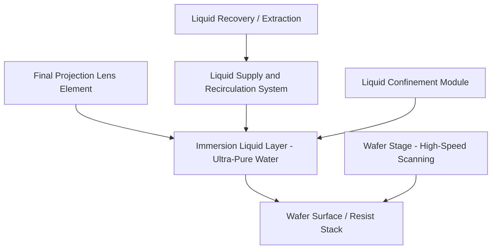

## Immersion Lithography

### Overview

Immersion lithography is a resolution-enhancement technique in which the medium between the final projection lens element and the wafer is replaced from air with a high-refractive-index liquid (predominantly ultra-pure water) during exposure. This increases the effective numerical aperture (NA) achievable by the imaging system beyond the air-limited maximum of 1.0, directly improving resolution and depth of focus without requiring a shorter exposure wavelength. Immersion lithography using 193 nm (ArF) light — commonly termed **193i** — became the dominant high-volume manufacturing technology for critical layers for over a decade before EUV insertion, and remains widely used today for non-critical and cost-sensitive layers, as well as in combination with multiple patterning for layers below single-exposure resolution limits.

### Physical Principle: Numerical Aperture Enhancement

The numerical aperture of an imaging system is defined as:

$$NA = n \sin\theta$$

where $n$ is the refractive index of the medium between the lens and the wafer, and $\theta$ is the half-angle of the maximum cone of light the lens can collect and focus.

In a conventional "dry" system, the medium is air ($n \approx 1.0$), which caps the maximum achievable NA at just under 1.0 in practice, since $\sin\theta$ cannot exceed 1. By replacing air with a liquid of higher refractive index — ultra-pure water has $n \approx 1.44$ at 193 nm — the same lens geometry (same $\theta$) yields a proportionally higher NA:

$$NA_{immersion} = n_{liquid} \sin\theta$$

This allows production 193i scanners to reach NA values around 1.35, compared to the practical ~0.93 ceiling of dry 193 nm systems.

### Resolution and Depth of Focus Impact

Both resolution and depth of focus in projection lithography follow the Rayleigh equations:

$$R = k_1 \frac{\lambda}{NA}$$

$$DOF = k_2 \frac{\lambda}{NA^2}$$

where $R$ is minimum resolvable half-pitch, $DOF$ is depth of focus, $\lambda$ is exposure wavelength, and $k_1$, $k_2$ are process-dependent constants shaped by illumination conditions, resist chemistry, and resolution enhancement techniques (RET).

- Increasing $NA$ directly improves resolution ($R$ decreases), which is immersion's primary benefit.
- However, $DOF$ falls off with the square of $NA$, meaning immersion's resolution gain comes with a proportionally steeper depth-of-focus penalty than a comparable dry-NA increase would — this is a key process-integration tradeoff immersion tool and process engineers must manage (tighter focus budgets, more sensitive to wafer topography and flatness).

### System Architecture

**Liquid confinement**

- The immersion liquid must be tightly confined to a small, localized region beneath the final lens element (the "meniscus" or fluid gap) that moves with the scanning wafer stage, rather than flooding the entire wafer or tool.
- Modern production tools use a localized confinement/recovery system built into the lens housing: liquid is continuously supplied and extracted at the boundary of the exposure field as the wafer stage scans beneath it, maintaining a stable, bubble-free, particle-free fluid layer only where imaging is actually occurring.

**Stage scanning dynamics**

- Because the wafer stage scans at high velocity during exposure (as in all scanner-type systems), the immersion liquid layer must remain stable and free of entrained bubbles or turbulence-induced disturbances even under significant acceleration and velocity, which drove substantial engineering effort in confinement hardware design as immersion tools matured from early demonstration systems to production-qualified platforms.

### Immersion-Specific Defect Modes

**Watermarks**

- Residual liquid droplets left on the wafer or resist surface after the confinement module passes can evaporate and leave mineral or contaminant residue, or interact chemically with the resist surface, producing localized printing defects.
- Mitigated through resist topcoats (protective, typically hydrophobic layers applied over the resist to prevent direct liquid-resist contact and leaching) and through confinement/extraction system design improvements.

**Bubbles**

- Microbubbles entrained in the immersion liquid (from degassing, liquid supply system imperfections, or turbulence at the confinement boundary) scatter and distort the imaging light path if present in the optical path during exposure, causing localized CD or printing defects.
- Controlled via degassed, filtered ultra-pure water supply and careful confinement module hydrodynamic design to minimize bubble entrainment.

**Resist leaching**

- Components of the photoresist (photoacid generator, base quencher, or other additives) can leach into the immersion liquid on contact, potentially contaminating the liquid (affecting subsequent field exposures) and altering the resist's own near-surface photochemistry.
- Addressed primarily via **resist topcoats**: a thin, immersion-liquid-compatible protective film applied over the photoresist before exposure, acting as a barrier against both leaching from the resist into the liquid and watermark-forming residue deposition from the liquid onto the resist.
- [Inference] Some later-generation immersion-optimized resists were formulated to be sufficiently non-leaching and hydrophobic on their own, reducing but not necessarily eliminating topcoat dependency depending on the specific resist platform and layer requirements.

**Liquid-induced defocus/refractive effects**

- Any non-uniformity in immersion liquid thickness, temperature, or purity can locally perturb the effective optical path length, introducing focus or aberration-like errors distinct from those seen in dry lithography, requiring immersion-specific metrology and control loops in the scanner.

### Immersion Combined with Resolution Enhancement Techniques

Immersion is not used in isolation but is layered together with other resolution enhancement techniques (RET) to maximize achievable resolution at 193 nm:

- **Phase-shift masks (PSM)** and **optical proximity correction (OPC)**: applied identically in principle to dry lithography, but calibrated against the higher NA (up to ~1.35) and correspondingly different optical diffraction behavior of the immersion system.
- **Off-axis illumination (OAI)**: source shaping continues to be co-optimized with immersion NA and mask pattern to maximize contrast for specific critical pitches.
- **Multiple patterning (LELE, SADP, SAQP)**: because 193i alone, even at maximum practical NA, cannot resolve the tightest pitches required at advanced nodes, immersion lithography has been combined extensively with multiple patterning techniques to extend its effective resolution below the single-exposure Rayleigh limit, enabling continued node scaling for one or more technology generations before EUV insertion for the most critical layers.

### Immersion vs. Dry Lithography: Comparative Summary

| Parameter | Dry 193 nm | Immersion 193 nm (193i) |
| --- | --- | --- |
| Medium between lens and wafer | Air ($n \approx 1.0$) | Ultra-pure water ($n \approx 1.44$) |
| Practical maximum NA | ~0.93 | ~1.35 |
| Resolution (relative) | Lower | Higher (finer half-pitch) |
| Depth of focus (relative) | Larger | Smaller (falls off as $1/NA^2$) |
| Additional hardware | None beyond dry lens/stage | Liquid supply, confinement, recovery systems |
| Additional resist/process considerations | Standard resist stack | Topcoat (in most cases), watermark/leaching control |

### Immersion Lithography and the Transition to EUV

[Inference] Immersion 193 nm lithography, especially when combined with multiple patterning, extended optical lithography's usable resolution range considerably beyond what would otherwise have been achievable at that wavelength, which is generally understood to have delayed the point at which EUV insertion became economically necessary relative to earlier industry projections. Immersion combined with multiple patterning and EUV single-exposure or EUV-plus-multiple-patterning approaches now coexist within modern process flows, with layer-by-layer economic and technical tradeoffs (mask cost, cycle time, achievable pitch, defectivity) determining which lithography approach is used for a given layer at a given node.

### Related Topics

- Multiple patterning techniques: LELE, SADP, SAQP
- Rayleigh resolution and depth-of-focus equations in projection lithography
- Photoresist topcoats and immersion-compatible resist chemistry
- Optical proximity correction (OPC) and phase-shift masks (PSM)
- EUV lithography fundamentals and reflective optics
- Off-axis illumination and source-mask optimization (SMO)