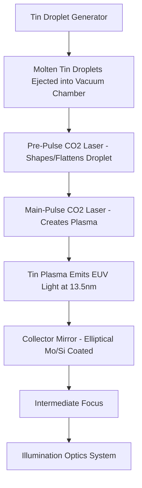

## Extreme Ultraviolet Lithography Fundamentals

### Overview

Extreme ultraviolet (EUV) lithography uses 13.5 nm wavelength light — roughly 14 times shorter than the 193 nm light used in immersion lithography — to directly enable finer resolution per the Rayleigh scaling relationship, without relying solely on numerical aperture increases or multiple patterning. The dramatic wavelength reduction, however, forces a nearly complete re-engineering of every subsystem in the lithography tool: at 13.5 nm, essentially all materials (including air) strongly absorb the light, so EUV systems must operate in vacuum and use entirely reflective (mirror-based) optics rather than the refractive lens systems used at longer wavelengths.

### Why 13.5 nm

- Shorter wavelength directly reduces the achievable resolution limit per the Rayleigh equation $R = k_1 \lambda / NA$, offering a path to finer pitches without the ever-increasing $k_1$-reduction and multiple-patterning burden required to keep extending 193 nm immersion lithography.
- 13.5 nm was selected in large part because it falls within a wavelength band where molybdenum-silicon (Mo/Si) multilayer mirror coatings can achieve usably high reflectivity (~65–70% per mirror surface), which is essential since EUV systems use many reflective surfaces in series and even small per-mirror losses compound severely across the full optical train.
- [Inference] The choice of 13.5 nm represents an engineering optimum balancing achievable multilayer mirror reflectivity, available light source technology, and resolution benefit, rather than being the theoretical shortest wavelength considered feasible.

### EUV Light Source: Laser-Produced Plasma (LPP)

Generating usable EUV light at suf ficient power for high-volume manufacturing throughput is one of the most demanding subsystems in the entire EUV ecosystem.

- **Tin droplet target**: microscopic droplets of molten tin are ejected at high repetition rate (tens of kHz) into the source vacuum vessel.
- **Dual-pulse laser excitation**: a low-energy "pre-pulse" CO2 laser first strikes each droplet to deform it into a flattened, disk-like shape optimized for efficient energy coupling; a subsequent high-energy "main pulse" CO2 laser then strikes the shaped droplet, heating the tin into a plasma state hot enough to emit strongly at the 13.5 nm EUV wavelength via multiply-ionized tin ion transitions.
- **Collector mirror**: a large, elliptical, Mo/Si multilayer-coated mirror positioned to collect the EUV light emitted by the plasma (which radiates in all directions) and focus it toward an intermediate focus point, from which it enters the illumination optics.
- **Debris mitigation**: the plasma generation process produces tin debris (both vapor and particulate) that threatens to contaminate and degrade the collector mirror's reflectivity over time; sources incorporate debris mitigation systems (e.g., hydrogen gas flow that reacts with deposited tin to form volatile stannane, which can be pumped away and the tin partially reclaimed) to extend collector mirror lifetime.
- [Inference] Source power and dose stability have historically been among the primary factors limiting EUV scanner throughput and uptime in production, since achieving sufficient EUV power at the wafer for economically viable wafers-per-hour output, while maintaining pulse-to-pulse and long-term power stability, is fundamentally harder than in DUV excimer laser sources.

### All-Reflective Optical System

Because no practical optical material is sufficiently transparent at 13.5 nm to serve as a lens element, EUV systems use only curved mirrors for both illumination and projection optics.

**Multilayer mirror construction**

- Each mirror consists of a precisely figured substrate (typically ultra-low thermal expansion glass-ceramic) coated with tens of alternating Mo/Si bilayers (typically ~40–50 pairs), engineered so that each interface reflects a small fraction of incident 13.5 nm light and constructive interference across the many-layer stack builds up total reflectivity to a usable level (a Bragg-mirror-like mechanism, analogous in principle to the EUV reticle's own reflective multilayer, since reticles for EUV are themselves mirrors).
- Even at optimized reflectivity (~65–70% per mirror), an optical train with a large number of mirror bounces suffers substantial cumulative light loss; this places a strong system-design incentive on minimizing the number of mirrors in both illumination and projection subsystems.

**Illumination system**

- Shapes and directs EUV light from the intermediate focus into a controlled illumination pattern (angular and spatial distribution) at the reticle plane, analogous in function to DUV illuminators but implemented entirely with reflective (rather than refractive) elements.

**Projection optics**

- A small number of large, extremely precisely figured mirrors (surface figure errors controlled to atomic-scale tolerances in places) demagnify the reflected reticle pattern onto the wafer, typically at 4x reduction consistent with industry-standard reticle magnification.
- Because the reticle itself is reflective (see EUV reticle architecture) and illumination arrives at a non-zero chief ray angle to physically separate incident and reflected beams, the projection system geometry, and the resulting shadowing effects on the mask side, are architecturally distinct from the fully transmissive, on-axis geometry of DUV projection systems.

### Vacuum Operating Environment

- The entire optical path — light source chamber, illumination optics, reticle stage, projection optics, and wafer stage — operates under high vacuum, since even trace amounts of gas (particularly oxygen and hydrocarbons) either absorb EUV light or can chemically degrade the multilayer mirror coatings over time through contamination or oxidation.
- This vacuum requirement drives substantially different wafer and reticle handling architecture compared to atmospheric-pressure DUV scanners, including specialized vacuum-compatible stages, load-lock systems for wafer and reticle transfer into and out of the vacuum environment, and vacuum-compatible actuators and sensors throughout.

### EUV Resist Considerations

While detailed resist chemistry is addressed elsewhere, several EUV-specific resist phenomena are fundamental to understanding EUV lithography's practical resolution limits:

- **Photon shot noise / stochastics**: at a given dose (energy per unit area), the number of absorbed EUV photons per resolution-relevant volume is comparatively low because each EUV photon carries much higher energy (~92 eV) than a 193 nm photon (~6.4 eV), meaning fewer photons are absorbed for the same deposited dose. This makes photon-count statistical (shot noise) variation a first-order contributor to line edge roughness (LER), local CD variation, and even stochastic printing failures (missing or bridging features) at EUV, in a way that is comparatively less significant at longer wavelengths.
- [Inference] This stochastic behavior is widely regarded as one of the central resolution-limiting factors for EUV at its most aggressive pitches, arguably rivaling classical optical resolution limits in practical importance, since simply increasing NA or improving resist contrast does not directly resolve a fundamentally photon-count-limited noise floor.
- **Secondary electron blur**: EUV photon absorption in the resist generates photoelectrons and subsequent cascades of lower-energy secondary electrons, which travel some finite distance before depositing their energy and driving the resist's chemical reaction; this electron travel distance introduces an image-blurring effect distinct from purely optical blur.

### High-NA EUV

- Next-generation EUV systems increase numerical aperture beyond the current generation's ~0.33 NA to higher values (0.55 NA systems being the next industry milestone), directly extending achievable resolution via the same $R = k_1\lambda/NA$ relationship.
- [Inference] Increasing NA in an all-reflective system requires larger and more complex mirror geometries and, notably, has historically been associated with a reduced usable exposure field size at the wafer for a given optical design approach, which is a key system-level tradeoff distinguishing High-NA EUV tool architecture from the current-generation platform, potentially requiring stitching or field-splitting strategies for large die.

### EUV vs. Immersion (193i) DUV: Comparative Summary

| Parameter | Immersion 193nm (193i) | EUV |
| --- | --- | --- |
| Wavelength | 193 nm | 13.5 nm |
| Optical medium | Refractive lenses, liquid immersion | All-reflective mirrors, vacuum |
| Reticle type | Transmissive | Reflective |
| Typical NA | Up to ~1.35 | ~0.33 (current gen), ~0.55 (High-NA) |
| Multiple patterning need | Frequently required at advanced pitches | Reduced or eliminated for many critical layers |
| Key resolution-limiting factor | Diffraction, RET complexity | Stochastics/shot noise, mirror reflectivity losses |
| Mask cost/complexity | Lower | Substantially higher (multilayer blanks, defect challenges) |

### Related Topics

- EUV reticle and reflective mask architecture (see Mask and Reticle Design)
- EUV resist stochastics and secondary electron blur
- High-NA EUV optical design and field-stitching strategies
- Laser-produced plasma source power scaling and collector mirror lifetime
- Multiple patterning as an alternative/complement to EUV single exposure
- EUV pellicle development and defect mitigation