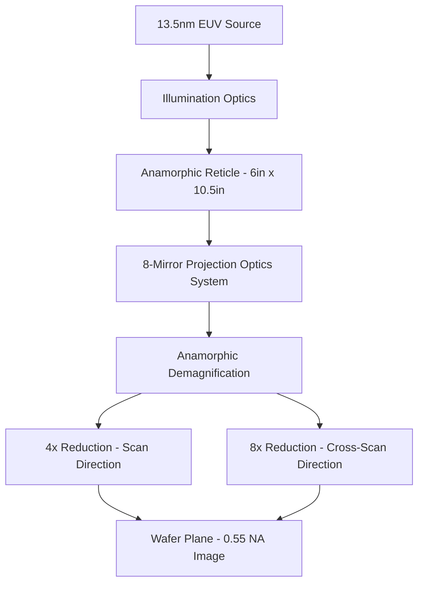

## High Numerical Aperture EUV Systems

### Overview

High-NA EUV lithography increases the numerical aperture of extreme ultraviolet projection optics from the first-generation value of 0.33 to 0.55, directly improving achievable resolution per the Rayleigh relationship without changing the 13.5 nm exposure wavelength. Achieving this NA increase within an all-reflective optical system required a fundamentally new, anamorphic mirror architecture rather than a simple scaling of the existing 0.33 NA design. ASML's High-NA platform, branded **EXE**, represents this generation of tools, and has entered volume production, with cumulative wafer exposures worldwide surpassing 1.35 million wafers and 10 systems operating across four customer fabs as of late 2026. [BigGo Finance](https://finance.biggo.com/news/ebcee768-7423-497f-8f5b-7f1b8ea2abb2)

### Motivation: Extending the Resolution Equation

As with all projection lithography, resolution follows:

$$R = k_1 \frac{\lambda}{NA}$$

Since EUV wavelength (13.5 nm) is already fixed by source and multilayer-mirror reflectivity constraints, increasing $NA$ is the most direct remaining lever for pushing $R$ lower without resorting to multiple patterning. Standard EUV systems using 0.33 NA optics achieve resolution down to approximately 13 nm single-exposure, while High-NA EUV systems using 0.55 NA anamorphic optics enable 8 nm single-exposure resolution. This resolution gain is the central economic argument for High-NA: compared to 0.33 NA EUV, which requires complex and costly multi-patterning processes for the tightest pitches, 0.55 NA High-NA EUV offers higher resolution in a single exposure. [Patsnap](https://www.patsnap.com/resources/blog/articles/asml-euv-and-high-na-lithography-technology-roadmap/)[BigGo Finance](https://finance.biggo.com/news/ebcee768-7423-497f-8f5b-7f1b8ea2abb2)

### The Anamorphic Optical Solution

A straightforward scale-up of the existing 0.33 NA reflective optical design to 0.55 NA is not feasible with mirrors of practical, manufacturable size and figure accuracy. ASML and Zeiss SMT addressed this with an **anamorphic** design, in which magnification differs between the scan direction and the direction orthogonal to it.

- The demagnification is increased from 4x to 8x only in one direction (in the plane of incidence), while remaining 4x in the orthogonal direction. [Wikipedia](https://en.wikipedia.org/wiki/EUV_lithography)
- This anamorphic design applies 4x reduction in the scan direction and 8x in the orthogonal direction, requiring larger reticles (6 inch by 10.5 inch versus the standard 6 inch by 6 inch square used in 0.33 NA systems). [Patsnap](https://www.patsnap.com/resources/blog/articles/asml-euv-and-high-na-lithography-technology-roadmap/)
- The projection optics use 8 mirrors instead of the 6 mirrors used in standard 0.33 NA EUV systems. [Patsnap](https://www.patsnap.com/resources/blog/articles/asml-euv-and-high-na-lithography-technology-roadmap/)

Because the additional mirror in the projection system adds a further reflective surface (and therefore further cumulative reflectivity loss, given each Mo/Si mirror reflects only ~65–70% of incident light), the light budget challenge that already constrains standard EUV is compounded further in High-NA systems, reinforcing the system-level need for higher-power EUV sources.

### Reduced Field Size and Anamorphic Stitching

A direct consequence of the asymmetric (anamorphic) magnification is a change in the usable exposure field geometry compared to standard EUV systems.

- The non-uniform 4x/8x demagnification effectively compresses the field in one axis relative to the other, and the resulting single-exposure field at the wafer is smaller in area than the field produced by symmetric 4x systems.
- [Inference] For die larger than the reduced single-field size, this generally requires field-stitching techniques (exposing a large die across more than one field position with precise overlay between the stitched sections) — an integration complexity not present with earlier, larger-field symmetric-optics EUV and DUV systems.

### Depth of Focus Tradeoff

As with all NA increases, resolution gain from High-NA comes at the cost of depth of focus, following:

$$DOF = k_2 \frac{\lambda}{NA^2}$$

- The 0.55 NA design has a much smaller depth of focus than immersion lithography, and depth of focus being reduced by increasing NA is a particular concern especially compared to multi-patterning exposure approaches. [Wikipedia](https://en.wikipedia.org/wiki/EUV_lithography)
- At 0.55 NA with 13.5nm wavelength, the depth of focus is significantly smaller than at 0.33 NA, meaning that wafer flatness, resist film thickness, and focus control become substantially tighter constraints in practice. [Istiack Mohammad](https://isti.studio/blog/high-na-euv-lithography-how-asml-s-next-generation-machines-are-enabling-sub-2nm)
- [Inference] This shrinking focus budget places increased demands on wafer flatness control, resist stack thickness minimization, and scanner-side focus/leveling metrology, layered on top of the process-integration challenges already present at 0.33 NA.

### Electron Blur as a Resolution-Limiting Factor

A phenomenon that becomes proportionally more significant as optical resolution improves is secondary-electron blur in the resist itself, since finer optical resolution can be undermined by non-optical blurring mechanisms.

- Electron blur is estimated to be at least approximately 2 nm, which is enough to significantly offset the resolution benefit that High-NA EUV lithography would otherwise provide. [Wikipedia](https://en.wikipedia.org/wiki/EUV_lithography)
- [Inference] This means High-NA's practical resolution advantage over standard-NA EUV is not simply the ratio of NA values, since a roughly fixed electron-blur floor represents a larger fraction of the smaller feature sizes High-NA targets, making resist chemistry (secondary electron range, photoacid diffusion length) an increasingly co-limiting factor alongside pure optical resolution.

### Resist and Materials Response

The combination of finer resolution and a compounded photon budget (from additional mirror losses and smaller features requiring tighter dose control) intensifies the stochastic challenges already present in standard EUV.

- Higher resolution means fewer EUV photons per printed feature, which amplifies stochastic defects such as random missing or extra features caused by photon shot noise. [Internet Pros](https://internet-pros.com/blog/high-na-euv-lithography-asml-twinscan-2026/)
- Industry response to this has included metal-oxide resists, dry resist processing approaches, and a new generation of carbon-nanotube-based pellicles designed to survive high-power EUV sources. [Internet Pros](https://internet-pros.com/blog/high-na-euv-lithography-asml-twinscan-2026/)
- [Speculation] The framing of specific named commercial suppliers and exact power thresholds in current trade coverage should be treated as reflecting the state of a fast-moving supply chain rather than settled, universally adopted standards.

### Computational Lithography Requirements

The combination of finer pitches, anamorphic imaging geometry, and heightened stochastic sensitivity has made computational mask correction effectively mandatory for High-NA layers rather than an optional enhancement.

- Inverse lithography technology (ILT) and source-mask optimization (SMO), previously considered advanced extras, are now treated as mandatory for every High-NA layer. [Internet Pros](https://internet-pros.com/blog/high-na-euv-lithography-asml-twinscan-2026/)
- Computational lithography vendors run large GPU compute clusters to pre-distort masks so that the printed result matches the intended design, to the point that a High-NA mask's computation time can exceed its actual writing time. [Internet Pros](https://internet-pros.com/blog/high-na-euv-lithography-asml-twinscan-2026/)
- [Inference] This shift reflects the general trend, already visible in standard EUV and advanced 193i multiple patterning, of mask design becoming an increasingly compute-bound rather than rule-bound process as pattern fidelity margins shrink.

### Commercialization Status and Adoption

- The EXE platform, ASML's High-NA product line, provides higher contrast and prints at a resolution of approximately 8nm, and supports high-volume chip manufacturing beginning in the 2025 to 2026 timeframe. [ASML](https://www.asml.com/en/products/euv-lithography-systems)
- The first High-NA EUV lithography system was delivered in December 2023, developed to support future advanced logic nodes starting around the 2nm level and comparable-density memory nodes. [ASML](https://www.asml.com/en/products/euv-lithography-systems)
- Certified EXE:5200B systems have achieved a throughput of 135 wafers per hour in acceptance testing, with tool availability improved to 84 percent, and ASML plans to raise throughput to 180 wafers per hour before the end of the decade while continuing development of the next-generation EXE:5400E platform. [BigGo Finance](https://finance.biggo.com/news/ebcee768-7423-497f-8f5b-7f1b8ea2abb2)
- Intel's 18A process node has adopted the technology for mass production of Panther Lake processors, marking the first application of High-NA EUV in high-volume logic production. [BigGo Finance](https://finance.biggo.com/news/ebcee768-7423-497f-8f5b-7f1b8ea2abb2)
- TSMC's N2 node, scheduled for volume production in 2025 to 2026, continues to use standard 0.33 NA EUV for most critical layers, with High-NA being evaluated specifically for layers that would otherwise require multiple patterning passes on current tools; Samsung is also engaged with ASML on High-NA development, though its production deployment timeline is less clearly defined relative to Intel and TSMC. [Istiack Mohammad](https://isti.studio/blog/high-na-euv-lithography-how-asml-s-next-generation-machines-are-enabling-sub-2nm)
- [Unverified] Exact customer-by-customer adoption timelines and node assignments continue to shift and should be checked against the most current public disclosures for any time-sensitive decision.

### Beyond High-NA: Hyper-NA

- Beyond High-NA, ASML announced in 2024 plans for the development of a hyper-NA EUV tool with an NA beyond 0.55, potentially around 0.75 or 0.85, which could cost approximately US$720 million each and are expected to be available around 2030. [Wikipedia](https://en.wikipedia.org/wiki/EUV_lithography)
- [Inference] Given that electron blur and photon-shot-noise stochastics are already significant at 0.55 NA, hyper-NA development will likely need to address these non-purely-optical resolution-limiting factors even more aggressively than High-NA does, rather than relying on NA increase alone to deliver a proportional resolution benefit.

### High-NA vs. Standard-NA EUV: Comparative Summary

| Parameter | Standard EUV (0.33 NA) | High-NA EUV (0.55 NA) |
| --- | --- | --- |
| Projection mirror count | 6 mirrors | 8 mirrors |
| Magnification | 4x (both axes) | 4x scan / 8x cross-scan (anamorphic) |
| Reticle size | 6in x 6in (standard) | 6in x 10.5in |
| Single-exposure resolution | ~13nm | ~8nm |
| Depth of focus | Larger | Substantially smaller |
| Computational lithography (ILT/SMO) | Common for critical layers | Effectively mandatory |
| Example platform | NXE:3800E | EXE:5000 / EXE:5200 |

### Related Topics

- Extreme ultraviolet lithography fundamentals (light source, reflective optics, resist stochastics)
- Anamorphic optical design and field-stitching strategies
- EUV pellicle materials for high-power source compatibility
- Computational lithography: inverse lithography technology (ILT) and source-mask optimization (SMO)
- Metal-oxide and dry-processed EUV resist chemistry
- Multiple patterning as an alternative to single-exposure High-NA layers