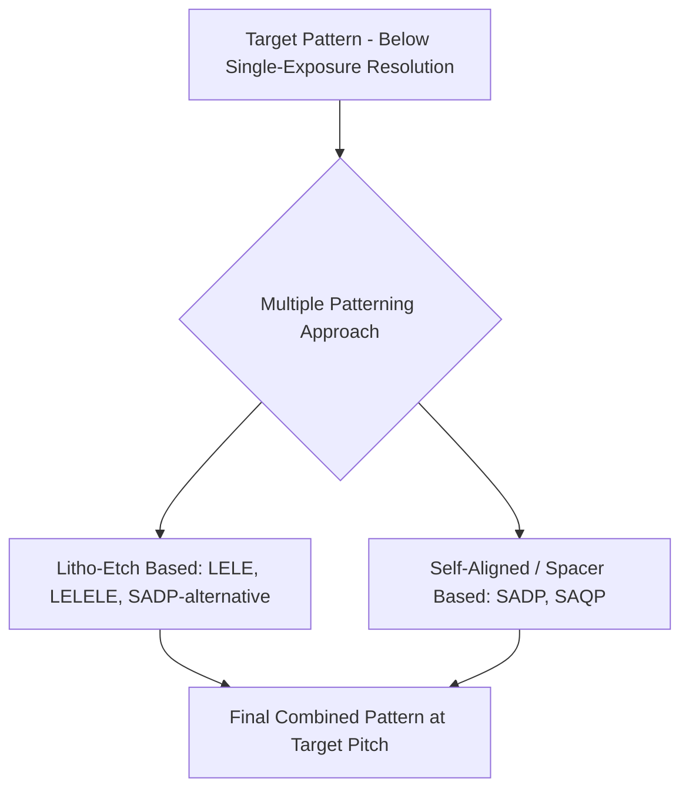
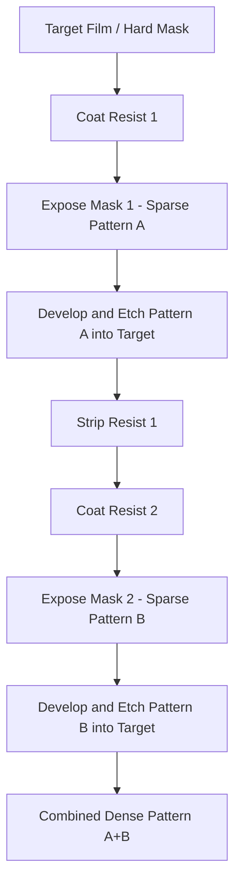
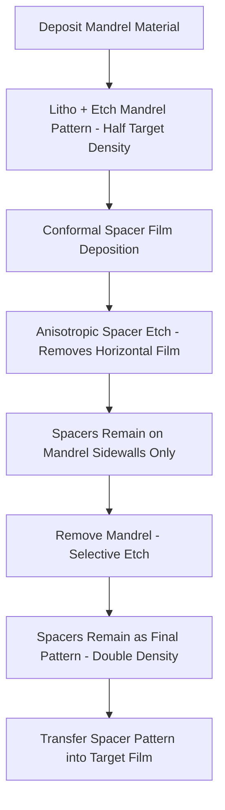
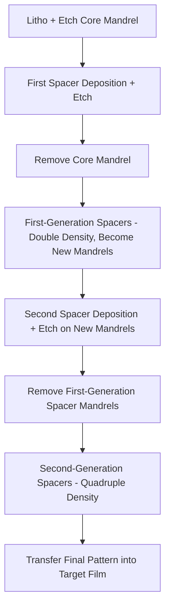

## Multi Patterning Techniques

### Overview

Multiple patterning is a family of techniques that split a single, tight-pitch target pattern across two or more separate lithography (and often etch) steps, enabling effective pattern density beyond what a single exposure of a given lithography system can resolve. These techniques were developed and widely deployed primarily to extend 193 nm immersion (193i) lithography's usable resolution range as device pitches scaled below what single-exposure Rayleigh-limited imaging could achieve, and remain relevant even in the EUV era for the very tightest pitches or where EUV capacity/cost considerations favor a multi-patterning approach with a less expensive exposure tool.

### Motivation: The Single-Exposure Resolution Wall

Single-exposure resolution is bounded by the Rayleigh relationship:

$$R = k_1 \frac{\lambda}{NA}$$

As target half-pitches scaled below what a given $(\lambda, NA)$ combination could resolve at a manufacturable $k_1$ (practically bounded around $k_1 \approx 0.25$–0.28 for production processes), two paths existed: reduce $\lambda$ (motivating EUV development) or split the pattern across multiple lower-density exposures, each individually resolvable, that combine to form the final tight-pitch pattern. Multiple patterning pursues the second path.

### Litho-Etch-Litho-Etch (LELE)

**Process flow**

- The target dense pattern is decomposed at the design stage into two separate, less-dense mask layers (color decomposition), each individually resolvable by the lithography system.
- The first mask is exposed and developed; that pattern is etched into the underlying hard mask or target film.
- Resist is stripped, a second resist layer is coated, and the second mask (containing the interleaved/complementary features) is exposed, developed, and etched into the same target film.
- The two etched patterns combine to form the final, tighter-pitch composite pattern.

**Design decomposition (coloring)**

- The design pattern is split ("colored") into two masks such that features on the same mask maintain a minimum resolvable spacing, while features that would otherwise be too close together on a single mask are assigned to different masks.
- This decomposition is a graph-coloring-like problem: features are nodes, proximity conflicts are edges, and the goal is a valid two-coloring; patterns that cannot be validly two-colored (odd cycles in the conflict graph) require design rule restrictions or additional mask splits (e.g., LELELE, triple patterning) to resolve.

**Overlay sensitivity**

- Because the two component patterns are formed by two independent lithography exposures, any overlay error between mask 1 and mask 2 directly translates into **pitch-walking**: alternating line-to-line spacing in the final composite pattern rather than uniform pitch, since the interleaved features from each mask are individually well-registered but only relative to each mask's own exposure, not to each other beyond the achievable overlay accuracy.
- [Inference] This overlay-driven pitch-walking sensitivity is one of the primary practical limitations of LELE-type approaches and a central motivation for the self-aligned spacer-based techniques described below, since those techniques replace overlay-dependent pitch splitting with deposition-thickness-dependent pitch splitting.

### Self-Aligned Double Patterning (SADP)

SADP avoids the overlay dependency of LELE by defining the final pitch split through a deposited film thickness rather than a second lithography exposure, using a spacer (sidewall) deposition and etch process.

**Process steps**

- **Mandrel formation**: a sacrificial material is patterned via conventional single-exposure lithography and etch, at a pitch that is a comfortable multiple (typically double) of the final target pitch — i.e., the mandrel pattern itself is well within single-exposure resolution capability.
- **Conformal spacer deposition**: a thin film (commonly a material with strong etch selectivity relative to both the mandrel and the underlying target film, such as an oxide or nitride) is deposited conformally over the mandrel pattern, coating both the top and sidewalls of each mandrel line uniformly.
- **Anisotropic spacer etch**: a directional (anisotropic) etch removes the spacer film from horizontal surfaces (top of mandrels and field regions) while leaving the spacer material on the vertical mandrel sidewalls intact, since anisotropic etch removes material primarily in the vertical direction.
- **Mandrel removal**: the original mandrel material is selectively etched away (using a chemistry that attacks the mandrel but not the spacer), leaving only the sidewall spacers standing — now at double the line density of the original mandrel pattern, with pitch determined by the mandrel pitch and spacing determined by the deposited spacer thickness.
- **Pattern transfer**: the spacer pattern (now the final mask) is used to etch the target film below.

**Pitch determination**

- The final line pitch equals half the mandrel pitch, and critically, the spacing between adjacent final lines is set by the **deposited spacer film thickness**, a parameter controlled via deposition process time/rate rather than lithography overlay.

$$P_{final} = \frac{P_{mandrel}}{2}$$

- [Inference] Because deposition thickness can generally be controlled with tighter uniformity and repeatability than lithography-to-lithography overlay at very tight pitches, SADP's spacer-based pitch definition is widely regarded as fundamentally more robust against pitch-walking than LELE's overlay-dependent approach, which is the primary reason SADP became the dominant multiple-patterning technique for the tightest logic and memory pitches during the peak 193i multi-patterning era.

**Line/space asymmetry consideration**

- Since SADP inherently produces lines from spacer material, and the final target lines are formed either from the spacers directly or from the gaps between them (mandrel and spacer removed, leaving the etched trench pattern), the design must account for which of these two resulting line sets corresponds to actual circuit features versus which is discarded, with implications for cut-mask design (see below).

### Self-Aligned Quadruple Patterning (SAQP)

SAQP extends the SADP concept by performing the mandrel-spacer-transfer sequence twice in series, achieving a further pitch-halving (quartering relative to the original lithographically defined pattern).

$$P_{final} = \frac{P_{original\ litho}}{4}$$

- [Inference] SAQP compounds SADP's process complexity (twice as many deposition, etch, and mandrel-removal steps) and correspondingly the cumulative CD and profile control challenge across all these steps, since any variation introduced during the first spacer generation propagates and can be amplified through the second spacer formation, generally making SAQP's overall process control window materially tighter than a single SADP sequence.

### Cut Masks

Both SADP/SAQP and, to a lesser extent, LELE-type flows typically produce continuous, unbroken lines running across the full pattern area, since the mandrel/spacer or two-color decomposition process is inherently line-and-space oriented rather than aware of where individual circuit features should actually terminate.

- A separate **cut mask** (or "block mask") lithography and etch step is used to selectively remove (cut) segments of these continuous lines at the locations where the actual circuit design requires a line to end, rather than continue.
- Cut mask lithography operates at a much looser pitch/CD requirement than the base pattern itself (since it only needs to resolve individual cut locations, not a dense repeating pattern), and can therefore often use a lower-cost, single-exposure lithography step even when the base pattern itself required multi-patterning.
- [Inference] Cut mask overlay to the underlying spacer/line pattern is nonetheless a meaningful contributor to the overall pattern's electrical yield, since a mispositioned cut can leave an unwanted line stub (potential short) or over-cut into an adjacent required line (potential open).

### Design Rule and EDA Implications

- **Restricted design rules**: multiple patterning, particularly SADP/SAQP, strongly favors highly regular, unidirectional line-and-space layouts (gridded design) over the more free-form Manhattan geometries permissible with single-exposure lithography, since the spacer-based pitch-splitting mechanism is fundamentally a line-doubling operation.
- **Decomposition/coloring verification**: EDA tools must verify that a given design layer can be validly decomposed into the required number of mask colors (for LELE-type flows) or is compatible with the mandrel/cut-mask structure (for SADP/SAQP flows) as part of design rule checking, since not all arbitrary layouts are automatically compatible with a chosen multi-patterning scheme.
- [Inference] This designer-side constraint (regular gridded layouts, restricted routing directions per layer) represents a significant, if less visible, cost of multiple patterning beyond the direct fab process cost, since it can reduce layout density efficiency or routing flexibility compared to a hypothetical unconstrained single-exposure design.

### Cost and Cycle Time Considerations

- Every additional litho-etch (LELE) or deposition-etch (SADP/SAQP) sequence adds mask cost, tool time, and cycle time to the overall process flow for that layer, compared to a hypothetical single-exposure alternative.
- [Inference] This added cost and cycle time is the central economic tradeoff multiple patterning presents relative to EUV single-exposure: multiple patterning uses comparatively lower capital-cost 193i tools but at higher per-layer process step count and cycle time, whereas EUV uses much higher capital-cost tools but can often pattern the same critical layer in a single exposure, and the layer-by-layer choice between these approaches in modern process flows is generally driven by this cost/cycle-time/capacity balance rather than by resolution capability alone, since EUV multi-patterning is also used in some cases for the very tightest pitches beyond even High-NA single-exposure capability.

### LELE vs. SADP/SAQP: Comparative Summary

| Parameter | LELE | SADP/SAQP |
| --- | --- | --- |
| Pitch-splitting mechanism | Two independent lithography exposures | Deposited film thickness (spacer) |
| Primary error source for pitch uniformity | Litho-to-litho overlay | Deposition thickness uniformity |
| Design flexibility | Relatively higher (two-color decomposition) | Lower (favors regular gridded lines) |
| Additional structure required | Two full litho+etch sequences | Mandrel, spacer, cut mask |
| Typical density multiplication | 2x (or more with LELELE) | 2x (SADP), 4x (SAQP) |

### Related Topics

- Overlay and alignment control (pitch-walking mechanisms)
- Immersion lithography and its role as the primary multiple-patterning workhorse
- EUV lithography as a multiple-patterning alternative
- Restricted design rules and gridded layout methodologies
- Etch selectivity and anisotropic etch fundamentals
- High-NA EUV as an emerging single-exposure alternative to multiple patterning