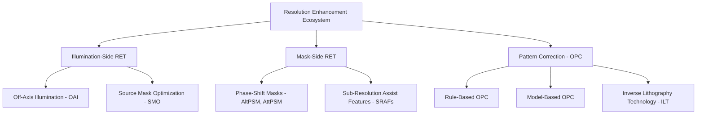
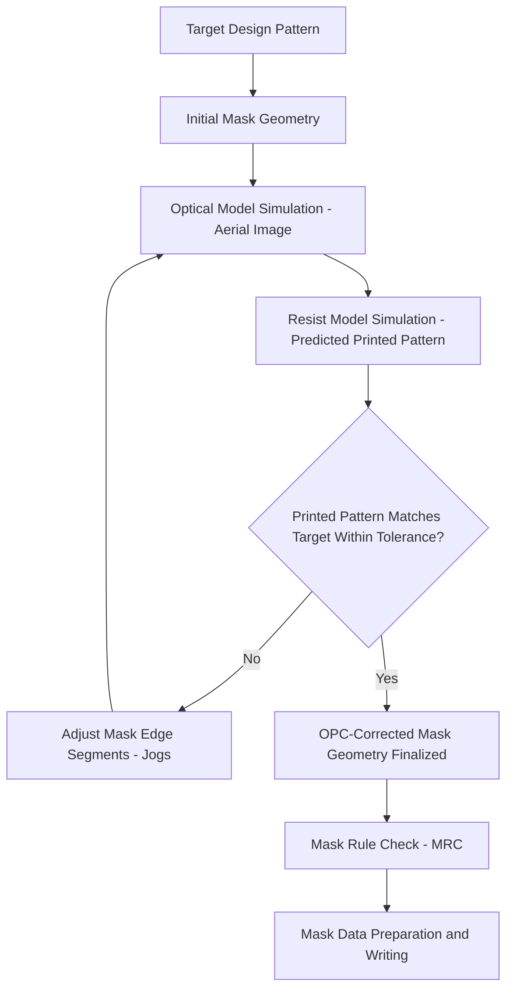

## Resolution Enhancement and Optical Proximity Correction

### Overview

Resolution enhancement techniques (RET) and optical proximity correction (OPC) are the computational and mask-design methods used to push imaging performance beyond what an unmodified mask exposed under standard illumination would achieve, and to compensate for the systematic pattern distortion that occurs when feature sizes approach or fall below the exposure wavelength. Together, these techniques are what allow production lithography to reliably print features at pitches well below the classical, unmodified diffraction-limited resolution of the optical system, and they are applied in some combination on virtually every critical layer at advanced nodes.

### The Underlying Problem: Sub-Wavelength Imaging Distortion

When feature dimensions on the mask approach or fall below the exposure wavelength, diffraction effects cause the aerial image (the actual light intensity pattern formed at the wafer plane) to deviate systematically from a simple, scaled-down copy of the mask geometry.

Characteristic distortions include:

- **Line-end shortening**: line ends print shorter than drawn, since diffraction at a line terminus spreads light outward in two dimensions rather than confining it to the line width, reducing effective exposure dose right at the tip.
- **Corner rounding**: sharp rectangular corners in the drawn mask pattern print as rounded corners at the wafer, since high-spatial-frequency corner information is preferentially attenuated by the optical system's limited frequency response.
- **Pitch-dependent CD variation**: identical drawn linewidths print at different actual critical dimensions depending on the spacing/pitch of neighboring features, because diffraction from nearby features constructively or destructively interferes with the feature of interest, an effect commonly termed the "iso-dense bias" between isolated and densely packed lines.

[Inference] These effects are not manufacturing defects in the conventional sense but predictable, physics-based consequences of imaging below the classical resolution limit, which is precisely why they can be systematically corrected for computationally rather than merely tolerated as process variation.

### Resolution Enhancement Techniques (RET): Overview

RET refers to the broader category of methods that modify the illumination, mask, or imaging conditions to improve the fundamental contrast and process window of the optical system, as distinct from OPC, which corrects the mask pattern itself to compensate for known distortion. In practice these categories are used together and are co-designed against one another.

### Off-Axis Illumination (OAI)

- Illuminating the mask at oblique (non-normal) angles, rather than straight-on (on-axis), changes the diffraction orders captured by the projection lens for a given pitch and orientation, and can be tuned to maximize image contrast for the specific critical pitches present in a given layer's design.
- Common illumination source shapes include **annular** (ring-shaped), **dipole** (two opposing poles, favoring one line orientation), and **quadrupole** (four poles, favoring two orthogonal orientations) configurations, each suited to different dominant pattern geometries.
- [Inference] Because a given illumination shape improves contrast for some pitches/orientations while potentially degrading it for others, OAI source shape selection is generally treated as a layer-specific optimization rather than a universal setting, and is typically co-optimized with the mask design for that specific layer's critical features.

### Phase-Shift Masks (PSM)

Phase-shift masking modifies the mask itself to exploit destructive interference for sharper image contrast, rather than relying solely on amplitude (light/dark) contrast.

- **Alternating PSM (AltPSM)**: etches the mask substrate to a controlled depth in alternating clear apertures, introducing a 180° phase shift between light passing through adjacent openings; destructive interference at the shared boundary sharpens the resulting intensity edge substantially more than a simple binary (amplitude-only) mask can achieve. AltPSM offers the strongest resolution enhancement of the PSM variants but introduces phase-conflict design challenges (regions where a valid two-phase assignment cannot be made without additional trim masks) and is comparatively complex to fabricate.
- **Attenuated PSM (AttPSM)**: replaces the opaque chrome absorber with a partially transmissive material (commonly molybdenum silicide-based, transmitting roughly 6% of incident light) that also imparts a 180° phase shift relative to the fully transmissive regions. The resulting destructive interference at feature edges sharpens contrast without AltPSM's phase-conflict routing complexity, making AttPSM the more widely used PSM variant in production mask flows.

### Sub-Resolution Assist Features (SRAFs / Scattering Bars)

- Additional, non-printing features are added to the mask near isolated lines, sized and spaced below the resolution threshold of the imaging system so that they do not themselves print at the wafer, but their presence modifies the local diffraction environment to more closely resemble that of a densely packed pattern.
- This addresses the iso-dense bias directly: since isolated features and densely packed features of nominally identical drawn width otherwise print at different actual CDs due to differing neighbor-diffraction contributions, SRAFs bring the isolated feature's effective printing behavior closer to that of the dense features, improving CD uniformity and process window consistency across the full range of pitches present in a design.
- **SRAF placement and sizing** is itself a nontrivial design step (rule-based lookup tables or model-based simulation, as with OPC below) since incorrectly sized or placed assist features risk crossing the printing threshold and inadvertently appearing as unwanted printed defects.

### Optical Proximity Correction (OPC)

OPC modifies the drawn mask geometry itself (edge positions, corner treatments) so that the resulting printed wafer pattern matches the originally intended design, compensating for the systematic distortions described above.

**Rule-based OPC**

- Applies pre-computed correction offsets based on a lookup table indexed by local geometric context: line width, spacing to nearest neighbor, corner type, and similar parameters.
- [Inference] Rule-based OPC is comparatively fast to apply computationally but scales poorly in accuracy as pattern complexity and the density of distinct geometric contexts increase, since a finite rule table cannot capture every possible local pattern configuration with equal fidelity, which has driven the industry-wide shift toward model-based OPC for critical layers.

**Model-based OPC (MB-OPC)**

- Uses a calibrated optical model (representing the actual imaging system's illumination, NA, and aberration characteristics) together with a resist model (representing exposure and development response) to simulate the predicted printed image for a given mask geometry.
- The mask edges are then iteratively adjusted ("jogged" — broken into small segments that can each be independently displaced) until the simulated printed pattern matches the target design pattern within a specified CD tolerance at all evaluation points across the design.

- Calibration of the optical and resist models against actual measured wafer data (typically from a dedicated test structure exposure and CD-SEM/scatterometry measurement campaign) is a prerequisite for accurate MB-OPC, since simulation accuracy is only as good as the underlying model's fidelity to the real imaging and resist system it represents.
- [Inference] Because MB-OPC simulation must be performed across every edge segment of an entire chip design, often iteratively, it is highly computationally intensive, and OPC run time and compute infrastructure (large server farms) represent a significant, if often underappreciated, component of overall mask data preparation cost and cycle time, particularly for the largest, most complex designs.

### Inverse Lithography Technology (ILT)

- Rather than starting from the drawn design geometry and applying incremental edge corrections (the OPC approach), ILT poses mask design as a formal inverse optimization problem: given the desired wafer pattern, directly solve for the mask geometry that best reproduces it through the known optical system.
- This approach often yields highly non-rectilinear, curvilinear mask shapes that would not be intuitively drawn by a human designer or produced by rule-based correction, since the optimization is free to explore the full space of geometries rather than perturbing a rectilinear starting point.
- ILT-derived curvilinear masks generally require mask writers capable of efficiently exposing curved/free-form geometry (multi-beam mask writers, which expose via pixelated dose maps rather than discrete geometric shots) to be practical for production, since variable-shaped-beam writers become comparatively inefficient when fracturing highly curvilinear shapes into the writer's native rectangular/trapezoidal shot primitives.
- [Inference] ILT adoption has grown in step with the availability and cost-effectiveness of multi-beam mask writing capacity, since the technique's benefits are most fully realized when the resulting curvilinear masks can actually be written efficiently and inspected reliably in production.

### Source Mask Optimization (SMO)

- SMO co-optimizes the illumination source shape (see off-axis illumination above) and the mask pattern simultaneously as a joint optimization problem, rather than treating source shape selection and mask correction as sequential, independent steps.
- [Inference] Because the achievable process window for a given target pattern depends jointly on both the illumination condition and the mask geometry, and neither alone can be optimized to its full potential independent of the other, SMO generally yields a larger usable process window than optimizing source and mask separately in sequence, which is why SMO has become standard practice for the most critical, process-window-constrained layers at advanced nodes.

### Verification: OPC and Mask Rule Check

- After OPC/ILT correction, the resulting mask geometry must pass **mask rule check (MRC)**, verifying that all corrected features (including the fine edge jogs and assist features introduced by the correction process) satisfy the mask-making process's own minimum feature size, spacing, and other manufacturability constraints.
- **Lithography-friendly design verification / OPC verification**: simulation-based checks (sometimes at full-chip scale) confirm that the OPC-corrected mask, when simulated through the actual optical and resist process models, produces a printed pattern within CD and edge-placement tolerance across the full range of process conditions the layer is expected to encounter (dose and focus variation, commonly assessed via a process window analysis).

### Process Window and the Role of RET/OPC Together

- The combined effect of RET (illumination and mask-side enhancements) and OPC (pattern correction) is generally assessed via the **process window**: the range of exposure dose and focus values over which a given feature prints within acceptable CD tolerance.
- [Inference] A layer with a comprehensively optimized RET/OPC solution (appropriate illumination shape, PSM type, SRAF placement, and model-based or ILT-derived mask correction) will generally exhibit a substantially larger usable process window than the same target pattern printed with an uncorrected binary mask under simple on-axis illumination, and this expanded process window is often the difference between a layer being manufacturable at a given pitch at all versus requiring an alternative approach (multiple patterning or a shorter-wavelength exposure tool).

### Related Topics

- Mask and reticle design (physical construction, PSM fabrication)
- Rayleigh resolution and depth-of-focus equations
- Multi-patterning techniques as a complementary resolution-extension approach
- High-NA EUV computational lithography requirements
- Mask data preparation and multi-beam mask writing
- Process window analysis and dose/focus exposure matrices