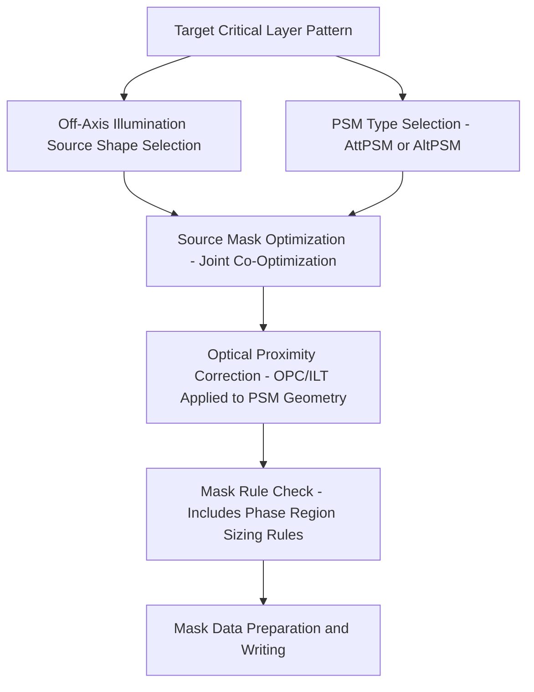

## Phase Shift Masks

### Overview

Phase-shift masks (PSM) are a mask-side resolution enhancement technique that improves imaging contrast by manipulating the phase of light passing through the mask, rather than relying solely on the binary amplitude (opaque/transparent) contrast used in conventional chrome-on-glass masks. By introducing a controlled phase difference — typically 180° — between light transmitted through adjacent regions of the mask, PSM exploits destructive interference at feature boundaries to sharpen the resulting aerial image edge, improving both resolution and depth of focus relative to an equivalent binary intensity mask (BIM) at the same wavelength and numerical aperture.

### Principle: Interference-Based Contrast Enhancement

In a conventional binary mask, the transition from an opaque region to a clear region produces a light intensity profile at the wafer that is inherently blurred by diffraction; even with an ideal step in mask transmittance, diffraction spreads the edge over a finite distance at the image plane, and this blur worsens as feature pitch approaches the resolution limit of the optical system.

Phase-shift masking addresses this by exploiting the wave nature of light directly:

- Light transmitted through two adjacent apertures with a 180° relative phase difference will destructively interfere in the region between them at the image plane, driving the intensity to near zero at that boundary even where a binary mask's diffraction-blurred intensity profile would remain significantly above zero.
- This sharper transition from bright to dark translates into a steeper image log-slope (a common metric of edge contrast) at the resist plane, which directly improves the resist's ability to resolve the edge location precisely and improves the process's tolerance to dose and focus variation (a larger usable process window).

The electric field amplitude transmitted through a phase-shifted region can be represented as having a transmittance with a negative sign relative to an unshifted region of equal magnitude:

$$E_{shifted} = -|E_{unshifted}|$$

so that the resulting intensity at the boundary, which depends on the coherent sum of the overlapping diffracted fields, passes through a null rather than the partial overlap that would occur if both regions had identical (unshifted) phase.

### Alternating Phase-Shift Mask (AltPSM / Levenson-Type)

**Construction**

- The mask substrate (fused silica/quartz) itself is selectively etched to a precise depth in alternating clear apertures, such that light passing through an etched aperture travels a different physical path length through the quartz than light passing through an adjacent unetched aperture of the same nominal design width.
- The etch depth is calculated so that the resulting optical path length difference corresponds to exactly a 180° phase shift at the exposure wavelength:

$$\Delta d = \frac{\lambda}{2(n-1)}$$

where $\Delta d$ is the required etch depth, $\lambda$ is the exposure wavelength, and $n$ is the refractive index of the quartz substrate at that wavelength.

**Strengths and limitations**

- AltPSM provides the strongest resolution and depth-of-focus improvement among PSM variants, since the phase-shifted apertures are themselves fully transmissive (not partially attenuated), maximizing the achievable contrast enhancement from the destructive-interference mechanism.
- **Phase conflicts**: because a valid AltPSM layout requires that every clear aperture be assigned a phase (0° or 180°) such that no two apertures of the same phase are close enough to interfere constructively in an unwanted way, and no two adjacent apertures needed to interact via destructive interference share the same phase, this constitutes a graph-coloring-like assignment problem. Some layouts contain conflict cycles that cannot be validly two-colored, requiring either design modification or the introduction of an additional **trim mask** exposure to resolve regions where a single mask cannot satisfy the phase assignment.
- [Inference] This phase-conflict resolution complexity, combined with the specialized substrate-etching fabrication process required (as opposed to simply patterning an absorber film), makes AltPSM mask design and manufacturing meaningfully more complex and costly than binary or attenuated PSM alternatives, which is the primary reason AltPSM has seen comparatively limited production adoption relative to attenuated PSM despite its stronger theoretical imaging benefit.

### Attenuated Phase-Shift Mask (AttPSM / EAPSM)

**Construction**

- Rather than etching the substrate, AttPSM replaces the conventional fully opaque chrome absorber with a partially transmissive absorber material — most commonly a molybdenum silicide (MoSi)-based compound — engineered to simultaneously transmit a small fraction of incident light (commonly around 6%, though other transmittance percentages are used depending on the specific application) and impose a 180° phase shift on that transmitted light relative to the fully open (clear) regions of the mask.
- Because the absorber material itself carries both the attenuation and phase-shift function in a single film, AttPSM masks are fabricated using a process much closer to conventional binary mask fabrication (deposit and pattern a single absorber film) than AltPSM's substrate-etching approach, without the phase-conflict layout constraints that AltPSM's fully-transmissive dual-phase scheme requires.

**Imaging behavior**

- The small amount of light leaking through the nominally "dark" (absorber-covered) regions, phase-shifted 180° relative to the clear-region light, destructively interferes with the diffracted light at the edge of clear features, sharpening the edge contrast in a manner analogous to AltPSM but with a smaller magnitude of enhancement, since the interfering field from the attenuated region is much weaker (a few percent transmittance) than the full-strength interfering field present in AltPSM's fully-transmissive alternating apertures.
- [Inference] Because AttPSM's contrast enhancement is more modest than AltPSM's but its fabrication complexity and phase-conflict-free design are much closer to conventional binary masks, AttPSM represents a favorable complexity-to-benefit tradeoff that has made it the dominant PSM type used in production lithography across a wide range of critical layers.

### Comparative Summary: BIM vs. AttPSM vs. AltPSM

| Parameter | Binary Intensity Mask (BIM) | Attenuated PSM (AttPSM) | Alternating PSM (AltPSM) |
| --- | --- | --- | --- |
| "Dark" region transmittance | ~0% (opaque chrome) | ~6% (partially transmissive absorber) | 0% (opaque, between phase-shifted clear apertures) |
| Phase shift mechanism | None | Absorber material composition | Substrate etch depth |
| Contrast enhancement magnitude | None (baseline) | Moderate | Strongest |
| Fabrication complexity | Lowest | Moderate (single specialized absorber film) | Highest (substrate etch, phase conflict resolution) |
| Phase-conflict design constraint | Not applicable | Not applicable | Present; may require trim mask |
| Typical production usage | Non-critical layers | Widely used for critical layers | Selectively used for most demanding features |

### Design Integration with Other RET

PSM is applied in conjunction with, not as a substitute for, other resolution enhancement techniques:

- **Optical proximity correction (OPC)**: PSM mask edges are themselves subject to the same sub-wavelength distortion effects (line-end shortening, corner rounding, pitch-dependent bias) as binary masks, and require OPC correction calibrated against the specific PSM type's optical behavior, since the presence of a phase-shifted or attenuated region changes the local diffraction environment relative to a binary aperture of the same drawn dimension.
- **Off-axis illumination and source-mask optimization**: PSM's contrast benefit is influenced by the illumination condition used, and for the most demanding layers, source and PSM mask geometry are co-optimized jointly (source mask optimization, SMO) rather than each being independently optimized against a fixed choice of the other.

### Mask Rule Check Considerations Specific to PSM

- **Minimum phase-shifter region size**: both AltPSM etch regions and AttPSM absorber-transmittance regions must satisfy minimum size and spacing rules specific to the mask fabrication process, distinct from and generally more restrictive than the equivalent rules for a binary chrome region, since achieving the precise etch depth (AltPSM) or absorber thickness/composition uniformity (AttPSM) within a very small feature is more challenging than for larger features.
- **Etch depth uniformity (AltPSM)**: since the phase-shift magnitude depends directly on etch depth per $\Delta d = \lambda / [2(n-1)]$, non-uniform etch depth across the mask directly translates into phase error, which degrades the destructive-interference contrast benefit; etch depth uniformity is therefore a tightly controlled mask fabrication parameter for AltPSM.
- **Transmittance and phase uniformity (AttPSM)**: similarly, the specific transmittance percentage and phase angle of the AttPSM absorber film must be held within tight tolerance across the mask and across manufacturing lots, since deviation from the target 180° phase or target transmittance percentage reduces the achieved contrast enhancement relative to what the OPC and illumination co-design assumed.

### Practical Example: Phase-Shift Contrast Illustration

Consider two adjacent clear apertures separated by a narrow opaque or attenuated region, at a pitch challenging enough that a binary mask would produce significant residual intensity in the nominally dark region between them due to diffraction blur.

- With a **binary mask**, the dark region's intensity, while reduced relative to the bright apertures, remains a non-trivial fraction of peak intensity due to diffraction, degrading the image contrast ratio and, consequently, the resist's ability to reliably resolve the boundary across normal dose and focus variation.
- With an **AltPSM** design, assigning 180° relative phase to the two apertures causes the diffracted fields from each aperture to destructively interfere in the shared dark region, driving the intensity there close to zero even at pitches where the equivalent binary mask would show substantial blur — directly widening the usable process window (the joint dose-focus range over which the feature prints within CD tolerance) for that specific pitch.

[Inference] This kind of contrast improvement is typically most impactful for the tightest, most process-window-constrained pitches on a given layer, which is why PSM (particularly AltPSM, given its cost) has historically been applied selectively to the most critical features of a design rather than uniformly across an entire layer, with less critical, more relaxed-pitch features often left as binary or AttPSM geometry.

### Related Topics

- Mask and reticle design (substrate, absorber, and pellicle fundamentals)
- Resolution enhancement and optical proximity correction
- Off-axis illumination and source mask optimization
- Rayleigh resolution and process window (dose-focus) analysis
- Mask rule check (MRC) and mask data preparation flow
- EUV reticle design as a distinct reflective-mask paradigm