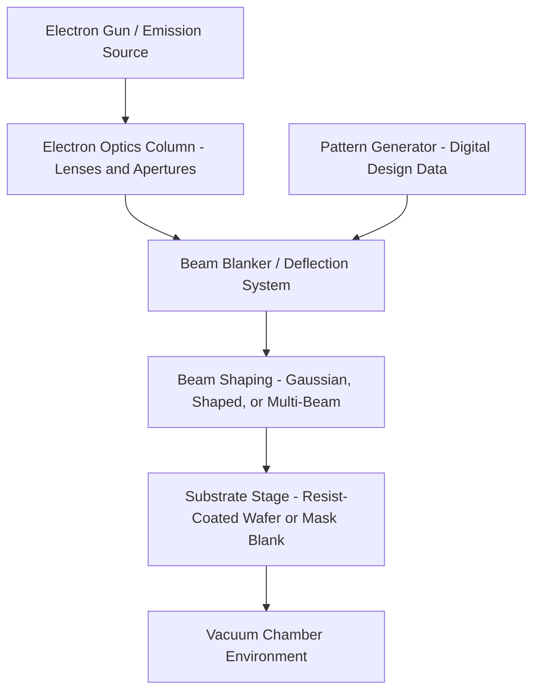
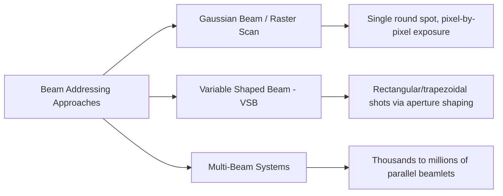

## Electron Beam and Maskless Lithography

### Overview

Electron beam (e-beam) lithography uses a focused beam of electrons, rather than photons, to directly expose a resist-coated substrate, achieving resolution far beyond what optical (photon-based) lithography can reach at any practical wavelength, since electron de Broglie wavelengths at typical acceleration voltages are orders of magnitude shorter than even EUV's 13.5 nm. **Maskless lithography** refers to the broader class of techniques — of which e-beam direct write is the most mature and widely used example — that pattern a substrate directly from digital design data without requiring a physical mask or reticle at all. In semiconductor manufacturing, e-beam lithography occupies two largely distinct roles: as the mask/reticle-writing tool that produces the photomasks used by all optical lithography (covered separately under mask and reticle design), and as a direct-write patterning technology in its own right for research, prototyping, and specialized low-volume production applications.

### Physical Basis: Electron Wavelength and Resolution

The de Broglie wavelength of an electron accelerated through a potential difference $V$ is given by:

$$\lambda = \frac{h}{\sqrt{2m_e eV}}$$

where $h$ is Planck's constant, $m_e$ is electron mass, $e$ is elementary charge, and $V$ is the accelerating voltage. At typical e-beam lithography voltages (tens to over 100 kV), the resulting electron wavelength is on the order of picometers — vastly shorter than any optical exposure wavelength — meaning that diffraction-limited resolution, per an electron-optics analog of the Rayleigh criterion, is not the practical resolution limit for e-beam systems. Instead, resolution is governed primarily by beam spot size, electron scattering effects in the resist and substrate, and resist chemistry, rather than by diffraction.

### System Architecture

**Electron source**

- Thermionic or field-emission electron guns generate the electron beam; field-emission sources generally provide higher brightness and smaller achievable spot sizes, favoring higher-resolution applications, at typically greater cost and system complexity than thermionic sources.

**Electron optics**

- A series of electromagnetic lenses focuses and shapes the electron beam analogously to how glass lenses focus light in optical systems, though electron lenses use magnetic or electrostatic fields rather than refractive optical elements.
- The entire beam path operates in vacuum, since electrons would scatter unacceptably through any appreciable path length of air or other gas at atmospheric pressure.

**Beam addressing modes**

- **Gaussian beam (raster/vector scan)**: a single, round-focused electron spot is scanned pixel-by-pixel or vector-by-vector across the pattern area, exposing one small spot at a time. This offers high resolution but comparatively low throughput, since the total exposure time scales with the total pattern area divided by the single beam's write rate.
- **Variable shaped beam (VSB)**: the beam is passed through a sequence of shaping apertures to form a rectangular or trapezoidal cross-section matched to a fractured pattern primitive, exposing an entire shaped region in a single shot rather than point-by-point, substantially improving throughput relative to Gaussian beam systems for patterns composed of larger primitive shapes. VSB is the dominant approach used in traditional mask-writing e-beam tools.
- **Multi-beam systems**: an array of thousands to millions of individually blanked (switchable) electron beamlets exposes the pattern in parallel via a pixelated dose map, rather than through discrete geometric shots; write time becomes largely independent of pattern geometric complexity, since every beamlet addresses its assigned pixels regardless of how intricate or curvilinear the underlying design shapes are. This architecture is a key enabler for writing highly complex, curvilinear masks (e.g., those produced by inverse lithography technology) without the shot-count explosion that VSB systems would otherwise incur.

### Direct-Write E-Beam Lithography

In direct-write mode, the e-beam system patterns the resist-coated wafer itself, with no intervening mask or reticle — the digital design data drives the beam directly.

**Process flow**

- Digital design data (typically GDSII/OASIS, following the same fracturing and formatting considerations described for mask data preparation) is converted into a beam exposure sequence.
- Resist (an e-beam-sensitive polymer, distinct from but conceptually analogous to optical photoresist) is spin-coated onto the substrate.
- The e-beam system exposes the pattern by locally modifying the resist's solubility (via chain scission for positive-tone resists, or cross-linking for negative-tone resists) through direct electron-resist interaction, rather than through photochemical absorption.
- Development, using an appropriate solvent, removes either the exposed or unexposed regions depending on resist tone, identically in principle to the develop step in optical lithography.

**Throughput limitation**

- Because direct-write e-beam patterns serially (even multi-beam systems, while far more parallel than single-beam Gaussian or VSB tools, remain fundamentally slower per unit area than a single flood optical exposure of an entire field), e-beam direct write throughput is dramatically lower than optical projection lithography for high-volume manufacturing purposes.
- [Inference] This throughput gap is the central reason e-beam direct write has not displaced optical lithography for high-volume production despite its superior intrinsic resolution, and is instead used where its resolution advantage outweighs its throughput disadvantage: mask/reticle writing (where only one mask, not millions of wafers, needs to be written), low-volume or prototype device fabrication, and specialized research applications.

### Electron Scattering Effects

**Forward scattering**

- As electrons penetrate the resist layer, small-angle scattering causes the effective beam spot to broaden somewhat with depth, contributing a resolution-limiting blur distinct from the beam's initial focused spot size.

**Backscattering and the proximity effect**

- Electrons that penetrate through the resist into the underlying substrate can scatter back up into the resist at significant lateral distances from the original beam position (potentially micrometers, depending on accelerating voltage and substrate material), depositing additional, unwanted exposure dose in regions near — but not at — the intended exposure location.
- This **proximity effect** causes densely patterned regions to receive more effective exposure dose than isolated features exposed with nominally identical primary beam dose, since densely packed features contribute more mutual backscattered dose to their neighbors than isolated features do.
- **Proximity effect correction (PEC)**: analogous in spirit to optical OPC, PEC computationally adjusts the dose (rather than the geometry, as in optical OPC) delivered to each region of the pattern to compensate for the position-dependent backscatter contribution, using either rule-based dose tables or, more precisely, model-based simulation of the full electron scattering distribution (often approximated via a double-Gaussian point-spread function representing the combined forward-scattering and backscattering contributions).

$$f(r) = \frac{1}{\pi(1+\eta)} \left[ \frac{1}{\alpha^2} e^{-r^2/\alpha^2} + \frac{\eta}{\beta^2} e^{-r^2/\beta^2} \right]$$

where $f(r)$ is the deposited energy density as a function of radial distance $r$ from the beam impact point, $\alpha$ characterizes the forward-scattering spread, $\beta$ characterizes the backscattering spread, and $\eta$ is the backscattering coefficient (ratio of backscattered to forward-scattered energy contribution). [Inference] The specific values of $\alpha$, $\beta$, and $\eta$ are strongly dependent on accelerating voltage, resist thickness, and substrate composition, so accurate PEC in practice generally requires empirical calibration of this point-spread function for the specific process stack being patterned, rather than relying on generic literature values.

### Multi-Beam Mask Writing Architecture

Beyond direct-write applications, multi-beam e-beam systems have become significant specifically as **mask writers**, addressing the shot-count explosion that increasingly complex OPC-corrected and curvilinear (ILT-derived) mask geometries impose on conventional VSB writers.

- A multi-beam mask writer typically employs an aperture array illuminated by a broad electron beam, with each individual aperture's corresponding beamlet independently switchable (blanked or unblanked) at high speed, and the pattern exposed as a dense grid of programmable pixel doses rather than as a sequence of discrete geometric shots.
- [Inference] Because write time in this architecture depends on the number of pixels and blanking cycles rather than the number of discrete geometric shapes in the design, multi-beam writers are particularly well suited to the increasingly complex, curvilinear mask geometries produced by inverse lithography technology and dense sub-resolution assist feature placement, where a VSB writer's shot count — and therefore write time — would scale unfavorably with geometric complexity.

### Maskless Lithography: Broader Context

While e-beam direct write is the most mature and widely deployed maskless technique, "maskless lithography" as a category also encompasses other approaches that share the core characteristic of patterning directly from digital data without a physical mask intermediary:

- **Maskless optical projection lithography**: uses a digital micromirror device (DMD) or similar spatial light modulator to dynamically form the pattern in an optical beam path (conceptually similar to a digital projector), exposing photoresist without a fixed physical mask; primarily used for lower-resolution applications such as redistribution layers in advanced packaging, or for rapid prototyping where mask cost and turnaround time outweigh resolution requirements.
- **Focused ion beam (FIB) lithography**: uses a focused beam of ions (commonly gallium) rather than electrons, offering direct milling/patterning capability distinct from resist-based exposure, primarily used for mask repair, failure analysis, and highly specialized prototyping rather than mainstream direct-write patterning.
- [Inference] Across all maskless approaches, the shared fundamental tradeoff remains throughput versus resolution/flexibility relative to mask-based optical projection lithography, since eliminating the mask removes both its cost and turnaround-time burden but also removes the inherent parallelism of a single flood exposure illuminating an entire field simultaneously.

### E-Beam/Maskless vs. Mask-Based Optical Lithography: Comparative Summary

| Parameter | Mask-Based Optical (DUV/EUV) | E-Beam Direct Write |
| --- | --- | --- |
| Pattern source | Physical mask/reticle | Direct digital data, no mask |
| Resolution-limiting mechanism | Diffraction (wavelength/NA) | Beam spot size, scattering, resist |
| Throughput (wafers/hour) | High (parallel field exposure) | Low (serial or limited-parallel writing) |
| Mask/reticle cost and turnaround | Significant (especially EUV) | None (no mask required) |
| Primary production role | High-volume manufacturing | Mask writing, prototyping, R&D, low-volume production |
| Correction methodology | Optical proximity correction (OPC) | Proximity effect correction (PEC) |

### Related Topics

- Mask data preparation and mask writer technology (VSB and multi-beam)
- Inverse lithography technology and curvilinear mask design
- Resist chemistry: chain scission and cross-linking mechanisms
- Advanced packaging redistribution layer patterning
- Focused ion beam mask repair techniques
- Throughput and cost modeling for lithography technology selection