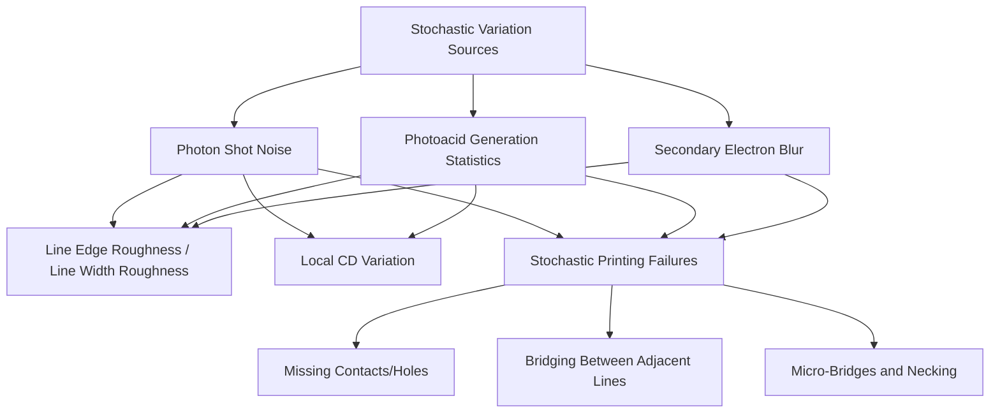
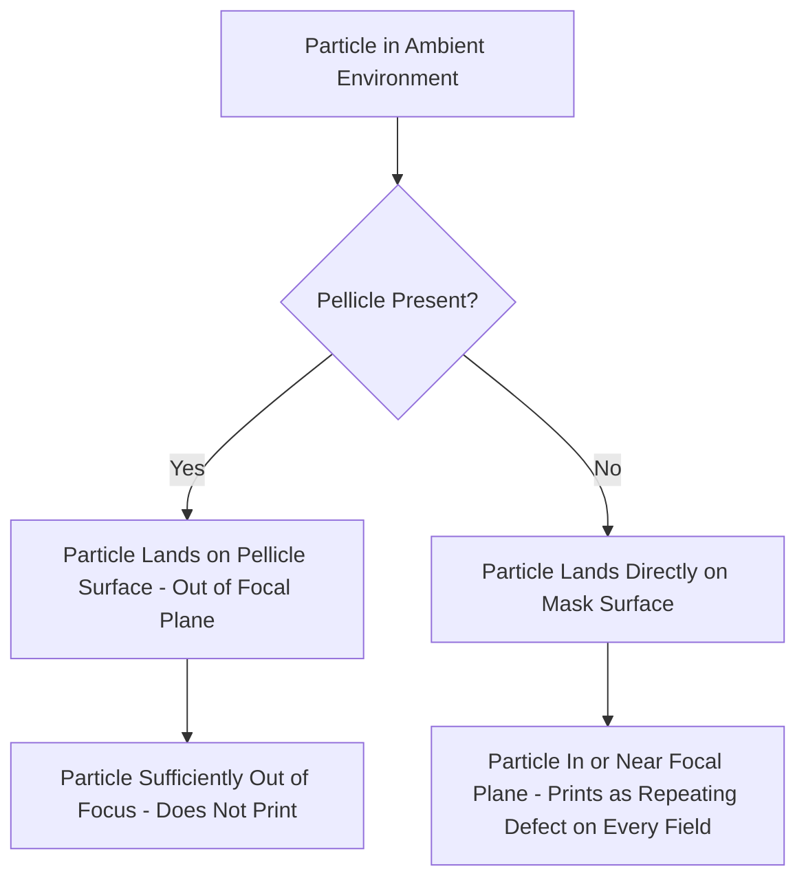

## Stochastic Defects and Pellicle Technology

### Overview

Stochastic defects are printing failures that arise from the fundamentally probabilistic (random, statistical) nature of light-matter and electron-matter interactions at the nanoscale, rather than from deterministic optical or process errors like defocus or dose miscalibration. As feature sizes have shrunk and, in the case of EUV, the number of photons available per exposed feature has correspondingly dropped, stochastic effects have grown from a secondary yield consideration into a first-order resolution-limiting factor. Pellicle technology — the thin protective membrane suspended above a mask or reticle — addresses a related but distinct concern: preventing particle contamination from reaching the mask's patterned surface, and has itself become a major engineering challenge specifically in the EUV context.

### The Physical Origin of Stochastic Defects

**Photon shot noise**

- Exposure dose is fundamentally quantized: a nominally uniform intensity actually corresponds to a Poisson-distributed number of photons absorbed per unit area, with statistical fluctuation inherent to any finite photon count.
- The relative magnitude of this fluctuation, characterized by Poisson statistics, scales as:

$$\frac{\sigma_N}{N} = \frac{1}{\sqrt{N}}$$

where $N$ is the mean number of photons absorbed in a given small area of interest, and $\sigma_N$ is the standard deviation of that count. As $N$ decreases, the relative fluctuation increases, meaning smaller features (which by definition receive fewer total absorbed photons for a given dose) experience proportionally larger dose fluctuation.

- **EUV-specific severity**: because each EUV photon (13.5 nm wavelength) carries substantially higher energy (~92 eV) than a 193 nm DUV photon (~6.4 eV), a given deposited dose (energy per unit area) corresponds to a much smaller absorbed photon count at EUV than at DUV for the same dose value, directly amplifying the relative shot-noise contribution at EUV relative to longer-wavelength lithography.

**Photoacid generation statistics (chemically amplified resists)**

- In chemically amplified resists, each absorbed photon has some probability of generating a photoacid molecule via the photoacid generator (PAG); this generation event is itself probabilistic, compounding the underlying photon shot noise with an additional layer of chemical-reaction-probability variation.
- The photoacid then diffuses during post-exposure bake and catalyzes a deprotection reaction; both the initial acid generation positions and subsequent diffusion paths are stochastic processes, introducing additional randomness beyond the photon absorption statistics alone.

**Secondary electron effects (EUV-specific)**

- EUV photon absorption generates energetic photoelectrons, which in turn generate cascades of lower-energy secondary electrons that travel some random distance before depositing their energy and driving the resist's chemical response.
- This secondary electron blur, itself a statistically variable process (not a fixed, deterministic blur radius), is estimated to contribute on the order of a few nanometers of effective image blur, and represents a resolution-limiting mechanism distinct from purely optical or photon-statistical effects.

### Manifestations of Stochastic Failure

**Line edge roughness (LER) and line width roughness (LWR)**

- Statistical variation in the position of a resist feature's edge along its length (LER) or in the resulting linewidth measured at different points along a line (LWR), driven by the combined statistical variation sources above.
- [Inference] LWR has become a first-order concern at advanced nodes because, as target CD shrinks, a roughly fixed absolute roughness magnitude represents a proportionally larger fraction of the linewidth itself, directly consuming CD control budget that must otherwise be shared with overlay, dose, and other systematic error sources.

**Local CD variation and stochastic printing failures**

- Beyond edge roughness on otherwise-present features, sufficiently severe stochastic variation can cause outright printing failures at specific, randomly distributed locations: a contact or via hole that fails to open completely (missing contact), or adjacent lines that unexpectedly bridge together due to insufficient local dose reaching the intended gap.
- [Inference] These failure modes are fundamentally different in character from classical process-window-limited defects, since they occur probabilistically even within an otherwise well-centered dose-focus process window; a given feature might print correctly the vast majority of the time yet still fail at some small but non-zero rate purely due to statistical variation, meaning that classical process-window characterization (bounding dose and focus ranges for acceptable printing) does not fully capture stochastic risk on its own.

### Characterizing and Modeling Stochastic Behavior

- **Stochastic defect rate measurement**: because failures occur at low probability per feature but a chip contains an enormous number of instances of any given critical feature, characterizing stochastic risk requires exposing and inspecting a very large number of feature instances (often at the scale of hundreds of millions to billions of features) to obtain statistically meaningful failure-rate estimates at the low probabilities relevant to acceptable chip yield.
- **Failure rate targets**: [Inference] because a modern chip may contain many billions of instances of a given critical feature, even an individually small per-feature stochastic failure probability can translate into an unacceptable number of total chip-level failures, meaning that stochastic defect rate targets for production processes are generally specified at extremely low per-feature probabilities, well beyond what could be verified through the kind of exposure-and-inspection sample sizes practical in early process development, necessitating extrapolation from measurable, higher-probability regimes.
- **Resist and dose contribution**: increasing exposure dose generally reduces relative photon shot noise (since $N$, the absorbed photon count, increases), improving stochastic performance, but at the cost of reduced exposure tool throughput (since higher dose requires longer exposure time per field for a given source power) — this dose/throughput/stochastic-defect tradeoff is a central economic and process consideration specifically in EUV lithography.

### Mitigation Strategies for Stochastic Defects

- **Higher-sensitivity resist chemistry**: resists engineered to generate a stronger chemical response per absorbed photon (higher effective quantum yield) can achieve comparable printing performance at lower dose, though this must be balanced against resolution and LWR tradeoffs, since higher sensitivity chemically amplified resist mechanisms can sometimes trade sensitivity against acid diffusion length and resulting blur.
- **Metal-oxide and inorganic resist platforms**: [Inference] resist chemistries based on metal-oxide or other inorganic absorbing species have been explored specifically to improve photon absorption efficiency and reduce the chemical-amplification-related statistical variation relative to conventional organic chemically amplified resists, though the specific tradeoffs and adoption status of any given commercial platform should be verified against current literature given the pace of resist development in this area.
- **Computational lithography co-design**: source mask optimization (SMO) and inverse lithography technology (ILT), while primarily developed to address deterministic diffraction-based distortion, are increasingly also evaluated for their effect on stochastic printing margin, since the local aerial image slope and contrast at a given feature (which SMO/ILT directly optimize) also influences that feature's sensitivity to a given magnitude of dose/photon-count fluctuation.
- **Higher-NA optics**: [Inference] while High-NA EUV improves classical optical resolution, its interaction with stochastic defects is more nuanced, since finer target features generally correspond to fewer absorbed photons for a given dose, meaning the resolution benefit of higher NA does not automatically translate into proportionally improved stochastic performance and may in some cases worsen it absent compensating dose or resist sensitivity improvements.

### Pellicle Technology: Purpose and Function

A pellicle is a thin, optically transparent (or, for EUV, sufficiently transmissive) membrane mounted on a frame held several millimeters above the mask or reticle's patterned surface.

**Core principle**

- Because the pellicle is positioned a defined standoff distance away from the mask's patterned (focal) plane, a particle landing on the pellicle surface is sufficiently out of focus at the wafer image plane that it does not print, whereas the same particle landing directly on the mask surface would be in (or very near) the focal plane and would print as a defect on every single field exposed with that mask — a repeating defect, since the same mask exposes every die on every wafer processed with it.
- This makes pellicle protection disproportionately high-leverage for yield relative to particle control measures addressing random, single-instance wafer-level particle defects, since a single unprotected mask-surface particle can compromise an entire lot or campaign of wafers rather than a single die.

### DUV/193i Pellicle Materials

- Conventional DUV pellicles use thin polymer membranes (historically nitrocellulose-based, with fluoropolymer materials also used, particularly for improved compatibility with 193 nm exposure and immersion-related considerations) that offer high optical transmission at DUV wavelengths while providing adequate mechanical durability and particle-blocking function.
- [Inference] DUV pellicle technology is comparatively mature relative to EUV pellicles, since transmissive polymer materials with acceptable transmission, durability, and optical uniformity at DUV wavelengths have been commercially available and refined over a much longer production history.

### The EUV Pellicle Challenge

EUV pellicles present a substantially more difficult engineering problem than their DUV counterparts, for reasons rooted directly in the physics of 13.5 nm light interacting with matter.

**Fundamental difficulty**

- Virtually all materials absorb strongly at 13.5 nm (the same physical reality that necessitates reflective rather than transmissive optics and reticles throughout the rest of the EUV system), meaning any pellicle membrane placed in the beam path inherently reduces the usable EUV power reaching the wafer, directly working against the light-budget constraints that already challenge EUV source power and stochastic defect performance.
- This creates a direct engineering tension: a thicker or more robust pellicle membrane offers better mechanical durability and particle-blocking performance but at the cost of lower EUV transmission, while a thinner membrane improves transmission but at increased risk of mechanical failure (rupture) under the thermal and mechanical loads imposed by high-power EUV exposure.

**Materials approaches**

- Thin polysilicon-based membranes and carbon-nanotube (CNT)-based membranes have been developed specifically to address this tension, aiming for sufficiently high transmission (commonly cited targets in the range of roughly 85 to 90 percent or higher) while maintaining adequate mechanical integrity and thermal stability to survive sustained exposure to increasingly high-power EUV sources (necessary to address the dose/throughput/stochastic-defect tradeoffs discussed above).
- [Inference] As EUV source power has increased over successive tool generations (partly to address stochastic defect and throughput pressures), pellicle thermal management has become an increasingly significant constraint in its own right, since a membrane that survives adequately at one source power level may face accelerated degradation or failure risk at a higher power level, making pellicle development an ongoing, moving target tied to source power roadmap progress rather than a one-time solved problem.
- [Unverified] The specific commercial adoption status, supplier landscape, and exact power-survival thresholds for current-generation EUV pellicles continue to evolve rapidly and should be checked against the most recent industry disclosures for any time-sensitive assessment.

**Adoption tradeoffs**

- [Inference] Because an EUV pellicle imposes both a transmission loss (requiring either higher source power or longer exposure time to compensate, both with cost or throughput implications) and a residual risk of membrane failure during high-power operation, pellicle adoption decisions in EUV production have generally involved a deliberate risk/cost tradeoff between the yield protection a pellicle offers against mask-surface particle defects and the throughput/power cost the pellicle itself imposes, rather than being a straightforward, uniformly adopted default as pellicles are in mature DUV production.

### Interaction Between Stochastics and Pellicle-Related Defectivity

- [Inference] Stochastic defects and pellicle-related particle defects are mechanistically distinct (statistical photon/chemical variation versus physical particle contamination) but interact at the system level: both consume a shared "defect budget" for a given layer's acceptable overall defect density, meaning that aggressive measures to reduce one category (e.g., higher dose to reduce stochastic failures) can free up margin that makes accepting a certain residual pellicle-related risk more tolerable, or vice versa, making defect budget allocation across these distinct mechanisms a genuine systems-engineering tradeoff rather than two entirely independent problems.

### Related Topics

- Extreme ultraviolet lithography fundamentals (source power, resist stochastics)
- High numerical aperture EUV systems and resolution-stochastics interaction
- Mask and reticle design (pellicle mounting, mask defect inspection and repair)
- Chemically amplified resist chemistry and photoacid generation
- Resist processing steps and defects (line edge roughness, particle-induced defects)
- EUV source power scaling and collector mirror lifetime