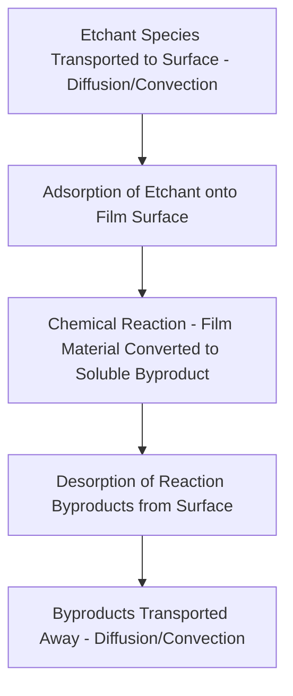

## Wet Chemical Etching

### Overview

Wet chemical etching removes material from a wafer surface through direct immersion in, or exposure to, a liquid chemical solution that reacts with and dissolves the target film. It is one of the oldest pattern-transfer and material-removal techniques in semiconductor processing, historically preceding plasma-based dry etching, and remains widely used today for applications where its characteristic isotropic removal profile, high selectivity, and comparatively low capital cost are advantageous, even though it has been largely displaced by dry (plasma) etching for critical, high-resolution pattern transfer at advanced nodes.

### Fundamental Mechanism

Wet etching proceeds through a sequence of mass-transport and chemical-reaction steps at the liquid-solid interface:

- **Mass transport to the surface**: fresh etchant must reach the film surface via diffusion through a boundary layer of relatively stagnant fluid adjacent to the wafer, and/or bulk convective flow (agitation, spraying) that reduces this boundary layer thickness.
- **Surface reaction**: the etchant chemically reacts with the film material, converting it into a soluble reaction product (and often releasing gas or other byproducts depending on the specific chemistry).
- **Byproduct removal**: reaction products must be transported away from the surface to sustain continued etching, since local accumulation of byproduct can slow or locally block further reaction (a diffusion-limited or reaction-limited regime distinction that affects etch uniformity, discussed further below).

Whether a given wet etch process is **reaction-rate-limited** or **mass-transport-limited** has direct practical consequences: reaction-rate-limited etches (where the chemical reaction itself, rather than species transport, is the slow step) tend to show strong temperature dependence (following Arrhenius-type kinetics) and are generally less sensitive to agitation, whereas mass-transport-limited etches are strongly affected by agitation and flow conditions but comparatively less temperature-sensitive.

$$k = A e^{-E_a/RT}$$

where $k$ is the reaction rate constant, $A$ is a pre-exponential factor, $E_a$ is the activation energy of the etching reaction, $R$ is the gas constant, and $T$ is absolute temperature. [Inference] For a reaction-rate-limited wet etch process, this Arrhenius dependence means that bath temperature control is typically one of the most sensitive and tightly specified parameters for achieving repeatable etch rate across production lots.

### Isotropic Etch Profile

The defining characteristic of most wet chemical etch processes is **isotropy**: the etchant attacks the exposed film at approximately equal rates in all directions, since the chemical reaction mechanism generally has no inherent directional preference.

<svg xmlns="http://www.w3.org/2000/svg" viewBox="0 0 500 260" font-family="sans-serif">
<text x="250" y="20" text-anchor="middle" font-size="14" font-weight="bold">Isotropic Wet Etch Undercut Profile (svg_diagram)</text>
<rect x="50" y="60" width="400" height="20" fill="#999" />
<text x="255" y="55" text-anchor="middle" font-size="11">Mask Layer</text>
<rect x="150" y="80" width="200" height="15" fill="#999" />
<path d="M 150 95 Q 130 95 125 115 L 125 160 Q 130 180 150 180 L 350 180 Q 370 180 375 160 L 375 115 Q 370 95 350 95 Z" fill="#cfd8dc" stroke="#333" stroke-width="1.5" />
<rect x="50" y="180" width="400" height="40" fill="#78909c" />
<text x="250" y="240" text-anchor="middle" font-size="11">Substrate</text>
<line x1="150" y1="95" x2="125" y2="115" stroke="#c0392b" stroke-width="1.5" stroke-dasharray="3,2" />
<text x="90" y="108" font-size="10" fill="#c0392b">Undercut</text>
<line x1="350" y1="95" x2="375" y2="115" stroke="#c0392b" stroke-width="1.5" stroke-dasharray="3,2" />
</svg>

- Because the etchant removes material equally in the lateral and vertical directions beneath the mask edge, wet etching produces significant **undercut**: the etched feature extends laterally beneath the mask opening, so the final etched feature is wider (or, for a trench, the sidewall recedes further) than the mask opening itself.
- **Undercut-to-depth relationship**: for a purely isotropic etch, the lateral undercut distance approximately equals the vertical etch depth, since the etch rate is the same in all directions:

$$\text{Undercut} \approx \text{Etch Depth}$$

- [Inference] This roughly 1:1 undercut-to-depth relationship is the central reason wet etching is generally unsuitable for transferring fine-pitch, high-aspect-ratio patterns at advanced nodes, since the resulting loss of critical dimension control (and the fact that CD loss scales directly with the film thickness being etched) becomes proportionally more severe as target feature sizes shrink relative to typical film thicknesses.

### Common Wet Etch Chemistries

**Silicon dioxide etching (buffered oxide etch, BOE / HF-based)**

- Hydrofluoric acid (HF), often buffered with ammonium fluoride (forming buffered oxide etch, BOE, to stabilize etch rate and reduce photoresist attack relative to unbuffered HF) is the standard wet etchant for silicon dioxide.
- Reaction (simplified): silicon dioxide reacts with HF to form soluble fluorosilicic species and water, following a net reaction commonly written as:

$$SiO_2 + 6HF \rightarrow H_2SiF_6 + 2H_2O$$

- [Inference] BOE's comparatively gentle, well-controlled etch rate and high selectivity to silicon and photoresist make it widely used for tasks like native oxide removal prior to subsequent processing steps, contact/via cleanup, and other applications where isotropic profile and CD loss are less critical than process simplicity and selectivity.

**Silicon etching**

- Various wet chemistries etch silicon depending on desired selectivity and profile, including isotropic mixtures such as HNA (hydrofluoric acid, nitric acid, and acetic acid), where nitric acid oxidizes the silicon surface and hydrofluoric acid dissolves the resulting oxide, with acetic acid serving as a diluent/moderator.
- **Anisotropic wet etching of crystalline silicon**: certain alkaline etchants (such as potassium hydroxide, KOH, or tetramethylammonium hydroxide, TMAH) exhibit strongly crystal-orientation-dependent etch rates in single-crystal silicon, etching the (100) crystal plane much faster than the (111) plane. This produces characteristic sloped sidewalls following the (111) plane angle (approximately 54.7° relative to the (100) surface) rather than the rounded, purely isotropic profile typical of most wet chemistries, making these specific alkaline etches a notable exception to the general isotropic-profile characterization of wet etching, and a technique specifically leveraged in MEMS and certain specialized structure fabrication.

**Metal etching**

- Wet etchants for common metal films include phosphoric-acetic-nitric (PAN) acid mixtures for aluminum, and various acid-based chemistries for other metals; metal wet etch selectivity to underlying dielectric and adjacent materials is a key formulation consideration.

**Selective wet etches for advanced structure formation**

- [Inference] Certain wet chemistries are specifically valued for their very high selectivity between closely related materials (for example, selectively removing one crystalline semiconductor alloy composition relative to another, or removing a sacrificial layer selectively relative to a structural layer), a property that has made wet etching relevant even in some advanced-node contexts specifically for selective removal steps (such as certain sacrificial layer release steps in 3D device architectures) where the etch's isotropic nature and high selectivity are actually advantageous rather than limiting, despite wet etching's general displacement by dry etch for critical anisotropic pattern transfer.

### Equipment and Process Configurations

**Immersion (bath) etching**

- Wafers (typically in a cassette/carrier, processed as a batch) are immersed directly in a tank of etchant solution for a controlled time, then transferred to a rinse tank.
- [Inference] Batch immersion processing offers high throughput (many wafers processed simultaneously) but generally provides less precise, individually tunable process control per wafer compared to single-wafer processing approaches, and bath chemistry depletion/aging over the course of processing many wafer batches is a practical concern requiring bath monitoring and replenishment or replacement schedules.

**Spray etching**

- Etchant is sprayed onto the wafer surface (often on a rotating chuck, single-wafer processing), providing fresh etchant continuously delivered to the surface and improved uniformity control relative to static immersion, since spray delivery can reduce the mass-transport-limiting boundary layer effects that static immersion baths are more prone to.

**Single-wafer spin processing**

- The wafer is held on a rotating chuck (spin chuck) while etchant is dispensed onto the center and spread outward by centrifugal force, allowing precise control of etch time, temperature, and chemical delivery on a per-wafer basis, at the cost of lower throughput relative to batch immersion processing.

### Rinse and Dry Steps

- After the etch reaction is complete, thorough rinsing (typically with deionized water) is essential to halt the etching reaction and remove residual etchant and reaction byproducts before they can cause unwanted continued etching, redeposition, or residue formation.
- **Megasonic-assisted rinsing**: acoustic energy applied during rinse can help dislodge particles and improve rinse effectiveness, particularly for high-aspect-ratio or particle-sensitive structures.
- Drying (commonly spin-drying, or in particle-sensitive applications, specialized drying techniques such as Marangoni drying or isopropyl alcohol vapor drying) must avoid introducing watermarks or particle redeposition, conceptually analogous to the watermark concerns discussed for immersion lithography, though arising in a different process context.

### Common Wet Etch Defects and Process Issues

**Non-uniform etch rate (loading effects)**

- Etch rate can vary depending on the local pattern density (a form of etch loading), since regions with more exposed film area consume etchant and generate reaction byproduct at a higher local rate, potentially depleting fresh etchant or accumulating byproduct faster than diffusion/convection can replenish/remove it in a mass-transport-limited regime — an effect broadly analogous to (though mechanistically distinct from) loading effects also seen in dry plasma etching.

**Excessive or non-uniform undercut**

- Since undercut scales with etch depth (and therefore with etch time and any overetch margin applied), variation in local etch rate directly translates into variation in undercut and therefore final CD, compounding the already substantial nominal CD loss inherent to isotropic wet etching.

**Incomplete etch / residue**

- Insufficient etch time, exhausted or contaminated etchant chemistry, or poor etchant access to recessed/high-aspect-ratio structures can leave residual unetched material, requiring either extended etch time (at the cost of further undercut in surrounding already-cleared regions) or process reformulation.

**Photoresist/mask attack**

- Some wet etch chemistries can partially attack the masking layer (photoresist or hard mask) itself, particularly at elevated temperature or extended process time, requiring selectivity to the masking material to be an explicit formulation and process-window consideration, similar in principle to selectivity requirements for dry etch processes.

**Particle contamination and bath chemistry degradation**

- Etchant baths (particularly in batch immersion configurations) accumulate dissolved reaction byproducts and can become particle sources over extended use, requiring bath lifetime management, filtration, and periodic replacement to maintain consistent, defect-free etch performance across production lots.

### Wet Etch vs. Dry (Plasma) Etch: Comparative Summary

| Parameter | Wet Chemical Etching | Dry (Plasma) Etching |
| --- | --- | --- |
| Etch profile | Generally isotropic (with specific crystallographic exceptions) | Highly anisotropic (directional) achievable |
| Undercut | Significant (approximately equals etch depth for isotropic etches) | Minimal, well-controlled sidewall profile |
| Selectivity to mask/underlying films | Often very high | Generally good but frequently lower than best wet-etch selectivity |
| Capital equipment cost | Generally lower | Generally higher (vacuum systems, plasma generation) |
| Suitability for fine-pitch pattern transfer | Poor (undercut dominates at small CD) | Standard approach for critical-dimension pattern transfer |
| Typical modern production role | Blanket film removal, cleaning, selective/sacrificial layer removal, non-critical layers | Critical-dimension anisotropic pattern transfer |

### Related Topics

- Dry (plasma) etching fundamentals and anisotropic pattern transfer
- Etch selectivity and hard mask material selection
- Resist processing steps and defects (mask/resist interaction during pattern transfer)
- MEMS fabrication and crystallographic anisotropic etching
- Cleaning and surface preparation processes
- Etch loading effects and pattern-density-dependent process variation