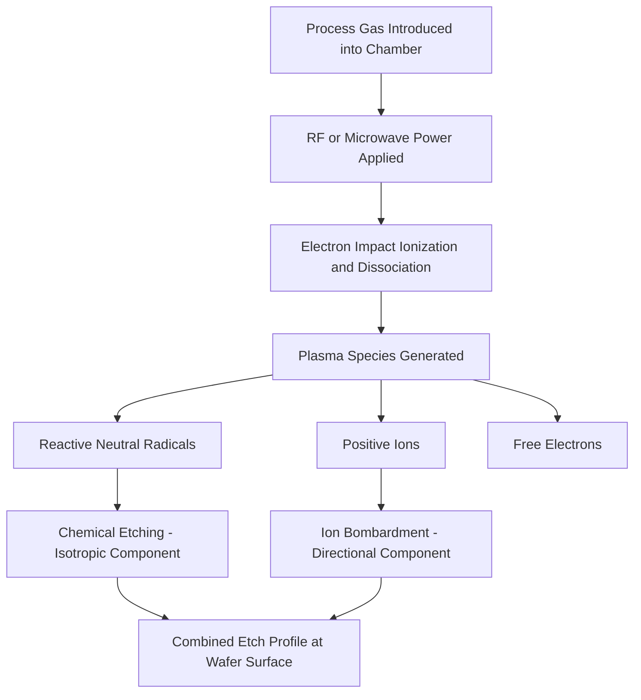
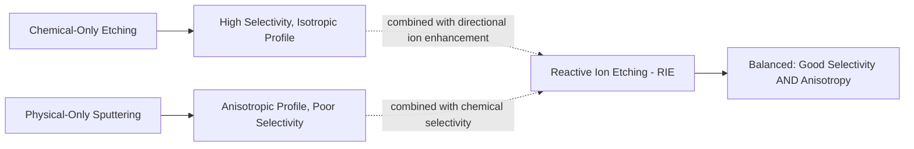
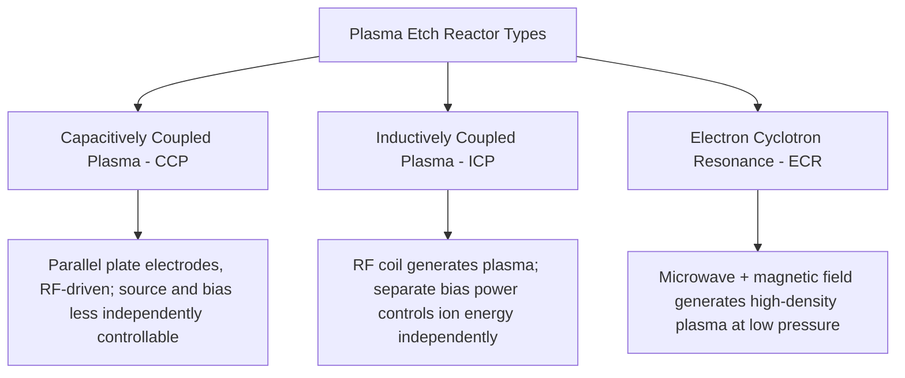

## Plasma and Dry Etching Fundamentals

### Overview

Dry etching removes material from a wafer surface using reactive species generated in a low-pressure plasma, rather than a liquid chemical bath. It is the dominant pattern-transfer technology in modern semiconductor manufacturing precisely because it can achieve highly **anisotropic** (directional) etch profiles — a capability essential for transferring fine-pitch lithographic patterns into underlying films with minimal critical-dimension loss, in sharp contrast to the largely isotropic profiles characteristic of wet chemical etching. Plasma etching combines physical (ion bombardment) and chemical (radical-driven) removal mechanisms in a single process, and the balance between these two mechanisms is the central lever engineers use to control etch profile, selectivity, and rate.

### Plasma Fundamentals

A plasma is a partially ionized gas containing a mix of neutral molecules, free radicals, positive ions, and free electrons, sustained by an externally applied electric or electromagnetic field that continuously replenishes ionization lost to recombination and surface loss.

- **Generation**: an externally applied radio-frequency (RF, typically 13.56 MHz) or, in some reactor types, microwave field accelerates free electrons present in the low-pressure gas, and electron-impact collisions with neutral gas molecules produce further ionization (generating positive ions and additional free electrons) and dissociation (breaking molecular process gases into reactive fragments, or radicals).
- **Quasi-neutrality and sheath formation**: because electrons are far lighter and more mobile than ions, they reach and are lost to chamber and wafer surfaces more readily, leaving those surfaces at a net negative potential relative to the bulk plasma; this creates a thin, ion-rich, electron-depleted **sheath** region adjacent to every surface in contact with the plasma, across which ions are accelerated toward the surface by the resulting electric field.
- **Self-bias voltage**: on an RF-driven, capacitively coupled electrode (such as the wafer chuck in many etch reactor designs), the differential mobility of electrons and ions across the RF cycle results in a net negative DC self-bias developing on that electrode, which determines the energy with which ions are accelerated across the sheath and strike the wafer surface.

### Chemical vs. Physical Etching Mechanisms

Dry etching profile and behavior emerge from the combination of two distinct removal mechanisms, and essentially all practical plasma etch processes operate somewhere along a spectrum between these two limiting cases.

**Purely chemical (radical-driven) etching**

- Reactive neutral radicals generated in the plasma diffuse to the wafer surface and react chemically with the film material, forming volatile reaction products that desorb and are pumped away — mechanistically similar in spirit to wet chemical etching's surface reaction step, but with radicals delivered from a gas-phase plasma rather than a liquid.
- Because radicals reach and react with the surface with no strong directional preference (radicals are neutral and not accelerated by the sheath field), purely chemical plasma etching tends toward an **isotropic** profile, similar to wet etching, and generally offers high etch selectivity (since the chemistry can be tuned to react much more readily with the target film than with the mask or underlying layer) but limited anisotropy.

**Purely physical (ion bombardment / sputtering)**

- Positive ions accelerated across the sheath strike the wafer surface with significant kinetic energy, physically dislodging (sputtering) surface atoms through momentum transfer, without requiring a specific chemical reaction between the ion species and the target material.
- Because ions are accelerated by the sheath field in a direction normal (perpendicular) to the wafer surface, physical sputtering is inherently **anisotropic** (highly directional), but pure sputtering generally offers poor selectivity (since momentum transfer removes essentially any material struck with sufficient energy, largely independent of chemical identity) and can also damage or redeposit sputtered material inconveniently.

**Reactive ion etching (RIE): the combined mechanism**

- Most production plasma etch processes deliberately combine both mechanisms: reactive chemical species provide the etch selectivity and reasonable etch rate, while directional ion bombardment enhances the reaction rate specifically on surfaces oriented perpendicular to the ion flux (horizontal surfaces, in typical wafer geometry) relative to surfaces parallel to the ion flux (vertical sidewalls), which receive comparatively little direct ion bombardment.
- This ion-enhanced chemical reaction mechanism is often explained via the observation that ion bombardment can damage or otherwise activate a surface (e.g., by breaking bonds or removing a passivating layer) in a way that dramatically accelerates the subsequent chemical reaction rate specifically where ions strike directly, producing much faster etching on horizontal (ion-exposed) surfaces than on vertical (largely ion-shadowed) sidewalls — the combination of chemistry (selectivity) and directional ion enhancement (anisotropy) that makes reactive ion etching (RIE) the practical workhorse mechanism underlying most production dry etch processes.

### Sidewall Passivation and Profile Control

A key technique for achieving highly anisotropic profiles, particularly for high-aspect-ratio etching, is deliberate **sidewall passivation**: certain process gas chemistries generate polymer-forming byproduct species during etching that redeposit preferentially on the sidewalls of the forming feature (since sidewalls receive far less direct ion bombardment to remove such deposits than the horizontal etch front does).

- This passivation layer protects the sidewall from further lateral chemical attack, effectively suppressing the isotropic (lateral) etch component while the ion-enhanced vertical etch component continues to proceed at the (largely passivation-free) bottom of the feature, reinforcing anisotropic profile development.
- **Bosch process (alternating etch/passivation)**: a specific and widely used technique, particularly for deep silicon etching (e.g., through-silicon vias, MEMS structures), that explicitly alternates between a chemical etch step (typically using $SF_6$ plasma, isotropic in nature) and a passivation deposition step (typically using a fluorocarbon such as $C_4F_8$, depositing a thin protective polymer film on all exposed surfaces including the bottom of the just-etched feature), with the subsequent etch step's ion bombardment preferentially removing the passivation from the horizontal bottom surface (allowing continued vertical etch there) while sidewall passivation, receiving little ion bombardment, remains largely intact.
- [Inference] This alternating cyclic approach necessarily produces a characteristic scalloped sidewall profile (visible as small periodic ripples along the sidewall, one scallop per etch/passivation cycle), a well-known signature and practical limitation of the Bosch process that must be weighed against its ability to achieve very high aspect ratios not readily achievable with continuous (non-cyclic) etch chemistry alone.

### Key Process Parameters

**Pressure**

- Lower chamber pressure generally increases the ion mean free path (average distance between collisions), producing more directional ion bombardment and improved anisotropy, but can reduce achievable etch rate due to lower overall reactive species density; higher pressure increases collision frequency (reducing ion directionality, since collisions randomize ion trajectory) but can improve etch rate and sometimes selectivity.

**RF power and bias**

- Source power (in reactors with independently controlled plasma-generation and wafer-bias power, such as inductively coupled plasma, ICP, systems) primarily controls plasma density (and therefore reactive species and ion flux), while bias power applied to the wafer chuck primarily controls ion energy (acceleration across the sheath), allowing largely independent tuning of etch rate/chemistry (via source power) and directionality/physical sputtering contribution (via bias power) — a key advantage of ICP-type reactors over simpler capacitively coupled plasma (CCP) designs where source and bias functions are less separable.

**Gas chemistry and flow**

- Etchant gas selection is tailored to the specific target film: fluorine-based chemistries (e.g., $CF_4$, $SF_6$, $C_4F_8$) are common for silicon, silicon dioxide, and silicon nitride etching, while chlorine-based chemistries (e.g., $Cl_2$, $BCl_3$) are common for etching metals such as aluminum and polysilicon, with specific gas mixtures and additive gases tuned to achieve the desired balance of etch rate, selectivity, and profile for a given film stack.

**Temperature**

- Wafer/chuck temperature affects both the chemical reaction rate at the surface and, in techniques relying on sidewall passivation, the volatility and redeposition behavior of passivation byproducts, making temperature control (often via active wafer chucking and temperature control systems) an important process parameter distinct from, but interacting with, pressure and power settings.

### Selectivity

**Selectivity** quantifies how much faster the etch process removes the intended target film relative to another material (commonly the masking layer or an underlying etch-stop film), and is defined as the ratio of etch rates:

$$S = \frac{ER_{target}}{ER_{other}}$$

- High selectivity to the masking material is essential so that the mask (photoresist or hard mask) survives long enough to protect the underlying pattern throughout the full target-film etch process, including any process margin (overetch) applied to ensure complete removal across all across-wafer and across-lot process variation.
- High selectivity to an underlying **etch-stop layer** (a film specifically chosen or engineered to etch far more slowly than the target film in the chosen chemistry) allows the etch process to naturally halt at a well-defined depth once the target film is cleared, providing a robust process endpoint largely insensitive to target film thickness variation, rather than relying purely on timed etching.
- [Inference] Because ion-bombardment-driven physical sputtering inherently has poor selectivity (removing essentially any material struck with sufficient energy), production etch processes seeking both high selectivity and high anisotropy must rely predominantly on the chemistry-driven, ion-enhanced reactive mechanism described above rather than on pure physical sputtering, reinforcing why RIE-type combined mechanisms rather than pure sputtering dominate production dry etch practice.

### Etch Profile Considerations Beyond Simple Anisotropy

**Aspect ratio dependent etching (ARDE) / RIE lag**

- Etch rate at the bottom of a feature commonly decreases as the feature's aspect ratio (depth-to-width ratio) increases, since reactive species and ions must travel further down an increasingly narrow, elongated feature to reach the etch front, and both neutral radical transport (limited by Knudsen diffusion at sufficiently high aspect ratio) and ion trajectory (some ions strike sidewalls rather than reaching the bottom) become progressively restricted.
- [Inference] This ARDE effect means that features of different widths on the same wafer, even when nominally targeting the same etch depth, can etch to different actual depths if not specifically compensated for in process design, making ARDE a significant practical process-integration concern for any layer containing a range of feature sizes.

**Microloading and macroloading**

- **Microloading**: local etch rate variation depending on the pattern density in the immediate vicinity of a feature, since densely packed features compete for a locally limited supply of reactive species, while isolated features have comparatively unrestricted access to fresh reactive species from the surrounding open area.
- **Macroloading**: etch rate variation depending on the total exposed area across an entire wafer (or across different wafers/lots with different overall pattern density), since a wafer with more total exposed target-film area consumes reactive species at a higher aggregate rate, potentially depleting the reactive species supply relative to a wafer with less total exposed area, for a given fixed gas flow and power setting.

**Notching and charging effects**

- On certain film stacks (particularly at the interface between a conductive layer being etched and an underlying insulating layer), differential charging of the developing sidewall and underlying surface by the plasma's charged species can locally deflect the ion trajectory near the bottom of the feature, producing an unwanted lateral etch (notch) at that interface — an effect requiring specific process tuning or chemistry adjustment to control, particularly relevant to certain gate and shallow trench isolation etch processes.

### Reactor Architectures

- **Capacitively coupled plasma (CCP)**: uses RF power applied across parallel-plate electrodes (often with the wafer itself forming or resting on one electrode) to generate and sustain the plasma; a comparatively simple and historically foundational architecture, though source density and wafer bias are less independently tunable than in ICP systems.
- **Inductively coupled plasma (ICP)**: an RF coil, typically external to the main chamber (often above a dielectric window), induces the plasma via a time-varying magnetic field rather than direct capacitive coupling, generally enabling higher plasma density at lower pressure, with a separate, independently controlled bias power applied to the wafer chuck to set ion energy — the independent source/bias control is a key advantage widely leveraged in modern production etch tool designs.
- **Electron cyclotron resonance (ECR)**: combines microwave power with a static magnetic field tuned so that electrons gyrate at the microwave frequency (cyclotron resonance), enabling efficient energy coupling and high plasma density at very low pressure; historically significant though less dominant in current mainstream production compared to ICP-based systems. [Inference] Specific reactor architecture prevalence varies by application and has evolved over successive technology generations, so current tool-selection practice for any specific etch application should be verified against current equipment vendor and process literature.

### Endpoint Detection

- Since etch time alone (a purely timed process) provides limited robustness against process and film-thickness variation, production etch processes commonly employ **endpoint detection** methods to identify the moment the target film has been fully cleared, most commonly via **optical emission spectroscopy (OES)**, which monitors characteristic emission wavelengths from the plasma that change in intensity as the etched film's chemical composition (and therefore the plasma's reaction byproduct chemistry) changes upon reaching an underlying, compositionally distinct film.
- [Inference] Endpoint detection is particularly valuable for etch processes into an underlying layer where an emission signal is not sharply distinct, or for high-selectivity-to-etch-stop processes where a clean chemical transition might otherwise be masked, making the specific endpoint detection strategy (and any supplementary techniques such as interferometry) an important, application-specific process integration decision.

### Related Topics

- Wet chemical etching (isotropic profile comparison and selective-etch use cases)
- Etch selectivity and hard mask material selection
- Bosch process and high-aspect-ratio silicon etching (TSV, MEMS)
- Chemical vapor deposition of etch-stop and hard mask films
- Plasma damage and its effect on device electrical characteristics
- Chamber cleaning and process chamber conditioning