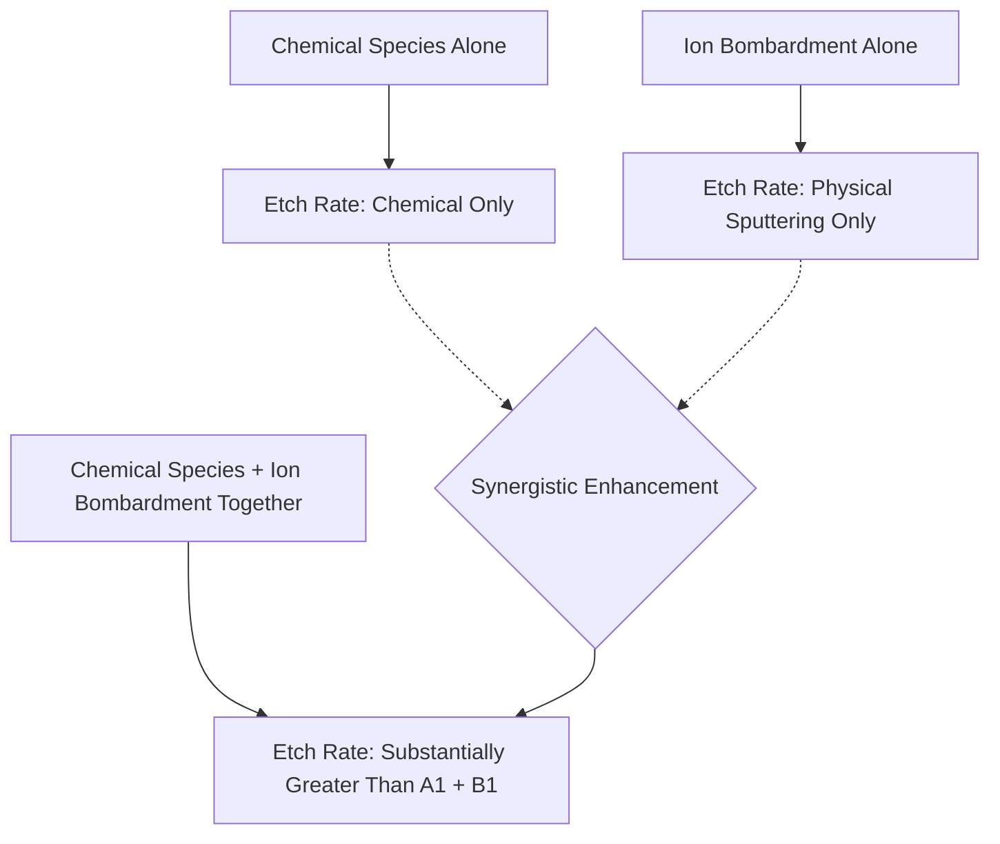

## Reactive Ion Etching

### Overview

Reactive ion etching (RIE) is the foundational plasma etch mechanism in which chemically reactive species and energetic ion bombardment act together, and specifically synergistically, at the wafer surface to achieve an etch process that is simultaneously selective (like purely chemical etching) and anisotropic (like purely physical sputtering). Rather than being a single distinct equipment category, RIE describes the dominant physical/chemical mechanism underlying the large majority of production dry etch processes, typically implemented on capacitively coupled plasma (CCP) or inductively coupled plasma (ICP) reactor platforms.

### The Synergy Mechanism

The defining and most technologically important feature of RIE is that the combined etch rate under simultaneous ion bombardment and chemical exposure substantially exceeds the simple sum of the chemical-only etch rate and the physical-sputtering-only etch rate measured separately.

This synergy is generally attributed to ion bombardment altering the surface in ways that dramatically accelerate the subsequent chemical reaction, through mechanisms that may include:

- **Surface damage/activation**: ion impact can break surface chemical bonds or displace surface atoms, creating reactive dangling bonds or otherwise activated sites that react far more readily with incoming neutral radicals than an undisturbed surface would.
- **Removal of a passivating or inhibiting surface layer**: some etch chemistries naturally form a thin, relatively inert surface layer (such as an oxide, a low-volatility reaction product, or a deliberately deposited polymer film) that would otherwise slow or halt further chemical attack; ion bombardment can preferentially clear this layer from surfaces it directly strikes, exposing fresh, reactive material underneath for continued chemical etching.
- **Enhanced desorption of reaction products**: ion impact can supply the energy needed to desorb reaction products that might otherwise remain adsorbed and block further reaction sites, sustaining a higher steady-state reaction rate on ion-bombarded surfaces.

[Inference] Because the specific dominant synergy mechanism can differ between different chemistry/material systems (surface damage versus passivation removal versus enhanced desorption), the precise physical explanation for a given RIE process's synergistic behavior is generally established through process-specific surface science studies rather than assumed to follow a single universal mechanism across all etch chemistries.

### Why the Synergy Produces Anisotropy

The practical consequence of this synergistic mechanism is a strong difference in effective etch rate between surfaces oriented perpendicular to the ion flux (horizontal surfaces, in standard wafer geometry, since the sheath field accelerates ions in a direction normal to the wafer) and surfaces oriented parallel to the ion flux (vertical sidewalls of a forming feature, which receive comparatively little direct ion bombardment due to their orientation).

<svg xmlns="http://www.w3.org/2000/svg" viewBox="0 0 520 280" font-family="sans-serif">
<text x="260" y="20" text-anchor="middle" font-size="14" font-weight="bold">RIE Anisotropic Profile via Directional Ion Flux (svg_diagram)</text>
<line x1="80" y1="45" x2="80" y2="75" stroke="#c0392b" stroke-width="2" />
<polygon points="80,75 75,65 85,65" fill="#c0392b" />
<line x1="140" y1="45" x2="140" y2="75" stroke="#c0392b" stroke-width="2" />
<polygon points="140,75 135,65 145,65" fill="#c0392b" />
<line x1="200" y1="45" x2="200" y2="75" stroke="#c0392b" stroke-width="2" />
<polygon points="200,75 195,65 205,65" fill="#c0392b" />
<line x1="320" y1="45" x2="320" y2="75" stroke="#c0392b" stroke-width="2" />
<polygon points="320,75 315,65 325,65" fill="#c0392b" />
<line x1="380" y1="45" x2="380" y2="75" stroke="#c0392b" stroke-width="2" />
<polygon points="380,75 375,65 385,65" fill="#c0392b" />
<line x1="440" y1="45" x2="440" y2="75" stroke="#c0392b" stroke-width="2" />
<polygon points="440,75 435,65 445,65" fill="#c0392b" />
<text x="260" y="40" text-anchor="middle" font-size="10" fill="#c0392b">Directional Ion Flux</text>
<rect x="60" y="75" width="120" height="15" fill="#999" />
<rect x="340" y="75" width="120" height="15" fill="#999" />
<text x="260" y="88" text-anchor="middle" font-size="10">Mask</text>
<rect x="60" y="90" width="400" height="15" fill="#78909c" />
<rect x="180" y="105" width="160" height="120" fill="#e8eaf0" stroke="#333" stroke-width="1.5" />
<line x1="182" y1="105" x2="182" y2="225" stroke="#333" stroke-width="1.5" />
<line x1="338" y1="105" x2="338" y2="225" stroke="#333" stroke-width="1.5" />
<rect x="60" y="225" width="400" height="15" fill="#78909c" />
<text x="260" y="255" text-anchor="middle" font-size="11">Substrate</text>
<text x="260" y="270" text-anchor="middle" font-size="10" fill="#2e7d32">Vertical sidewalls: minimal ion exposure, minimal lateral etch</text>
</svg>

- On horizontal surfaces directly exposed to the ion flux, the synergistic enhancement drives a high, ion-assisted chemical etch rate.
- On vertical sidewalls, which receive negligible direct ion bombardment (ions travel largely perpendicular to the wafer surface, so a vertical sidewall is nearly parallel to the ion trajectory and is struck only by a small fraction of ions, primarily those with some angular scatter), the etch rate reverts toward the much slower, purely chemical (isotropic) rate.
- The resulting large disparity between the ion-enhanced horizontal etch rate and the largely unenhanced vertical sidewall etch rate is what produces RIE's characteristic highly anisotropic, vertical-sidewall profile.

### RIE-Lag (Aspect Ratio Dependent Etching)

As a feature etches deeper and its aspect ratio (depth-to-width ratio) increases, the etch rate at the bottom of that feature commonly decreases relative to the etch rate observed for a wider, lower-aspect-ratio feature under nominally identical process conditions — an effect specifically named **RIE-lag** in reference to this mechanism.

- **Neutral transport limitation**: reactive neutral radicals must diffuse down the narrowing feature to reach the etch front; at sufficiently high aspect ratio, this transport becomes limited by Knudsen diffusion (where the mean free path becomes comparable to or larger than the feature width, so radical transport is dominated by wall collisions within the feature rather than by bulk gas-phase collisions), reducing the effective radical flux reaching the bottom.
- **Ion shadowing and trajectory effects**: while ions are highly directional, a finite angular spread in ion trajectories means that as aspect ratio increases, a progressively larger fraction of ions aimed toward the bottom of the feature instead strike the upper sidewalls, reducing the ion flux that actually reaches the etch front at the bottom of deep, narrow features.
- [Inference] Because RIE-lag causes etch rate to depend on local feature geometry (specifically aspect ratio) rather than being a fixed, geometry-independent property of the process chemistry and power settings alone, it is a significant practical process-integration concern for any layer containing a mix of feature widths that must all etch to a comparable target depth, generally requiring either process-specific compensation (dose/overetch adjustment informed by the specific aspect ratios present) or acceptance of some depth variation across differently sized features.

### Selectivity in RIE

Selectivity in RIE processes arises predominantly from the chemical component of the etch mechanism, since the reactive species can be chosen to react much more readily with the target film than with the masking material or an underlying etch-stop film, while the physical (ion sputtering) component alone would offer comparatively little chemical discrimination between different materials.

$$S = \frac{ER_{target}}{ER_{mask\ or\ stop}}$$

- **Chemistry-driven selectivity**: for example, fluorocarbon-based chemistries used for silicon dioxide etching can be tuned (via specific gas mixture and additive selection) to form a thin, protective fluorocarbon polymer layer preferentially on silicon (or photoresist) surfaces exposed during the etch, effectively passivating and slowing the etch of silicon relative to the oxide, achieving high oxide-to-silicon (or oxide-to-resist) selectivity even though both materials are subject to the same ion bombardment.
- [Inference] Because achieving both high selectivity and strong anisotropy simultaneously generally requires carefully balancing the chemical (selectivity-providing) and physical (anisotropy-providing) contributions to the overall RIE mechanism, process development for a new film stack or etch application typically involves systematic exploration of gas chemistry, pressure, and power/bias settings to locate a process window that adequately satisfies both requirements together, rather than optimizing either independently.

### Key Tunable Parameters and Their Effect on the RIE Balance

| Parameter | Effect of Increasing | Typical Tradeoff |
| --- | --- | --- |
| Bias power (ion energy) | Increases ion bombardment energy, generally increasing anisotropy and ion-enhanced etch rate | Can reduce selectivity (energetic ions increasingly capable of physically sputtering mask/stop material) and increase risk of substrate/device damage |
| Source power (plasma density, on ICP-type reactors) | Increases reactive species and ion flux, generally increasing overall etch rate | Can affect uniformity and loading behavior; higher density does not by itself improve selectivity or anisotropy |
| Chamber pressure | Increases collision frequency, reducing ion directionality (more isotropic ion angular spread) | Reduced anisotropy at higher pressure; but higher pressure can improve etch rate and sometimes chemical selectivity |
| Gas chemistry / additive ratio | Shifts balance toward more passivating (selectivity-favoring) or more purely reactive (rate-favoring) surface chemistry | Excessive passivation can reduce etch rate or cause incomplete clearing; insufficient passivation can reduce selectivity and sidewall control |

### RIE and Sidewall Passivation-Assisted Processes

While RIE's core synergy mechanism alone can produce meaningful anisotropy for many applications, the most demanding high-aspect-ratio etch requirements typically layer additional, deliberate sidewall passivation on top of the base RIE mechanism (as covered in the Bosch process context under plasma and dry etching fundamentals), since relying on the RIE synergy mechanism alone may not suppress lateral (sidewall) chemical attack sufficiently at very high aspect ratio, where even the reduced sidewall etch rate accumulates to a non-negligible undercut over a long, deep etch.

- [Inference] The choice between relying on RIE's intrinsic anisotropy alone versus adding explicit cyclic sidewall passivation (Bosch-type approaches) is generally driven by the target aspect ratio and acceptable sidewall roughness/scalloping for the specific application, with continuous (non-cyclic) RIE-only processes favored where achievable aspect ratio is modest and smooth sidewalls are prioritized, and cyclic passivation-assisted approaches favored where very high aspect ratio is the primary requirement and some sidewall scalloping is an acceptable tradeoff.

### RIE Damage Considerations

Because RIE inherently involves energetic ion bombardment of the wafer surface, it can introduce several forms of unwanted physical or electrical damage distinct from the intended etch removal itself:

- **Lattice damage**: ion impact can displace substrate lattice atoms, creating crystallographic defects near the etched surface, particularly relevant when etching directly into or very close to active device silicon.
- **Charging damage**: differential charge accumulation from the plasma's charged species (ions and electrons arriving at different rates and with different angular distributions onto various exposed conductor surfaces, particularly extended conductive lines connected to sensitive gate dielectrics) can induce damaging currents or voltage stress across thin gate oxides, a well-known reliability concern often referred to as **plasma-induced damage** or antenna-effect-related damage.
- **Ion implantation/contamination**: energetic ions can become embedded in the near-surface region of the etched material, altering its electrical or structural properties in ways that may require subsequent treatment (such as a mild anneal or a sacrificial oxide growth-and-strip cycle) to fully remediate before the affected surface is used to form active device structures.
- [Inference] Managing this damage-versus-anisotropy tradeoff (since higher ion energy generally improves anisotropy and etch rate but also increases damage risk) is a recurring theme across RIE process development, particularly for etch steps performed close to sensitive active device regions, where damage mitigation may take priority over otherwise-achievable maximum etch rate or aggressiveness.

### Related Topics

- Plasma and dry etching fundamentals (reactor architecture, endpoint detection, loading effects)
- Bosch process and high-aspect-ratio silicon etching
- Etch selectivity and hard mask/etch-stop material selection
- Plasma-induced damage and antenna effect in device fabrication
- Aspect ratio dependent etching (ARDE) and process compensation strategies
- Wet chemical etching as an isotropic-profile comparison point