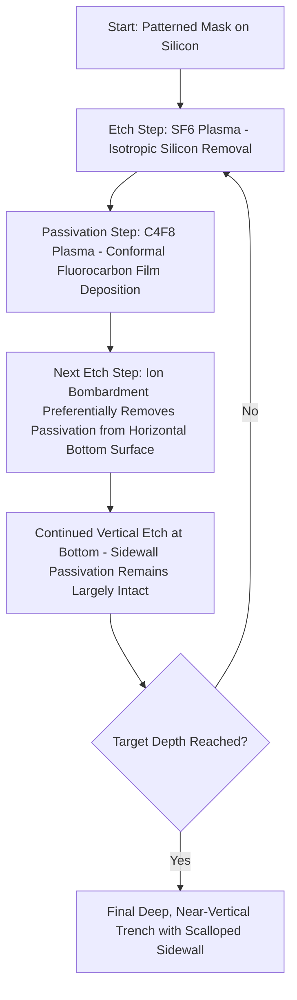

## Deep Reactive Ion Etching and the Bosch Process

### Overview

Deep reactive ion etching (DRIE) refers to specialized plasma etch techniques developed specifically to achieve very high aspect ratio (deep, narrow) features in silicon, well beyond what continuous, single-chemistry reactive ion etching can typically sustain before lateral etching, RIE-lag, or sidewall degradation limit achievable depth. The **Bosch process** is the most widely adopted DRIE technique, using a time-multiplexed, alternating sequence of isotropic chemical etch and conformal passivation deposition steps to build deep, near-vertical trenches or through-substrate features, and is foundational to applications including through-silicon vias (TSVs), MEMS device fabrication, and other structures requiring etch depths of tens to hundreds of micrometers with well-controlled sidewall verticality.

### Motivation: Limitations of Continuous RIE at High Aspect Ratio

Continuous (single-step, non-cyclic) reactive ion etching, as covered under reactive ion etching fundamentals, relies on the intrinsic synergy between directional ion bombardment and chemical reaction to suppress lateral (sidewall) etching relative to vertical etching. However, as etch depth and aspect ratio increase, several effects progressively erode this intrinsic anisotropy advantage:

- Even the comparatively low sidewall etch rate associated with reduced ion exposure on vertical surfaces accumulates to a non-negligible absolute undercut over a very deep etch, since undercut scales with total etch time.
- RIE-lag reduces the ion and neutral flux reaching the bottom of an increasingly narrow, deep feature, slowing vertical etch progress precisely as depth increases, working against the goal of achieving very high aspect ratio.
- [Inference] These compounding effects mean that continuous RIE chemistries alone generally cannot achieve the combination of very high aspect ratio (commonly needed at ratios of 20:1 or higher for demanding TSV and MEMS applications) and acceptably vertical, low-undercut sidewalls that DRIE applications require, motivating the alternating passivation-based approach the Bosch process introduces.

### The Bosch Process: Alternating Etch/Passivation Cycle

**Etch step**

- A brief exposure to a fluorine-based plasma, most commonly generated from sulfur hexafluoride ($SF_6$), etches exposed silicon isotropically (in this step considered alone, without directional preference) via reactive fluorine radicals combined with whatever directional ion bombardment is present.
- Because this step alone would produce isotropic (undercutting) removal if allowed to proceed for an extended, continuous duration, it is deliberately kept brief within each cycle, relying on the subsequent passivation step to reintroduce sidewall protection before lateral etch can accumulate significantly.

**Passivation step**

- A fluorocarbon process gas, most commonly octafluorocyclobutane ($C_4F_8$), is introduced and forms a thin, conformal, Teflon-like polymer film that deposits relatively uniformly across all exposed surfaces of the just-etched feature — sidewalls, bottom, and any exposed mask surface alike — since this deposition step, absent significant directional ion bombardment, behaves similarly to a conformal chemical vapor deposition process rather than a directional process.

**Return to etch step**

- When the plasma returns to the fluorine-based etch chemistry, the directional ion bombardment characteristic of the etch step preferentially strikes and removes the passivation film specifically from the horizontal bottom surface of the feature (since ions travel largely perpendicular to the wafer, striking the bottom directly but the vertical sidewalls only glancingly), exposing fresh silicon at the bottom for continued etching, while the passivation film on the vertical sidewalls, receiving comparatively little direct ion bombardment, remains largely intact and continues to protect those sidewalls from lateral chemical attack during this etch sub-step.

**Cycle repetition**

- This etch-passivate-etch-passivate sequence repeats, typically for many tens to hundreds of cycles depending on target depth, with each cycle incrementally advancing the etch front downward by a small amount while continuously reapplying and selectively removing sidewall protection, progressively building a deep, predominantly vertical trench.

### The Characteristic Scalloped Sidewall

A direct and essentially unavoidable consequence of the cyclic, discrete nature of the Bosch process is a characteristic **scalloped sidewall** profile: a series of small, periodic ripples or undulations along the trench sidewall, with approximately one scallop corresponding to each individual etch/passivation cycle.

<svg xmlns="http://www.w3.org/2000/svg" viewBox="0 0 460 300" font-family="sans-serif">
<text x="230" y="20" text-anchor="middle" font-size="14" font-weight="bold">Bosch Process Scalloped Sidewall Profile (svg_diagram)</text>
<rect x="60" y="40" width="120" height="15" fill="#999" />
<rect x="280" y="40" width="120" height="15" fill="#999" />
<text x="230" y="52" text-anchor="middle" font-size="10">Mask</text>
<path d="M 180 55 Q 195 65 182 78 Q 195 90 182 103 Q 195 115 182 128 Q 195 140 182 153 Q 195 165 182 178 Q 195 190 182 203 Q 195 215 182 228 L 182 240 L 278 240 L 278 228 Q 265 215 278 203 Q 265 190 278 178 Q 265 165 278 153 Q 265 140 278 128 Q 265 115 278 103 Q 265 90 278 78 Q 265 65 278 55 Z" fill="#e8eaf0" stroke="#333" stroke-width="1.5" />
<rect x="60" y="55" width="120" height="185" fill="#78909c" />
<rect x="280" y="55" width="120" height="185" fill="#78909c" />
<text x="230" y="270" text-anchor="middle" font-size="11">Silicon Substrate</text>
<text x="400" y="150" font-size="9" fill="#c0392b" text-anchor="middle">Scallops:</text>
<text x="400" y="163" font-size="9" fill="#c0392b" text-anchor="middle">one per</text>
<text x="400" y="176" font-size="9" fill="#c0392b" text-anchor="middle">etch/pass.</text>
<text x="400" y="189" font-size="9" fill="#c0392b" text-anchor="middle">cycle</text>
</svg>

- Scallop depth and periodicity (vertical pitch) are directly related to the duration and etch rate of each individual etch sub-step within the cycle: a longer etch step per cycle produces deeper, more pronounced scallops (approaching the isotropic undercut that would occur if that step ran for its full duration without intervening passivation), while shorter etch steps per cycle produce shallower, finer scallops but require more total cycles (and correspondingly more total process time and passivation gas consumption) to reach a given target depth.

$$\text{Scallop Depth} \approx f(\text{Etch Step Duration}, \text{Etch Rate})$$

- [Inference] This creates a direct process tradeoff between sidewall smoothness (favoring shorter, more numerous etch/passivation cycles) and overall process throughput (favoring longer, fewer cycles), meaning that Bosch process recipe development for a given application typically involves explicitly balancing acceptable scallop magnitude (which can affect downstream processes such as conformal film deposition into the etched feature, or optical/mechanical performance in MEMS structures) against total process time and cost.

### Process Parameter Considerations

**Cycle time and gas switching**

- Rapid, repeatable switching between etch and passivation gas chemistries (and associated plasma conditions) many times over the course of a single deep etch process places specific demands on gas delivery system response time and plasma stabilization speed, since any lag or incomplete transition between steps can degrade the intended alternating behavior and profile control.

**Passivation layer thickness and removal completeness**

- If the passivation step deposits too thick a film, the subsequent etch step's ion bombardment may not fully clear the passivation from the bottom surface within the allotted etch step duration, slowing or unevenly progressing the vertical etch; if too thin, sidewall protection during the etch step may be insufficient, allowing excess lateral etch and larger scallops or even undercut beyond the intended scallop-limited profile.

**Mask selectivity for deep etching**

- Because DRIE processes run for extended total process time (potentially many minutes to hours depending on target depth and per-cycle etch rate), the masking material (commonly a thick photoresist, oxide, or metal hard mask depending on required selectivity) must maintain sufficient thickness and integrity throughout the full multi-cycle process; DRIE mask selectivity requirements are generally considerably more demanding than for shallower, single-step RIE processes given the cumulative exposure duration involved.

**Undercut at the mask edge (initial etch lag)**

- [Inference] Some degree of lateral etch beneath the mask edge, distinct from the sidewall scalloping that develops deeper in the trench, can occur particularly during the earliest cycles before the passivation/etch balance reaches its steady-state cyclic behavior, meaning that near-mask profile control at the very top of a DRIE feature sometimes requires separate process tuning consideration from the bulk, steady-state scalloped sidewall region further down the trench.

### Applications

**Through-silicon vias (TSVs)**

- DRIE is a foundational process for creating the deep, high-aspect-ratio vertical vias that pass through a silicon substrate to enable direct vertical electrical interconnection between stacked dies in advanced 3D packaging and heterogeneous integration schemes, where via depth (spanning the substrate thickness, often on the order of tens to over a hundred micrometers) combined with a comparatively small via diameter demands the high aspect ratio capability the Bosch process provides.

**MEMS (microelectromechanical systems) fabrication**

- Many MEMS structures — accelerometers, gyroscopes, pressure sensors, and various microfluidic and micromechanical devices — require deep, well-controlled vertical silicon structures (suspended beams, deep trenches defining mechanical elements, or through-wafer features) that DRIE is specifically well suited to produce, and DRIE (often specifically Bosch-process-based tools) is considered a core, enabling process technology for the MEMS fabrication industry.

**Silicon interposers and 3D integration**

- [Inference] Beyond simple TSV formation, the broader trend toward increasingly complex 3D-integrated and chiplet-based packaging architectures has generally increased reliance on DRIE-based deep silicon structuring capability, since these architectures depend on reliable, high-aspect-ratio vertical silicon features as a core structural and electrical interconnection element.

### DRIE Variants and Alternatives

- **Cryogenic DRIE**: an alternative to the room-temperature, cyclic Bosch approach, in which the wafer is cooled to cryogenic temperatures during a continuous (non-cyclic) fluorine-based etch; at sufficiently low temperature, sidewall passivation occurs naturally via condensation and reduced volatility of certain reaction products directly on the cold sidewall, achieving anisotropic behavior without requiring the Bosch process's discrete alternating gas chemistry steps, and without the resulting scalloped sidewall profile.
- [Inference] Cryogenic DRIE can achieve smoother sidewalls than the inherently cyclic Bosch process, but requires more demanding cryogenic wafer temperature control equipment and process infrastructure, representing a tradeoff between sidewall smoothness/process simplicity (favoring cryogenic) and equipment cost/complexity (favoring room-temperature Bosch-type systems), with the specific preferred approach for a given application generally depending on the relative priority placed on these competing considerations.

### Related Topics

- Reactive ion etching (RIE synergy mechanism and RIE-lag)
- Plasma and dry etching fundamentals (reactor architecture, endpoint detection)
- Through-silicon via (TSV) formation and 3D packaging integration
- MEMS device fabrication process flows
- Etch mask selectivity for extended-duration processes
- Conformal thin film deposition (relevant to passivation step chemistry)