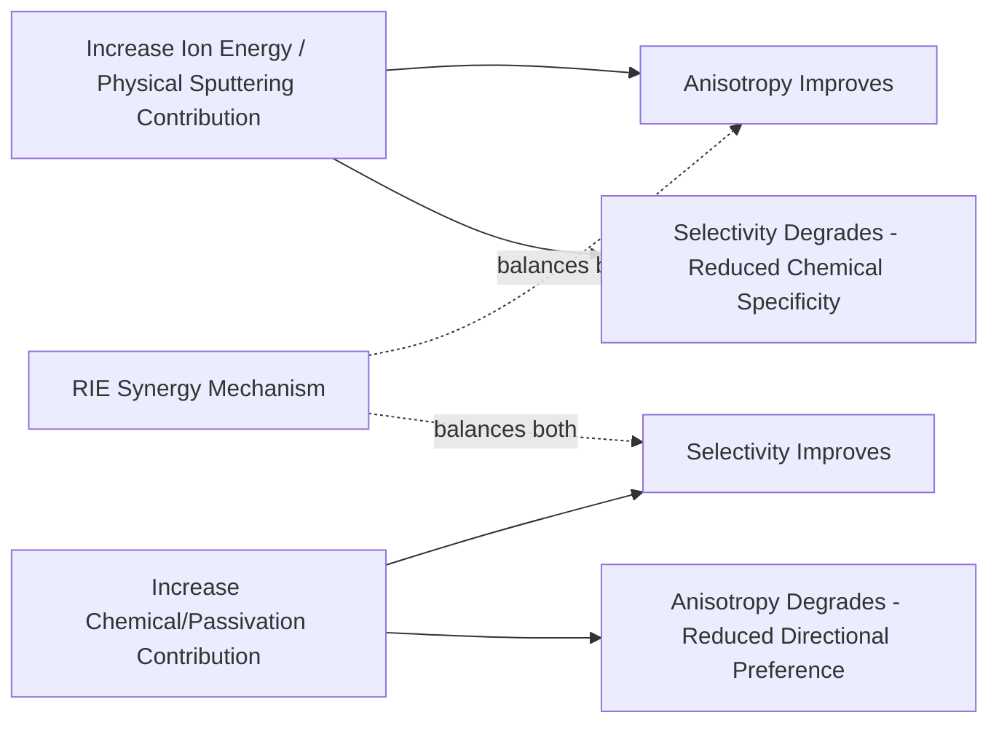

## Etch Selectivity, Profile, and Anisotropy

### Overview

Etch selectivity, profile, and anisotropy are the three interrelated figures of merit that together define the quality and manufacturability of any etch process, whether wet or dry. While earlier topics have introduced each concept in the context of specific etch techniques (wet chemical etching, reactive ion etching, and the Bosch process), this topic consolidates and formalizes the underlying definitions, quantitative treatment, and interdependencies among these three parameters, since process engineers routinely must trade off improvements in one against degradation in another when developing or tuning any real etch process.

### Selectivity: Formal Definition and Types

**Basic definition**

Selectivity quantifies the relative etch rate of one material compared to another under identical process conditions:

$$S_{A:B} = \frac{ER_A}{ER_B}$$

where $ER_A$ and $ER_B$ are the etch rates of materials A and B (commonly the target film and the mask, or the target film and an underlying etch-stop layer) measured under the same process conditions.

**Selectivity to mask**

$$S_{film:mask} = \frac{ER_{film}}{ER_{mask}}$$

- This selectivity determines how much mask thickness is consumed over the course of etching through the full target film thickness, including any overetch margin; the mask must retain sufficient thickness throughout the entire process to continue protecting underlying regions that should not be etched.
- Required mask thickness can be estimated from the target film thickness, selectivity, and required overetch margin:

$$t_{mask,min} \geq \frac{t_{film} \times (1 + \text{overetch fraction})}{S_{film:mask}}$$

- [Inference] Because insufficient mask selectivity directly limits how thick a target film can be etched before the mask is fully consumed (mask "breakthrough," which would allow unwanted etching of regions the mask was intended to protect), mask selectivity is frequently a primary constraint determining maximum achievable etch depth for a given lithographically defined mask thickness, particularly relevant for deep or extended-duration etch processes such as DRIE.

**Selectivity to underlying etch-stop layer**

$$S_{film:stop} = \frac{ER_{film}}{ER_{stop}}$$

- High selectivity to a deliberately incorporated etch-stop film allows a timed or slightly overetched process to naturally self-limit at a well-defined depth (the etch-stop interface) with comparatively wide process margin, since the etch effectively stalls once it reaches the much-more-slowly-etching stop layer, rather than continuing to remove material (and potentially damage underlying structures) if the target film's thickness varies somewhat from wafer to wafer or lot to lot.
- [Inference] This etch-stop-based self-limiting behavior is generally far more robust against target film thickness variation than a purely timed etch process without an etch-stop layer, which is why etch-stop layer incorporation is a common and deliberate process integration strategy specifically to relax the required precision of etch time/endpoint control.

**Overetch and its selectivity dependence**

- Because across-wafer and across-lot etch rate and film thickness variation are essentially unavoidable in production, etch processes are commonly run for somewhat longer than the nominal time required to just clear the target film at its average thickness — this additional time is termed **overetch**, expressed as a percentage of the nominal etch time.
- The maximum tolerable overetch percentage is directly constrained by selectivity to whatever underlying material (etch-stop layer, or the substrate itself if no dedicated stop layer is used) is exposed once the target film clears, since excessive overetch on a material with poor selectivity risks significant unwanted removal of that underlying material.

### Etch Profile: Definitions and Characterization

**Etch profile** refers to the cross-sectional shape of an etched feature, and is most commonly characterized by the **sidewall angle** ($\theta$) measured relative to the original wafer surface (horizontal).

<svg xmlns="http://www.w3.org/2000/svg" viewBox="0 0 620 260" font-family="sans-serif">
<text x="310" y="20" text-anchor="middle" font-size="14" font-weight="bold">Etch Profile Sidewall Angle Definitions (svg_diagram)</text>
<text x="100" y="45" text-anchor="middle" font-size="11" font-weight="bold">Vertical (90 deg)</text>
<rect x="30" y="55" width="60" height="15" fill="#999" />
<rect x="130" y="55" width="60" height="15" fill="#999" />
<rect x="90" y="70" width="40" height="120" fill="#e8eaf0" stroke="#333" stroke-width="1.5" />
<path d="M 15 190 A 15 15 0 0 0 30 205" fill="none" stroke="#c0392b" stroke-width="1" />
<text x="55" y="205" font-size="9" fill="#c0392b">theta = 90 deg</text>
<text x="310" y="45" text-anchor="middle" font-size="11" font-weight="bold">Tapered (theta less than 90)</text>
<rect x="240" y="55" width="60" height="15" fill="#999" />
<rect x="380" y="55" width="60" height="15" fill="#999" />
<path d="M 300 70 L 340 190 L 380 190 L 360 70 Z" fill="#e8eaf0" stroke="#333" stroke-width="1.5" transform="translate(-40,0)" />
<path d="M 260 70 L 300 190 L 340 190 L 320 70 Z" fill="#e8eaf0" stroke="#333" stroke-width="1.5" />
<text x="310" y="215" text-anchor="middle" font-size="9" fill="#c0392b">theta less than 90 deg (sloped)</text>
<text x="510" y="45" text-anchor="middle" font-size="11" font-weight="bold">Undercut (isotropic bias)</text>
<rect x="450" y="55" width="60" height="15" fill="#999" />
<rect x="570" y="55" width="60" height="15" fill="#999" />
<path d="M 480 70 Q 460 90 460 110 L 460 150 Q 460 170 480 190 L 550 190 Q 570 170 570 150 L 570 110 Q 570 90 550 70 Z" fill="#e8eaf0" stroke="#333" stroke-width="1.5" />
<text x="515" y="215" text-anchor="middle" font-size="9" fill="#c0392b">Bowed / undercut sidewall</text>
</svg>

- **Vertical profile** ($\theta \approx 90°$): the ideal, fully anisotropic result for most critical-dimension pattern transfer applications, where the etched sidewall runs perpendicular to the wafer surface with no lateral deviation from the mask edge position.
- **Tapered/sloped profile** ($\theta < 90°$): the etched feature narrows with depth (or widens, if the taper runs the other direction), often resulting from a combination of ion angular spread, sidewall passivation deposition rate, or deliberate process tuning (tapered sidewalls are sometimes intentionally targeted for specific applications, such as improving subsequent step coverage of a deposited film over the etched feature).
- **Undercut/bowed profile**: the etched feature's sidewall recedes laterally beneath the mask edge, either uniformly (straightforward isotropic-type undercut, as discussed under wet chemical etching) or with a characteristic "bowing" (maximum lateral etch at some intermediate depth rather than uniformly along the full sidewall), often associated with reduced ion flux or altered chemistry partway down a feature in certain dry etch conditions.

**Critical dimension (CD) bias**

The difference between the as-etched feature dimension and the as-defined mask opening dimension is termed CD bias:

$$\text{CD Bias} = CD_{etched} - CD_{mask}$$

- A negative CD bias indicates the etched feature is narrower than the mask opening (a common outcome in some anisotropic processes due to sidewall passivation buildup slightly encroaching inward), while a positive CD bias indicates the etched feature is wider than the mask opening (as would occur with any degree of undercut).
- [Inference] Because CD bias directly propagates into the final device's electrical characteristics for CD-sensitive structures (such as transistor gate length), tight control and characterization of CD bias — and its variation across a wafer, across different local pattern densities, and across process lots — is a routine and essential part of production etch process monitoring, generally tracked via inline CD metrology comparing post-etch measurements against post-litho (pre-etch) measurements of the same features.

### Anisotropy: Formal Quantification

Anisotropy is most commonly quantified via a normalized ratio comparing lateral (undercut) etch distance to vertical etch depth:

$$A = 1 - \frac{L}{V}$$

where $L$ is the lateral etch distance (undercut) and $V$ is the vertical etch depth, such that:

- $A = 1$ (or 100%) represents perfectly anisotropic etching, with zero lateral etch regardless of vertical depth (a fully vertical sidewall).
- $A = 0$ represents perfectly isotropic etching, where lateral etch distance equals vertical etch depth (as characteristic of most wet chemical etch processes and purely chemical, radical-driven dry etch mechanisms).
- Intermediate values of $A$ describe partially anisotropic behavior, common in many practical dry etch processes that combine both chemical and physical removal mechanisms without achieving perfectly ideal directional selectivity.

[Inference] In practice, achieving $A$ values very close to 1 (near-perfect anisotropy) generally requires either strong sidewall passivation (as in Bosch-type or fluorocarbon-passivated oxide etch processes) or sufficiently low pressure and well-collimated ion trajectories that lateral etch contribution from scattered ions and residual radical diffusion becomes negligible relative to the dominant vertical, ion-enhanced etch mechanism.

### The Fundamental Selectivity-Anisotropy Tradeoff

A central, recurring theme across etch process development is that the mechanisms which most directly improve anisotropy (energetic, directional ion bombardment; minimal chemical passivation) tend to work against high selectivity, while the mechanisms that most directly improve selectivity (chemistry-driven reaction specificity; protective passivation layers) tend to reduce the purely physical, ion-driven directional removal that produces strong anisotropy on their own.

- This tradeoff is precisely what makes the RIE synergy mechanism (ion-enhanced chemical etching, as covered under reactive ion etching) so practically important: by relying primarily on chemistry for material removal and selectivity, while using ion bombardment mainly to locally accelerate that chemistry on ion-exposed surfaces (rather than relying on pure physical sputtering, which offers essentially no selectivity), RIE-based processes can achieve a substantially better simultaneous combination of selectivity and anisotropy than either a purely chemical or purely physical mechanism alone could provide.
- [Inference] Because no single process condition setting simultaneously maximizes both selectivity and anisotropy, real production etch process development generally involves establishing an acceptable process window where both parameters meet minimum application-specific requirements, rather than independently optimizing either parameter to its theoretical best achievable value.

### Uniformity as a Related Cross-Cutting Consideration

- **Across-wafer uniformity**: variation in etch rate, selectivity, or profile from the center to the edge of a single wafer, commonly influenced by reactive species and ion flux distribution across the plasma, gas flow patterns, and temperature uniformity across the wafer.
- **Across-chamber/across-tool (chamber matching) uniformity**: variation between nominally identical process chambers or tools running the same recipe, relevant in production environments with multiple parallel etch chambers processing different wafer lots.
- [Inference] Because uniformity variation effectively compounds with nominal selectivity, profile, and anisotropy targets (a process with excellent average selectivity but poor across-wafer uniformity may still produce unacceptable results at the wafer edge, for example), production etch process qualification typically requires characterizing all of selectivity, profile/anisotropy, and uniformity together across representative production conditions, rather than validating each figure of merit independently at a single measurement location.

### Practical Example: Selectivity-Constrained Overetch Budget

Consider a process etching a target film with a nominal thickness of 100 nm on top of an etch-stop layer, where the film-to-stop selectivity is 20:1, and the process is run with a 30% overetch margin to accommodate expected thickness and rate variation:

$$t_{overetch} = 0.30 \times t_{nominal}$$

If the nominal etch time to clear 100 nm of film is $t_{nominal}$, the additional 30% overetch time exposes the now-revealed etch-stop layer to continued etching for that same additional duration. Given the 20:1 selectivity, the etch-stop layer erodes at only 1/20th the rate of the target film during this overetch period, so the effective stop-layer loss corresponds to:

$$\text{Stop Layer Loss} \approx \frac{0.30 \times t_{film}}{20} = 0.015 \times t_{film}$$

or approximately 1.5 nm of stop-layer erosion for a 100 nm target film thickness in this example — generally an acceptable margin, illustrating why sufficiently high film-to-stop selectivity (here 20:1) allows a comfortable overetch margin (here 30%) without excessive consumption of the underlying etch-stop layer. [Inference] A process with substantially lower selectivity would need to either accept a much smaller overetch margin (risking incomplete film clearing in thickness-variation scenarios) or tolerate correspondingly greater etch-stop layer erosion, illustrating concretely why selectivity and acceptable process margin are directly linked quantities in practical process design.

### Related Topics

- Wet chemical etching (isotropic profile baseline comparison)
- Reactive ion etching (synergy mechanism underlying combined selectivity/anisotropy)
- Deep reactive ion etching and the Bosch process (extreme anisotropy via cyclic passivation)
- Plasma and dry etching fundamentals (loading effects, endpoint detection)
- Hard mask and etch-stop layer material selection
- Inline CD metrology and etch process monitoring