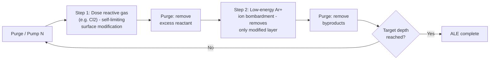
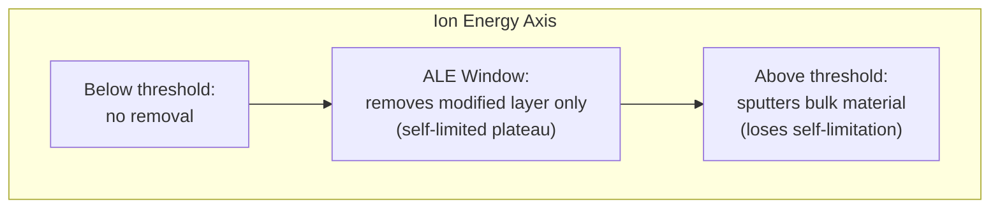

## Atomic Layer Etching

### Definition and Core Concept

Atomic Layer Etching (ALE) is a material removal technique that etches materials with angstrom-level precision by using sequential, self-limiting surface reactions. Rather than continuous exposure to reactive species (as in conventional plasma etching), ALE separates the etch process into discrete cycles, each removing a fixed, sub-nanometer amount of material regardless of process time or minor variations in reactant flux.

ALE is the etching counterpart to Atomic Layer Deposition (ALD): where ALD builds material one self-limited layer at a time, ALE removes it the same way. The technique addresses a central challenge in modern semiconductor fabrication — as device features shrink below 10 nm, conventional plasma etching's continuous chemical and physical attack becomes too imprecise, causing damage, roughness, and loss of atomic-scale dimensional control.

### Motivation: Why Conventional Etching Falls Short

Conventional reactive ion etching (RIE) relies on continuous ion bombardment and radical flux to remove material at a rate governed by process parameters (power, pressure, gas flow, time). This continuous nature creates several limitations at advanced nodes:

- **Etch rate non-uniformity**: Small variations across a wafer or between wafers translate directly into thickness/depth variation, since etch depth is a continuous function of time.
- **Aspect-ratio-dependent etching (ARDE)**: Etch rates differ between high- and low-aspect-ratio features due to differential transport of reactants and ions, causing lag in narrow features.
- **Plasma-induced damage**: Continuous ion bombardment causes lattice damage, dangling bonds, and unwanted sub-surface modification.
- **Limited selectivity**: Continuous chemical etches often struggle to stop precisely at an underlying layer without over-etching.
- **Line-edge/line-width roughness (LER/LWR)**: Stochastic etch fronts under continuous exposure amplify roughness at nanoscale dimensions.

ALE's self-limiting cycles decouple etch amount from process time, giving digital, layer-by-layer control that fixes many of these issues.

### The Two-Step ALE Cycle

A canonical ALE cycle consists of two sequential, self-limiting half-reactions:

**Step 1 — Surface Modification:**

A reactive species (typically a halogen source, e.g., $Cl_2$, $HBr$, or a fluorocarbon) is dosed onto the surface. This forms a thin, chemically modified layer (e.g., a chlorinated surface layer on silicon) that is distinct from the bulk material. Critically, this reaction is **self-limiting** — once the surface sites are saturated, further exposure does not modify additional material because the underlying bulk is unreactive to the dosing species under these conditions.

**Step 2 — Modified Layer Removal:**

A directional, low-energy physical step (typically a noble-gas ion bombardment, e.g., $Ar^+$) removes only the chemically modified layer. The ion energy is tuned to be above the sputtering threshold of the modified layer but below the threshold of the pristine underlying material — this energy window is what makes the removal step self-limiting.

Between the two steps, an inert gas purge (or pump-down) removes excess reactants and byproducts to prevent gas-phase mixing and unwanted spontaneous etching (analogous to ALD purge steps).

Each cycle removes a fixed **etch-per-cycle (EPC)**, typically on the order of 0.5–3 Å, depending on material and chemistry. Total etch depth is thus digitally controlled:

$$d_{etch} = N_{cycles} \times EPC$$

### Self-Limiting Behavior and the ALE Synergy Window

The defining characteristic of true ALE is a **saturation curve**: EPC plotted against a process parameter (dose time, ion energy, ion dose) shows a plateau region where EPC is independent of that parameter. This plateau is called the **ALE window** or **synergy window**.

Synergy is quantified as:

$$S = \frac{EPC_{ALE} - (EPC_{chem-only} + EPC_{phys-only})}{EPC_{ALE}} \times 100\%$$

where $EPC_{chem-only}$ is spontaneous etching from the modification step alone (ideally near zero) and $EPC_{phys-only}$ is sputtering from the ion step alone on unmodified material (ideally near zero, since ion energy is below the bulk sputter threshold). High synergy (approaching 100%) indicates a well-behaved, truly self-limiting ALE process.

A well-designed ALE process exhibits:

- Near-zero spontaneous etch rate during the modification step alone
- Near-zero physical sputter rate during the removal step alone (ions below bulk sputtering threshold)
- A distinct ion energy window between the modified-layer sputter threshold and the bulk sputter threshold

### Categories of ALE

**1. Directional (Anisotropic) ALE**

Uses ion bombardment as the removal step, providing vertical, anisotropic material removal suited to high-aspect-ratio features like FinFET fins, gate-all-around (GAA) nanosheet release, and deep contact/via etching. This is the dominant mode for logic and memory device fabrication.

**2. Isotropic (Thermal) ALE**

Uses purely thermal/chemical reactions for both steps — no ion bombardment. Step 1 forms a modified layer (e.g., via fluorination), and Step 2 uses a ligand-exchange or spontaneous volatilization reaction (often with a Lewis acid such as $Sn(acac)_2$ or $HF$/organic ligand chemistries) that selectively removes the modified layer without directionality. Isotropic thermal ALE is used for conformal etch-back, selective removal in 3D structures, and applications where line-of-sight ion bombardment cannot reach (e.g., undercut structures, nanowire release).

**3. Plasma-Enhanced ALE (Directional Plasma ALE)**

The most industrially mature form: uses plasma-generated halogen radicals/ions for modification and a separate low-energy ion bombardment step (often using a synchronously pulsed bias in a single plasma reactor, rather than physically separate chambers). This "single-step plasma ALE" approach pulses gas chemistry and RF bias within one reactor cycle rather than moving the wafer between chambers.

### Material Systems and Chemistries

| Material | Modification Chemistry | Removal Mechanism |
| --- | --- | --- |
| Silicon (Si) | $Cl_2$ or $HBr$ (chlorination/bromination) | Low-energy $Ar^+$ sputtering |
| Silicon dioxide ($SiO_2$) | Fluorocarbon deposition (e.g., $C_4F_8$) forming a thin $CF_x$ layer | Low-energy $Ar^+$ activation/removal |
| Silicon nitride ($Si_3N_4$) | $CH_3F$ / $CH_2F_2$-based fluorocarbon modification | Ar or He ion activation |
| III-V materials (GaAs, InP, GaN) | $Cl_2$ chlorination | $Ar^+$ sputtering (widely studied for photonics/RF devices) |
| Metals (W, Ru, Co) | Surface oxidation ($O_2$) or halogenation | Ligand-exchange volatilization (thermal ALE) or ion removal |
| High-k dielectrics ($HfO_2$, $Al_2O_3$) | Fluorination or chlorination | Thermal ligand-exchange (e.g., with $Sn(acac)_2$, $TiCl_4$) — thermal ALE |

**[Inference]** Exact EPC values and optimal process windows are highly reactor- and recipe-dependent, and published values vary across tool platforms and chemistries; representative literature ranges (0.5–3 Å/cycle) should be treated as typical rather than universal.

### Thermal ALE Reaction Example: Al₂O₃ Etching

A well-documented isotropic thermal ALE process for $Al_2O_3$ uses fluorination followed by ligand exchange:

**Step A (Fluorination):**

$$Al_2O_3 + 6\,HF \rightarrow 2\,AlF_3 + 3\,H_2O$$

This converts the surface oxide into a thin aluminum fluoride layer.

**Step B (Ligand Exchange, e.g., with $Sn(acac)_2$):**

$$AlF_3 + Sn(acac)_2 \rightarrow Al(acac)_x F_{3-x} + Sn(acac)_{2-x}F_x$$

The volatile metal-organic products desorb, completing removal of the fluorinated layer. This cycle is repeated to achieve digital etch-back with high conformality, useful for spacer trimming and interface cleaning in high-k/metal-gate stacks.

### Process Equipment Considerations

- **Fast gas switching**: ALE reactors require rapid, precise gas delivery and purge cycles (often sub-second) to maintain throughput, since each cycle removes only angstroms of material.
- **Pulsed RF bias synchronization**: In plasma ALE, the substrate bias must be precisely synchronized with the gas pulsing sequence to confine ion bombardment to the correct half-cycle.
- **Low ion energy control**: Removal-step ion energies typically range from roughly 10–100 eV — precise, stable low-energy ion delivery is a key equipment differentiator among ALE-capable etch tools.
- **Temperature control**: Especially critical for thermal ALE, where reaction volatility and self-limitation are strongly temperature-dependent.

### Metrics for Evaluating ALE Processes

- **Etch Per Cycle (EPC)**: Material removed per cycle at saturation; the fundamental unit of ALE control.
- **Synergy (%)**: Degree to which the process behaves as true self-limiting ALE versus a hybrid of continuous chemical/physical etching.
- **Selectivity**: Ratio of EPC on the target material versus an underlying stop layer or mask.
- **Damage/Roughness**: Sub-surface damage depth and resulting LER/LWR, typically characterized via TEM, XPS depth profiling, or AFM.
- **Uniformity**: Wafer-to-wafer and within-wafer EPC consistency, which benefits inherently from ALE's digital nature.

### Applications in Advanced Device Fabrication

- **FinFET and Gate-All-Around (GAA) transistors**: Precise fin/nanosheet trimming and channel release with minimal damage.
- **High-aspect-ratio contact/via etch**: Digital depth control reduces ARDE-related variability.
- **Spacer and liner trimming**: Thermal ALE enables conformal, damage-free thinning in 3D structures.
- **Selective etch in heterogeneous stacks**: High selectivity chemistries allow etching one material (e.g., $SiGe$) while leaving another (e.g., $Si$) intact — critical for nanosheet channel release in GAA architectures.
- **EUV photoresist and hardmask trimming**: Sub-nanometer control supports critical dimension (CD) tuning at leading-edge nodes.

### Comparison: ALE vs. Conventional RIE

| Characteristic | Conventional RIE | Atomic Layer Etch |
| --- | --- | --- |
| Etch rate dependence | Continuous function of time/power | Digital (cycles × EPC) |
| Depth control | Timed, subject to drift | Self-limited, highly reproducible |
| Damage | Higher (continuous ion flux) | Lower (bounded low-energy ion step) |
| ARDE | Significant at high aspect ratio | Reduced due to saturation-based removal |
| Throughput | Higher (continuous process) | Lower (cyclic, purge-limited) |
| Precision | Nanometer-scale | Sub-nanometer/angstrom-scale |

### Illustrative Schematic: ALE Surface Reaction Sequence (svg_diagram)

<svg xmlns="http://www.w3.org/2000/svg" viewBox="0 0 760 300">
<text x="380" y="24" text-anchor="middle" font-size="16" font-weight="bold" fill="#222">ALE Cycle: Surface Modification and Removal (svg_diagram)</text>

<g>
<rect x="20" y="120" width="140" height="100" fill="#8fa8c9" stroke="#333" />
<text x="90" y="240" text-anchor="middle" font-size="12" fill="#222">1. Pristine Surface</text>
<text x="90" y="255" text-anchor="middle" font-size="10" fill="#555">(bulk material)</text>
</g>

<line x1="165" y1="170" x2="205" y2="170" stroke="#333" stroke-width="2" marker-end="url(#arrow)" />

<g>
<rect x="210" y="120" width="140" height="80" fill="#8fa8c9" stroke="#333" />
<rect x="210" y="100" width="140" height="20" fill="#e0a458" stroke="#333" />
<text x="280" y="240" text-anchor="middle" font-size="12" fill="#222">2. Modification Step</text>
<text x="280" y="255" text-anchor="middle" font-size="10" fill="#555">(Cl2 dose forms</text>
<text x="280" y="268" text-anchor="middle" font-size="10" fill="#555">reactive layer)</text>
</g>
<line x1="355" y1="170" x2="395" y2="170" stroke="#333" stroke-width="2" marker-end="url(#arrow)" />

<g>
<rect x="400" y="120" width="140" height="80" fill="#8fa8c9" stroke="#333" />
<rect x="400" y="100" width="140" height="20" fill="#e0a458" stroke="#333" />
<text x="470" y="240" text-anchor="middle" font-size="12" fill="#222">3. Purge</text>
<text x="470" y="255" text-anchor="middle" font-size="10" fill="#555">(remove excess</text>
<text x="470" y="268" text-anchor="middle" font-size="10" fill="#555">reactant gas)</text>
</g>
<line x1="545" y1="170" x2="585" y2="170" stroke="#333" stroke-width="2" marker-end="url(#arrow)" />

<g>
<rect x="590" y="140" width="140" height="60" fill="#8fa8c9" stroke="#333" />
<line x1="605" y1="90" x2="605" y2="130" stroke="#c0392b" stroke-width="2" marker-end="url(#arrow2)" />
<line x1="630" y1="90" x2="630" y2="130" stroke="#c0392b" stroke-width="2" marker-end="url(#arrow2)" />
<line x1="655" y1="90" x2="655" y2="130" stroke="#c0392b" stroke-width="2" marker-end="url(#arrow2)" />
<line x1="680" y1="90" x2="680" y2="130" stroke="#c0392b" stroke-width="2" marker-end="url(#arrow2)" />
<text x="660" y="80" text-anchor="middle" font-size="10" fill="#c0392b">Ar+ ions</text>
<text x="660" y="230" text-anchor="middle" font-size="12" fill="#222">4. Removal Step</text>
<text x="660" y="245" text-anchor="middle" font-size="10" fill="#555">(low-E ions strip</text>
<text x="660" y="258" text-anchor="middle" font-size="10" fill="#555">modified layer only)</text>
</g>
</svg>

### Challenges and Limitations

- **Throughput penalty**: Cyclic purge steps add overhead compared to continuous RIE, making ALE slower per unit depth — a significant cost consideration for high-volume manufacturing.
- **Narrow process windows**: True self-limiting behavior often exists only within a tight range of dose, purge time, and ion energy; deviating outside this range degrades synergy.
- **Reactor design complexity**: Achieving fast, uniform gas switching and synchronized pulsed bias across large wafers (300 mm) adds engineering complexity.
- **Material-specific chemistry development**: Each new material system (novel high-k dielectrics, 2D materials, magnetic tunnel junction stacks) requires bespoke chemistry discovery, since no universal ALE chemistry exists.

**[Inference]** As device architectures move toward 2D-material channels, MTJ-based MRAM, and complex multi-material 3D stacks, ALE chemistry development is likely to remain an active research area rather than a fully standardized toolset, since optimal reagents and synergy windows differ substantially by material system.

**Next Steps**

- Atomic Layer Deposition (ALD) — the complementary self-limiting deposition process
- Reactive Ion Etching (RIE) and Deep RIE (Bosch process)
- Plasma physics fundamentals: sheath formation, ion energy distribution functions (IEDF)
- Selective etching chemistries for GAA nanosheet release (SiGe/Si selectivity)
- Etch damage characterization: XPS, TEM cross-sectioning, electrical CV/IV damage assessment
- High-k/metal-gate stack integration and thermal ALE for interface engineering
- Cryogenic etching techniques for high-aspect-ratio features