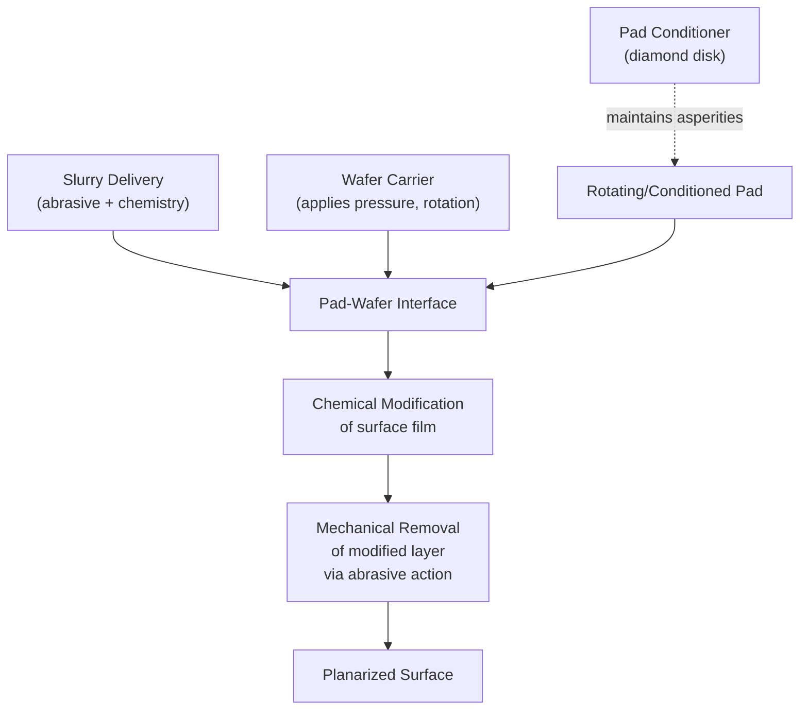

## CMP Process Mechanics

### Definition and Purpose

Chemical Mechanical Planarization (CMP), also called Chemical Mechanical Polishing, is a hybrid material removal process that combines chemical reactions with mechanical abrasion to planarize wafer surfaces at the global (wafer-scale) and local (feature-scale) level. It is the primary technique for achieving the flat, uniform topography required for multilevel interconnect fabrication, shallow trench isolation (STI), and advanced lithography, where depth of focus at each patterning layer depends on surface flatness across the entire wafer.

CMP removes material through the synergistic combination of:

- **Chemical action**: Slurry chemistry reacts with or softens the surface film, forming a reactive or hydrated layer that is more easily removed than the unmodified bulk.
- **Mechanical action**: Abrasive particles suspended in the slurry, driven by relative motion and applied pressure between the wafer and polishing pad, physically abrade the chemically modified surface layer.

Neither mechanism alone achieves the required removal rate, selectivity, and planarity — pure mechanical abrasion causes excessive damage and scratching, while pure chemical etching is isotropic and cannot planarize topography.

### The Preston Equation

The foundational empirical model for CMP material removal rate (MRR) is the **Preston equation**:

$$MRR = K_p \cdot P \cdot V$$

Where:

- $MRR$ = material removal rate
- $K_p$ = Preston coefficient (empirical constant capturing chemical, mechanical, and consumable-dependent effects)
- $P$ = applied pressure (down-force) between wafer and pad
- $V$ = relative velocity between wafer and pad

**[Inference]** The Preston equation is a first-order approximation; in practice $K_p$ is not truly constant and varies with slurry chemistry, pad condition, pattern density, and contact mechanics, so real CMP processes show significant deviation from strict linearity, especially at low pressures or on patterned (non-blanket) wafers.

### Core System Components

**1. Polishing Pad**

Typically a porous polyurethane material (e.g., IC1000-type stacked pads) with engineered surface texture (grooves, perforations) to:

- Transport fresh slurry to the wafer-pad interface
- Remove spent slurry and reaction byproducts
- Maintain consistent contact pressure distribution

  Pads undergo **conditioning** (in-situ or ex-situ) using a diamond-embedded conditioning disk to restore surface asperities as polishing wears them smooth, since a glazed pad loses removal rate and uniformity.

**2. Slurry**

A colloidal suspension containing:

- **Abrasive particles**: commonly silica ($SiO_2$), ceria ($CeO_2$), or alumina ($Al_2O_3$), typically 20–200 nm in diameter
- **Chemical oxidizers/etchants**: e.g., hydrogen peroxide ($H_2O_2$) for metal CMP, or $KOH$/amine-based chemistries for oxide/dielectric CMP
- **pH modifiers**: control zeta potential of particles and surface films, affecting both removal rate and defectivity
- **Complexing agents and corrosion inhibitors**: e.g., benzotriazole (BTA) in copper CMP, forming a passivating Cu-BTA complex layer to control static (non-mechanical) etch rate and prevent dishing/corrosion during pauses

**3. Wafer Carrier**

Holds the wafer face-down against the pad, applying controlled down-force via a retaining ring and membrane. Modern carriers use **zone-pressure control** (multiple independently addressable pressure zones across the wafer radius) to compensate for radially non-uniform removal and improve within-wafer non-uniformity (WIWNU).

**4. Platen**

The rotating table on which the pad is mounted; wafer carrier and platen typically rotate at similar (but not identical) angular velocities to produce relatively uniform relative velocity across the wafer surface and avoid center-slow/edge-fast velocity gradients (rotational CMP), or a platen may execute linear/orbital motion (linear CMP tools) for different velocity uniformity characteristics.

### Removal Mechanism: The Modified-Layer Model

The dominant mechanistic framework (originating from Cook's model and later refined by Luo and Dornfeld, among others) describes CMP removal as a two-step process analogous conceptually to ALE but continuous rather than cyclic:

1. **Chemical softening/modification**: The slurry chemistry reacts with the exposed surface, forming a thin, mechanically weaker layer (e.g., a hydrated silica gel layer on $SiO_2$, or a Cu-oxide/Cu-BTA layer on copper).
2. **Mechanical abrasion**: Asperities on the pad surface, mediated by abrasive particles, apply localized stress that removes this weakened layer. Because the modified layer is much softer than the underlying bulk, removal is largely confined to it, protecting the underlying material from gouging — provided particle size, pressure, and hardness are properly controlled.

This dual dependency explains key CMP behaviors:

- Slurry alone (no mechanical contact) produces only slow, isotropic **static etch rate**.
- Mechanical polishing alone (no reactive chemistry, e.g., DI water only) produces poor removal rate and high defectivity/scratching.
- The combined process produces a removal rate far exceeding the sum of the two acting independently — a synergy effect similar in spirit to the ALE synergy window.

### Planarization Mechanics: Pattern Density and Step-Height Reduction

A central function of CMP is reducing topographic step height from underlying patterned features (e.g., after dielectric deposition over metal lines). Planarization efficiency depends on:

- **Pattern density**: The fraction of a given area occupied by raised features. Regions of high pattern density polish more slowly per unit area of "up" feature (pressure is distributed over more contact area), while low-density (isolated) features experience higher local pressure and polish faster — a phenomenon requiring **dummy fill patterns** to homogenize density across the layout and avoid **dishing** (Chip-scale metal recess) and **erosion** (dielectric loss in dense array regions).
- **Pad bending/contact mechanics**: The pad's elastic modulus determines how well it conforms to (and thus polishes) recessed regions versus staying in contact only with raised regions. A stiffer pad improves planarization efficiency (faster removal of "up" areas relative to "down" areas) but can increase defectivity (scratching) and WIWNU.

$$PE = 1 - \frac{\Delta h_{final}}{\Delta h_{initial}}$$

Where $PE$ is planarization efficiency and $\Delta h$ is step height before/after a given polish interval.

### CMP Process Regimes by Application

**1. Interlayer Dielectric (ILD) / Oxide CMP**

Planarizes deposited dielectric films (typically $SiO_2$ or low-k dielectrics) between metal interconnect layers. Uses silica or ceria-based slurries at controlled pH (often alkaline) to promote a hydrated silica removal mechanism.

**2. Shallow Trench Isolation (STI) CMP**

Planarizes $SiO_2$ fill in trenches etched into silicon, typically stopping on a $Si_3N_4$ (silicon nitride) hard mask/polish-stop layer. Requires very high oxide-to-nitride selectivity (often engineered via ceria-based slurries, which exhibit strong chemical selectivity toward $SiO_2$ over $Si_3N_4$) to prevent nitride erosion and ensure uniform active-area height across the die.

**3. Copper (Damascene) CMP**

The critical enabling process for copper dual-damascene interconnects. Removes bulk overburden copper deposited by electroplating, stopping on a barrier layer (e.g., Ta/TaN), then removes the barrier itself, stopping on the underlying dielectric. Typically performed as a **multi-step process**:

- Step 1 (bulk Cu removal): High removal rate, oxidizer-rich slurry (e.g., $H_2O_2$-based) with BTA as a corrosion inhibitor to prevent excessive static etching (which would cause pitting/roughness) while enabling mechanically-driven removal.
- Step 2 (barrier removal): Different slurry chemistry/abrasive optimized for Ta/TaN removal with high selectivity to both copper and the underlying dielectric.
- Step 3 (buff/final polish): Low-pressure, often lower-abrasive-concentration finishing step to reduce defectivity and micro-scratching.

Copper CMP is particularly susceptible to **dishing** (excess Cu recess in wide lines) and **erosion** (dielectric thinning in dense arrays), both of which are pattern-density-dependent defects requiring careful slurry engineering and layout-level dummy fill.

**4. Tungsten (W) CMP**

Used for tungsten-plug/via planarization. Employs oxidizer-based slurries (often ferric nitrate or $H_2O_2$/alumina-based) to oxidize the tungsten surface into a WO$_3$-like layer, which is then mechanically removed; must stop selectively on the underlying oxide.

### Key Process Parameters

| Parameter | Effect |
| --- | --- |
| Down-force pressure ($P$) | Increases MRR (Preston); excessive pressure increases defectivity, WIWNU, and dishing |
| Platen/carrier relative velocity ($V$) | Increases MRR; must be balanced against slurry residence time and heat generation |
| Slurry flow rate | Governs fresh reactant supply and byproduct removal; too low starves the interface, causing non-uniform removal |
| Pad conditioning rate | Maintains pad asperity/roughness for stable MRR over pad lifetime; under-conditioning causes MRR decay |
| Slurry pH / oxidizer concentration | Controls chemical modification rate and selectivity between films |
| Abrasive particle size/concentration | Affects MRR, surface roughness, and scratch defect density |
| Retaining ring design | Controls edge effects and edge exclusion zone uniformity |

### Common CMP-Induced Defects

- **Dishing**: Concave recess in wide metal features due to excess local removal relative to surrounding dielectric.
- **Erosion**: Loss of dielectric thickness in densely patterned regions, often compounding with dishing to produce total thickness variation.
- **Scratching**: Mechanical defects from large/agglomerated abrasive particles or hard contaminants gouging the surface.
- **Slurry residue/particle contamination**: Requires dedicated post-CMP cleaning (brush scrubbing, megasonic cleaning) to remove residual slurry particles and organic residues.
- **Galvanic corrosion**: In copper CMP, dissimilar-metal contact (Cu, barrier, and slurry oxidizers) can create galvanic cells causing localized corrosion if chemistry is not properly balanced.
- **Delamination/peeling**: Especially relevant for low-k dielectrics, which are mechanically fragile and prone to cracking or interfacial delamination under CMP stress.

### Endpoint Detection

Because CMP must stop at precise film thicknesses or interfaces, in-situ endpoint detection is essential:

- **Optical interferometry**: Monitors thin-film interference signal changes through a window in the pad/platen, correlating signal oscillations with remaining film thickness.
- **Motor current/torque monitoring**: Detects friction coefficient changes as the polish transitions between films of different hardness (e.g., Cu to barrier to dielectric), since friction and thus motor torque shifts distinctly at each interface.
- **Eddy current sensing**: Used primarily for metal (conductive) films, detecting changes in induced eddy currents as metal thickness decreases — widely used in copper CMP for stopping bulk removal before reaching the barrier.

### Post-CMP Cleaning

Post-polish cleaning is integral to the overall CMP process flow, removing residual slurry particles, metal ion contamination, and organic residues:

- **Brush scrubbing**: Mechanical PVA (polyvinyl alcohol) brushes with DI water or dilute chemistry remove loosely bound particles.
- **Megasonic cleaning**: High-frequency acoustic agitation dislodges particles without mechanical brush contact, useful for fragile low-k structures.
- **Chemical cleaning**: Dilute acidic or basic solutions (process-specific) to remove metal residues and passivate exposed surfaces against corrosion.

### Illustrative Schematic: CMP Wafer-Pad Interface (svg_diagram)

<svg xmlns="http://www.w3.org/2000/svg" viewBox="0 0 700 320">
<text x="350" y="24" text-anchor="middle" font-size="16" font-weight="bold" fill="#222">CMP Wafer-Pad Interface (svg_diagram)</text>

<rect x="220" y="50" width="260" height="30" fill="#999" stroke="#333" />
<text x="350" y="70" text-anchor="middle" font-size="11" fill="#fff">Wafer Carrier (rotation, down-force)</text>

<line x1="260" y1="85" x2="260" y2="110" stroke="#c0392b" stroke-width="2" marker-end="url(#a1)" />
<line x1="350" y1="85" x2="350" y2="110" stroke="#c0392b" stroke-width="2" marker-end="url(#a1)" />
<line x1="440" y1="85" x2="440" y2="110" stroke="#c0392b" stroke-width="2" marker-end="url(#a1)" />
<text x="500" y="100" font-size="10" fill="#c0392b">Pressure (P)</text>

<rect x="220" y="112" width="260" height="24" fill="#5d8aa8" stroke="#333" />
<text x="350" y="128" text-anchor="middle" font-size="11" fill="#fff">Wafer (patterned film)</text>

<rect x="180" y="138" width="340" height="14" fill="#f1c40f" stroke="#333" stroke-width="0.5" />
<text x="350" y="148" text-anchor="middle" font-size="9" fill="#222">Slurry (abrasive + chemistry)</text>

<rect x="150" y="154" width="400" height="60" fill="#d5b895" stroke="#333" />
<text x="350" y="188" text-anchor="middle" font-size="11" fill="#222">Polishing Pad (porous polyurethane)</text>

<line x1="200" y1="154" x2="200" y2="214" stroke="#8a6d3b" stroke-width="2" />
<line x1="300" y1="154" x2="300" y2="214" stroke="#8a6d3b" stroke-width="2" />
<line x1="400" y1="154" x2="400" y2="214" stroke="#8a6d3b" stroke-width="2" />
<line x1="500" y1="154" x2="500" y2="214" stroke="#8a6d3b" stroke-width="2" />

<rect x="120" y="216" width="460" height="30" fill="#777" stroke="#333" />
<text x="350" y="236" text-anchor="middle" font-size="11" fill="#fff">Rotating Platen</text>

<path d="M 550 130 A 40 40 0 1 1 549 129" fill="none" stroke="#27ae60" stroke-width="2" marker-end="url(#a2)" />
<text x="600" y="135" font-size="10" fill="#27ae60">Relative Velocity (V)</text>
</svg>

### Metrology and Process Control

- **Within-wafer non-uniformity (WIWNU)**: Standard deviation of removed thickness across the wafer, normalized by mean removal — a key CMP quality metric.
- **Wafer-to-wafer non-uniformity (WTWNU)**: Consistency of removal across a lot, sensitive to pad wear/conditioning drift over time.
- **Thickness metrology**: Ellipsometry (dielectrics) and four-point probe or sheet resistance mapping (metals) verify post-CMP film thickness across the wafer.
- **Defect inspection**: Optical/SEM-based wafer inspection tools detect scratches, residue, and delamination post-CMP and post-clean.

**[Inference]** Because CMP performance is strongly coupled to consumable condition (pad wear state, slurry batch variation, conditioner disk wear), production fabs typically implement statistical process control (SPC) and periodic consumable requalification; the specific control limits and requalification intervals are fab- and process-specific rather than universally standardized.

**Next Steps**

- Slurry chemistry design: abrasive selection, oxidizers, and corrosion inhibitors (BTA chemistry)
- Copper dual-damascene interconnect integration flow
- Low-k dielectric CMP challenges and mechanical fragility
- Shallow Trench Isolation (STI) process integration
- Post-CMP cleaning techniques: megasonic and brush scrubbing systems
- Dummy fill and layout-driven planarization (Design for Manufacturability, DFM)
- Endpoint detection systems: optical interferometry vs. eddy current sensing
- Pad conditioning mechanics and consumable lifecycle management