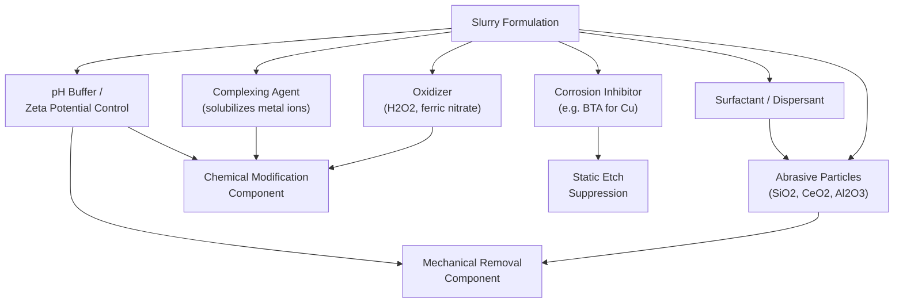
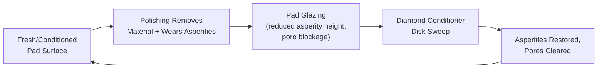

## Slurry Chemistry and Pad Conditioning

### Overview

Slurry chemistry and pad conditioning are the two consumable-driven subsystems that determine CMP process stability, removal rate, selectivity, and defectivity over time. Slurry provides the chemical and abrasive medium at the wafer-pad interface; pad conditioning maintains the mechanical asperity structure of the pad required for consistent slurry transport and contact mechanics. Both are engineered together — a slurry formulated for one pad texture/hardness will not necessarily perform identically on another, and conditioning parameters are tuned per slurry-pad pairing.

### Slurry Composition: Core Components

**1. Abrasive Particles**

Suspended solid particles that provide the mechanical component of material removal.

- **Fumed/colloidal silica ($SiO_2$)**: Most common abrasive for oxide and general dielectric CMP; typically 20–100 nm particle size. Colloidal silica is grown in solution (more uniform, lower defectivity) versus fumed silica (pyrogenic, less uniform but historically cheaper).
- **Ceria ($CeO_2$)**: Used predominantly for STI oxide CMP due to strong chemical-mechanical selectivity toward $SiO_2$ over $Si_3N_4$, enabling the process to stop cleanly at the nitride polish-stop layer. Ceria's selectivity arises partly from a chemical bonding mechanism (Ce-O-Si bond formation) rather than purely mechanical hardness differences.
- **Alumina ($Al_2O_3$)**: Common in tungsten CMP and some metal barrier slurries; harder than silica, giving higher removal rates but generally higher scratch/defect risk if not well-dispersed.
- **Particle size distribution (PSD)**: A tight, well-controlled PSD is critical — large-tail particles (agglomerates) are a primary source of scratch defects. Slurry suppliers specify $D_{50}$ (median size) and $D_{99}$ or similar tail metrics to characterize distribution quality.

**2. Oxidizers**

Drive chemical modification of metal surfaces, particularly in metal CMP:

- **Hydrogen peroxide ($H_2O_2$)**: Dominant oxidizer in copper and some tungsten slurries; oxidizes the metal surface to form a softer oxide/hydroxide layer more readily removed mechanically.
- **Ferric nitrate ($Fe(NO_3)_3$) / potassium iodate**: Used in tungsten CMP to oxidize W to WO$_3$-like species.
- **Persulfates**: Alternative oxidizer chemistries used in some copper formulations for controlled static etch behavior.

**3. Complexing Agents**

Form soluble complexes with oxidized metal ions, controlling dissolution rate and preventing redeposition:

- Common in copper CMP (e.g., glycine, citric acid, or amino-acid-based complexants) to solubilize $Cu^{2+}$ ions generated by oxidation, keeping the removal process chemically controlled rather than purely oxidative/corrosive.

**4. Corrosion Inhibitors**

- **Benzotriazole (BTA)**: The archetypal corrosion inhibitor in copper CMP. BTA adsorbs onto exposed copper surfaces, forming a passivating Cu-BTA polymeric film that suppresses the **static etch rate** (chemical etching with no mechanical contact) while still allowing removal under active mechanical abrasion. This selectivity between static and dynamic (mechanically-assisted) removal is essential to prevent dishing, pitting, and galvanic corrosion during process pauses or in low-pressure regions.

**5. pH Modifiers / Buffers**

- Slurry pH controls zeta potential of both the abrasive particles and the wafer surface film, which governs colloidal stability (particle agglomeration risk) and chemical reaction rates.
- Oxide CMP slurries are often alkaline (high pH, e.g., $KOH$-based) to promote hydrolysis of $SiO_2$ into a softer hydrated silica gel layer.
- Metal CMP slurries are frequently formulated at near-neutral to mildly acidic pH to balance oxidation rate, complexation, and inhibitor effectiveness.

**6. Surfactants and Dispersants**

Maintain particle suspension stability, prevent agglomeration, and can influence hydrophilicity/hydrophobicity of the wafer surface, affecting slurry wetting and removal uniformity.

### Slurry-Surface Interaction: Zeta Potential and Colloidal Stability

The **zeta potential** of both the abrasive particles and the wafer film surface governs electrostatic interaction at the interface:

- When particle and surface zeta potentials have the **same sign**, electrostatic repulsion reduces particle adhesion/agglomeration on the surface, generally improving defectivity but potentially lowering mechanical contact efficiency.
- When they have **opposite signs**, attractive forces increase particle-surface contact (beneficial for mechanical removal) but raise the risk of particle sticking/embedding and post-CMP residue.

Slurry pH is tuned relative to the **isoelectric point (IEP)** of the abrasive (the pH at which zeta potential is zero) to control this balance — e.g., silica has an IEP around pH ~2–3, so most oxide slurries operate at pH well above this to maintain negative, mutually repulsive zeta potential and colloidal stability.

### Application-Specific Slurry Chemistries

| Process | Abrasive | Key Chemistry | Primary Goal |
| --- | --- | --- | --- |
| Oxide/ILD CMP | Colloidal silica | Alkaline (KOH-based), high pH | High removal rate, low defectivity blanket planarization |
| STI CMP | Ceria | Near-neutral to mildly alkaline | High $SiO_2$:$Si_3N_4$ selectivity, nitride polish-stop |
| Cu bulk CMP | Colloidal silica or modified silica | $H_2O_2$ oxidizer + complexing agent + BTA | High MRR with dishing/corrosion control |
| Barrier (Ta/TaN) CMP | Alumina or silica | Oxidizer + selective chemistry vs. Cu and dielectric | High barrier:Cu and barrier:dielectric selectivity |
| Tungsten CMP | Alumina | Ferric nitrate or $H_2O_2$-based oxidizer | High W removal rate, oxide selectivity |

### Pad Conditioning: Purpose and Mechanism

CMP pads (typically porous, cast polyurethane with a stacked sub-pad structure) develop a smooth, "glazed" surface during polishing as the pad's micro-scale asperities wear down and become filled with slurry byproducts and polished debris. A glazed pad:

- Loses effective contact area/asperity height, reducing mechanical abrasion efficiency
- Impedes slurry transport to the wafer-pad interface
- Causes MRR decay and increased within-wafer non-uniformity over time

**Pad conditioning** restores the pad surface texture using a **diamond-embedded conditioning disk** (a metal disk with electroplated or brazed diamond grit) that abrades the pad surface, re-exposing fresh asperities and clearing pore blockage.

### Conditioning Modes

**1. Ex-situ Conditioning**

Conditioning occurs between polishing steps (wafer removed from the platen). Simpler mechanically but introduces process interruption and does not correct pad state changes that occur during the active polish itself.

**2. In-situ Conditioning**

Conditioning occurs concurrently with wafer polishing, using a separate conditioner arm sweeping across the pad while the wafer is being polished. This is the dominant mode in modern production tools because it maintains a more consistent pad state throughout the polish and improves long-term MRR stability and WIWNU repeatability.

**3. Pre-conditioning / Break-in**

New or recently dressed pads undergo a "break-in" conditioning sequence (and sometimes dummy wafer polishing) before production use, since fresh pad surfaces (especially from a stacked-pad lamination process) have different asperity characteristics than a "broken-in" steady-state pad.

### Conditioner Disk Parameters

- **Diamond grit size and density**: Coarser grit and higher density increase pad cut rate (material removed from the pad per unit time) but can also increase pad wear rate, shortening pad lifetime.
- **Conditioning down-force**: Governs aggressiveness of pad texturing; must be balanced against pad wear rate and conditioning uniformity across the pad radius.
- **Conditioner sweep profile/dwell time**: The conditioner's radial sweep pattern and dwell time distribution across the pad determine conditioning uniformity — critical because non-uniform conditioning directly translates into WIWNU on the wafer.
- **Conditioning frequency/duty cycle**: In-situ systems typically condition continuously or at a high duty cycle relative to polish time; the ratio of conditioning sweep time to polish time is tuned to balance pad cut rate against pad lifetime.

### Pad Cut Rate and Pad Life

**Pad cut rate (PCR)** quantifies the rate of pad material removed by the conditioner (typically measured in µm/hr or similar), analogous conceptually to wafer MRR but for the pad itself. PCR must be maintained within a target range:

- **Too low**: Insufficient asperity renewal → MRR decay, glazing, non-uniformity drift over pad life
- **Too high**: Excessive pad wear → shortened pad lifetime, potential pad thickness non-uniformity, increased consumable cost

Pads have a finite usable lifetime (measured in wafers polished or total polish time) after which the porous structure and groove depth degrade beyond acceptable process windows, requiring pad replacement. Production fabs track pad life via wafer count, cumulative conditioning time, or periodic MRR/uniformity monitor wafers.

### Coupled Slurry-Pad-Conditioning Interactions

Slurry chemistry, pad material properties, and conditioning parameters are not independent — they form a coupled system:

- **Pad hardness/modulus** affects planarization efficiency and how conditioning-restored asperities interact with abrasive particle size; a stiffer pad combined with larger abrasive particles increases local contact stress and can raise both MRR and defectivity.
- **Slurry particle size relative to pad asperity scale** affects whether particles are effectively trapped and rolled/slid at the interface (mechanical engagement) or simply flow past without contributing to abrasion.
- **Conditioning aggressiveness vs. slurry chemistry**: A more chemically aggressive slurry (higher oxidizer concentration) may tolerate a less aggressively conditioned (smoother) pad while still achieving target MRR, illustrating the chemical-mechanical trade-off central to Preston-equation behavior — a lower effective $K_p$ contribution from mechanical asperity can be compensated by higher chemical reactivity, and vice versa.

**[Inference]** Because these interactions are strongly formulation- and platform-specific, optimal slurry-pad-conditioning parameter sets are typically determined empirically via design-of-experiments (DOE) methodology for each specific process/tool/consumable combination rather than derived from first-principles models alone.

### Illustrative Schematic: Pad Surface Before/After Conditioning (svg_diagram)

<svg xmlns="http://www.w3.org/2000/svg" viewBox="0 0 700 260">
<text x="350" y="24" text-anchor="middle" font-size="16" font-weight="bold" fill="#222">Pad Surface: Glazed vs. Conditioned (svg_diagram)</text>

<text x="170" y="55" text-anchor="middle" font-size="12" font-weight="bold" fill="#222">Glazed Pad (worn)</text>

<rect x="60" y="65" width="220" height="80" fill="`#d5b895`" stroke="#333" />

<path d="M 60 90 Q 100 88 140 90 T 220 90 T 280 90" stroke="`#8a6d3b`" stroke-width="2" fill="none" />

<path d="M 60 110 Q 100 108 140 110 T 220 110 T 280 110" stroke="`#8a6d3b`" stroke-width="2" fill="none" />

<text x="170" y="160" text-anchor="middle" font-size="10" fill="#555">Smoothed asperities,</text>

<text x="170" y="173" text-anchor="middle" font-size="10" fill="#555">blocked pores</text>

<line x1="300" y1="105" x2="360" y2="105" stroke="#333" stroke-width="2" marker-end="url(#a3)" />
<text x="330" y="95" text-anchor="middle" font-size="9" fill="#333">Diamond</text>
<text x="330" y="120" text-anchor="middle" font-size="9" fill="#333">Conditioner</text>

<text x="530" y="55" text-anchor="middle" font-size="12" font-weight="bold" fill="#222">Conditioned Pad (fresh)</text>

<rect x="420" y="65" width="220" height="80" fill="`#d5b895`" stroke="#333" />

<path d="M 420 80 L 435 100 L 450 80 L 465 100 L 480 80 L 495 100 L 510 80 L 525 100 L 540 80 L 555 100 L 570 80 L 585 100 L 600 80 L 615 100 L 630 80" stroke="`#8a6d3b`" stroke-width="2" fill="none" />

<path d="M 420 120 L 435 140 L 450 120 L 465 140 L 480 120 L 495 140 L 510 120 L 525 140 L 540 120 L 555 140 L 570 120 L 585 140 L 600 120 L 615 140 L 630 120" stroke="`#8a6d3b`" stroke-width="2" fill="none" />

<text x="530" y="160" text-anchor="middle" font-size="10" fill="#555">Sharp asperities restored,</text>

<text x="530" y="173" text-anchor="middle" font-size="10" fill="#555">pores cleared for slurry flow</text>

</svg>

### Monitoring and Control Metrics

- **Pad cut rate tracking**: Periodic measurement of pad thickness loss to verify conditioning is within target range over pad lifetime.
- **Slurry particle size/count monitoring**: Inline or offline particle counters detect agglomeration or contamination before slurry reaches the tool, since large-particle excursions are a leading scratch defect root cause.
- **MRR monitor wafers**: Blanket-film monitor wafers polished periodically to track drift in removal rate, serving as an early indicator of slurry degradation, pad wear, or conditioner disk wear.
- **Conditioner disk life tracking**: Diamond grit wears over time, gradually reducing pad cut rate at fixed down-force; disks are replaced on a qualified schedule or performance-based trigger.

### Common Failure Modes

- **Slurry particle agglomeration**: Caused by pH drift, contamination, or extended dwell time in delivery lines; directly increases scratch defectivity.
- **Pad glazing/under-conditioning**: Leads to gradual MRR decay and WIWNU degradation over a polish campaign.
- **Over-conditioning**: Excessive pad wear shortens pad life and can create groove/asperity structures outside the qualified process window.
- **Conditioner disk wear-out**: Dulled diamond grit reduces pad cut rate at constant down-force, requiring either increased down-force (increasing pad wear elsewhere) or disk replacement.
- **Slurry line contamination/settling**: Improper slurry delivery system design (dead-legs, inadequate recirculation) can cause particle settling and inconsistent delivery concentration.

**Next Steps**

- Copper CMP integration: bulk, barrier, and buff step chemistry design
- STI CMP and ceria-based selectivity mechanisms
- Zeta potential and colloidal chemistry fundamentals
- Pad material science: polyurethane formulation, hardness, and groove design
- CMP endpoint detection systems (optical interferometry, eddy current, motor torque)
- Post-CMP cleaning: brush scrubbing and megasonic cleaning integration
- Design of Experiments (DOE) methodology for consumable qualification