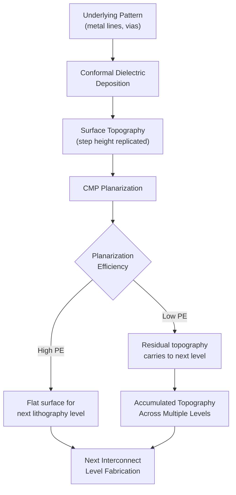

## Planarization for Multilevel Structures

<syllabot_broad_topic/>

### Overview and Motivation

Multilevel interconnect structures in modern integrated circuits stack many layers of metal wiring (often 10–15+ layers in advanced logic processes) separated by interlayer dielectrics (ILD), each connected vertically through vias. Without planarization, topography generated at one level — from underlying metal lines, vias, and dielectric fill — propagates and accumulates upward through subsequent layers, degrading lithographic depth of focus, causing step coverage failures in deposited films, and ultimately limiting the number of interconnect levels that can be reliably fabricated.

Planarization for multilevel structures addresses this by flattening each layer's surface topography before the next level is built, using CMP as the dominant enabling technology (having replaced earlier approaches such as spin-on-glass etchback and reflow planarization for most modern nodes). The central challenge is not merely "polishing flat" but managing how underlying pattern density, feature geometry, and material stacks interact with the planarization process across the *entire* wafer and across *every* level of the interconnect stack.

### Why Topography Accumulates: The Multilevel Problem

Each interconnect level introduces its own topographic contribution:

1. Metal lines/vias are patterned and filled (damascene) or deposited and etched (subtractive)
2. Dielectric is deposited over this patterned layer, largely conforming to the underlying topography (particularly for conformal CVD dielectrics)
3. Without planarization, this conformal replication means the surface presented to the *next* lithography step retains a step height related to the *previous* layer's feature height

If left uncorrected across multiple levels, this topography compounds — later levels see progressively worse combined step heights from all preceding layers, since each unplanarized layer's contribution adds rather than cancels.

$$h_{total} \approx \sum_{i=1}^{n} h_i \times (1 - PE_i)$$

Where $h_i$ is the topographic contribution from level $i$ and $PE_i$ is the planarization efficiency achieved at that level. Perfect planarization ($PE_i = 1$) at every level would fully "reset" topography before the next layer, decoupling levels from one another; in practice, $PE_i < 1$, so residual topography still accumulates, but at a much slower rate than with no planarization at all.

### Depth of Focus and Lithographic Constraints

Advanced lithography (particularly at high numerical aperture, including immersion and EUV systems) has a shrinking **depth of focus (DOF)** — the range of vertical positions across which the projected image remains acceptably in focus. As DOF shrinks with each node:

$$DOF \propto \frac{\lambda}{NA^2}$$

surface topography that would have been tolerable at earlier nodes becomes a lithography-limiting defect at advanced nodes. This is a primary driver forcing tighter CMP planarization requirements (both local step-height reduction and global wafer-scale flatness) at each successive technology generation, since even modest residual topography can push part of the wafer surface outside the lithographic focus budget.

### Global vs. Local Planarization

Multilevel planarization must be evaluated at two distinct spatial scales:

**Global (wafer-scale) planarity**: The overall flatness of the wafer surface across its full diameter, affected by factors like wafer bow, incoming substrate non-uniformity, and CMP tool-level effects (carrier pressure zoning, pad wear pattern). Poor global planarity manifests as low-frequency thickness variation across the wafer (e.g., center-thick/edge-thin).

**Local (feature-scale) planarity**: Flatness within a die or within a specific circuit block, driven by local pattern density variation (dense array vs. isolated line regions) and step height from underlying features. Poor local planarity manifests as dishing, erosion, and residual step height at the scale of individual interconnect features.

A CMP process can achieve good global planarity while still exhibiting poor local planarity (e.g., dishing in wide lines within an otherwise flat wafer region), so both metrics must be controlled simultaneously — global planarity primarily through tool/process engineering, and local planarity primarily through pattern-density-aware layout design combined with process/consumable tuning.

### Pattern-Density Dependence and Layout-Level Mitigation

CMP removal rate and planarization behavior are strongly dependent on local **pattern density** — the fraction of a region occupied by raised (or, depending on the process, recessed) features:

- In **oxide/ILD CMP**, isolated raised features (low local density) experience concentrated pad contact pressure and polish faster, while densely packed features share contact area and polish more slowly, leading to differential thickness across regions of different density after a fixed polish time.
- In **copper damascene CMP**, the inverse relationship often dominates: wide, isolated metal lines are prone to **dishing** because the pad can flex into the low-hardness copper surface below the surrounding dielectric plane, while dense arrays experience **erosion** of the surrounding dielectric due to compounded local pressure effects.

**Dummy fill** is the primary layout-level mitigation: non-functional metal or dielectric shapes are inserted into sparse layout regions during physical design to homogenize pattern density across the die, reducing density-driven variation in CMP removal and planarization efficiency. Dummy fill insertion is typically governed by density-uniformity design rules (e.g., requiring pattern density within a specified window, checked over sliding windows of a defined size) as part of design-for-manufacturability (DFM) flow, and is applied consistently across every metal/via level in the stack rather than as a one-time fix.

### Multilevel Process Flow: Dual-Damascene Integration

Modern multilevel copper interconnects use the **dual-damascene** process, in which via and trench are patterned and filled together before a single CMP step, repeated at every metal level:

1. Deposit ILD (often low-k dielectric) over the previous, planarized level
2. Pattern and etch via holes and trench (dual-damascene lithography/etch sequence)
3. Deposit diffusion barrier (Ta/TaN) and copper seed layer
4. Electroplate copper fill (overburden deposited above the trench top)
5. **CMP**: bulk copper removal → barrier removal → final buff, planarizing the level and stopping on the dielectric surface
6. Repeat from step 1 for the next metal level

Because this sequence repeats at every level (often 10+ times in advanced logic), even small per-level planarization deficiencies compound significantly by the upper metal levels, making per-level CMP process robustness a first-order yield and reliability driver for the entire back-end-of-line (BEOL) stack.

### Interlevel Stack Considerations

**Low-k Dielectric Integration**

As ILD materials shift from $SiO_2$ to low-k and ultra-low-k dielectrics (to reduce interconnect RC delay), multilevel planarization becomes mechanically more challenging: low-k films are typically more porous and mechanically weaker (lower modulus, lower fracture toughness), making them more susceptible to CMP-induced delamination and cracking. This constrains achievable CMP down-force and requires gentler process windows, which can in turn reduce achievable planarization efficiency per level — a trade-off that must be managed across the full multilevel stack.

**Via/Contact Stacking and Stress Accumulation**

In advanced multilevel stacks, vias are often stacked directly over one another (stacked vias) rather than staggered, to save area. This increases local mechanical stress concentration through the stack and raises sensitivity to any CMP-induced dishing/erosion at lower levels, since geometric misalignment or recess at a lower level propagates directly into contact resistance and reliability issues at the via connecting to the level above.

**Barrier/Liner Layer Effects**

At each level, thin diffusion barrier layers (Ta/TaN for Cu) must be planarized with high selectivity to both the copper and the surrounding dielectric. Because barrier layers are very thin (often only a few nanometers), the CMP process window for barrier removal is narrow, and over-polishing directly erodes the underlying dielectric — a particularly acute concern for maintaining consistent planarity across many stacked levels.

### Metrology for Multilevel Planarity Verification

- **Optical profilometry / interferometry**: Maps surface topography across the die and wafer after each CMP step to verify local and global flatness before the next lithography level.
- **Cross-sectional SEM/TEM**: Used periodically (destructively) to directly measure dishing, erosion, and residual step height at representative structures (wide lines, dense arrays, isolated features) as part of process qualification.
- **Focus-exposure matrix (FEM) monitoring**: Indirectly verifies whether residual topography from CMP is within the lithographic process's depth-of-focus budget at the subsequent patterning step.
- **Electrical test structures**: Via chain resistance and yield test structures provide an integrated, production-representative signal of whether multilevel planarization (and the resulting via/metal geometry) is within specification across the full stack.

### Cumulative Effects and Process Control Strategy

Because planarization deficiencies compound across levels, production processes typically employ:

- **Per-level process qualification**: Each metal level's CMP recipe is qualified independently, since pattern density characteristics, dielectric stack, and via geometry differ level-to-level (e.g., lower, denser local-interconnect levels vs. upper, wider global-routing levels).
- **Level-specific dummy fill rules**: Density uniformity targets may differ by level, reflecting different routing characteristics and criticality (e.g., tighter control at lower levels where lithographic DOF budget is most constrained).
- **Statistical process control (SPC) across the stack**: Thickness and planarity metrics are tracked not just per-level but cumulatively, to detect drift that might not violate any single level's spec but produces unacceptable combined topography by upper levels.

**[Inference]** Because dummy fill density rules, per-level process windows, and stacked-via design constraints are heavily dependent on a given fab's specific design rules and process design kit (PDK), the precise numerical targets (e.g., density window bounds, maximum allowable dishing) vary significantly by foundry/process node and are not standardized industry-wide.

### Illustrative Schematic: Topography Accumulation Without vs. With Planarization (svg_diagram)

<svg xmlns="http://www.w3.org/2000/svg" viewBox="0 0 760 320">
<text x="380" y="24" text-anchor="middle" font-size="16" font-weight="bold" fill="#222">Multilevel Topography: Unplanarized vs. Planarized (svg_diagram)</text>

<text x="180" y="50" text-anchor="middle" font-size="12" font-weight="bold" fill="#222">Without Planarization</text>

<rect x="80" y="230" width="200" height="20" fill="#999" stroke="#333" />
<rect x="120" y="210" width="40" height="20" fill="#5d8aa8" stroke="#333" />
<rect x="80" y="190" width="200" height="20" fill="#ccc" stroke="#333" />
<path d="M80 190 L120 170 L160 170 L200 190 Z" fill="#ccc" stroke="#333" />
<rect x="130" y="170" width="30" height="20" fill="#5d8aa8" stroke="#333" />
<rect x="80" y="150" width="200" height="20" fill="#ddd" stroke="#333" />
<path d="M80 150 L110 125 L200 125 L230 150 Z" fill="#ddd" stroke="#333" opacity="0.9" />
<rect x="135" y="125" width="30" height="25" fill="#5d8aa8" stroke="#333" />
<rect x="80" y="105" width="200" height="20" fill="#eee" stroke="#333" />
<path d="M80 105 L100 75 L260 75 L280 105 Z" fill="#eee" stroke="#333" />
<text x="180" y="270" text-anchor="middle" font-size="10" fill="#555">Topography compounds</text>
<text x="180" y="283" text-anchor="middle" font-size="10" fill="#555">upward through levels</text>

<text x="580" y="50" text-anchor="middle" font-size="12" font-weight="bold" fill="#222">With CMP Planarization</text>

<rect x="480" y="230" width="200" height="20" fill="#999" stroke="#333" />
<rect x="520" y="210" width="40" height="20" fill="#5d8aa8" stroke="#333" />
<rect x="480" y="190" width="200" height="20" fill="#ccc" stroke="#333" />
<rect x="530" y="170" width="30" height="20" fill="#5d8aa8" stroke="#333" />
<rect x="480" y="150" width="200" height="20" fill="#ddd" stroke="#333" />
<rect x="535" y="130" width="30" height="20" fill="#5d8aa8" stroke="#333" />
<rect x="480" y="110" width="200" height="20" fill="#eee" stroke="#333" />
<text x="580" y="270" text-anchor="middle" font-size="10" fill="#555">Each level reset flat</text>
<text x="580" y="283" text-anchor="middle" font-size="10" fill="#555">before next lithography step</text>
</svg>

### Key Failure Modes Specific to Multilevel Context

- **Progressive DOF budget consumption**: Even individually-acceptable per-level residual topography can, when summed, exceed lithographic DOF budget by upper metal levels, causing pattern defects only visible several levels above their true origin.
- **Via misalignment/void formation**: Residual step height or dishing at a lower level can cause via-to-metal misalignment or incomplete via fill at the level above, creating latent reliability defects (e.g., via voids) not immediately caught by electrical test.
- **Delamination propagation**: Mechanical stress from CMP at one level, particularly with fragile low-k dielectrics, can create latent interfacial weaknesses that manifest as delamination failures only after subsequent thermal/mechanical processing at later levels.
- **Cumulative yield loss**: Because multilevel stacks involve repeated CMP steps, even a modest per-level defect rate compounds multiplicatively across many levels, making per-level CMP defectivity control a significant driver of overall die yield in complex BEOL stacks.

**Next Steps**

- Dual-damascene copper interconnect integration flow
- Dummy fill and pattern-density-driven Design for Manufacturability (DFM)
- Low-k and ultra-low-k dielectric mechanical properties and CMP compatibility
- Lithographic depth of focus and its relationship to CMP planarity requirements
- Dishing and erosion: mechanisms and slurry/pad mitigation strategies
- Via chain electrical test structures for planarity/yield correlation
- Back-end-of-line (BEOL) reliability and stress-induced failure mechanisms