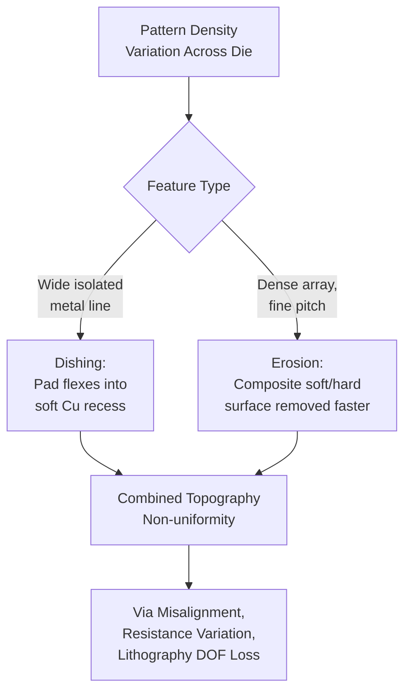
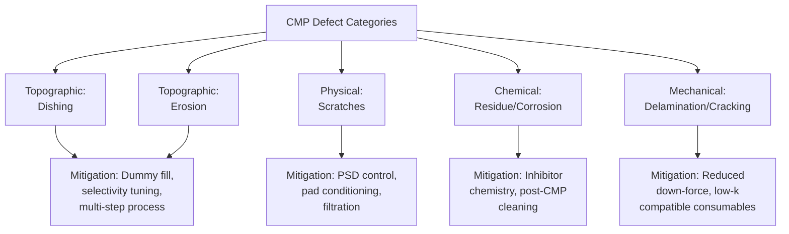

## Dishing, Erosion, and Defect Control

### Overview

Dishing and erosion are the two dominant pattern-dependent topographic defects produced by Chemical Mechanical Planarization, particularly in copper damascene interconnects. Both arise from the same underlying cause — spatially non-uniform material removal driven by local pattern density and feature geometry — but manifest differently and require distinct mitigation strategies. Alongside these topographic defects, CMP introduces a broader category of localized physical defects (scratches, residue, corrosion) that together determine overall CMP-limited yield. Controlling all three categories simultaneously, across every level of a multilevel interconnect stack, is a central CMP process integration challenge.

### Dishing: Definition and Mechanism

**Dishing** is the concave recess of a metal feature (most commonly copper) below the plane of the surrounding dielectric, occurring predominantly in wide, isolated metal lines and large pads.

**Mechanism**: During the final stages of copper CMP (and especially during over-polish/buff steps), the polishing pad — being a compliant, elastic material — can flex slightly into the recess created as copper is removed, since copper is mechanically softer than the surrounding dielectric and etches at a different rate under the given slurry chemistry. Once a small recess forms, the pad continues to preferentially contact and remove the lower-standing copper less than the dielectric plane would suggest, but the softer copper still erodes faster than the harder dielectric under sustained mechanical/chemical action, progressively deepening the dish. Wide features are most susceptible because:

- The pad has more unsupported area to flex into
- Local removal rate is less "protected" by the surrounding stiffer dielectric at large distances from the feature edge

$$Dishing = h_{dielectric} - h_{copper, center}$$

measured as the vertical recess of the copper surface at the center of a wide line relative to the adjacent planarized dielectric.

### Erosion: Definition and Mechanism

**Erosion** is the thinning of the dielectric (and to some extent the copper) in **densely patterned array regions** (e.g., fine-pitch memory arrays or dense logic routing), where local pattern density is high.

**Mechanism**: In dense arrays, closely spaced copper lines and thin dielectric spaces between them create a composite surface with locally averaged mechanical properties (softer overall due to the high copper fraction). This causes the CMP process to remove *both* the copper lines and the dielectric between them somewhat uniformly but at a higher net rate than in low-density regions with the same polish time, since the pad contacts an area that behaves, on average, mechanically softer. The result is that the entire dense region — copper and dielectric together — sits lower than equivalent isolated-feature regions elsewhere on the die.

$$Erosion = h_{dielectric,isolated} - h_{dielectric,dense array}$$

measured as the dielectric thickness loss in a dense array relative to a nearby isolated (low-density) region.

Erosion and dishing frequently compound: a dense array with wide lines embedded in it can show both erosion of the overall array dielectric level *and* dishing of the individual wide lines within that array, producing complex multi-scale topography.

### Quantitative Relationships and Influencing Factors

Both dishing and erosion scale with several common process and layout variables:

| Factor | Effect on Dishing | Effect on Erosion |
| --- | --- | --- |
| Feature width (line width) | Increases with wider lines | Largely independent of individual line width |
| Local pattern density | Increases with lower density (isolated) | Increases with higher density (dense arrays) |
| Over-polish time (buff step duration) | Increases with longer over-polish | Increases with longer over-polish |
| Pad hardness/modulus | Increases with softer, more compliant pads | Decreases with softer pads (less differential removal) |
| Slurry selectivity (Cu:dielectric) | Increases with higher Cu-to-dielectric removal selectivity | Complex — depends on which material dominates local composite removal |
| Down-force pressure | Increases with higher pressure | Increases with higher pressure |

**[Inference]** Because dishing and erosion depend on the interaction of pad mechanics, slurry chemistry, and layout-specific pattern density, exact quantitative sensitivity coefficients are process- and platform-specific; the directional relationships in the table above represent generally accepted trends rather than universal fixed values.

### Overpolish and the Dishing/Erosion Trade-off

CMP processes intentionally include a period of **overpolish** — continued polishing after clearing the copper overburden — to ensure complete removal of copper residue across the *entire* wafer, since local removal rate variation ($WIWNU$) means some regions may still retain a thin copper film ("clearing lag") after the average target time. However, since the barrier and buff steps proceed for a fixed additional time to guarantee full clearing everywhere, regions that cleared earliest and now consist of exposed copper/dielectric are subjected to continued mechanical/chemical action, directly worsening dishing and erosion in those regions.

This creates a fundamental trade-off:

- **Insufficient overpolish** → residual copper shorts/bridging defects in slow-clearing regions
- **Excessive overpolish** → worsened dishing and erosion in fast-clearing regions

Process engineers must balance total overpolish time against the wafer's WIWNU to minimize the combined defect budget, often informed by endpoint detection signal quality and monitor-wafer characterization of clearing time distribution across the wafer.

### Defect Control Strategies for Dishing and Erosion

**1. Layout-Level Mitigation (Dummy Fill)**

The primary and most systematic mitigation is inserting non-functional dummy metal and dielectric fill shapes during physical design to homogenize pattern density across the die, reducing the density variation that drives both dishing (via isolated feature over-removal) and erosion (via dense array over-removal). Density-uniformity design rules typically require pattern density to fall within a specified window when measured over sliding windows of defined size, applied consistently at every metal level.

**2. Slurry Chemistry Tuning**

- **Selective inhibitor chemistry**: Corrosion inhibitors such as BTA form a passivating film on copper that suppresses the static (non-mechanical) etch rate; tuning inhibitor concentration affects the balance between mechanically-driven removal (needed to clear overburden) and chemically-driven removal (which contributes disproportionately to dishing/erosion during overpolish, when mechanical contact area is reduced).
- **High Cu:barrier and Cu:dielectric selectivity control**: Excessively high copper removal selectivity relative to the dielectric can worsen dishing, since the process removes copper preferentially even after nominal planarization is reached; slurry formulations must balance selectivity against dishing/erosion sensitivity.

**3. Multi-Step Process Optimization**

Splitting the CMP process into distinct bulk removal, barrier removal, and buff steps (rather than a single continuous step) allows each step's chemistry and mechanical aggressiveness to be independently tuned:

- Bulk step: optimized for high removal rate with acceptable, but not necessarily minimal, dishing/erosion
- Barrier step: optimized for high barrier:copper and barrier:dielectric selectivity with minimal additional dishing
- Buff step: optimized specifically to minimize additional topographic degradation and reduce defectivity (scratches, residue) with very low removal rate and low down-force

**4. Pad and Conditioning Optimization**

Stiffer pads reduce the pad's ability to flex into recessed copper regions, directly reducing dishing, but can increase local contact stress in dense regions (potentially worsening erosion) and increase scratch defectivity; pad selection therefore requires balancing these competing effects against the specific defect budget for a given process.

**5. Zone-Pressure Carrier Control**

Multi-zone wafer carriers allow independent pressure adjustment across the wafer radius, which can compensate for radially-dependent dishing/erosion trends (e.g., edge effects) but does not address die-level pattern-density-driven variation within a single carrier zone.

### Non-Topographic CMP Defects

Beyond dishing and erosion, CMP introduces several distinct physical defect categories that require separate control strategies:

**Scratches**

Caused by large or agglomerated abrasive particles, hard contaminant particles, or asperities on a poorly conditioned pad gouging the wafer surface. Control strategies include:

- Tight particle size distribution (PSD) control and filtration in slurry delivery systems
- Proper pad conditioning to avoid glazed or damaged pad surfaces contributing hard debris
- Slurry point-of-use filtration to remove agglomerates before reaching the wafer

**Residue and Particle Contamination**

Residual slurry abrasive particles, reaction byproducts, or organic residues remaining on the wafer surface after polish. Addressed primarily through post-CMP cleaning:

- Brush scrubbing (PVA brushes) for mechanical particle removal
- Megasonic cleaning for gentle, non-contact particle removal (particularly important for fragile low-k structures)
- Chemical cleaning steps targeting specific residue chemistries (e.g., metal ion residues, organic complexant residues)

**Galvanic and Static Corrosion**

In copper CMP, dissimilar-metal contact between copper, barrier metal, and slurry oxidizing species can create galvanic cells causing localized pitting or corrosion, particularly during process pauses when active mechanical removal (which would otherwise remove any incipient corrosion product) is absent. Corrosion inhibitors (BTA) and careful oxidizer/complexing agent balance are the primary chemical mitigations; minimizing unnecessary process pause time between polish and rinse is a complementary process-flow mitigation.

**Delamination and Cracking**

Particularly relevant for mechanically fragile low-k and ultra-low-k dielectrics, where CMP-induced mechanical stress (from down-force, pad conditioning debris, or slurry particle impact) can initiate interfacial delamination or cohesive cracking, especially at via/trench corners where stress concentrates. Mitigated through reduced down-force process windows, pad/slurry combinations optimized for lower mechanical aggressiveness, and via/trench corner rounding at the design or etch step to reduce stress concentration.

### Illustrative Schematic: Dishing vs. Erosion Cross-Section (svg_diagram)

<svg xmlns="http://www.w3.org/2000/svg" viewBox="0 0 760 300">
<text x="380" y="24" text-anchor="middle" font-size="16" font-weight="bold" fill="#222">Dishing vs. Erosion: Cross-Section View (svg_diagram)</text>

<line x1="40" y1="100" x2="720" y2="100" stroke="#999" stroke-dasharray="4,4" stroke-width="1" />
<text x="45" y="95" font-size="9" fill="#999">Reference (target) plane</text>

<rect x="60" y="100" width="60" height="60" fill="#ccc" stroke="#333" />
<path d="M 130 100 Q 190 130 250 100" fill="#e0a458" stroke="#333" />
<rect x="250" y="100" width="60" height="60" fill="#ccc" stroke="#333" />
<text x="190" y="185" text-anchor="middle" font-size="11" fill="#222">Dishing</text>
<text x="190" y="198" text-anchor="middle" font-size="9" fill="#555">(wide isolated Cu line,</text>
<text x="190" y="210" text-anchor="middle" font-size="9" fill="#555">pad flexes into recess)</text>
<line x1="190" y1="100" x2="190" y2="120" stroke="#c0392b" stroke-width="1.5" />
<text x="205" y="112" font-size="9" fill="#c0392b">recess</text>

<g>
<rect x="420" y="112" width="15" height="48" fill="#e0a458" stroke="#333" />
<rect x="435" y="112" width="15" height="48" fill="#ccc" stroke="#333" />
<rect x="450" y="112" width="15" height="48" fill="#e0a458" stroke="#333" />
<rect x="465" y="112" width="15" height="48" fill="#ccc" stroke="#333" />
<rect x="480" y="112" width="15" height="48" fill="#e0a458" stroke="#333" />
<rect x="495" y="112" width="15" height="48" fill="#ccc" stroke="#333" />
<rect x="510" y="112" width="15" height="48" fill="#e0a458" stroke="#333" />
<rect x="525" y="112" width="15" height="48" fill="#ccc" stroke="#333" />
<rect x="540" y="112" width="15" height="48" fill="#e0a458" stroke="#333" />
</g>
<rect x="580" y="100" width="80" height="60" fill="#ccc" stroke="#333" />
<text x="480" y="185" text-anchor="middle" font-size="11" fill="#222">Erosion</text>
<text x="480" y="198" text-anchor="middle" font-size="9" fill="#555">(dense array sits lower</text>
<text x="480" y="210" text-anchor="middle" font-size="9" fill="#555">than isolated region)</text>
<line x1="480" y1="100" x2="480" y2="112" stroke="#c0392b" stroke-width="1.5" />
</svg>

### Metrology for Dishing and Erosion

- **Profilometry (stylus or optical)**: Direct measurement of surface height profile across a test structure spanning isolated and dense regions, yielding dishing and erosion values directly.
- **Atomic Force Microscopy (AFM)**: High-resolution topography mapping for fine-pitch structures where stylus profilometry lacks sufficient lateral resolution.
- **Cross-sectional SEM/TEM**: Destructive but highly accurate method for direct visual confirmation and measurement of dishing/erosion at specific structures, often used for process qualification and failure analysis.
- **Sheet resistance mapping**: Since dishing/erosion changes the effective cross-sectional area of copper lines, four-point-probe sheet resistance measurements across dedicated test structures provide an indirect, non-destructive, wafer-level signal correlated with dishing severity.
- **Electrical test structures**: Via chain resistance and comb/serpentine structures designed to be sensitive to dishing/erosion-induced resistance variation, used for production monitoring and yield correlation.

### Process Control and Yield Impact

Dishing and erosion are not binary pass/fail defects but continuous topographic variations that must be kept within a specification window tied to downstream requirements:

- **Electrical impact**: Dishing reduces copper cross-sectional area, increasing line resistance; excessive dishing can push resistance out of timing/reliability specification, particularly for wide power/ground lines sensitive to IR drop.
- **Reliability impact**: Thinned dielectric from erosion can reduce time-dependent dielectric breakdown (TDDB) margin and increase capacitive coupling risk between adjacent structures.
- **Lithographic impact**: Residual topography from uncorrected dishing/erosion consumes depth-of-focus budget at the next patterning level, as described in multilevel planarization considerations.
- **Cumulative multilevel impact**: Because dishing and erosion recur at every metal level in a multilevel stack, even modest per-level values can compound into significant cumulative topography and resistance variation by upper interconnect levels.

**[Inference]** Specific dishing/erosion specification limits (e.g., maximum allowable recess in nanometers for a given line width) are determined by each fab's design rules and reliability qualification data rather than a universal industry standard, since acceptable limits depend on the specific interconnect stack, target reliability lifetime, and circuit sensitivity to resistance variation.

**Next Steps**

- Dummy fill and pattern-density-driven Design for Manufacturability (DFM)
- Copper damascene CMP: bulk, barrier, and buff step chemistry design
- Low-k dielectric mechanical fragility and CMP-induced delamination
- CMP endpoint detection and overpolish time optimization
- Post-CMP cleaning: brush scrubbing and megasonic cleaning systems
- Electrical test structure design for interconnect reliability monitoring
- Time-dependent dielectric breakdown (TDDB) and interconnect reliability fundamentals