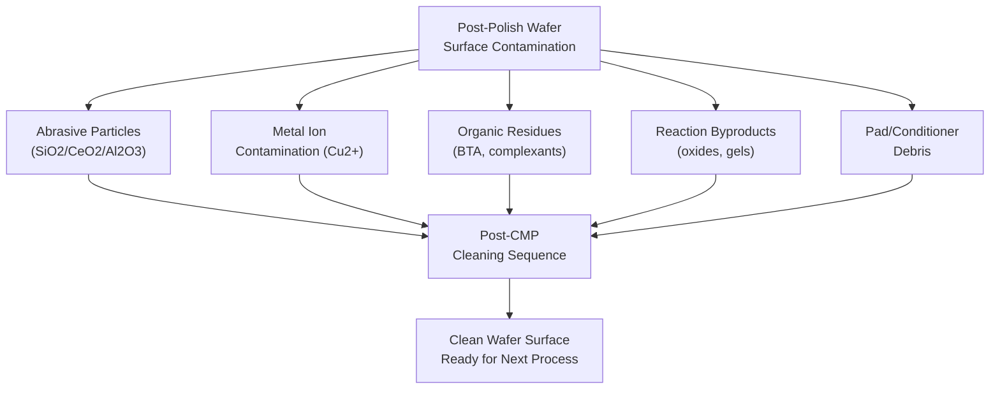
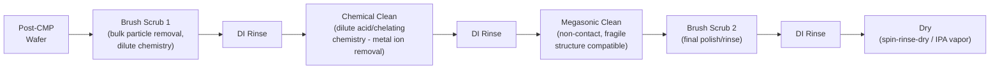

## Post CMP Cleaning

### Overview and Purpose

Post-CMP cleaning is the sequence of wet-chemical and mechanical processes performed immediately after Chemical Mechanical Planarization to remove residual slurry abrasive particles, metal ion contamination, organic residues, and reaction byproducts from the wafer surface. It is an integral, non-optional stage of the CMP process flow rather than a generic wafer clean — without it, residual slurry particles and chemical contamination would cause catastrophic defectivity, electrical shorts/leakage, and corrosion in subsequent processing.

CMP inherently deposits a high density of foreign material onto the wafer surface: abrasive nanoparticles (silica, ceria, or alumina), dissolved and precipitated metal species (particularly relevant for copper CMP), organic complexing agents and corrosion inhibitors (e.g., BTA), and pad/conditioner debris. Because CMP-generated particles are often strongly adhered to the wafer surface (through van der Waals forces, electrostatic attraction, or partial embedding), removing them requires a combination of chemical and mechanical cleaning mechanisms beyond simple rinsing.

### Contamination Categories Requiring Removal

**1. Abrasive Particles**

Silica, ceria, or alumina nanoparticles from the slurry, ranging from tens to hundreds of nanometers, adhered to the wafer surface through electrostatic and van der Waals forces. Particle adhesion strength depends on zeta potential matching between particle and surface, particle size, and any embedding that occurred during polishing.

**2. Metal Ion Contamination**

Particularly critical for copper CMP: residual $Cu^{2+}$ or other metal ions can diffuse into exposed dielectric surfaces if not promptly removed, creating latent reliability risks (increased leakage current, reduced time-dependent dielectric breakdown margin) since copper is a fast-diffusing contaminant in silicon-based dielectrics and can migrate under subsequent thermal processing.

**3. Organic Residues**

Residual complexing agents, corrosion inhibitors (BTA and its copper complexes), and surfactants from the slurry formulation that remain adsorbed on the surface after polishing.

**4. Slurry Reaction Byproducts**

Oxidized metal species, hydrated silica gel residues, and other chemical reaction products formed during the CMP process itself.

**5. Pad and Conditioner Debris**

Trace polyurethane pad wear debris and diamond conditioner grit fragments that can become embedded or loosely adhered to the wafer surface during polishing.

### Cleaning Mechanisms

**1. Mechanical Brush Scrubbing**

The primary workhorse cleaning mechanism for bulk particle removal:

- Uses **PVA (polyvinyl alcohol) brushes** — soft, porous, sponge-like rollers — that contact the wafer surface (typically both front and back side, or double-sided brush boxes) while rotating, physically dislodging loosely adhered particles.
- Brushes are typically used with dilute cleaning chemistry (DI water with pH-adjusted additives, or dilute acid/base solutions specific to the process) flowing through the brush and across the wafer during scrubbing.
- Brush pressure and rotation speed are tuned to maximize particle removal efficiency while avoiding new scratch defects from the brush itself or from any hard particles trapped within it.
- Often implemented as sequential multi-brush stations (e.g., a first brush box for bulk particle removal, a second for final polish/rinse).

**2. Megasonic Cleaning**

A non-contact cleaning technique using high-frequency acoustic energy (typically ~700 kHz–1 MHz range) transmitted through the cleaning fluid to generate acoustic streaming and microstreaming effects that dislodge particles without direct mechanical brush contact.

- Particularly valuable for **fragile low-k dielectric structures**, where brush contact pressure risks mechanical damage (delamination, cracking) that megasonic energy avoids.
- Effective at removing particles from high-aspect-ratio or recessed features where brush bristles may not achieve full physical contact.
- Cavitation effects (if present at sufficiently high acoustic intensity) must be carefully controlled, since excessive cavitation can itself damage delicate structures — process tuning balances cleaning efficacy against damage risk.

**3. Chemical Cleaning**

Dilute chemical solutions target specific residue chemistries:

- **Dilute acidic solutions** (e.g., dilute citric acid or other organic acid chemistries): commonly used post-copper CMP to dissolve residual metal oxide/hydroxide species and complex residual metal ions for rinse-away removal, while remaining compatible with exposed copper (avoiding aggressive re-etching).
- **Dilute basic/alkaline solutions**: used in some oxide CMP cleaning sequences to promote particle release via zeta-potential-driven electrostatic repulsion (raising surface charge to repel remaining negatively-charged silica particles, for example).
- **Chelating/complexing rinse chemistries**: specifically formulated to bind and remove residual metal ions, reducing the risk of metal diffusion into dielectric during subsequent thermal steps.
- Chemical selection must avoid re-depositing removed contaminants and must be compatible with all exposed materials on the wafer surface (copper, barrier metal, low-k dielectric) simultaneously, since a chemistry aggressive toward one material may damage another.

**4. DI Water Rinsing**

High-purity deionized water rinsing stages are interspersed throughout the cleaning sequence (between brush stations, after chemical clean steps, and as a final step) to remove residual cleaning chemistry and loosened particles before they can redeposit or dry onto the surface.

**5. Drying**

Final drying (commonly spin-rinse-dry, IPA vapor drying, or Marangoni drying techniques) must avoid water-mark formation and particle redeposition from drying droplets, since improperly dried wafers can show localized residue or watermark defects even after otherwise effective cleaning.

### Process-Specific Cleaning Considerations

**Copper CMP Cleaning**

Requires particular attention to:

- **Corrosion prevention**: Cleaning chemistry must avoid promoting galvanic corrosion between exposed copper and adjacent barrier metal, often requiring inclusion of corrosion inhibitors (continuing BTA-type chemistry) into the cleaning solution itself, not just the polishing slurry.
- **Metal ion removal efficiency**: Because copper is a particularly problematic fast-diffusing contaminant, copper CMP cleaning sequences are typically validated with metal contamination metrology (e.g., surface photovoltage or TXRF — total reflection X-ray fluorescence) to confirm residual copper ion levels are below specification.
- **Barrier/dielectric compatibility**: Cleaning chemistry must simultaneously be compatible with exposed copper, barrier metal (Ta/TaN), and low-k dielectric without preferentially attacking any one material.

**Oxide/STI CMP Cleaning**

Primarily focused on particle removal (silica or ceria abrasive residue) since metal ion contamination is not a primary concern for pure dielectric CMP:

- Alkaline cleaning chemistries are common, leveraging zeta-potential-driven particle repulsion for silica-based slurries.
- Ceria particle removal can be more challenging than silica due to stronger chemical adhesion mechanisms (Ce-O-Si bonding), sometimes requiring more aggressive or specifically tailored chemistries.

**Low-k Dielectric Cleaning**

Requires the gentlest overall cleaning approach due to the mechanical fragility (lower modulus, lower fracture toughness, higher porosity) of low-k and ultra-low-k films:

- Favors megasonic cleaning over aggressive brush contact where possible.
- Requires careful chemical compatibility validation, since some low-k films (particularly porous or carbon-doped oxide variants) can be susceptible to chemical attack or moisture uptake from aqueous cleaning chemistries, potentially degrading the film's dielectric constant.

### Cleaning Equipment Architecture

Post-CMP cleaning is typically integrated directly into the CMP tool platform as sequential cleaning modules the wafer passes through immediately after polishing, minimizing exposure time between polish and clean (reducing corrosion/oxidation risk for metal CMP) and maximizing throughput:

- **Brush box modules**: House PVA brush rollers with integrated chemistry delivery.
- **Megasonic modules**: Contain transducer-equipped cleaning chambers.
- **Buffer/queue time management**: Tool scheduling is designed to minimize wafer queue time between CMP and cleaning, since delayed cleaning allows contamination to dry onto the surface (increasing removal difficulty) or allows corrosion processes to initiate on exposed metal.

### Metrology and Verification

- **Particle counting (post-clean inspection)**: Optical or laser-scattering-based wafer inspection tools count residual surface particles above a specified size threshold, providing the primary pass/fail metric for cleaning effectiveness.
- **Total Reflection X-ray Fluorescence (TXRF)**: Highly sensitive surface metal contamination measurement technique used to verify residual metal ion levels (e.g., copper) are below specification after cleaning.
- **Surface Photovoltage (SPV)**: Indirect technique sensitive to near-surface metal contamination in silicon, sometimes used as a complementary metal contamination monitor.
- **Contact Angle Measurement**: Used to verify surface hydrophilicity/hydrophobicity consistency, since unexpected contact angle shifts can indicate organic residue contamination.
- **SEM/optical defect review**: Following automated particle counting, defect review classifies detected defects by type (particle, scratch, residue, watermark) to guide root-cause corrective action.

### Illustrative Schematic: Post-CMP Cleaning Module Sequence (svg_diagram)

<svg xmlns="http://www.w3.org/2000/svg" viewBox="0 0 760 260">
<text x="380" y="24" text-anchor="middle" font-size="16" font-weight="bold" fill="#222">Post-CMP Cleaning Module Sequence (svg_diagram)</text>

<circle cx="60" cy="140" r="25" fill="#5d8aa8" stroke="#333" />
<text x="60" y="180" text-anchor="middle" font-size="10" fill="#222">Post-CMP</text>
<text x="60" y="192" text-anchor="middle" font-size="10" fill="#222">Wafer</text>
<line x1="90" y1="140" x2="130" y2="140" stroke="#333" stroke-width="2" marker-end="url(#pc1)" />

<rect x="135" y="105" width="90" height="70" fill="#d5b895" stroke="#333" />
<circle cx="160" cy="140" r="12" fill="#f5f0e6" stroke="#8a6d3b" />
<circle cx="200" cy="140" r="12" fill="#f5f0e6" stroke="#8a6d3b" />
<text x="180" y="192" text-anchor="middle" font-size="9" fill="#222">Brush Scrub 1</text>
<line x1="228" y1="140" x2="268" y2="140" stroke="#333" stroke-width="2" marker-end="url(#pc1)" />

<rect x="273" y="105" width="90" height="70" fill="#a8d5ba" stroke="#333" />
<text x="318" y="145" text-anchor="middle" font-size="9" fill="#222">Chemical</text>
<text x="318" y="158" text-anchor="middle" font-size="9" fill="#222">Clean</text>
<text x="318" y="192" text-anchor="middle" font-size="9" fill="#222">(metal ion removal)</text>
<line x1="366" y1="140" x2="406" y2="140" stroke="#333" stroke-width="2" marker-end="url(#pc1)" />

<rect x="411" y="105" width="90" height="70" fill="#c9b8e0" stroke="#333" />
<path d="M 425 140 Q 435 125 445 140 T 465 140 T 485 140" stroke="#5d3a8a" stroke-width="1.5" fill="none" />
<text x="456" y="192" text-anchor="middle" font-size="9" fill="#222">Megasonic Clean</text>
<line x1="504" y1="140" x2="544" y2="140" stroke="#333" stroke-width="2" marker-end="url(#pc1)" />

<rect x="549" y="105" width="90" height="70" fill="#d5b895" stroke="#333" />
<circle cx="574" cy="140" r="12" fill="#f5f0e6" stroke="#8a6d3b" />
<circle cx="614" cy="140" r="12" fill="#f5f0e6" stroke="#8a6d3b" />
<text x="594" y="192" text-anchor="middle" font-size="9" fill="#222">Brush Scrub 2</text>
<line x1="642" y1="140" x2="682" y2="140" stroke="#333" stroke-width="2" marker-end="url(#pc1)" />

<rect x="687" y="115" width="60" height="50" fill="#f1c40f" stroke="#333" />
<text x="717" y="145" text-anchor="middle" font-size="9" fill="#222">Dry</text>
</svg>

### Common Post-Clean Defect Modes

- **Residual particle defects**: Incomplete particle removal, often traced to insufficient brush pressure, degraded/contaminated brush condition, or inadequate megasonic energy for the specific particle-surface adhesion strength.
- **Watermarks**: Drying-related residue patterns from incomplete rinse or improper drying sequence, particularly on hydrophilic surfaces where water droplets evaporate non-uniformly.
- **Re-deposited particles**: Particles removed from one area of the wafer redepositing elsewhere due to inadequate rinse flow or fluid dynamics within the cleaning module.
- **Residual metal contamination**: Insufficient chemical clean time/concentration leaving metal ion levels above specification, risking downstream diffusion-related reliability issues.
- **Brush-induced scratching**: Contamination or hardening of PVA brush material (from accumulated slurry residue) can itself become a scratch source if brush maintenance/replacement schedules are inadequate.
- **Low-k film damage**: Excessive mechanical or chemical aggressiveness in cleaning fragile low-k structures, manifesting as delamination, increased dielectric constant (from moisture uptake or chemical modification), or physical damage.

### Process Control Strategy

- **Brush conditioning and replacement schedules**: PVA brushes degrade over cumulative wafer count/usage time and require periodic conditioning or replacement to maintain consistent cleaning performance and avoid becoming a contamination source themselves.
- **Chemistry concentration and dwell time monitoring**: Cleaning chemistry effectiveness depends on maintaining specified concentration and sufficient contact/dwell time; drift in either parameter directly affects particle and metal-ion removal efficiency.
- **Inline particle count trending**: Continuous monitoring of post-clean particle counts (via inline or lot-sampled inspection) provides early warning of cleaning module performance drift before it translates into yield-impacting defect excursions.
- **Queue time control**: Time between polish completion and clean initiation, and between clean completion and subsequent processing, is typically specified and monitored, since extended queue time increases both contamination fixation risk and (for exposed copper) oxidation/corrosion risk.

**[Inference]** Specific cleaning chemistry formulations, brush material specifications, and megasonic frequency/power settings are generally proprietary to tool and consumable suppliers and tuned per fab process; the general mechanisms and trade-offs described here represent standard industry practice rather than a single universal recipe.

**Next Steps**

- Copper CMP integration: bulk, barrier, and buff step chemistry
- Low-k dielectric mechanical fragility and cleaning compatibility
- Slurry chemistry and pad conditioning fundamentals
- Wafer contamination metrology: TXRF, SPV, and particle inspection systems
- Dishing, erosion, and CMP-induced defect control
- Time-dependent dielectric breakdown (TDDB) and metal contamination reliability effects