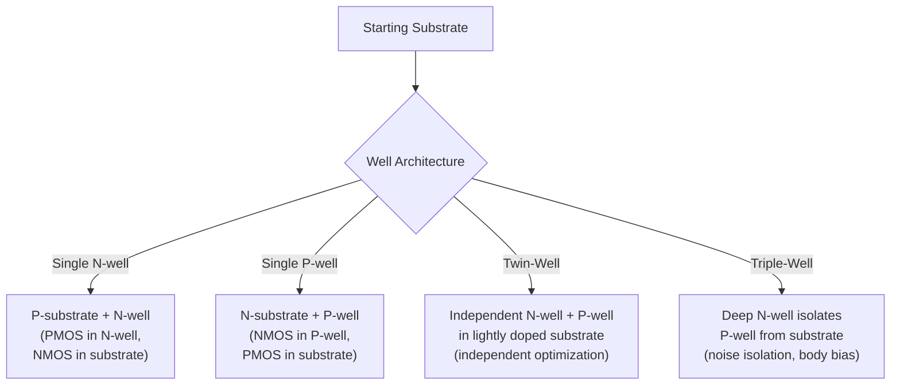
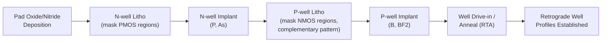
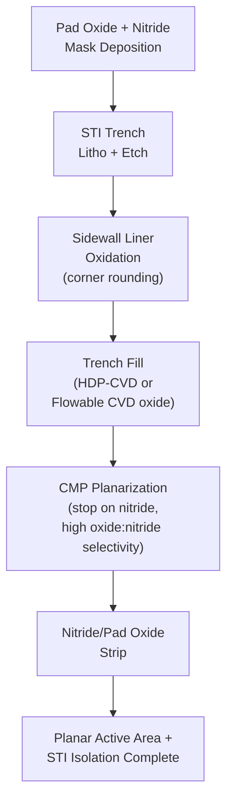

## Well Formation and Isolation Schemes

### Overview

Well formation and isolation schemes are foundational front-end-of-line (FEOL) process modules in CMOS fabrication that establish the electrical framework enabling complementary NMOS and PMOS transistors to coexist on a single substrate without unwanted current leakage or parasitic device interaction. Wells create locally doped regions of controlled polarity and concentration in which transistors of the opposite type are built, while isolation structures physically and electrically separate individual devices to prevent leakage, latch-up, and cross-talk.

These two process modules are implemented early in the CMOS integration flow, before gate formation, and together define the substrate-level electrical topology upon which all subsequent transistor and interconnect processing is built.

### Why Wells Are Necessary: CMOS Complementary Requirement

CMOS technology requires both NMOS transistors (built in p-type material) and PMOS transistors (built in n-type material) on the same chip. Since a starting wafer substrate has a single, uniform background doping type, **wells** — locally counter-doped regions — must be formed to create the opposite-polarity material needed for one of the two transistor types:

- **N-well**: A region doped n-type (typically via phosphorus or arsenic implantation) within a p-type substrate, used to host PMOS transistors.
- **P-well**: A region doped p-type (typically via boron implantation) within an n-type substrate or within an n-well-dominant process, used to host NMOS transistors.

### Well Architecture Types

**1. N-well Process (single well)**

The simplest architecture: a p-type substrate hosts NMOS transistors directly, while n-wells are selectively implanted to host PMOS transistors. Historically common in older, less dense CMOS processes.

**2. P-well Process (single well)**

The inverse: an n-type substrate hosts PMOS transistors directly, while p-wells are selectively implanted to host NMOS transistors. Less common in modern logic processes but used in specific applications.

**3. Twin-Well Process**

Both n-wells and p-wells are independently implanted into a lightly doped (or intrinsic-like) starting substrate or epitaxial layer. This architecture allows **independent optimization** of both well doping profiles (concentration, depth, retrograde profile) rather than being constrained by the single fixed background substrate doping, which is essential for controlling threshold voltage, latch-up immunity, and short-channel effects independently for NMOS and PMOS devices. Twin-well is the dominant architecture in modern sub-micron and deep-submicron CMOS logic processes.

**4. Triple-Well Process**

Adds a **deep n-well** beneath a standard p-well, electrically isolating that p-well (and the NMOS devices within it) from the underlying p-type substrate. This isolated p-well can be biased independently of the substrate, which is used for:

- Noise isolation of sensitive analog/RF circuits from digital switching noise propagating through the substrate
- Body-biasing schemes for threshold voltage control or power management (e.g., forward/reverse body bias techniques)
- Improved latch-up immunity in specific circuit contexts, since the deep n-well interrupts the parasitic bipolar current path partially responsible for latch-up

### Well Formation Process Sequence

**1. Pad Oxide and Nitride Deposition**

A thin pad oxide (stress buffer) and silicon nitride masking layer are deposited/grown on the substrate, forming the implant mask stack.

**2. Well Photolithography**

Photoresist is patterned to expose regions where one well type (e.g., n-well) will be formed, protecting regions intended for the other well type.

**3. Well Implantation**

High-energy ion implantation introduces dopants to the target depth and concentration profile:

- **N-well**: Phosphorus (lighter, deeper implant range at a given energy) or arsenic implantation
- **P-well**: Boron implantation, often as $BF_2$ molecular ions for improved implant control at shallow-to-moderate depths

Modern processes frequently use **retrograde well profiles** — created via multiple implant energies/doses — where doping concentration is lower near the surface (reducing junction capacitance and improving short-channel control) and higher at depth (providing effective latch-up-suppressing low-resistance current paths and punch-through/isolation benefit beneath the channel region).

**4. Well Drive-in / Anneal**

A high-temperature thermal anneal activates implanted dopants (moving them onto substitutional lattice sites) and repairs implant-induced lattice damage, while also causing some dopant diffusion that shapes the final well profile. Rapid thermal annealing (RTA) is commonly used in modern processes to minimize unwanted dopant diffusion/spreading (thermal budget control) compared to older furnace-based long-duration anneals.

**5. Second Well Implant (Complementary Mask)**

The photoresist/mask pattern is reversed (or a self-aligned complementary mask approach is used) to implant the opposite well type into the remaining regions, followed by its own anneal/drive-in (which may be combined into a shared final anneal step for both wells in modern flows to minimize total thermal budget).

### Well Doping Profile Considerations

- **Retrograde doping**: As described above, low surface concentration with a buried high-concentration peak — this profile simultaneously supports low channel doping (better short-channel control, lower junction capacitance) and strong latch-up suppression (low-resistance vertical current path to substrate/well contacts).
- **Threshold voltage tuning**: A separate, typically lower-energy/lower-dose implant (the **Vt-adjust implant**) is performed near the surface after well formation to independently tune the channel doping concentration that directly sets transistor threshold voltage, decoupled from the deeper well profile.
- **Punch-through suppression implant**: An intermediate-depth implant sometimes added beneath the channel to suppress sub-surface punch-through leakage paths, particularly relevant as channel lengths scale down.

### Isolation Schemes: Purpose

Isolation structures physically and electrically separate adjacent transistors (and wells) to prevent:

- **Parasitic leakage/inversion**: Unwanted conduction paths between adjacent devices through the field region if the field region itself can be inverted by nearby gate/interconnect potentials (historically a major concern with early isolation schemes).
- **Latch-up**: A parasitic PNPN thyristor structure inherent to bulk CMOS (formed by adjacent NMOS/PMOS/well/substrate regions) that can trigger a low-impedance, high-current latching state if triggered by noise, ESD events, or transient currents; proper isolation and well contact strategy (guard rings, well-tap density) is a primary latch-up mitigation.
- **Cross-talk and substrate noise coupling**: Especially relevant in mixed-signal designs, where digital switching noise can couple through the substrate into sensitive analog circuits if isolation is inadequate.

### Isolation Technology Evolution: LOCOS to STI

**LOCOS (Local Oxidation of Silicon)** — Legacy Technology

An older isolation technique in which a silicon nitride mask protects active device areas while exposed field regions undergo thermal oxidation, growing a thick field oxide selectively in isolation regions.

- **Bird's beak effect**: A characteristic limitation of LOCOS — oxidant diffuses laterally beneath the nitride mask edge during oxidation, causing the field oxide to encroach into the intended active area with a tapering, beak-like oxide profile. This encroachment consumes usable active area and limits achievable pitch scaling, becoming a primary reason LOCOS was replaced for sub-micron and deep-submicron nodes.
- LOCOS is generally considered obsolete for modern advanced logic processes but remains conceptually important as the historical predecessor to STI and is occasionally still referenced or used in specific legacy/analog process contexts.

**STI (Shallow Trench Isolation)** — Modern Standard

The dominant isolation technology for essentially all modern CMOS processes from the sub-micron era onward:

1. **Trench Etch**: A pad oxide/nitride mask stack (similar in concept to LOCOS masking) defines the isolation pattern, and a plasma etch forms shallow trenches (typically a few hundred nanometers deep) into the silicon substrate in the field regions.
2. **Liner Oxidation**: A thin thermal oxide liner is grown on the trench sidewalls and bottom to passivate etch damage and round trench corners (corner rounding is important to avoid electric field concentration and parasitic leakage/threshold voltage anomalies at sharp trench corners).
3. **Trench Fill**: A dielectric gap-fill material — typically high-density plasma (HDP) CVD oxide or, in more advanced processes, flowable CVD (FCVD) oxide for superior gap-fill in high-aspect-ratio trenches — fills the trench completely, overfilling above the original surface.
4. **CMP Planarization**: Chemical Mechanical Planarization removes the oxide overburden, stopping on the nitride hard mask (leveraging high oxide:nitride selectivity, often via ceria-based slurry) to planarize the trench fill flush with the active area surface.
5. **Nitride/Pad Oxide Strip**: The masking nitride and underlying pad oxide are removed (wet etch), exposing the final active silicon surface with STI oxide filling the isolation regions at a controlled, near-planar height relative to the active area.

STI eliminates the bird's beak encroachment problem, provides much better active-area pitch scaling, and produces a more planar overall topography beneficial for subsequent lithography — making it essential for enabling continued CMOS scaling.

### STI-Related Defect and Integration Considerations

- **Trench corner effects**: Insufficiently rounded trench corners create localized electric field concentration and can cause parasitic sub-threshold leakage or double-hump threshold voltage characteristics in transistors whose gate crosses near the STI edge; sidewall liner oxidation and etch process tuning specifically address this.
- **STI-induced stress**: The trench fill dielectric can impart mechanical stress on adjacent active silicon regions, affecting carrier mobility (stress engineering is sometimes deliberately leveraged, though STI-induced stress is more commonly an effect to be controlled/compensated for standard transistor performance consistency).
- **Trench fill voiding**: Inadequate gap-fill in high-aspect-ratio trenches can leave voids that later cause defects (e.g., slurry/chemical penetration during subsequent CMP or cleaning, or electrical leakage paths); this drove adoption of flowable CVD oxide as aspect ratios increased with scaling.
- **STI CMP selectivity and erosion**: As covered in dedicated CMP process modules, STI CMP requires very high oxide:nitride selectivity to achieve a uniform, controlled active-area step height across pattern-density variations, since insufficient selectivity produces nitride erosion and inconsistent active-area recess.

### Guard Rings and Latch-Up Mitigation

Beyond well and trench isolation structures themselves, additional layout and process features mitigate the parasitic PNPN latch-up structure inherent to bulk CMOS:

- **Guard rings**: Heavily doped substrate/well contact rings placed around sensitive circuits or at regular intervals across a design, providing low-resistance paths to collect injected minority carriers before they can trigger the parasitic bipolar structure.
- **Well/substrate tap density**: Frequent, well-distributed substrate and well contacts (taps) reduce the effective resistance of the parasitic bipolar base regions, directly raising the latch-up triggering current threshold.
- **Triple-well isolation**: As described above, deep n-well structures can interrupt the parasitic current path for specific sensitive circuit blocks, providing an additional latch-up mitigation layer beyond guard rings/tap density alone.

**[Inference]** Specific guard ring spacing rules, well-tap density requirements, and triple-well usage criteria are defined in each foundry's design rule manual and are process-node-specific rather than universally standardized, since they depend on the particular well doping profiles, substrate resistivity, and target latch-up immunity specification of a given process.

### Illustrative Schematic: Twin-Well with STI Isolation Cross-Section (svg_diagram)

<svg xmlns="http://www.w3.org/2000/svg" viewBox="0 0 760 300">
<text x="380" y="24" text-anchor="middle" font-size="16" font-weight="bold" fill="#222">Twin-Well CMOS with STI Isolation (svg_diagram)</text>

<rect x="60" y="220" width="640" height="50" fill="#b0a99f" stroke="#333" />
<text x="380" y="250" text-anchor="middle" font-size="11" fill="#222">Lightly Doped P-type Substrate</text>

<rect x="100" y="150" width="220" height="70" fill="#a8c5e0" stroke="#333" />
<text x="210" y="190" text-anchor="middle" font-size="11" fill="#222">N-well (PMOS region)</text>

<rect x="440" y="150" width="220" height="70" fill="#e0c5a8" stroke="#333" />
<text x="550" y="190" text-anchor="middle" font-size="11" fill="#222">P-well (NMOS region)</text>

<rect x="320" y="130" width="120" height="20" fill="#f0f0f0" stroke="#333" />
<text x="380" y="115" text-anchor="middle" font-size="9" fill="#222">STI (oxide fill)</text>

<rect x="60" y="130" width="40" height="20" fill="#f0f0f0" stroke="#333" />
<rect x="660" y="130" width="40" height="20" fill="#f0f0f0" stroke="#333" />

<rect x="140" y="120" width="140" height="10" fill="#7a9bc4" stroke="#333" />
<text x="210" y="105" text-anchor="middle" font-size="9" fill="#222">PMOS active area</text>

<rect x="480" y="120" width="140" height="10" fill="#c49b7a" stroke="#333" />
<text x="550" y="105" text-anchor="middle" font-size="9" fill="#222">NMOS active area</text>

<rect x="105" y="130" width="20" height="20" fill="#4a4a4a" stroke="#333" />
<text x="115" y="150" text-anchor="middle" font-size="7" fill="#fff" />
<rect x="635" y="130" width="20" height="20" fill="#4a4a4a" stroke="#333" />
</svg>

### Process Flow Position in Overall CMOS Integration

Well formation and isolation occur near the very beginning of the FEOL process flow:

1. Starting substrate/epitaxial preparation
2. **STI formation** (trench etch, liner, fill, CMP, strip)
3. **Well formation** (implant, anneal) — well implants are typically performed after STI formation in modern flows, since STI trenches are patterned directly into the initial substrate before well doping is introduced, though specific ordering can vary by process
4. Threshold voltage adjustment implants
5. Gate stack formation (gate oxide/high-k dielectric, gate electrode)
6. Source/drain extension and halo implants
7. Spacer formation
8. Source/drain implant and anneal
9. Silicidation and contact formation

**[Inference]** The precise ordering of STI formation relative to well implantation, and the number/sequence of distinct implant steps, varies across specific foundry process flows and technology nodes; the sequence outlined here represents a commonly used, representative flow rather than a universally fixed ordering.

**Next Steps**

- Shallow Trench Isolation (STI) CMP integration and ceria-based selectivity
- Ion implantation fundamentals: energy, dose, and profile control
- Latch-up mechanisms and guard ring design rules
- Threshold voltage adjustment implants and channel engineering
- Rapid Thermal Annealing (RTA) and thermal budget management
- Gate stack formation and high-k/metal-gate integration
- Substrate engineering: epitaxial layers and SOI (Silicon-on-Insulator) alternatives