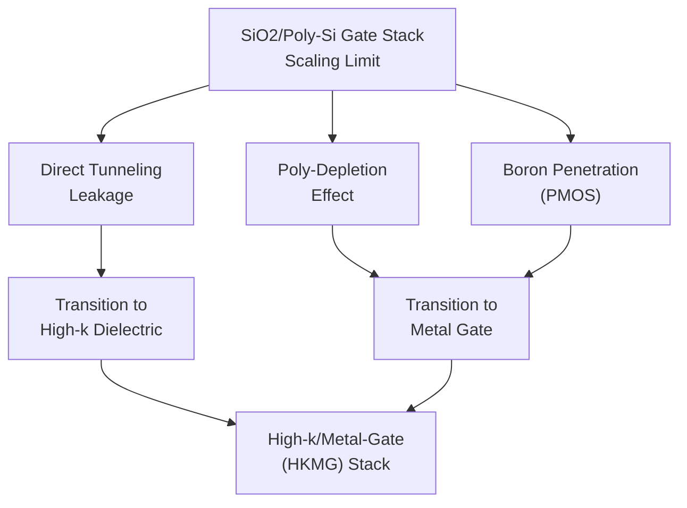
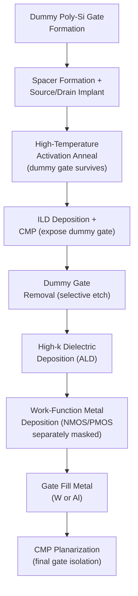

## Gate Stack Formation Sequence

### Overview

Gate stack formation is the sequence of process steps that constructs the MOSFET gate dielectric and gate electrode — the structure directly controlling channel conduction via the applied gate voltage. This module sits at the heart of the CMOS FEOL flow, positioned after well formation and STI isolation but before source/drain formation, and its materials and dimensional control directly determine transistor switching speed, leakage current, and reliability. The gate stack has undergone the most significant material transformation of any CMOS process module over the past two decades, evolving from simple thermally grown $SiO_2$ with polysilicon electrodes to high-k dielectrics with metal electrodes, integrated through fundamentally different process sequences (gate-first versus gate-last).

### Legacy Gate Stack: Poly-Si/SiO₂

**Gate Oxide Growth**

Historically, and still used at older/less aggressive technology nodes, the gate dielectric is thermally grown silicon dioxide ($SiO_2$), formed by oxidizing the exposed silicon channel surface in a controlled furnace or rapid thermal oxidation (RTO) ambient (dry $O_2$ or wet steam oxidation). Thermal oxidation is self-limiting in thickness uniformity and produces a high-quality, low-defect-density $Si/SiO_2$ interface, which is critical for channel mobility and threshold voltage stability.

$$Si + O_2 \rightarrow SiO_2$$

As gate lengths scaled below approximately 100 nm, gate oxide thickness had to scale correspondingly (to maintain adequate gate capacitive coupling to the channel), eventually reaching thicknesses of only a few atomic layers (~1.2 nm at the 90–65 nm nodes). At these thicknesses, **direct quantum-mechanical tunneling current** through the oxide becomes significant, causing unacceptable gate leakage power and motivating the transition to high-k dielectrics.

**Polysilicon Gate Deposition**

Following gate dielectric formation, a blanket layer of polycrystalline silicon (polysilicon) is deposited via low-pressure CVD (LPCVD), typically using silane ($SiH_4$) decomposition:

$$SiH_4 \rightarrow Si_{(poly)} + 2H_2$$

Polysilicon is subsequently doped (either in-situ during deposition or via ion implantation after gate patterning) to achieve the low resistivity needed for gate electrode conductivity, with NMOS and PMOS gates often doped oppositely (n+ poly for NMOS, p+ poly for PMOS) to achieve appropriate work function/threshold voltage in a dual-poly-gate scheme.

**Gate Patterning**

Photolithography defines the gate length dimension (historically the most critical dimension in the entire process, driving the tightest CD control requirements), followed by anisotropic plasma etch of the polysilicon (typically HBr/Cl₂-based chemistry) selective to the underlying gate oxide, stopping precisely at the thin oxide layer.

### The High-k/Metal-Gate Transition: Motivation

Continued gate oxide scaling using $SiO_2$ became untenable due to:

- **Gate leakage current**: Direct tunneling through sub-2nm $SiO_2$ increases exponentially with decreasing thickness, causing unacceptable static power consumption.
- **Poly-depletion effect**: At high gate bias, a thin depletion region forms within the polysilicon gate itself near the gate dielectric interface, effectively adding series capacitance and reducing the gate's ability to fully control the channel — a parasitic effect that becomes proportionally more significant as gate dielectric thickness shrinks.
- **Boron penetration**: In PMOS devices with p+ polysilicon gates, boron dopant can diffuse through thin gate oxide into the channel during thermal processing, causing threshold voltage instability.

**High-k dielectrics** (most commonly hafnium-based, e.g., $HfO_2$ or hafnium silicate $HfSiO_x$) solve the tunneling leakage problem by providing the same gate capacitance (and thus channel control) as a very thin $SiO_2$ layer, but using a **physically thicker** film, since capacitance scales with dielectric constant:

$$C_{ox} = \frac{\kappa \varepsilon_0}{t_{ox}}$$

A high-k material with $\kappa$ several times that of $SiO_2$ ($\kappa \approx 3.9$) can achieve equivalent capacitance at several times the physical thickness, dramatically reducing direct tunneling current while maintaining or improving gate control — quantified via the **Equivalent Oxide Thickness (EOT)**:

$$EOT = t_{high-k} \times \frac{\kappa_{SiO_2}}{\kappa_{high-k}}$$

However, high-k dielectrics are generally incompatible with polysilicon gates due to Fermi-level pinning effects and poly-depletion remaining problematic, motivating the paired transition to **metal gate electrodes**, which eliminate poly-depletion entirely (metals have no depletion region) and, through appropriate metal selection/engineering, provide the correct work function for NMOS and PMOS threshold voltage targeting.

### High-k/Metal-Gate Integration: Two Process Approaches

**1. Gate-First Integration**

The high-k dielectric and metal gate electrode are deposited and patterned early in the flow, analogous in sequence position to the legacy poly-Si gate flow — the metal gate stack is formed, then source/drain implants and high-temperature anneals are performed *after* the gate stack already exists.

- **Challenge**: High-temperature source/drain activation anneals (required for dopant activation) occur after the metal gate is already in place, and many candidate metal gate materials cannot survive these thermal budgets without work function shift, interfacial reaction, or degradation.
- Gate-first was used in some early high-k/metal-gate implementations but proved difficult to extend to more aggressive nodes due to this thermal stability constraint, particularly for PMOS work function metals.

**2. Gate-Last (Replacement Metal Gate, RMG) Integration**

The dominant approach at advanced nodes: a **sacrificial dummy polysilicon gate** is formed and carried through the entire high-temperature source/drain formation and activation anneal sequence (exactly as in the legacy flow), and only *after* all high-temperature processing is complete is the dummy gate removed and replaced with the final high-k dielectric and metal gate stack.

Gate-last/RMG process sequence:

1. Form dummy gate (polysilicon) over a thin interfacial/sacrificial oxide, using the legacy-style patterning flow
2. Complete spacer formation, source/drain implant, and high-temperature activation anneal (dummy gate protects the channel region during these steps, and its thermal stability is not a concern since it will be removed)
3. Deposit interlayer dielectric (ILD) and planarize via CMP, exposing the top of the dummy polysilicon gate
4. **Selectively remove the dummy polysilicon gate** (wet or dry etch selective to the surrounding ILD and to the underlying sacrificial oxide), opening a gate trench
5. Deposit the **high-k dielectric** (via ALD, for excellent conformality and thickness control) into the gate trench, typically preceded by a thin interfacial $SiO_2$ or $SiON$ layer to maintain high channel mobility and interface quality
6. Deposit **work-function metal(s)**: distinct metal layers/stacks are deposited for NMOS and PMOS regions (masked separately) to achieve the correct work function for each transistor type's threshold voltage target
7. Deposit a **gate fill metal** (typically tungsten or aluminum) to fill the remaining trench volume and provide low-resistance bulk gate conductivity
8. **CMP planarization** removes excess metal overburden, isolating individual gate electrodes and completing the replacement gate module

### Work Function Engineering

Achieving correct threshold voltage for both NMOS and PMOS in a metal-gate scheme requires depositing **different work-function metals** in each transistor's gate stack, since a single metal's work function cannot simultaneously provide low threshold voltage for both device types:

- **NMOS work-function metals**: Typically near the silicon conduction band edge (e.g., titanium-aluminum-based compounds, such as $TiAlN$ or $TiAl$ alloys), providing an effective work function suited to n-channel threshold voltage targets.
- **PMOS work-function metals**: Typically near the silicon valence band edge (e.g., titanium nitride $TiN$ or tantalum nitride $TaN$-based layers), providing an effective work function suited to p-channel threshold voltage targets.

This requires **separate masking and deposition steps** for NMOS and PMOS regions within the replacement gate module — one region is masked while the other's work-function metal is deposited, then the mask is stripped and the sequence reversed for the opposite region — adding process complexity relative to a single-material gate approach but essential for independent threshold voltage control.

**[Inference]** Specific work-function metal compositions, thicknesses, and deposition sequences are proprietary to individual foundries/technology nodes and are continuously refined; the general categories and roles described here (near-conduction-band metals for NMOS, near-valence-band metals for PMOS) reflect established industry practice rather than a single fixed recipe.

### High-k Dielectric Deposition: Atomic Layer Deposition

High-k gate dielectrics are almost universally deposited via **Atomic Layer Deposition (ALD)** rather than CVD or thermal growth, because ALD's self-limiting, sequential surface-reaction mechanism provides:

- Precise, sub-angstrom thickness control essential for EOT targeting
- Excellent conformality, critical as gate structures move toward 3D architectures (FinFET fins, gate-all-around nanosheets) where the gate stack must conformally wrap non-planar channel surfaces
- Low defect density and good interface quality when combined with an appropriate interfacial layer

A typical $HfO_2$ ALD process uses alternating pulses of a hafnium precursor (e.g., $HfCl_4$ or a metal-organic hafnium precursor such as TDMAH — tetrakis(dimethylamido)hafnium) and an oxidant (e.g., $H_2O$ or $O_3$), each self-limited to a fraction of a monolayer per cycle, analogous in mechanism to the general ALD principle underlying atomic layer etching's deposition counterpart.

### Interfacial Layer Role

Directly depositing high-k dielectric onto silicon typically produces poor interface quality (high defect density, degraded channel mobility) due to lattice mismatch and bonding characteristics between the high-k oxide and silicon. A thin **interfacial layer** — typically $SiO_2$ or silicon oxynitride ($SiON$), only a few angstroms thick — is grown or deposited before the high-k layer to:

- Provide a high-quality, low-defect-density interface with the silicon channel, preserving carrier mobility
- Act as a diffusion barrier reducing metal/oxygen interdiffusion between the high-k layer and channel

This interfacial layer contributes its own (low-k) capacitance in series with the high-k layer, so its thickness must be carefully minimized and controlled as part of overall EOT budget management.

### Gate Stack Process Flow for FinFET/GAA Architectures

As transistor architecture moved from planar to 3D (FinFET, then gate-all-around nanosheets), the gate-last/RMG sequence adapted to conformally coat non-planar channel geometries:

- **FinFET**: The gate wraps three sides of a vertical silicon fin; ALD-deposited high-k and metal layers must conformally coat the fin sidewalls and top with tight thickness uniformity, since non-uniform coverage directly causes threshold voltage variation between the top and sidewall portions of the same transistor.
- **Gate-All-Around (GAA) Nanosheet**: The gate stack must conformally wrap the *entire* perimeter of stacked horizontal nanosheet channels, including the narrow inter-sheet gaps, placing even greater demands on ALD conformality and precise work-function metal thickness control within confined geometries — this became a primary driver for continued advancement in ALD-based work-function metal deposition techniques as the industry transitioned from FinFET to GAA nodes.

**[Inference]** As channel architectures continue evolving (e.g., toward more complex stacked or forksheet configurations), gate stack deposition techniques are likely to require continued refinement in ALD process control and potentially new work-function metal chemistries to maintain adequate conformality and threshold voltage uniformity in increasingly confined 3D geometries, though the specific solutions adopted industry-wide remain an active area of development.

### Illustrative Schematic: Gate-Last (RMG) Sequence Cross-Section (svg_diagram)

<svg xmlns="http://www.w3.org/2000/svg" viewBox="0 0 760 320">
<text x="380" y="24" text-anchor="middle" font-size="16" font-weight="bold" fill="#222">Replacement Metal Gate Sequence (svg_diagram)</text>

<text x="130" y="55" text-anchor="middle" font-size="11" font-weight="bold" fill="#222">1. Dummy Gate + S/D</text>

<rect x="60" y="150" width="140" height="20" fill="`#b0a99f`" stroke="#333" />

<rect x="110" y="100" width="40" height="50" fill="#999" stroke="#333" />

<rect x="95" y="130" width="15" height="20" fill="#555" stroke="#333" />

<rect x="150" y="130" width="15" height="20" fill="#555" stroke="#333" />

<rect x="70" y="90" width="120" height="14" fill="`#e0e0c0`" stroke="#333" />

<text x="130" y="200" text-anchor="middle" font-size="8" fill="#555">Dummy poly + spacers</text>

<text x="130" y="212" text-anchor="middle" font-size="8" fill="#555">survives high-temp anneal</text>

<line x1="215" y1="145" x2="255" y2="145" stroke="#333" stroke-width="2" marker-end="url(#g1)" />

<text x="330" y="55" text-anchor="middle" font-size="11" font-weight="bold" fill="#222">2. ILD + CMP</text>

<rect x="260" y="150" width="140" height="20" fill="`#b0a99f`" stroke="#333" />

<rect x="260" y="100" width="140" height="50" fill="`#d0d0d0`" stroke="#333" />

<rect x="310" y="100" width="40" height="50" fill="#999" stroke="#333" />

<text x="330" y="200" text-anchor="middle" font-size="8" fill="#555">ILD planarized,</text>

<text x="330" y="212" text-anchor="middle" font-size="8" fill="#555">dummy gate exposed</text>

<line x1="415" y1="145" x2="455" y2="145" stroke="#333" stroke-width="2" marker-end="url(#g1)" />

<text x="530" y="55" text-anchor="middle" font-size="11" font-weight="bold" fill="#222">3. Gate Removal</text>

<rect x="460" y="150" width="140" height="20" fill="`#b0a99f`" stroke="#333" />

<rect x="460" y="100" width="140" height="50" fill="`#d0d0d0`" stroke="#333" />

<rect x="510" y="100" width="40" height="50" fill="#fff" stroke="#333" stroke-dasharray="3,2" />

<text x="530" y="200" text-anchor="middle" font-size="8" fill="#555">Trench open,</text>

<text x="530" y="212" text-anchor="middle" font-size="8" fill="#555">ready for HKMG fill</text>

<line x1="615" y1="145" x2="655" y2="145" stroke="#333" stroke-width="2" marker-end="url(#g1)" />

<text x="700" y="55" text-anchor="middle" font-size="11" font-weight="bold" fill="#222">4. HKMG Fill</text>

<rect x="660" y="150" width="90" height="20" fill="`#b0a99f`" stroke="#333" />

<rect x="660" y="100" width="90" height="50" fill="`#d0d0d0`" stroke="#333" />

<rect x="695" y="100" width="20" height="50" fill="`#f4a261`" stroke="#333" />

<rect x="692" y="100" width="3" height="50" fill="`#264653`" />

<rect x="712" y="100" width="3" height="50" fill="`#264653`" />

<text x="705" y="200" text-anchor="middle" font-size="8" fill="#555">High-k + WF metal</text>

<text x="705" y="212" text-anchor="middle" font-size="8" fill="#555">+ fill metal, CMP'd</text>

</svg>

### Key Metrology and Characterization

- **Equivalent Oxide Thickness (EOT)**: Extracted from capacitance-voltage (C-V) measurements on gate capacitor test structures, the primary electrical metric for gate stack capacitive scaling verification.
- **Gate leakage current density ($J_g$)**: Measured via current-voltage (I-V) characterization, directly verifying the leakage reduction benefit of the high-k/metal-gate transition.
- **Threshold voltage ($V_t$) extraction**: From transistor I-V characteristics, verifying work-function metal engineering achieved the intended NMOS/PMOS threshold targets.
- **Transmission Electron Microscopy (TEM)**: Cross-sectional imaging to directly verify gate stack layer thicknesses, interfacial layer quality, and conformality on 3D structures (FinFET/GAA).
- **X-ray Photoelectron Spectroscopy (XPS)**: Compositional and chemical bonding state analysis of high-k and interfacial layers, used to verify stoichiometry and detect unwanted interfacial reactions.

### Common Gate Stack Integration Challenges

- **Fermi-level pinning**: Interaction between high-k dielectric and metal gate can pin the effective work function away from the intended value, requiring careful interface engineering (e.g., dipole-inducing capping layers) to achieve target threshold voltages.
- **Threshold voltage variability**: In advanced 3D architectures (FinFET, GAA), work-function metal thickness variation across confined geometries directly translates to threshold voltage variability between transistors, a significant yield and design-margin concern.
- **Dummy gate removal selectivity**: The wet/dry etch removing the sacrificial polysilicon dummy gate must be highly selective to the surrounding ILD and underlying sacrificial oxide to avoid damaging adjacent structures.
- **Void-free metal gate fill**: As gate trench aspect ratios increase (especially in scaled FinFET/GAA nodes with narrow gate pitches), achieving void-free fill metal deposition becomes increasingly challenging, requiring advanced deposition techniques (e.g., specialized CVD or ALD-based fill metal processes).

**Next Steps**

- High-k dielectric ALD process design ($HfO_2$, interfacial layer engineering)
- Work-function metal engineering and threshold voltage tuning
- FinFET and Gate-All-Around (GAA) transistor architecture
- Replacement Metal Gate (RMG) CMP integration
- Source/drain formation, spacer engineering, and activation annealing
- Fermi-level pinning mechanisms in high-k/metal-gate interfaces
- Gate stack reliability: bias temperature instability (BTI) and time-dependent dielectric breakdown