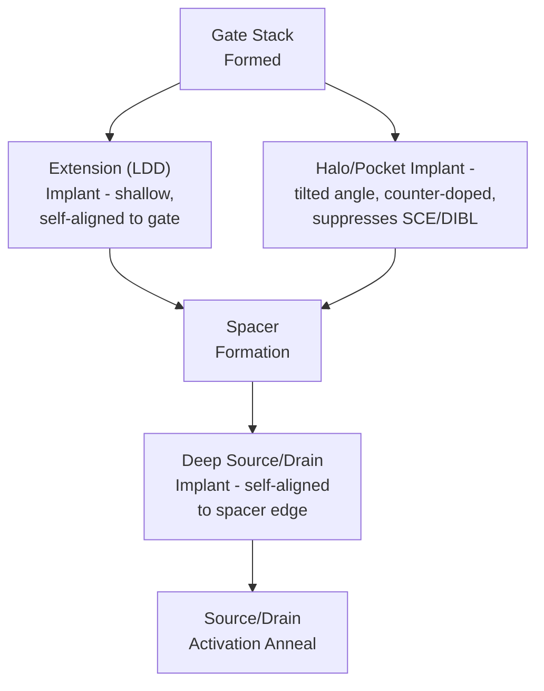
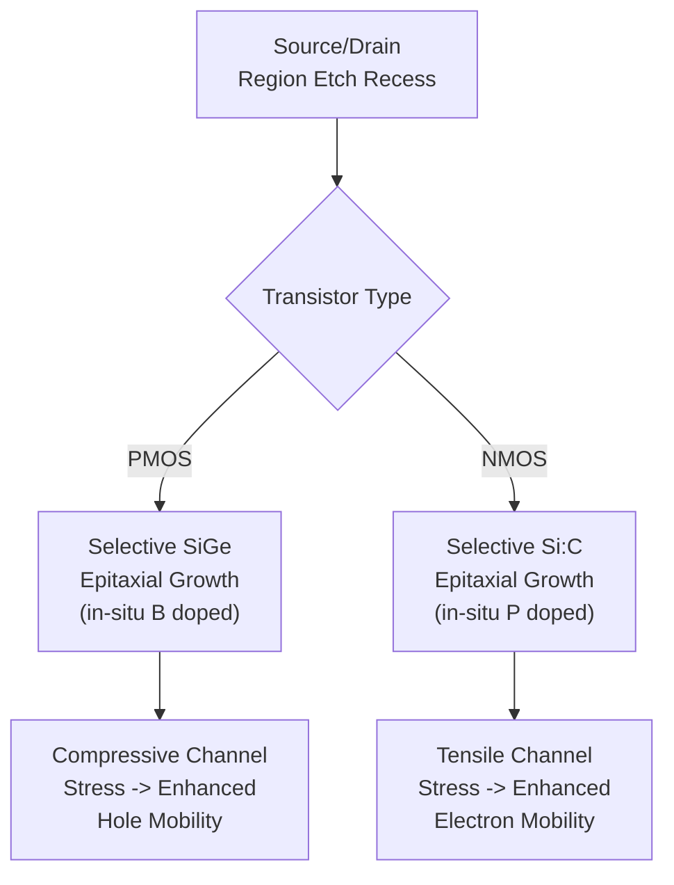

## Source and Drain Engineering

### Overview

Source and drain engineering encompasses the sequence of implantation, thermal, and materials-integration steps that form the transistor's source and drain terminals — the regions through which current enters and exits the channel. This module is executed after gate stack formation and spacer definition, and its design directly determines short-channel effect control, series resistance, junction leakage, and ultimately transistor drive current and power efficiency. As CMOS scaling progressed, source/drain engineering evolved from simple single-implant junctions into a multi-step, precisely graded architecture combining shallow extensions, halo implants, deep contact implants, and selective epitaxial stressor films.

### Why Simple Junctions Are Insufficient at Scaled Dimensions

A naive source/drain formed by a single deep implant creates several problems as gate length shrinks:

- **Short-channel effects (SCE)**: Deep source/drain junctions extend their depletion regions further into the channel, allowing the drain field to more strongly influence the channel potential (drain-induced barrier lowering, or DIBL), degrading gate control over the channel and causing threshold voltage roll-off at short gate lengths.
- **Series resistance vs. junction depth trade-off**: Shallower junctions improve SCE control but increase source/drain series resistance (since a thinner conducting path has higher resistance), directly reducing drive current.
- **Overlap capacitance**: Excessive lateral diffusion of source/drain dopant under the gate edge increases parasitic gate-to-source/drain overlap capacitance, degrading switching speed.

Modern source/drain engineering resolves these competing constraints through a graded, multi-implant architecture rather than a single uniform junction.

### Source/Drain Extension (Lightly Doped Drain, LDD) Implant

The **extension implant** (historically called Lightly Doped Drain, LDD) is a shallow, low-to-moderate dose implant performed immediately after gate patterning but *before* spacer formation, using the gate electrode itself as a self-aligned implant mask:

- Introduces dopant (arsenic or phosphorus for NMOS; boron or $BF_2$ for PMOS) to a shallow depth close to the gate edge
- The shallow depth minimizes short-channel effect contribution from this portion of the junction
- Self-alignment to the gate edge (using the gate as the implant mask) ensures the extension abuts the channel with minimal, controlled overlap, critical for both SCE control and overlap capacitance minimization

The extension region bridges the gap between the channel and the deeper, heavier-doped source/drain contact regions formed later.

### Halo (Pocket) Implant

Performed at an angle (tilted implant, typically 20–45 degrees from vertical) either just before or immediately following the extension implant, the **halo implant** (also called pocket implant) introduces a *counter-doped* region beneath and around the extension:

- For NMOS: a p-type halo (boron) implant surrounds the n-type extension
- For PMOS: an n-type halo (arsenic or phosphorus) implant surrounds the p-type extension

The halo implant locally increases channel doping concentration specifically near the source/drain junction edges (while leaving the central channel region's doping largely set by the separate threshold-voltage-adjust implant), which:

- Suppresses short-channel effects by increasing the potential barrier the drain field must overcome to influence the channel (counteracting DIBL)
- Helps control punch-through leakage (a sub-surface leakage path between source and drain that becomes more significant as channel length shrinks)

The tilted implant angle and rotation (typically implanted from multiple angles/wafer rotations to symmetrically surround the gate on all relevant sides) are specifically chosen to place the halo dopant beneath the gate edge in the desired location without requiring an additional lithography step.

### Spacer Formation

After extension and halo implants, a **dielectric sidewall spacer** (typically silicon nitride, silicon oxide, or a composite oxide/nitride stack) is deposited conformally and then anisotropically etched, leaving material only on the vertical sidewalls of the gate electrode:

- The spacer serves as the **self-aligned implant mask** for the subsequent deep source/drain implant, offsetting that implant laterally away from the gate edge by the spacer width
- Spacer width is a critical, precisely controlled dimension — it directly sets the effective separation between the shallow extension (which extends closer to the channel) and the deep source/drain contact implant, balancing the series resistance versus short-channel-effect trade-off
- Multi-layer spacers (e.g., a thin oxide liner plus a nitride main spacer) are common, allowing independent tuning of implant offset, stress engineering (particularly relevant for nitride spacers, which can impart beneficial channel stress), and selective etch compatibility with subsequent processing (e.g., selective epitaxy or silicide formation)

### Deep Source/Drain Implant

Following spacer formation, a higher-energy, higher-dose implant forms the deep source/drain regions, self-aligned to the outer spacer edge:

- Provides the low-resistance bulk conducting path for the transistor's source and drain terminals
- Dopant species match the extension implant polarity (arsenic/phosphorus for NMOS, boron/$BF_2$ for PMOS) but at substantially higher dose and typically greater depth
- Because this implant is offset from the channel edge by the spacer width, it can use more aggressive dose/energy without directly worsening short-channel effects to the same degree the extension implant would

### Source/Drain Activation Anneal

All implant steps introduce lattice damage and place dopant atoms in interstitial (non-substitutional) lattice positions where they are not yet electrically active. The **activation anneal** is a high-temperature thermal step that:

- Repairs implant-induced crystal lattice damage
- Drives dopant atoms onto substitutional lattice sites, activating them as electrically active donors/acceptors
- Must be carefully thermal-budget-controlled to avoid excessive dopant diffusion, which would spread the carefully engineered shallow extension and halo profiles beyond their intended positions, degrading short-channel effect control

**Rapid Thermal Annealing (RTA)** using very short (seconds-scale), high-temperature spike anneals is the dominant technique, chosen specifically to maximize dopant activation while minimizing diffusion time (thermal budget) compared to older, longer-duration furnace anneals. More advanced techniques include:

- **Spike anneal**: An RTA variant with an extremely fast ramp rate and minimal high-temperature dwell time, further reducing diffusion for very shallow junction requirements
- **Millisecond annealing** (flash lamp or laser annealing): Achieves activation temperatures for only milliseconds, providing even tighter thermal budget control for the shallowest, most diffusion-sensitive junction architectures at advanced nodes
- **[Inference]** The specific choice between spike RTA and millisecond annealing techniques depends on the target junction depth and diffusion sensitivity of a given technology node; exact process parameters are proprietary to individual foundries.

### Selective Epitaxial Source/Drain (Stressor) Engineering

At advanced nodes, source/drain regions are frequently **recessed via etch and then regrown using selective epitaxial deposition** of a different material composition, serving dual purposes: providing in-situ doping and inducing beneficial channel stress to enhance carrier mobility.

**PMOS: Silicon-Germanium (SiGe) Source/Drain**

- Source/drain regions are etched away (recessed) and replaced with epitaxially grown silicon-germanium
- Because germanium has a larger lattice constant than silicon, the epitaxially grown SiGe (constrained by the surrounding silicon lattice) is under compressive strain, and this strain is transferred into the adjacent channel region as **compressive channel stress**
- Compressive stress enhances hole mobility in the PMOS channel, directly increasing PMOS drive current — this became one of the primary mobility-enhancement techniques enabling continued PMOS performance scaling
- The epitaxial growth is typically **in-situ boron doped**, allowing the source/drain doping to be introduced during epitaxial growth itself rather than (or in addition to) conventional ion implantation, improving dopant activation and abruptness of the resulting junction

**NMOS: Silicon-Carbon (Si:C) Source/Drain**

- Analogous approach for NMOS: epitaxially grown silicon with a small substitutional carbon content, since carbon's smaller atomic radius creates **tensile channel stress** when constrained by the surrounding silicon lattice
- Tensile stress enhances electron mobility in the NMOS channel, providing an NMOS-specific mobility enhancement analogous in purpose to SiGe's role for PMOS
- Typically in-situ phosphorus doped during epitaxial growth

### Illustrative Schematic: Graded Source/Drain Junction Profile (svg_diagram)

<svg xmlns="http://www.w3.org/2000/svg" viewBox="0 0 760 300">
<text x="380" y="24" text-anchor="middle" font-size="16" font-weight="bold" fill="#222">Graded Source/Drain Architecture (svg_diagram)</text>

<rect x="60" y="180" width="640" height="70" fill="#b0a99f" stroke="#333" />
<text x="380" y="270" text-anchor="middle" font-size="10" fill="#222">Substrate / Channel Region</text>

<rect x="330" y="100" width="100" height="50" fill="#999" stroke="#333" />
<text x="380" y="90" text-anchor="middle" font-size="10" fill="#222">Gate</text>

<path d="M 300 150 L 330 150 L 330 100 Z" fill="#e0e0c0" stroke="#333" />
<path d="M 460 150 L 430 150 L 430 100 Z" fill="#e0e0c0" stroke="#333" />

<path d="M 300 150 Q 320 175 340 195" stroke="#c0392b" stroke-width="2" fill="none" stroke-dasharray="3,2" />
<path d="M 460 150 Q 440 175 420 195" stroke="#c0392b" stroke-width="2" fill="none" stroke-dasharray="3,2" />
<text x="380" y="200" text-anchor="middle" font-size="8" fill="#c0392b">Halo (counter-doped)</text>

<rect x="270" y="150" width="30" height="15" fill="#5d8aa8" stroke="#333" opacity="0.85" />
<rect x="460" y="150" width="30" height="15" fill="#5d8aa8" stroke="#333" opacity="0.85" />
<text x="285" y="145" text-anchor="middle" font-size="7" fill="#222">Ext.</text>

<rect x="150" y="150" width="120" height="60" fill="#5d8aa8" stroke="#333" />
<rect x="490" y="150" width="120" height="60" fill="#5d8aa8" stroke="#333" />
<text x="210" y="185" text-anchor="middle" font-size="10" fill="#fff">Source</text>
<text x="550" y="185" text-anchor="middle" font-size="10" fill="#fff">Drain</text>

<text x="210" y="225" text-anchor="middle" font-size="8" fill="#555">Deep implant,</text>

<text x="210" y="237" text-anchor="middle" font-size="8" fill="#555">spacer-offset</text>

</svg>

### Contact Resistance Reduction: Silicidation

Following source/drain formation, a **self-aligned silicide (salicide)** process forms a low-resistance metal-silicon compound at the source/drain (and gate, in poly-gate schemes) surface to minimize contact resistance to the subsequent metal interconnect:

1. Blanket deposition of a refractory metal (historically titanium or cobalt; nickel or nickel-platinum alloy in modern advanced nodes) over the entire wafer surface
2. Thermal anneal induces a solid-state reaction between the metal and exposed silicon, forming a metal-silicide compound (e.g., nickel silicide, $NiSi$) only where the metal directly contacts silicon
3. Selective wet etch removes unreacted metal from over the dielectric spacer/STI regions, leaving silicide only on the silicon (and poly-gate, if applicable) surfaces
4. A second anneal (in some process schemes) further stabilizes the silicide phase for optimal resistivity and thermal stability

Nickel-based silicides are favored at advanced nodes over cobalt or titanium silicide due to their lower silicon consumption during the silicidation reaction (important as junction depths shrink) and lower formation temperature, reducing overall thermal budget impact on the already carefully engineered shallow junction profiles.

### Metrology and Characterization

- **Secondary Ion Mass Spectrometry (SIMS)**: Depth-profiling technique providing direct measurement of dopant concentration versus depth, used to verify extension, halo, and deep implant profiles meet target specifications.
- **Spreading Resistance Profiling (SRP)**: Measures electrically active carrier concentration versus depth, complementing SIMS (which measures total chemical dopant concentration regardless of activation state).
- **Sheet resistance measurement (four-point probe)**: Verifies source/drain and silicide sheet resistance meet target specifications for series resistance control.
- **Transistor I-V characterization**: Extracts drive current, threshold voltage, DIBL, and sub-threshold slope — the ultimate electrical verification that the combined source/drain engineering (extension, halo, stressor) achieves target short-channel effect control and performance.
- **Cross-sectional TEM/STEM**: Direct imaging verification of junction geometry, spacer dimensions, and epitaxial stressor region shape/composition.

### Key Integration Trade-offs

| Design Choice | Benefit | Trade-off |
| --- | --- | --- |
| Shallower extension | Better SCE control | Higher series resistance |
| Stronger halo implant | Better DIBL/punch-through suppression | Increased junction capacitance, potential mobility degradation from higher local channel doping |
| Wider spacer | Better SCE control (more S/D offset) | Higher series resistance, larger transistor footprint |
| More aggressive activation anneal | Higher dopant activation, lower resistance | Increased diffusion, degraded shallow junction control |
| SiGe/Si:C stressor epitaxy | Significant mobility enhancement | Added process complexity, potential defect/leakage risk at epitaxy interface |

**[Inference]** The precise quantitative balance among these trade-offs (exact extension depth, halo dose/angle, spacer width, stressor germanium/carbon concentration) is determined empirically per technology node through extensive process characterization and is proprietary to individual foundries; the qualitative trade-off relationships described above reflect generally accepted device physics principles.

**Next Steps**

- Gate stack formation and replacement metal gate (RMG) integration
- Silicide/salicide process engineering and contact resistance reduction
- Strain engineering and mobility enhancement techniques
- Rapid thermal annealing and millisecond annealing systems
- Short-channel effects: DIBL, punch-through, and threshold voltage roll-off
- FinFET and Gate-All-Around source/drain integration challenges
- SIMS and spreading resistance profiling metrology techniques