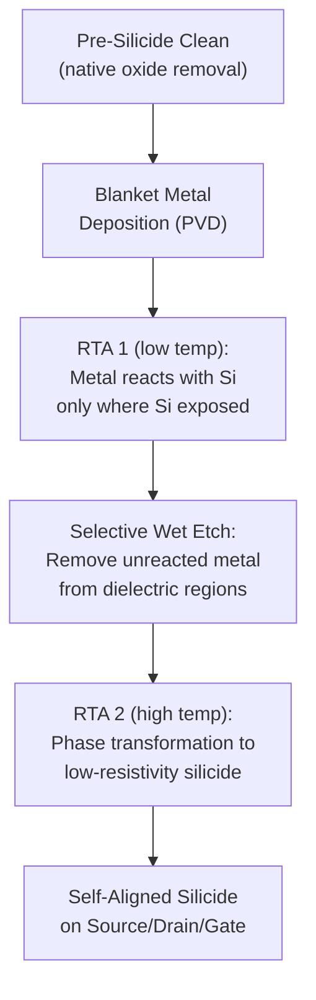

## Self Aligned Silicide Formation

### Definition and Purpose

Self-Aligned Silicide (SALICIDE) formation is the process module that creates a low-resistance metal-silicon compound layer on exposed silicon surfaces — source, drain, and polysilicon gate regions (in poly-gate schemes) — without requiring a dedicated lithography step to define its location. The "self-aligned" nature derives from the process using the existing dielectric spacer and STI/field oxide topology as the natural masking boundary: silicide forms only where a deposited metal directly contacts exposed silicon, and is removed everywhere else via selective wet etch, eliminating the need for a separate silicide-patterning mask.

Silicidation directly addresses a critical scaling bottleneck: as source/drain junctions and gate contact areas shrink, the effective contact resistance between the semiconductor and the overlying tungsten/copper interconnect metallization becomes an increasingly significant fraction of total transistor series resistance. Without a low-resistance silicide interface, this contact resistance would substantially degrade transistor drive current and circuit speed, independent of how well the channel and junction itself are engineered.

### Why Self-Alignment Matters

Prior to the self-aligned approach, silicide formation (or direct metal contact) required its own lithography and etch steps to define exactly where metal-silicon reaction should occur — adding cost, alignment tolerance requirements, and process complexity. The self-aligned salicide process instead exploits the fact that, after spacer formation and source/drain implantation, the wafer surface already has clearly defined regions of exposed silicon (source, drain, and gate top) bounded by dielectric (spacers, STI oxide). Depositing metal everywhere and reacting only where silicon is exposed, followed by removing all unreacted metal, produces a silicide pattern that is automatically and precisely registered to the transistor geometry with zero additional lithography and inherently perfect alignment to the active silicon regions.

### Process Sequence

**1. Pre-Silicide Surface Preparation**

Immediately before metal deposition, the exposed silicon surfaces undergo a cleaning step (typically a dilute HF or similar wet clean) to remove native oxide, since even a thin native oxide layer would prevent or severely impede the intended metal-silicon solid-state reaction.

**2. Blanket Metal Deposition**

A thin, uniform layer of a refractory or near-noble metal is deposited across the entire wafer surface, typically via physical vapor deposition (PVD/sputtering):

- Historically: **titanium (Ti)** or **cobalt (Co)**
- Modern advanced nodes: **nickel (Ni)** or **nickel-platinum alloy (NiPt)**

The metal blankets both the exposed silicon regions (source, drain, polysilicon gate top) and the dielectric regions (spacers, STI oxide) uniformly, since PVD deposition is not selective at this stage.

**3. First (Low-Temperature) Rapid Thermal Anneal**

A first RTA step, typically at a relatively low temperature specific to the metal-silicon system in use, initiates the solid-state reaction between the deposited metal and the underlying silicon, forming a metal-rich silicide phase at the metal-silicon interface. Critically, **no reaction occurs where the metal sits on dielectric** (spacer or STI oxide), since there is no silicon available to react — this is the physical basis for the self-aligned selectivity of the entire process.

$$Metal + Si \xrightarrow{\text{RTA 1}} Metal_xSi_y \text{ (metal-rich silicide phase)}$$

**4. Selective Wet Etch (Unreacted Metal Removal)**

A wet chemical etch (chemistry selected to be highly selective toward the unreacted metal while leaving the newly formed silicide largely intact) removes all metal that did not react — i.e., all metal that was sitting on dielectric regions — cleanly exposing the underlying spacer and STI oxide surfaces while leaving silicide only on the source, drain, and gate regions where reaction occurred.

**5. Second (Higher-Temperature) Rapid Thermal Anneal**

A second RTA step, typically at higher temperature than the first, converts the initial metal-rich silicide phase into the final, lower-resistivity, more thermally stable silicide phase (the specific phase transformation depends on the metal system, discussed below). This two-step anneal sequence (react → selective etch → phase-transform anneal) is standard practice because it allows removal of unreacted metal *before* the final high-temperature step, preventing any residual metal from causing bridging or lateral silicide encroachment defects during the higher-temperature phase transformation.

### Metal System Evolution and Selection Criteria

**Titanium Silicide (TiSi₂) — Legacy**

One of the earliest widely used salicide metals. A significant limitation is the **fine-line effect**: as polysilicon gate/line widths shrink, titanium silicide's preferred low-resistivity phase (C54) becomes increasingly difficult to nucleate in narrow structures, causing resistance to increase sharply below a critical line width — this scaling limitation drove the industry transition away from titanium silicide as gate lengths continued shrinking.

**Cobalt Silicide (CoSi₂) — Intermediate Generation**

Adopted to overcome the titanium fine-line effect, cobalt silicide does not exhibit the same narrow-line resistance degradation and was used at intermediate technology nodes. However, cobalt silicide formation **consumes a relatively large amount of silicon** during the reaction (high silicon consumption ratio), which becomes problematic as source/drain junction depths shrink — excessive silicon consumption risks silicide encroachment through the entire shallow junction depth, causing junction leakage or shorting.

**Nickel Silicide (NiSi) — Modern Standard**

The dominant salicide metal at advanced nodes, chosen because it addresses the key limitations of both predecessors:

- **Low silicon consumption**: Nickel silicide formation consumes substantially less silicon per unit silicide thickness than cobalt silicide, critical for compatibility with the very shallow source/drain junctions required at scaled nodes
- **Low formation temperature**: Nickel silicide forms its low-resistivity phase at lower temperature than titanium or cobalt systems, reducing overall thermal budget impact on the already carefully engineered, diffusion-sensitive shallow junction and halo profiles
- **No fine-line effect**: Nickel silicide resistivity does not degrade at narrow line widths the way titanium silicide's did, making it compatible with continued gate/contact scaling

**Nickel-Platinum Alloy (NiPt)**

A refinement of pure nickel silicide, where platinum is alloyed into the nickel (typically a small atomic percentage) to suppress a specific failure mode: nickel silicide is prone to **excessive lateral growth and agglomeration** at elevated temperature (nickel silicide has a narrower thermal stability process window than cobalt or titanium silicide systems), and platinum addition improves thermal stability, delaying the onset of agglomeration and unwanted high-resistivity phase transformation (e.g., transformation to $NiSi_2$, a higher-resistivity phase that can form if nickel silicide is exposed to excessive thermal budget).

| Metal System | Si Consumption | Fine-Line Effect | Thermal Stability | Status |
| --- | --- | --- | --- | --- |
| Titanium (TiSi₂) | Moderate | Significant (C54 phase issue) | Moderate | Legacy |
| Cobalt (CoSi₂) | High | Minimal | Good | Intermediate generation |
| Nickel (NiSi) | Low | Minimal | Narrower process window (agglomeration risk) | Modern standard |
| Nickel-Platinum (NiPt) | Low | Minimal | Improved over pure Ni | Advanced nodes |

### Illustrative Schematic: Self-Aligned Silicide Formation Sequence (svg_diagram)

<svg xmlns="http://www.w3.org/2000/svg" viewBox="0 0 760 300">
<text x="380" y="24" text-anchor="middle" font-size="16" font-weight="bold" fill="#222">Self-Aligned Silicide Formation (svg_diagram)</text>

<text x="140" y="55" text-anchor="middle" font-size="11" font-weight="bold" fill="#222">1. Blanket Metal Deposit</text>

<rect x="60" y="150" width="160" height="30" fill="`#b0a99f`" stroke="#333" />

<rect x="100" y="120" width="40" height="30" fill="#999" stroke="#333" />

<path d="M 70 150 L 100 150 L 100 120 Z" fill="`#e0e0c0`" stroke="#333" />

<path d="M 210 150 L 140 150 L 140 120 Z" fill="`#e0e0c0`" stroke="#333" />

<rect x="60" y="110" width="160" height="8" fill="`#c0c0c0`" stroke="#333" />

<text x="140" y="195" text-anchor="middle" font-size="8" fill="#555">Metal blankets all surfaces</text>

<line x1="230" y1="145" x2="270" y2="145" stroke="#333" stroke-width="2" marker-end="url(#s1)" />

<text x="360" y="55" text-anchor="middle" font-size="11" font-weight="bold" fill="#222">2. RTA 1: Selective Reaction</text>

<rect x="280" y="150" width="160" height="30" fill="`#b0a99f`" stroke="#333" />

<rect x="320" y="120" width="40" height="30" fill="#999" stroke="#333" />

<path d="M 290 150 L 320 150 L 320 120 Z" fill="`#e0e0c0`" stroke="#333" />

<path d="M 430 150 L 360 150 L 360 120 Z" fill="`#e0e0c0`" stroke="#333" />

<rect x="280" y="142" width="40" height="10" fill="`#f4a261`" stroke="#333" />

<rect x="360" y="142" width="40" height="10" fill="`#f4a261`" stroke="#333" />

<rect x="320" y="112" width="40" height="10" fill="`#f4a261`" stroke="#333" />

<rect x="280" y="110" width="160" height="6" fill="`#c0c0c0`" stroke="#333" />

<text x="360" y="195" text-anchor="middle" font-size="8" fill="#555">Silicide forms only on Si</text>

<line x1="450" y1="145" x2="490" y2="145" stroke="#333" stroke-width="2" marker-end="url(#s1)" />

<text x="580" y="55" text-anchor="middle" font-size="11" font-weight="bold" fill="#222">3. Selective Etch</text>

<rect x="500" y="150" width="160" height="30" fill="`#b0a99f`" stroke="#333" />

<rect x="540" y="120" width="40" height="30" fill="#999" stroke="#333" />

<path d="M 510 150 L 540 150 L 540 120 Z" fill="`#e0e0c0`" stroke="#333" />

<path d="M 650 150 L 580 150 L 580 120 Z" fill="`#e0e0c0`" stroke="#333" />

<rect x="500" y="142" width="40" height="10" fill="`#f4a261`" stroke="#333" />

<rect x="580" y="142" width="40" height="10" fill="`#f4a261`" stroke="#333" />

<rect x="540" y="112" width="40" height="10" fill="`#f4a261`" stroke="#333" />

<text x="580" y="195" text-anchor="middle" font-size="8" fill="#555">Unreacted metal removed</text>

<line x1="670" y1="145" x2="700" y2="145" stroke="#333" stroke-width="2" marker-end="url(#s1)" />
</svg>

### Application Regions Within the Transistor

- **Source/drain silicide**: Reduces contact resistance between the source/drain silicon and the tungsten contact plug that connects to the first metal interconnect level, directly reducing total transistor series resistance.
- **Polysilicon gate silicide**: In legacy poly-gate schemes (superseded by metal gate at advanced nodes), a silicide layer on top of the polysilicon gate reduces gate electrode sheet resistance, important for minimizing RC delay along long polysilicon gate/interconnect runs.
- **Note on gate-last (RMG) integration**: In modern replacement-metal-gate flows, the polysilicon gate is a sacrificial dummy structure removed entirely before final metal gate formation, so gate silicidation is not applicable to the final device gate in these processes — silicidation in RMG-based flows is confined to the source/drain regions.

### Key Defect Modes and Failure Mechanisms

**Silicide Encroachment/Piping**

Excessive or non-uniform silicon consumption during the silicidation reaction can cause the silicide front to grow non-uniformly or penetrate ("pipe") through the shallow junction depth in localized areas, potentially reaching or shorting to the underlying channel/well region — a particular concern for metal systems with high silicon consumption (historically cobalt) combined with very shallow modern junctions.

**Agglomeration**

At elevated temperature or extended thermal exposure, silicide films (nickel silicide in particular) can undergo morphological instability, breaking up into isolated islands (agglomeration) rather than remaining a continuous, low-resistance film — directly increasing sheet resistance and potentially causing open-circuit contact failures. This is the primary motivation for nickel-platinum alloy adoption, since platinum addition raises the agglomeration onset temperature.

**Bridging**

Incomplete removal of unreacted metal during the selective wet etch step (or excessive lateral silicide growth during anneal) can leave a residual conductive path across the spacer between the gate and source/drain silicide regions, causing an electrical short (gate-to-source/drain bridging) — a critical yield-limiting defect requiring tightly controlled etch selectivity and process uniformity.

**High-Resistance Phase Formation**

Some silicide systems have multiple possible crystalline phases with substantially different resistivity (e.g., nickel silicide's low-resistivity NiSi phase versus the higher-resistivity $NiSi_2$ phase that can form under excessive thermal budget); process anneal conditions must be tightly controlled to favor formation and retention of the desired low-resistivity phase throughout subsequent thermal processing.

### Metrology and Process Control

- **Sheet resistance measurement (four-point probe)**: The primary electrical verification metric, directly confirming silicide film resistivity and continuity meet target specification across source/drain and (where applicable) gate regions.
- **X-ray Diffraction (XRD)**: Identifies which crystalline silicide phase is present, verifying the desired low-resistivity phase has formed rather than an undesired higher-resistivity phase.
- **Cross-sectional TEM**: Direct imaging of silicide thickness, uniformity, and junction proximity, used to verify absence of encroachment/piping defects and to confirm silicide depth relative to the underlying shallow junction.
- **Electrical leakage/short testing**: Production test structures and yield monitors specifically designed to detect bridging or junction-piping-induced leakage/short defects associated with silicidation.

### Integration Considerations in the Overall Process Flow

Self-aligned silicide formation occurs after source/drain implant activation annealing is complete, since the silicidation anneals themselves are lower-temperature and shorter-duration than the activation anneal and are not intended to further drive dopant diffusion. This ordering ensures:

- The shallow junction and halo profiles are already fully formed and activated before silicide-related thermal steps are introduced, minimizing additional unwanted dopant diffusion
- The silicide reaction consumes silicon from an already-finalized junction depth, allowing process engineers to budget silicide thickness against a known, fixed junction depth rather than a still-diffusing profile

**[Inference]** Exact anneal temperatures, durations, and selective etch chemistries for silicide formation are proprietary to individual foundries and vary by specific metal system and technology node; the general two-step react/etch/anneal sequence and the qualitative metal-system trade-offs described here reflect standard, widely documented industry practice rather than a single universal recipe.

**Next Steps**

- Source/drain engineering: extension, halo, and stressor epitaxy integration
- Contact and via formation: tungsten plug integration following silicidation
- Rapid Thermal Annealing (RTA) equipment and thermal budget management
- Replacement Metal Gate (RMG) integration and its interaction with silicidation scope
- Metal-semiconductor contact physics: Schottky barriers and specific contact resistivity
- X-ray diffraction phase identification techniques for thin-film metallurgy