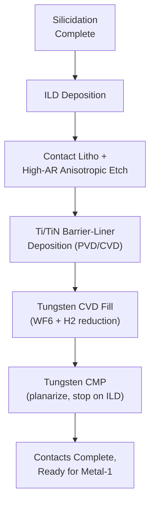
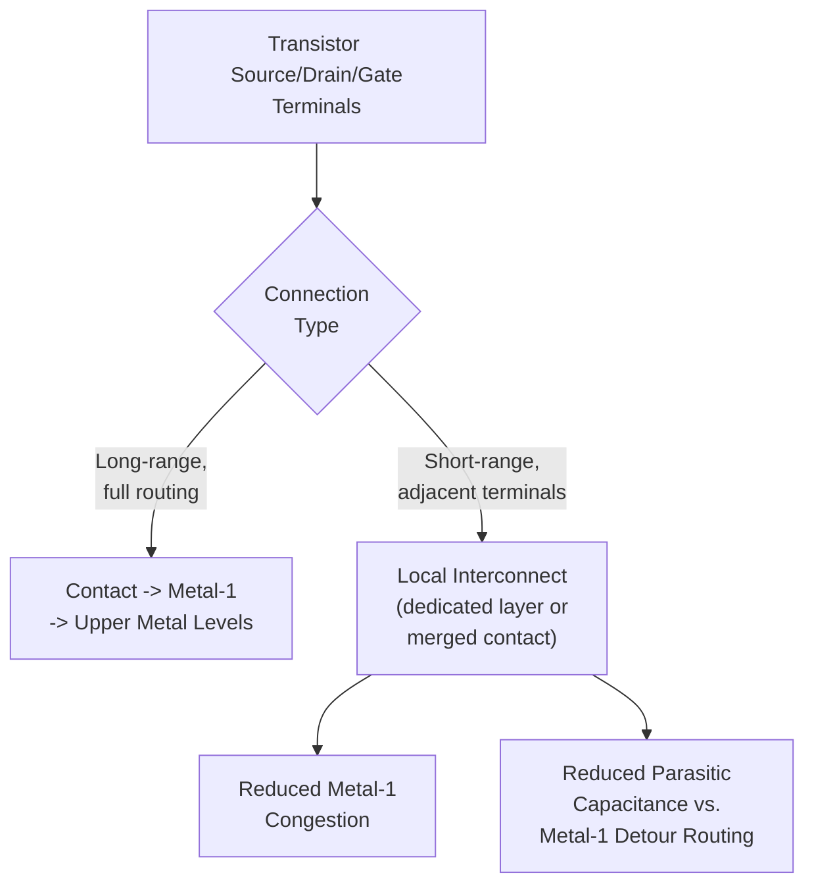
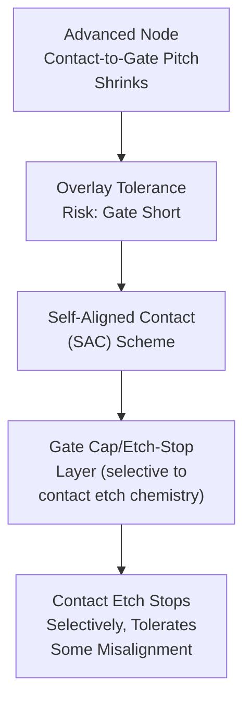

## Contact and Local Interconnect Formation

### Overview and Purpose

Contact and local interconnect formation is the process module that establishes the first electrical connections between individual transistor terminals (source, drain, gate) and the overlying multilevel metal interconnect system. It sits at the boundary between front-end-of-line (FEOL) transistor fabrication and back-end-of-line (BEOL) interconnect wiring, and its design directly determines a significant fraction of total transistor-to-circuit series resistance, particularly critical as contact dimensions have scaled to only tens of nanometers at advanced nodes, where contact resistance can rival or exceed the intrinsic transistor channel resistance.

This module encompasses two related but distinct sub-processes: **contact formation** (vertical connections from individual transistor terminals up to the first metal layer) and **local interconnect** (short-range, layer-specific horizontal wiring that connects nearby transistor terminals to each other or to contacts without requiring a full metal-layer routing step, used in specific architectures to save area and reduce parasitic capacitance).

### Contact Formation: Process Sequence

**1. Interlayer Dielectric (ILD) Deposition**

Following silicidation, a dielectric layer (historically doped or undoped $SiO_2$; increasingly low-k dielectrics as scaling progresses) is deposited over the entire transistor structure, encapsulating the gate, spacers, and silicided source/drain regions, and providing the insulating medium through which contact holes will later be etched.

**2. Contact Lithography and Etch**

Photolithography defines contact hole locations, followed by a high-aspect-ratio anisotropic plasma etch (typically fluorocarbon-based chemistry, e.g., $C_4F_8$/$CF_4$-based) through the ILD, stopping selectively on the underlying silicide or gate surface. As contact dimensions shrink and ILD thickness (relative to contact diameter) increases, achieving void-free, high-aspect-ratio contact etch with adequate selectivity to the underlying silicide/gate stop layer becomes an increasingly demanding etch process requirement.

**3. Barrier/Liner Deposition**

A thin conformal barrier/liner layer — typically titanium (Ti) followed by titanium nitride ($TiN$) — is deposited into the contact hole via PVD or CVD/ALD before the bulk contact fill metal:

- The **titanium liner** serves a dual purpose: it acts as a **glue layer** improving adhesion between the fill metal and the dielectric/silicide surfaces, and it can further reduce contact resistance by reacting with any residual native oxide or improving the metal-silicide interface quality
- The **titanium nitride layer** serves as a **diffusion barrier**, preventing the bulk fill metal (typically tungsten) from diffusing into the surrounding dielectric or reacting undesirably with the underlying silicon/silicide during subsequent thermal processing

**4. Contact Fill Metal Deposition**

**Tungsten (W)** is the dominant contact fill metal, deposited via CVD using tungsten hexafluoride ($WF_6$) reduction chemistry:

$$WF_6 + 3H_2 \rightarrow W + 6HF$$

Tungsten CVD provides excellent conformal, void-free fill even in the high-aspect-ratio contact holes characteristic of advanced nodes, which is the primary reason tungsten (rather than copper, used at higher interconnect levels) remains the standard contact fill material — copper CVD/electroplating fill techniques used in damascene BEOL interconnects are not as well suited to the very high aspect ratios and small diameters of contact-level structures.

**5. Tungsten CMP Planarization**

Chemical Mechanical Planarization removes tungsten overburden from the wafer surface, leaving tungsten only within the contact holes themselves, stopping on and exposing the surrounding ILD surface for subsequent metal-1 interconnect processing. This is the tungsten CMP process referenced in dedicated CMP process modules, using oxidizer-based slurries selective to the underlying dielectric stop layer.

### Contact Resistance Components

Total contact resistance is the sum of several series resistance contributions, each requiring separate engineering attention:

$$R_{contact,total} = R_{silicide/Si} + R_{barrier} + R_{fill\,metal} + R_{via\,geometry}$$

- **Silicide-to-silicon specific contact resistivity**: Governed by the Schottky barrier height and doping concentration at the metal-silicide/silicon interface (addressed via silicidation and heavy source/drain doping, as covered in source/drain engineering)
- **Barrier layer resistance**: The Ti/TiN liner, while necessary for adhesion and diffusion barrier function, adds series resistance; liner thickness must be minimized while still providing adequate barrier integrity, especially critical as contact diameter shrinks and liner thickness becomes a proportionally larger fraction of the total contact cross-sectional area
- **Fill metal bulk resistivity**: Tungsten has higher bulk resistivity than copper, contributing to contact resistance scaling challenges as contact diameter shrinks (resistance increases as cross-sectional area decreases, and this effect is compounded at very small dimensions by additional surface/grain-boundary scattering effects in the fill metal)
- **Contact geometry (aspect ratio, sidewall profile)**: Non-ideal sidewall profiles (e.g., re-entrant or excessively tapered contact holes) can locally constrict the fill metal cross-section, adding parasitic resistance beyond the nominal contact diameter would suggest

**[Inference]** As contact dimensions continue shrinking below approximately 20 nm diameter, surface and grain-boundary electron scattering effects in the tungsten fill metal become an increasingly significant, and less straightforward to mitigate, contributor to overall contact resistance; alternative fill metals or contact architectures are an active area of industry research, though specific solutions adopted at the most advanced nodes are proprietary and not comprehensively documented in public literature.

### Local Interconnect: Purpose and Architecture

**Local interconnect (LI)** refers to a dedicated conductive layer, positioned between the contact level and the first full metal interconnect layer (metal-1), used to make short-range connections between nearby transistor terminals without consuming metal-1 routing resources:

- Common uses include connecting adjacent source/drain regions within a standard cell (e.g., tying together source terminals of series/parallel transistor configurations) or connecting a gate to a nearby source/drain terminal, both of which are frequent, geometrically compact connection patterns in standard cell layouts
- By handling these short-range connections at a dedicated local interconnect level rather than routing them through metal-1, local interconnect reduces metal-1 congestion, allows tighter standard cell layout density, and can reduce parasitic capacitance associated with longer metal-1 routing detours that would otherwise be needed for the same connections

Local interconnect materials and process integration vary by node and specific implementation approach, but commonly involve either:

- A dedicated conductive layer (e.g., tungsten or a specific metal silicide/nitride stack) patterned directly above the contact level, functioning similarly to a contact-level "wire," or
- Direct merging of adjacent contact structures at the layout level, effectively using an elongated or merged contact shape to achieve the same short-range connection function without a fully distinct additional process layer

**[Inference]** The specific choice of local interconnect implementation (dedicated additional layer versus merged/elongated contact structures) and its exact material composition are technology-node- and foundry-specific integration decisions; both general approaches are used across the industry depending on the specific process generation and standard cell architecture requirements.

### Illustrative Schematic: Contact Structure Cross-Section (svg_diagram)

<svg xmlns="http://www.w3.org/2000/svg" viewBox="0 0 700 300">
<text x="350" y="24" text-anchor="middle" font-size="16" font-weight="bold" fill="#222">Contact Structure Cross-Section (svg_diagram)</text>

<rect x="60" y="220" width="580" height="40" fill="#b0a99f" stroke="#333" />
<text x="350" y="245" text-anchor="middle" font-size="10" fill="#222">Substrate</text>

<rect x="120" y="205" width="120" height="15" fill="#8a6d3b" stroke="#333" />
<rect x="460" y="205" width="120" height="15" fill="#8a6d3b" stroke="#333" />
<text x="180" y="218" text-anchor="middle" font-size="8" fill="#fff">Silicide</text>
<text x="520" y="218" text-anchor="middle" font-size="8" fill="#fff">Silicide</text>

<rect x="300" y="170" width="100" height="50" fill="#999" stroke="#333" />
<path d="M 280 220 L 300 220 L 300 170 Z" fill="#e0e0c0" stroke="#333" />
<path d="M 420 220 L 400 220 L 400 170 Z" fill="#e0e0c0" stroke="#333" />

<rect x="60" y="90" width="580" height="80" fill="#e8e4dc" stroke="#333" opacity="0.7" />
<text x="620" y="105" text-anchor="middle" font-size="8" fill="#555">ILD</text>

<rect x="150" y="105" width="30" height="100" fill="#4a4a4a" stroke="#333" />
<rect x="152" y="105" width="4" height="100" fill="#2a2a2a" />
<rect x="176" y="105" width="4" height="100" fill="#2a2a2a" />
<rect x="490" y="105" width="30" height="100" fill="#4a4a4a" stroke="#333" />
<rect x="492" y="105" width="4" height="100" fill="#2a2a2a" />
<rect x="516" y="105" width="4" height="100" fill="#2a2a2a" />

<text x="165" y="90" text-anchor="middle" font-size="8" fill="#222">W fill +</text>

<text x="165" y="75" text-anchor="middle" font-size="8" fill="#222">Ti/TiN liner</text>

<text x="350" y="130" text-anchor="middle" font-size="9" fill="#222">Gate</text>

</svg>

### Contact Etch Challenges at Scaled Dimensions

- **High aspect ratio etch**: As ILD thickness scales less aggressively than contact diameter (to maintain adequate metal-1 to gate/substrate isolation), contact aspect ratio (depth-to-diameter) increases with each technology generation, demanding increasingly anisotropic, high-selectivity etch processes to avoid bowing, tapering, or incomplete etch at the contact bottom.
- **Self-aligned contact (SAC) schemes**: At advanced nodes, contact-to-gate spacing shrinks to the point where conventional contact lithography overlay tolerance risks unwanted gate-to-contact shorts. **Self-aligned contact** approaches use a dedicated etch-stop/hard-mask layer over the gate (distinct in etch selectivity from the surrounding ILD) so that the contact etch can be patterned with reduced overlay margin — the etch stops selectively on the gate cap layer even if some lateral misalignment occurs, preventing gate shorting while allowing tighter contact-to-gate pitch than conventional (non-self-aligned) contact schemes would permit.

### Metrology and Process Control

- **Contact resistance test structures**: Kelvin (four-terminal) contact resistance structures provide direct, geometry-independent measurement of specific contact resistivity, isolating contact resistance from surrounding line/via resistance contributions.
- **Cross-sectional SEM/TEM**: Direct imaging verification of contact hole profile (aspect ratio, sidewall angle, any bowing/tapering), barrier/liner thickness uniformity, and fill metal void-free confirmation.
- **Contact chain yield structures**: Large arrays of daisy-chained contacts used in production yield monitoring to detect open (resistive/missing fill) or short (bridging) contact defects at statistically meaningful sample sizes.
- **Electrical leakage testing**: Verifies adequate contact-to-gate and contact-to-adjacent-structure isolation, particularly important for self-aligned contact schemes where overlay margin is intentionally reduced.

### Common Defect Modes

- **Voiding**: Incomplete tungsten CVD fill in high-aspect-ratio contacts, causing increased resistance or complete open-circuit failure; particularly a risk as aspect ratio increases with continued scaling.
- **Barrier layer discontinuity**: Non-conformal Ti/TiN deposition at the bottom or sidewalls of high-aspect-ratio contacts can leave gaps in diffusion barrier coverage, risking tungsten-silicon interaction or fluorine-related corrosion/leakage from the $WF_6$ CVD chemistry reacting directly with silicon in barrier-deficient regions.
- **Contact-to-gate shorting**: Overlay/misalignment-driven shorts, particularly relevant at advanced nodes with aggressive contact-to-gate pitch, mitigated by self-aligned contact schemes as described above.
- **Silicide consumption/damage during contact etch**: Over-etch into the underlying silicide layer (if etch selectivity to the silicide stop layer is inadequate) can thin or damage the silicide, increasing contact resistance or, in severe cases, etching through to the underlying junction.
- **Tungsten CMP-related defects**: Dishing, erosion, or residual tungsten stringers from incomplete CMP clearing, following the same general CMP defect mechanisms described in dedicated CMP process modules, applied specifically to the tungsten contact fill context.

### Integration Position in Overall Process Flow

Contact and local interconnect formation occurs immediately after source/drain silicidation and before the beginning of the multilevel BEOL copper damascene interconnect sequence:

1. Source/drain formation and activation anneal
2. Self-aligned silicide formation
3. **Contact/local interconnect formation** (ILD deposition, contact etch, barrier/liner, tungsten fill, CMP)
4. Metal-1 and subsequent multilevel BEOL interconnect (dual-damascene copper process, repeated at each level)

This module thus represents the critical transition point where the process flow shifts from device-specific FEOL materials and geometries (silicon, silicide, tungsten, high-aspect-ratio small features) to the multilevel copper/low-k BEOL interconnect stack that will be built on top of it.

**[Inference]** As previously noted regarding contact resistance scaling, alternative contact metallization schemes (e.g., alternative liner materials, or fill metals other than tungsten) are subjects of ongoing industry research at the most advanced nodes; specific solutions in current high-volume production are generally not fully disclosed in public technical literature, so claims about the exact contact stack composition at the leading edge should be treated as provisional.

**Next Steps**

- Self-aligned silicide formation and its role in contact resistance
- Copper dual-damascene BEOL interconnect integration
- Tungsten CMP process mechanics and defect control
- Self-aligned contact (SAC) schemes and overlay-tolerant patterning
- Kelvin contact resistance test structure design and metrology
- High-aspect-ratio dielectric etch processes for contact/via formation
- Standard cell layout and local interconnect area/density trade-offs