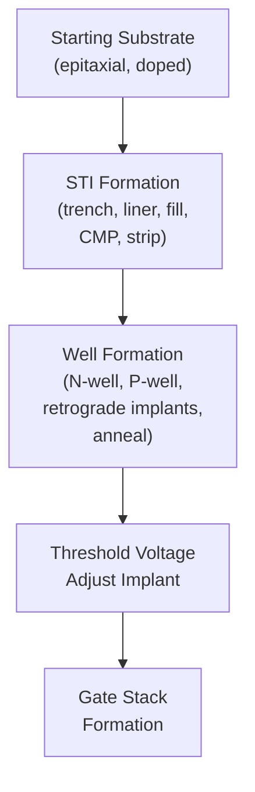
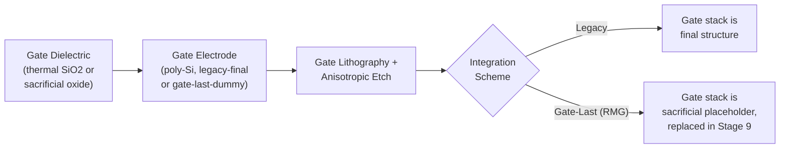
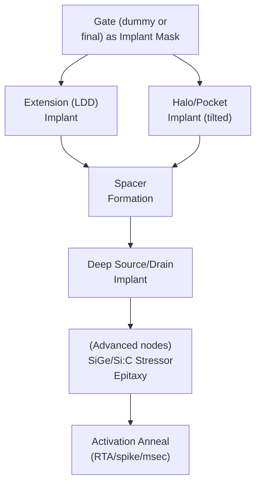
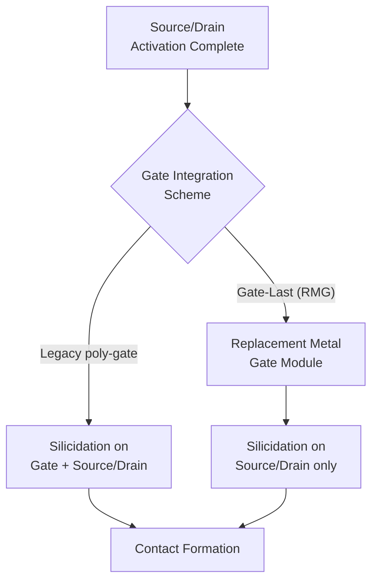
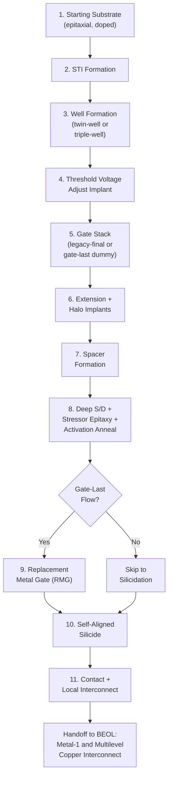

## Full Front End Process Flow Walkthrough

### Overview

This walkthrough integrates the individual FEOL (Front-End-of-Line) process modules covered in prior sections into a single, sequential narrative — from starting substrate through contact formation, the point at which the process transitions to BEOL multilevel interconnect. Each step references the detailed mechanisms established in its dedicated module; this section's purpose is to show how the modules connect, what each depends on from the step before it, and what constraints it imposes on the step after it.

### Stage 1: Starting Substrate Preparation

The flow begins with a prime-grade single-crystal silicon wafer, often with a lightly doped epitaxial layer grown on a more heavily doped bulk substrate (epitaxial substrates provide a controlled, defect-minimized surface doping concentration independent of the bulk wafer's doping, and can help suppress latch-up by providing a low-resistance path beneath the active device region). Substrate resistivity, crystal orientation, and epitaxial layer thickness/doping are specified according to the target technology node's well and device requirements.

### Stage 2: Shallow Trench Isolation (STI)

Before any doping differentiation between NMOS and PMOS regions, isolation structures are formed to define and electrically separate individual active areas:

1. Pad oxide growth and nitride deposition (implant/etch mask stack)
2. STI trench lithography and anisotropic etch
3. Sidewall liner oxidation (corner rounding, damage passivation)
4. Trench dielectric fill (HDP-CVD or flowable CVD oxide)
5. CMP planarization, stopping on the nitride hard mask with high oxide:nitride selectivity
6. Nitride/pad oxide strip, exposing the final planar active silicon surface

This establishes the physical and electrical boundaries within which all subsequent well and transistor formation will occur, and its planarity directly benefits every subsequent lithography step in the flow.

### Stage 3: Well Formation

With isolation boundaries established, wells are implanted to create the locally doped regions needed for complementary NMOS/PMOS devices:

1. N-well lithography (masking future PMOS regions) and multi-energy retrograde implant (phosphorus/arsenic)
2. P-well lithography (complementary mask, masking future NMOS regions) and multi-energy retrograde implant (boron/$BF_2$)
3. Well drive-in/activation anneal (RTA), shaping final retrograde doping profiles and activating dopants
4. (Where applicable) deep n-well implant for triple-well isolated circuit regions

The choice of twin-well versus triple-well architecture, and the specific retrograde profile design, is determined by target latch-up immunity, threshold voltage requirements, and (for triple-well) any body-biasing or analog/RF isolation needs specified for the design.

### Stage 4: Threshold Voltage Adjustment Implant

A dedicated, typically lower-energy/lower-dose implant is performed near the surface, independent of the deeper well implant, to precisely set channel doping concentration and thereby transistor threshold voltage — decoupling this fine-tuning step from the well's own retrograde profile, which is optimized primarily for latch-up suppression rather than $V_t$ targeting.

### Stage 5: Gate Stack Formation

The gate dielectric and electrode are formed, using one of two integration sequences depending on technology generation:

**Legacy (poly-Si/SiO₂) sequence**: Thermal gate oxide growth, blanket polysilicon deposition, gate lithography and anisotropic etch — the gate stack is essentially final at this point in the flow.

**Modern (gate-last/replacement metal gate) sequence**: A **sacrificial dummy polysilicon gate** is formed using the legacy-style lithography/etch flow, but this dummy gate is only a placeholder — it will be removed and replaced much later in the flow (Stage 9), after all high-temperature processing is complete. This distinction is critical to understanding the rest of the walkthrough: in gate-last flows, "the gate" referenced in Stages 6–8 below is this dummy structure, not the final high-k/metal-gate stack.

### Stage 6: Source/Drain Extension and Halo Implants

With the (dummy or final) gate electrode acting as a self-aligned implant mask:

1. **Extension (LDD) implant**: shallow, self-aligned to the gate edge, minimizing short-channel effect contribution from this near-channel region
2. **Halo (pocket) implant**: tilted-angle, counter-doped implant surrounding the extension, suppressing DIBL and punch-through

These two implants establish the graded near-channel doping profile that balances short-channel effect control against series resistance, as detailed in source/drain engineering.

### Stage 7: Spacer Formation

A conformal dielectric layer (oxide, nitride, or composite stack) is deposited and anisotropically etched, leaving sidewall spacers on the gate electrode. The spacer serves as the self-aligned offset mask for the subsequent deep source/drain implant, and its width is a precisely controlled dimension balancing series resistance against short-channel-effect control.

### Stage 8: Deep Source/Drain Formation and Stressor Integration

1. **Deep source/drain implant**, self-aligned to the outer spacer edge, providing the low-resistance bulk conducting path
2. **(At advanced nodes) Selective epitaxial stressor formation**: source/drain regions are recessed and regrown with SiGe (PMOS, compressive channel stress, in-situ boron doped) or Si:C (NMOS, tensile channel stress, in-situ phosphorus doped)
3. **Source/drain activation anneal**: RTA, spike anneal, or millisecond annealing, chosen to maximize dopant activation while minimizing further diffusion of the now-finalized extension/halo/deep-implant profiles

By the end of this stage, the transistor's electrical junction structure — extension, halo, and deep source/drain, with or without stressor epitaxy — is fully formed and activated.

### Stage 9: Replacement Metal Gate (Gate-Last Flows Only)

For processes using the gate-last integration scheme, this is the point where the sacrificial dummy gate is finally removed and replaced:

1. ILD deposition and CMP, planarizing to expose the top of the dummy polysilicon gate
2. Selective dummy gate removal (wet/dry etch selective to surrounding ILD and sacrificial oxide)
3. High-k dielectric deposition via ALD (with thin interfacial layer for channel interface quality)
4. Work-function metal deposition, separately masked for NMOS and PMOS regions
5. Gate fill metal deposition (tungsten or aluminum)
6. CMP planarization, isolating individual gate electrodes

This late-stage gate formation is specifically why the dummy gate's thermal stability was never a concern during Stage 8's high-temperature activation anneal — the dummy gate only needed to survive as a physical placeholder and self-aligned implant mask, not as an electrically functional, thermally stable final gate material.

**For legacy (poly-Si/SiO₂) flows**, this stage is skipped entirely, since the gate formed in Stage 5 is already the final structure.

### Stage 10: Self-Aligned Silicide Formation

**Note on integration timing**: In legacy poly-gate flows, silicidation occurs on both the polysilicon gate top and the source/drain regions. In gate-last/RMG flows, since the final metal gate is formed after silicidation would normally occur (or, in many implementations, silicidation of source/drain happens before the replacement gate module, prior to ILD deposition in Stage 9), silicidation scope is generally confined to source/drain regions only, as the final gate is already a metal (no silicidation needed or applicable).

1. Pre-silicide clean (native oxide removal)
2. Blanket metal deposition (nickel or nickel-platinum alloy at advanced nodes; historically titanium or cobalt)
3. First RTA: selective reaction with exposed silicon only (self-aligned selectivity — no reaction on dielectric)
4. Selective wet etch: removes unreacted metal from dielectric regions
5. Second RTA: phase transformation to final low-resistivity silicide

This step minimizes source/drain (and, where applicable, gate) contact resistance before the transition to contact-level metallization.

### Stage 11: Contact and Local Interconnect Formation

1. ILD deposition over the completed transistor structure
2. Contact lithography and high-aspect-ratio anisotropic etch, stopping on silicide/gate
3. Ti/TiN barrier-liner deposition (adhesion and diffusion barrier)
4. Tungsten CVD fill ($WF_6$ + $H_2$ reduction chemistry)
5. Tungsten CMP planarization, stopping on the ILD surface
6. (Where implemented) local interconnect layer for short-range, area-efficient connections between nearby transistor terminals

This is the final FEOL module and the direct handoff point to BEOL processing: the exposed, planarized contact/local-interconnect surface becomes the foundation upon which metal-1 and all subsequent dual-damascene copper interconnect levels are built.

### Complete Flow Summary Diagram

### Cross-Module Dependencies and Constraints

Several dependencies link modules across the flow in ways that constrain earlier decisions based on later requirements:

- **STI planarity → all subsequent lithography**: The CMP-planarized STI surface directly benefits every later patterning step's depth-of-focus margin, establishing why STI CMP quality (as covered in dedicated CMP modules) is treated as a foundational yield driver rather than an isolated concern.
- **Well retrograde profile → latch-up immunity and threshold voltage**: The well architecture chosen in Stage 3 directly determines available guard ring/tap density requirements and triple-well usage decisions that layout designers must accommodate.
- **Gate integration scheme (legacy vs. gate-last) → thermal budget tolerance for Stages 6–8**: Because gate-last flows use a sacrificial dummy gate, they permit more aggressive (higher thermal budget) activation annealing in Stage 8 than a legacy flow using a thermally-sensitive final metal gate would tolerate — this is a primary reason gate-last integration became necessary once high-k/metal-gate stacks were introduced.
- **Spacer width → both short-channel control and contact-to-gate pitch**: The same spacer that offsets the deep source/drain implant (Stage 7) also determines the physical separation available for self-aligned contact schemes (Stage 11), linking a device-physics decision to a downstream patterning/overlay decision.
- **Silicide silicon consumption → junction depth budget**: The metal system chosen for silicidation (Stage 10) must consume less silicon than the shallow junction depth established in Stage 8 can tolerate, directly linking source/drain engineering choices to silicidation metal selection (e.g., nickel's low silicon consumption becoming necessary as junction depths shrunk).

### Illustrative Schematic: Full FEOL Flow Cross-Section Progression (svg_diagram)

<svg xmlns="http://www.w3.org/2000/svg" viewBox="0 0 760 340">
<text x="380" y="24" text-anchor="middle" font-size="16" font-weight="bold" fill="#222">FEOL Flow: Cross-Section Progression (svg_diagram)</text>

<text x="120" y="55" text-anchor="middle" font-size="10" font-weight="bold" fill="#222">STI + Wells</text>

<rect x="40" y="200" width="160" height="50" fill="`#b0a99f`" stroke="#333" />

<rect x="45" y="180" width="70" height="20" fill="`#a8c5e0`" stroke="#333" />

<rect x="120" y="180" width="70" height="20" fill="`#e0c5a8`" stroke="#333" />

<rect x="112" y="170" width="16" height="30" fill="`#f0f0f0`" stroke="#333" />

<line x1="205" y1="200" x2="235" y2="200" stroke="#333" stroke-width="2" marker-end="url(#w1)" />

<text x="285" y="55" text-anchor="middle" font-size="10" font-weight="bold" fill="#222">Gate (dummy/final)</text>

<rect x="240" y="200" width="160" height="50" fill="`#b0a99f`" stroke="#333" />

<rect x="245" y="180" width="70" height="20" fill="`#a8c5e0`" stroke="#333" />

<rect x="320" y="180" width="70" height="20" fill="`#e0c5a8`" stroke="#333" />

<rect x="312" y="170" width="16" height="30" fill="`#f0f0f0`" stroke="#333" />

<rect x="290" y="150" width="30" height="30" fill="#999" stroke="#333" />

<line x1="405" y1="200" x2="435" y2="200" stroke="#333" stroke-width="2" marker-end="url(#w1)" />

<text x="485" y="55" text-anchor="middle" font-size="10" font-weight="bold" fill="#222">S/D + Silicide</text>

<rect x="440" y="200" width="160" height="50" fill="`#b0a99f`" stroke="#333" />

<rect x="460" y="190" width="30" height="10" fill="`#8a6d3b`" stroke="#333" />

<rect x="550" y="190" width="30" height="10" fill="`#8a6d3b`" stroke="#333" />

<rect x="490" y="150" width="30" height="40" fill="`#f4a261`" stroke="#333" />

<path d="M 470 200 L 490 200 L 490 150 Z" fill="`#e0e0c0`" stroke="#333" />

<path d="M 550 200 L 520 200 L 520 150 Z" fill="`#e0e0c0`" stroke="#333" />

<line x1="605" y1="200" x2="635" y2="200" stroke="#333" stroke-width="2" marker-end="url(#w1)" />

<text x="685" y="55" text-anchor="middle" font-size="10" font-weight="bold" fill="#222">Contacts</text>

<rect x="640" y="200" width="110" height="50" fill="`#b0a99f`" stroke="#333" />

<rect x="655" y="130" width="80" height="70" fill="`#e8e4dc`" stroke="#333" opacity="0.7" />

<rect x="665" y="140" width="14" height="60" fill="`#4a4a4a`" stroke="#333" />

<rect x="700" y="140" width="14" height="60" fill="`#4a4a4a`" stroke="#333" />

</svg>

### Cumulative Metrology Checkpoints Across the Flow

Production FEOL flows embed metrology verification at multiple points rather than solely at the end, since each module's output constrains the achievable performance of subsequent modules:

| Flow Stage | Key In-Line Metrology |
| --- | --- |
| STI | CMP thickness/planarity mapping, trench profile SEM |
| Well formation | SIMS/SRP dopant profile verification |
| Gate stack | Gate CD (critical dimension) measurement, EOT via C-V |
| Extension/Halo | SIMS profiling, transistor short-channel I-V characterization |
| Source/drain | Sheet resistance (4-point probe), SIMS/SRP |
| Replacement metal gate | TEM cross-section (conformality), threshold voltage extraction |
| Silicidation | Sheet resistance, XRD phase identification |
| Contact | Kelvin contact resistance structures, contact chain yield monitors |

### Transition to Back-End-of-Line

The completion of contact and local interconnect formation marks the formal FEOL-to-BEOL transition. From this point, the process shifts to the repeated dual-damascene copper interconnect sequence (ILD deposition, dual-damascene litho/etch, barrier/seed, electroplate, copper CMP) executed once per metal level, typically 10 or more times in advanced logic processes, as covered in the multilevel planarization and copper CMP modules — each level building upon the planarized surface left by the level (or, for metal-1, the contact structure) beneath it.

**[Inference]** The exact stage ordering, specific module inclusion (e.g., whether triple-well or stressor epitaxy is used), and precise integration choices at each stage vary significantly across foundries and technology nodes; this walkthrough represents a commonly used, representative modern CMOS logic flow rather than a single universally fixed sequence, and specific advanced-node implementation details are generally proprietary.

**Next Steps**

- Copper dual-damascene BEOL interconnect integration (full multilevel sequence)
- FinFET and Gate-All-Around transistor architecture adaptations to this FEOL flow
- Design Rule Checking (DRC) and layout-process co-optimization
- Process variability and statistical process control across a multi-stage FEOL flow
- Reliability qualification: BTI, TDDB, and electromigration as cumulative flow outcomes
- Advanced lithography (EUV) integration points within the FEOL sequence