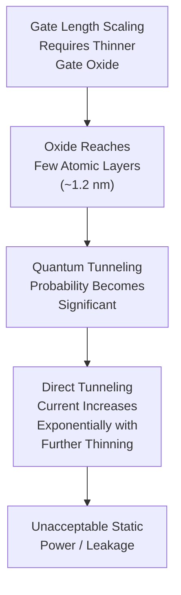
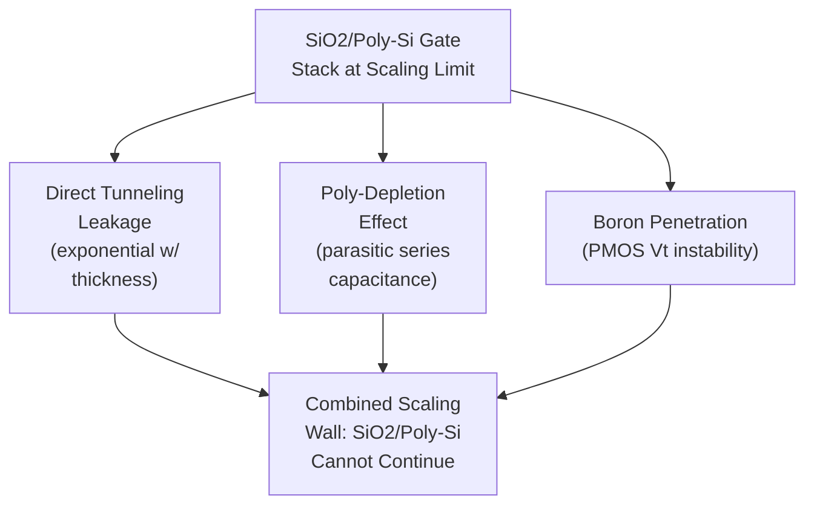

## Gate Oxide Scaling Limits and Leakage

### Overview

Gate oxide scaling limits and the resulting leakage current problem represent the fundamental physical constraint that ended silicon dioxide's decades-long role as the universal MOSFET gate dielectric and directly motivated the industry-wide transition to high-k gate dielectrics. Understanding why $SiO_2$ scaling failed — mechanistically, quantitatively, and in terms of its downstream circuit-level consequences — provides the physical justification for the high-k/metal-gate integration sequence covered in gate stack formation modules.

### Why Gate Oxide Must Scale With Gate Length

MOSFET scaling theory (historically formalized through Dennard scaling principles) requires that as gate length ($L_g$) shrinks, gate oxide thickness ($t_{ox}$) must shrink proportionally to maintain adequate electrostatic control of the channel by the gate electrode. This relationship exists because:

- **Gate capacitive coupling to the channel** must remain strong relative to the drain's capacitive coupling to the channel, or else the drain terminal increasingly influences channel potential independently of the gate — the mechanism underlying short-channel effects such as drain-induced barrier lowering (DIBL)
- Gate oxide capacitance per unit area scales inversely with thickness:

$$C_{ox} = \frac{\varepsilon_{SiO_2} \varepsilon_0}{t_{ox}}$$

- Thinner oxide → higher $C_{ox}$ → stronger gate control → better short-channel effect suppression at a given gate length

This created a direct, historically unavoidable coupling: continued transistor scaling to smaller gate lengths *required* continued gate oxide thinning, generation after generation, following the industry's broader scaling roadmap.

### The Scaling Trajectory and Where It Broke Down

Gate oxide thickness scaled from tens of nanometers in early CMOS generations down to approximately 1.2–1.5 nm by the 90–65 nm technology nodes — at this point, the oxide was only a handful of atomic layers thick (silicon dioxide's unit cell dimension is roughly 0.3–0.5 nm, meaning a 1.2 nm oxide is only about 3–4 atomic layers). At this scale, the oxide could no longer be treated as a classical insulating barrier; quantum mechanical effects began to dominate its electrical behavior.

### Direct Tunneling: The Physical Mechanism

**Quantum mechanical tunneling** occurs when an electron (or hole) has a non-zero probability of passing through a potential energy barrier even when its energy is insufficient to classically surmount that barrier — a direct consequence of the electron's wave-like nature in quantum mechanics. For a sufficiently thin gate oxide, electrons in the gate electrode (or channel) have a significant probability of tunneling directly through the entire oxide thickness to the opposite side, constituting a **direct tunneling current** that flows even under normal (non-destructive) operating gate bias.

Tunneling probability depends exponentially on barrier thickness and barrier height:

$$J_{tunnel} \propto \exp\left(-\frac{2t_{ox}\sqrt{2m^*\phi_B}}{\hbar}\right)$$

Where $t_{ox}$ is oxide thickness, $\phi_B$ is the tunneling barrier height (related to the conduction/valence band offset between silicon and $SiO_2$), $m^*$ is the effective tunneling mass, and $\hbar$ is the reduced Planck constant. The exponential dependence on thickness is the critical feature: even a small reduction in oxide thickness at these already-thin dimensions produces a disproportionately large increase in tunneling current — this is precisely why gate leakage became an increasingly severe problem with each successive thinning step, rather than scaling gradually.

**[Inference]** The exact numerical tunneling current values at a given oxide thickness depend on additional factors (interface trap density, oxide composition uniformity, gate bias polarity and magnitude, temperature) beyond the simplified exponential relationship shown above; the equation captures the qualitative physical mechanism and its steep thickness dependence rather than serving as a precise predictive formula for any specific process.

### Tunneling Mechanism Types

**Direct Tunneling**

Dominant mechanism for very thin oxides (below approximately 3–4 nm) under normal operating bias: carriers tunnel directly through the *entire* trapezoidal potential barrier from one electrode to the other in a single quantum-mechanical event, without requiring an intermediate energy state within the oxide.

**Fowler-Nordheim (F-N) Tunneling**

Dominant mechanism for thicker oxides under high applied electric field: at sufficiently high gate bias, the effective barrier shape becomes triangular (rather than trapezoidal) because the applied field lowers the effective barrier height/width near the injecting electrode, allowing carriers to tunnel through only a portion of the barrier before reaching the oxide conduction band, then travel through the remaining oxide via normal (classical) conduction. F-N tunneling is the traditional mechanism of concern in older, thicker-oxide technology generations and remains relevant for high-field stress/reliability testing (e.g., time-dependent dielectric breakdown characterization) even in modern high-k stacks.

The transition from F-N-dominated to direct-tunneling-dominated leakage as oxide thickness scaled below a few nanometers represents the key inflection point where gate leakage evolved from a reliability/stress-testing concern (F-N tunneling under elevated field) into a normal-operation, always-present static power concern (direct tunneling under nominal bias).

### Circuit-Level Consequences of Gate Leakage

**Static (Standby) Power Increase**

Direct tunneling current flows continuously whenever the gate is biased, regardless of whether the transistor is actively switching, contributing directly to static power dissipation. As the number of transistors per chip increased with continued scaling (following the broader industry scaling trend), even a modest per-transistor leakage current, multiplied across billions of transistors, became a first-order contributor to total chip power consumption and thermal budget — a critical concern for both high-performance and, especially, battery-powered/mobile applications.

**Total Chip Leakage Power Trend**

As gate oxide thickness approached the tunneling-dominated regime, static leakage power began increasing disproportionately relative to historical scaling trends, threatening to offset or even reverse the power efficiency gains that scaling had traditionally provided (since dynamic switching power scales favorably with reduced voltage and capacitance, but static tunneling leakage does not follow the same favorable scaling relationship once tunneling dominates).

**Reliability Implications**

Beyond static power, thin-oxide direct tunneling current contributes to gate oxide degradation mechanisms over device lifetime (trap generation from repeated carrier tunneling events), interacting with — though mechanistically distinct from — the high-field-driven time-dependent dielectric breakdown (TDDB) processes traditionally associated with F-N tunneling stress.

### Poly-Depletion: A Compounding Effect

Independent of the tunneling leakage mechanism itself, the polysilicon gate electrode used with $SiO_2$ gate dielectrics suffers from **poly-depletion**: at typical operating gate bias, a thin depletion region can form within the polysilicon itself near the gate-oxide interface (since polysilicon, despite heavy doping, is not a perfect metal and can support a depletion region under certain bias conditions). This depletion region behaves as an additional series capacitance:

$$\frac{1}{C_{total}} = \frac{1}{C_{ox}} + \frac{1}{C_{poly-depletion}}$$

effectively increasing the electrical (though not physical) oxide thickness as perceived by the gate control mechanism — compounding the difficulty of maintaining adequate gate control as physical oxide thickness continued shrinking, since a portion of the intended capacitive benefit of oxide thinning was being lost to this parasitic series capacitance effect.

### Boron Penetration: A PMOS-Specific Compounding Effect

In PMOS transistors using p+-doped polysilicon gates (as required in a dual-poly-gate CMOS scheme for correct work function/threshold voltage), boron dopant atoms can diffuse through a sufficiently thin gate oxide during high-temperature thermal processing steps (particularly source/drain activation annealing), penetrating into the underlying channel region. This boron penetration causes threshold voltage instability and shift, an effect that becomes increasingly significant as gate oxide thickness shrinks (thinner oxide provides less diffusion barrier resistance) — compounding, alongside tunneling leakage and poly-depletion, the overall case against continued pure $SiO_2$/poly-Si scaling.

### The High-k Solution: Physical Thickness vs. Electrical Thickness

High-k dielectrics resolve the tunneling leakage problem by decoupling **physical thickness** from **electrical (capacitive) thickness**. Since gate capacitance depends on dielectric constant divided by physical thickness:

$$C_{ox} = \frac{\kappa \varepsilon_0}{t_{physical}}$$

a material with dielectric constant $\kappa$ several times higher than $SiO_2$'s $\kappa \approx 3.9$ can achieve the **same capacitance** (and thus equivalent gate control) using a **physically thicker** film. This is quantified via **Equivalent Oxide Thickness (EOT)**:

$$EOT = t_{high-k} \times \frac{\kappa_{SiO_2}}{\kappa_{high-k}}$$

Because tunneling current depends exponentially on *physical* barrier thickness (not electrical/capacitive thickness), a high-k film with the same EOT as a scaled-limit $SiO_2$ film — but several times the physical thickness — exhibits dramatically reduced direct tunneling current, since the exponential suppression from increased physical thickness far outweighs any change in the effective barrier height between materials.

$$EOT_{high-k} = EOT_{SiO_2, limit} \quad \text{but} \quad t_{physical, high-k} \gg t_{physical, SiO_2, limit}$$

This EOT/physical-thickness decoupling is the single most important conceptual insight explaining why high-k dielectrics solved the gate leakage crisis, and it directly motivated hafnium-based high-k materials ($HfO_2$, $HfSiO_x$) becoming the industry-standard gate dielectric, as covered in gate stack formation.

### Illustrative Schematic: Tunneling Current vs. Oxide Thickness (svg_diagram)

<svg xmlns="http://www.w3.org/2000/svg" viewBox="0 0 700 320">
<text x="350" y="24" text-anchor="middle" font-size="16" font-weight="bold" fill="#222">Gate Leakage Current vs. Oxide Thickness (svg_diagram)</text>

<line x1="80" y1="270" x2="650" y2="270" stroke="#333" stroke-width="1.5" />
<line x1="80" y1="270" x2="80" y2="50" stroke="#333" stroke-width="1.5" />
<text x="365" y="300" text-anchor="middle" font-size="11" fill="#222">Oxide Thickness (decreasing -&gt;)</text>
<text x="40" y="160" text-anchor="middle" font-size="11" fill="#222" transform="rotate(-90 40 160)">Gate Leakage (log scale)</text>

<path d="M 620 260 C 550 255, 480 240, 420 210 C 360 180, 320 140, 280 100 C 250 75, 220 58, 190 50" fill="none" stroke="`#c0392b`" stroke-width="2.5" />

<line x1="500" y1="270" x2="500" y2="50" stroke="#999" stroke-dasharray="4,3" />
<text x="560" y="60" text-anchor="middle" font-size="9" fill="#555">Thick oxide:</text>
<text x="560" y="72" text-anchor="middle" font-size="9" fill="#555">F-N tunneling</text>
<text x="560" y="84" text-anchor="middle" font-size="9" fill="#555">(high field only)</text>

<text x="350" y="60" text-anchor="middle" font-size="9" fill="#555">Direct tunneling</text>

<text x="350" y="72" text-anchor="middle" font-size="9" fill="#555">regime begins</text>

<circle cx="220" cy="70" r="4" fill="#c0392b" />
<text x="220" y="95" text-anchor="middle" font-size="9" fill="#c0392b">~1.2nm SiO2:</text>
<text x="220" y="107" text-anchor="middle" font-size="9" fill="#c0392b">scaling limit</text>

<circle cx="420" cy="210" r="4" fill="#27ae60" />
<text x="420" y="235" text-anchor="middle" font-size="9" fill="#27ae60">High-k, same EOT:</text>
<text x="420" y="247" text-anchor="middle" font-size="9" fill="#27ae60">thicker, lower leakage</text>
</svg>

### Quantitative Historical Reference Points

**[Unverified]** Widely cited industry figures (e.g., from ITRS roadmap documentation and academic literature of the period) indicate gate oxide thickness reached approximately 1.2 nm at the 90 nm node and continued thinning trends were projected to become impractical due to tunneling leakage by the 65 nm node and beyond; these specific historical figures are commonly referenced in device physics literature but should be treated as representative industry benchmarks from that era rather than precisely verified values for any single foundry's specific process.

### Alternative/Interim Mitigation Approaches (Historical Context)

Before full high-k/metal-gate adoption, several interim approaches were explored or used to partially extend $SiO_2$-based scaling:

- **Nitrided oxide ($SiON$)**: Incorporating nitrogen into the gate oxide modestly increases the effective dielectric constant (nitrogen has a higher polarizability contribution than pure oxygen bonding) while also providing some boron penetration resistance, extending $SiO_2$-based scaling by roughly one to two additional technology generations before the fundamental tunneling limit was reached again at the further-thinned nitrided oxide thickness.
- **[Inference]** Nitrided oxide is best understood as a stopgap measure that delayed, rather than solved, the fundamental tunneling scaling limit, since its dielectric constant improvement over pure $SiO_2$ is modest compared to the several-fold increase provided by true high-k materials such as $HfO_2$.

### Why the High-k Transition Was Necessary Rather Than Optional

The convergence of direct tunneling leakage, poly-depletion, and boron penetration effects at the sub-2nm $SiO_2$ thickness regime represented a combined physical barrier that could not be resolved through incremental process refinement of the existing $SiO_2$/polysilicon material system. This is why the industry-wide transition to high-k dielectrics paired with metal gate electrodes (eliminating poly-depletion) — rather than continued incremental $SiO_2$ scaling — became necessary at approximately the 45nm technology node and beyond, establishing the high-k/metal-gate integration sequence (gate-first and gate-last approaches) as the standard path for continued CMOS scaling from that point forward.

**Next Steps**

- High-k dielectric materials and ALD deposition (HfO2, interfacial layer engineering)
- Replacement Metal Gate (RMG) integration sequence
- Work function engineering for NMOS/PMOS threshold voltage control
- Fermi-level pinning in high-k/metal-gate interfaces
- Time-dependent dielectric breakdown (TDDB) and gate oxide reliability
- Equivalent Oxide Thickness (EOT) scaling roadmap and metrology (C-V extraction)