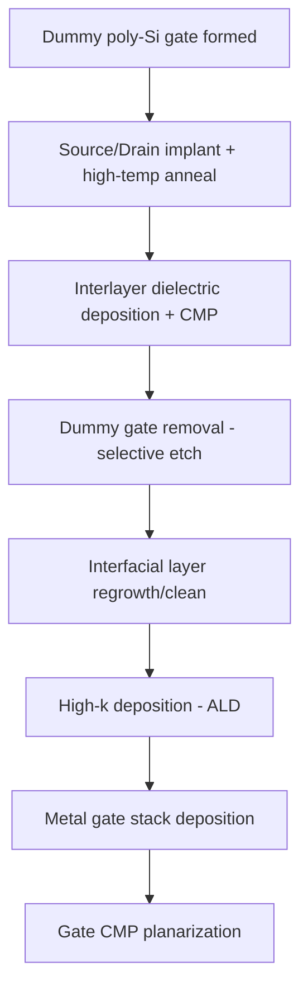

## High-k Dielectric Materials

### Overview

High-k dielectric materials are insulating compounds with a relative permittivity (dielectric constant, $k$) substantially greater than that of silicon dioxide ($k \approx 3.9$), used to replace $SiO_2$ as the gate insulator in advanced MOSFETs. Their adoption addresses the fundamental scaling limit reached when $SiO_2$ gate oxides became too thin (below approximately 1.2 nm) to suppress quantum-mechanical tunneling current while maintaining adequate capacitance density.

### Motivation for High-k Adoption

**Key Points**

- Gate capacitance scales as $C = \dfrac{k \varepsilon_0 A}{t}$, where $t$ is the physical thickness of the dielectric.
- To maintain drive current and short-channel control as transistors scaled, $C$ had to increase, historically achieved by thinning $SiO_2$.
- Below ~1.2 nm physical thickness, direct tunneling current through $SiO_2$ rises exponentially, causing unacceptable static power dissipation and reliability degradation.
- A high-k material allows a physically thicker film to deliver the same (or greater) capacitance as a thin $SiO_2$ film, suppressing tunneling while preserving electrostatic control.

### Equivalent Oxide Thickness (EOT)

EOT is the standard metric for comparing high-k dielectrics to $SiO_2$ on an equal-capacitance basis:

$$EOT = t_{high-k} \times \frac{k_{SiO_2}}{k_{high-k}}$$

**Example**

A hafnium oxide ($HfO_2$, $k \approx 20$) film with physical thickness $t_{high-k} = 4\ nm$ has:

$$EOT = 4\ nm \times \frac{3.9}{20} = 0.78\ nm$$

This delivers the capacitance equivalent of a 0.78 nm $SiO_2$ layer while being physically over 5× thicker, drastically reducing direct tunneling leakage.

In practice, an interfacial layer (IL) of $SiO_2$ or $SiON$ (typically 0.5–1 nm) remains between the high-k film and the silicon channel to preserve interface quality, so total EOT is:

$$EOT_{total} = EOT_{high-k} + EOT_{IL}$$

### Material Candidates and Selection Criteria

**Key Points**

- Candidates were screened against several simultaneous requirements: sufficiently high $k$, large bandgap, adequate conduction/valence band offsets with silicon, thermodynamic stability in contact with Si, low interface trap density, and process compatibility.
- A general (though imperfect) inverse trend exists between $k$ value and bandgap: higher-$k$ materials tend to have smaller bandgaps, which increases leakage via Schottky emission and reduces band offsets.

| Material | Dielectric Constant ($k$) | Bandgap (eV) | Notes |
| --- | --- | --- | --- |
| $SiO_2$ | 3.9 | 8.9 | Baseline reference |
| $Si_3N_4$ | 7 | 5.1 | Early high-k, limited improvement |
| $Al_2O_3$ | 9 | 8.7 | Good bandgap, moderate $k$, amorphous stability |
| $Y_2O_3$ | 15 | 5.6 | Less commonly adopted |
| $HfO_2$ | ~20–25 | 5.7–5.8 | Industry-standard choice since 45 nm node |
| $ZrO_2$ | ~25 | 5.8 | Similar to $HfO_2$, less thermally stable on Si |
| $La_2O_3$ | ~27 | 4.3 | High $k$ but hygroscopic, reactivity issues |
| $TiO_2$ | ~80 | 3.5 | Very high $k$ but bandgap too small for practical leakage suppression |
| $Ta_2O_5$ | ~25 | 4.4 | Used historically in DRAM capacitors |

$HfO_2$ and its silicate/nitrided derivatives ($HfSiO_x$, $HfSiON$, $HfON$) became the industry-standard choice because they offer the best practical balance: [Inference] the combination of moderate-to-high $k$ (~20–25), a bandgap (~5.7 eV) large enough to maintain workable band offsets with silicon (~1.5 eV conduction band offset, ~3.4 eV valence band offset), and reasonable thermodynamic stability against silicon at typical processing temperatures made it the most manufacturable option among the candidates evaluated industry-wide.

### Band Offset Requirements

For a dielectric to suppress both electron and hole tunneling/injection, it must have sufficient conduction band offset (CBO) and valence band offset (VBO) relative to the silicon channel — generally targeted at greater than 1 eV for each to keep Schottky emission leakage low.

(svg_diagram)

<svg xmlns="http://www.w3.org/2000/svg" viewBox="0 0 640 320">

<title>Band Alignment: Si / High-k / Metal Gate (svg_diagram)</title>
<rect width="640" height="320" fill="#ffffff" />

<line x1="80" y1="80" x2="200" y2="80" stroke="#1a1a1a" stroke-width="2" />
<line x1="80" y1="220" x2="200" y2="220" stroke="#1a1a1a" stroke-width="2" />
<text x="90" y="70" font-size="12" fill="#1a1a1a">Si Ec</text>
<text x="90" y="240" font-size="12" fill="#1a1a1a">Si Ev</text>

<line x1="200" y1="40" x2="400" y2="40" stroke="#2060c0" stroke-width="2" />
<line x1="200" y1="270" x2="400" y2="270" stroke="#2060c0" stroke-width="2" />
<text x="250" y="30" font-size="12" fill="#2060c0">High-k Ec</text>
<text x="250" y="290" font-size="12" fill="#2060c0">High-k Ev</text>

<line x1="160" y1="80" x2="160" y2="40" stroke="#c02020" stroke-width="1.5" marker-end="url(#arrow)" />
<text x="165" y="60" font-size="11" fill="#c02020">CBO ~1.5 eV</text>
<line x1="160" y1="220" x2="160" y2="270" stroke="#c02020" stroke-width="1.5" marker-end="url(#arrow)" />
<text x="165" y="255" font-size="11" fill="#c02020">VBO ~3.4 eV</text>

<line x1="400" y1="130" x2="520" y2="130" stroke="#208020" stroke-width="2" />
<text x="410" y="120" font-size="12" fill="#208020">Metal Gate Ef</text>

<line x1="200" y1="80" x2="200" y2="40" stroke="#2060c0" stroke-width="2" />
<line x1="200" y1="220" x2="200" y2="270" stroke="#2060c0" stroke-width="2" />
<line x1="400" y1="40" x2="400" y2="130" stroke="#2060c0" stroke-width="2" />
<line x1="400" y1="270" x2="400" y2="130" stroke="#2060c0" stroke-width="2" />
</svg>

### Process Integration Approaches

**Gate-First Integration**

- High-k deposited directly on the silicon channel (after IL formation), followed by polysilicon or metal gate deposition, then source/drain activation anneal (~1000°C).
- Challenge: high-temperature anneal causes Fermi-level pinning and threshold voltage instability at the high-k/metal-gate interface, along with mobility degradation from remote phonon scattering and charge trapping.

**Gate-Last (Replacement Metal Gate, RMG) Integration**

- A sacrificial (dummy) polysilicon gate is used through the high-temperature source/drain anneal steps.
- The dummy gate is removed, and high-k and metal gate are deposited afterward at lower thermal budget.
- This became the dominant approach from the 45/32 nm nodes onward (e.g., Intel's High-k Metal Gate process) because it avoids exposing the high-k/metal stack to peak anneal temperatures, mitigating $V_t$ instability and improving mobility.

### Deposition Techniques

**Atomic Layer Deposition (ALD)** is the dominant method for high-k gate dielectrics due to its self-limiting, sequential surface reaction mechanism, which yields:

- Angstrom-level thickness control
- Excellent conformality on high-aspect-ratio 3D structures (FinFETs, gate-all-around devices)
- Low defect density and uniform film composition across large wafers

A typical ALD cycle for $HfO_2$ alternates:

1. Precursor pulse (e.g., $HfCl_4$ or tetrakis(ethylmethylamino)hafnium, TEMAH)
2. Purge (inert gas, removes unreacted precursor/byproducts)
3. Oxidant pulse (e.g., $H_2O$ or $O_3$)
4. Purge

Each cycle deposits approximately one monolayer, and cycle count directly controls final film thickness — critical for EOT targeting at sub-nanometer precision.

### Key Material Challenges

**Fixed Charge and Interface Traps**

High-k/silicon interfaces exhibit higher densities of fixed oxide charge ($Q_f$) and interface trap density ($D_{it}$) compared to thermally grown $SiO_2$, degrading channel mobility and causing threshold voltage shifts. [Inference] This is generally attributed to oxygen vacancies and under-coordinated bonding at the high-k/Si or high-k/IL interface, though exact trap physics vary by material system and process.

**Fermi-Level Pinning**

In gate-first integration, polysilicon deposited on high-k dielectrics causes the effective work function to shift toward the silicon band edges regardless of the poly-Si doping, compressing the achievable $V_t$ range. This effect is substantially reduced in gate-last/RMG flows.

**Remote Phonon Scattering**

The polar optical phonons of high-k materials couple electrostatically to channel carriers, an additional scattering mechanism absent in $SiO_2$-based channels, contributing to mobility degradation. This effect is mitigated by using a thin $SiO_2$/$SiON$ interfacial layer to screen the channel from the high-k film.

**Crystallization**

Many high-k oxides (notably $HfO_2$, $ZrO_2$) crystallize at typical anneal temperatures (~500–700°C), forming grain boundaries that act as leakage paths. Doping with silicon (forming $HfSiO_x$) or nitrogen (forming $HfSiON$) raises the crystallization temperature and stabilizes the amorphous phase, at some cost to $k$ value.

### Reliability Considerations

**Key Points**

- Bias Temperature Instability (BTI): high-k films tend to show increased Negative BTI (NBTI) and Positive BTI (PBTI) compared to $SiO_2$, driven by charge trapping in the bulk high-k film.
- Time-Dependent Dielectric Breakdown (TDDB): high-k stacks generally show different breakdown kinetics than $SiO_2$; [Unverified] specific breakdown voltage and lifetime figures are highly process- and vendor-dependent and require characterization on the specific integrated stack.
- Behavior described here reflects generally reported trends in the literature; production reliability data depends on the specific fab process, film stoichiometry, and post-deposition anneal conditions.

### Industry Evolution

$HfO_2$-based high-k dielectrics, paired with metal gates, were first introduced in volume manufacturing at the 45 nm logic node (2007), replacing the $SiO_2$/polysilicon gate stack that had been used since the inception of CMOS scaling. Subsequent nodes refined the interfacial layer scaling, high-k doping (La-doped for NMOS $V_t$ tuning, Al-doped for PMOS $V_t$ tuning), and transitioned from planar to FinFET and gate-all-around geometries, where ALD conformality became essential to depositing uniform high-k films around 3D fin or nanosheet channels.

**Next Steps**

- Metal gate work function engineering (N-metal/P-metal stacks)
- Interfacial layer scaling and engineering (SiO2 vs. SiON IL)
- FinFET and gate-all-around high-k conformality challenges
- Threshold voltage tuning via capping layers (La2O3, Al2O3 dipole layers)
- Bias temperature instability (BTI) mechanisms in high-k stacks
- ALD process chemistry and precursor selection for HfO2/ZrO2
- Remote phonon scattering and channel mobility modeling