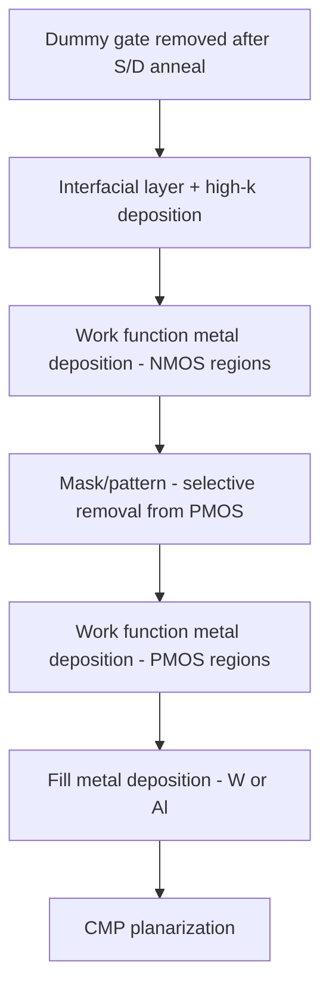

## Metal Gate Work Function Engineering

### Overview

Metal gate work function engineering is the set of material and process techniques used to set the effective work function (EWF) of a MOSFET's gate electrode to achieve the target threshold voltage ($V_t$) for NMOS and PMOS devices independently, replacing the doped-polysilicon gate approach that became inadequate at scaled nodes.

### Motivation

**Key Points**

- Threshold voltage depends on the work function difference between the gate electrode and the channel: $V_t \propto \Phi_M - \Phi_S$, where $\Phi_M$ is the gate metal (or poly) work function and $\Phi_S$ is the semiconductor work function.
- Doped polysilicon gates suffer from **poly depletion effect**: under gate bias, a depletion region forms at the poly/dielectric interface, adding an effective series capacitance that reduces the inversion charge and degrades drive current.
- Poly gates also exhibit **boron penetration** (in PMOS) through thin gate oxides during activation anneal, causing $V_t$ shifts and reliability degradation.
- When combined with high-k dielectrics, polysilicon gates cause **Fermi-level pinning**, compressing the achievable work function range and making dual-$V_t$ CMOS design difficult.
- Metal gates eliminate depletion (metals have effectively infinite carrier density) and, when paired appropriately with high-k dielectrics, avoid pinning effects.

### Work Function Targets

For a conventional bulk or partially-depleted CMOS process, ideal gate work functions align near the silicon band edges:

| Device Type | Target EWF | Reference |
| --- | --- | --- |
| NMOS | ~4.05–4.3 eV | Near Si conduction band edge |
| PMOS | ~4.9–5.2 eV | Near Si valence band edge |

$$\Phi_{Si,midgap} \approx 4.6\ eV$$

The separation between the NMOS and PMOS target work functions (the "work function split") must be roughly equal to the silicon bandgap (~1.1 eV) to achieve symmetric, low $V_t$ for both device types without excessive channel doping.

### Dual Metal Gate Integration Schemes

Because a single metal cannot satisfy both NMOS and PMOS work function targets, dual-metal-gate integration is required.

**Gate-First Dual Metal**

- Separate N-metal and P-metal films deposited and patterned before high-temperature anneal.
- Requires selective removal/masking of one metal from the opposite device region, which is process-intensive and prone to residue/damage issues.
- Metals must survive the full thermal budget (~1000°C activation anneal), which restricts material choice and often causes work function drift ("Fermi-level pinning" toward midgap after anneal).

**Gate-Last (Replacement Metal Gate, RMG)**

- Dummy poly-Si gate used through S/D anneal; removed afterward, then high-k and metal stack deposited at low thermal budget.
- Allows use of work-function metals that would not survive high-temperature processing.
- Dominant approach since 45/32 nm nodes; enables precise, thermally-stable work function tuning.

### Work Function Metal Materials

**N-type Work Function Metals**

- $TiAl$, $TiAlN$, $TiAlC$: aluminum incorporation lowers the effective work function toward the conduction band; increasing Al content decreases EWF.
- $HfAl$, $TaAlC$: used in some process generations for lower EWF and thermal stability.
- $La_2O_3$ capping layers: a thin lanthanum oxide dipole layer inserted at the high-k/metal interface shifts EWF toward the conduction band edge via interfacial dipole formation, used for NMOS $V_t$ tuning without changing the bulk metal.

**P-type Work Function Metals**

- $TiN$: near mid-to-high work function (~4.6–5.0 eV depending on deposition conditions, stoichiometry, and film density), a common baseline P-metal or capping layer.
- $TaN$: work function near midgap to slightly P-side, used in some early gate-last schemes.
- $Al_2O_3$ capping layers: inserted at the high-k/metal interface to shift EWF toward the valence band via dipole formation, used for PMOS $V_t$ tuning.
- $W$, $Ru$, $MoOx$: explored for higher work function targets, particularly for advanced nodes seeking wider $V_t$ range.

**Key Points**

- [Inference] Effective work function in these stacks is not simply the bulk metal's vacuum work function; it results from a combination of the bulk metal, interfacial dipole formation at the high-k boundary, oxygen vacancy density, and any capping layer used — so measured EWF values vary meaningfully across specific process integrations and cannot be treated as fixed material constants.

### Dipole Engineering (Cap-Layer Approach)

A widely used technique avoids depositing/patterning two distinct bulk metals by instead using a **single** metal gate (e.g., $TiN$) combined with thin dipole-inducing capping layers inserted between the high-k and the metal:

1. Deposit high-k dielectric ($HfO_2$).
2. Deposit thin dipole cap layer: $La_2O_3$ (NMOS regions) or $Al_2O_3$ (PMOS regions), patterned selectively.
3. Anneal to drive dipole formation at the high-k interface (cap layer intermixes/diffuses into the high-k film).
4. Strip remaining cap layer (optional, depending on process).
5. Deposit common metal gate electrode ($TiN$) over both regions.

This reduces process complexity (fewer masking/etch steps for bulk metal patterning) while achieving the required work function split through interfacial dipoles rather than distinct bulk metal work functions.

(svg_diagram)

<svg xmlns="http://www.w3.org/2000/svg" viewBox="0 0 640 300">

<title>Dipole Capping Layer Work Function Tuning (svg_diagram)</title>
<rect width="640" height="300" fill="#ffffff" />

<rect x="60" y="180" width="200" height="20" fill="#d0d0d0" stroke="#333" />
<text x="100" y="215" font-size="12" fill="#333">Si Channel (NMOS)</text>
<rect x="60" y="160" width="200" height="20" fill="#a0c8f0" stroke="#333" />
<text x="80" y="155" font-size="11" fill="#2060c0">Interfacial Layer</text>
<rect x="60" y="140" width="200" height="20" fill="#6090d0" stroke="#333" />
<text x="90" y="135" font-size="11" fill="#2060c0">HfO2</text>
<rect x="60" y="125" width="200" height="15" fill="#f0a020" stroke="#333" />
<text x="65" y="122" font-size="10" fill="#a05000">La2O3 dipole cap</text>
<rect x="60" y="95" width="200" height="30" fill="#909090" stroke="#333" />
<text x="100" y="115" font-size="11" fill="#ffffff">TiN gate</text>

<rect x="380" y="180" width="200" height="20" fill="#d0d0d0" stroke="#333" />
<text x="420" y="215" font-size="12" fill="#333">Si Channel (PMOS)</text>
<rect x="380" y="160" width="200" height="20" fill="#a0c8f0" stroke="#333" />
<text x="400" y="155" font-size="11" fill="#2060c0">Interfacial Layer</text>
<rect x="380" y="140" width="200" height="20" fill="#6090d0" stroke="#333" />
<text x="410" y="135" font-size="11" fill="#2060c0">HfO2</text>
<rect x="380" y="125" width="200" height="15" fill="#40a040" stroke="#333" />
<text x="385" y="122" font-size="10" fill="#206020">Al2O3 dipole cap</text>
<rect x="380" y="95" width="200" height="30" fill="#909090" stroke="#333" />
<text x="420" y="115" font-size="11" fill="#ffffff">TiN gate</text>

<text x="60" y="250" font-size="12" fill="#333">EWF shifts toward Ec (lower)</text>

<text x="380" y="250" font-size="12" fill="#333">EWF shifts toward Ev (higher)</text>

</svg>

### Deposition Techniques

- **Physical Vapor Deposition (PVD/sputtering)**: historically used for bulk metal fill and some work-function metal layers; limited conformality on high-aspect-ratio 3D structures.
- **Atomic Layer Deposition (ALD)**: preferred for thin work-function metal and dipole cap layers in FinFET/GAA processes due to superior conformality and thickness control on 3D fin/nanosheet sidewalls.
- **Chemical Vapor Deposition (CVD)**: used for certain fill metals (e.g., $W$ CVD fill after work-function metal deposition) due to good gap-fill in high-aspect-ratio trench gates.

### Threshold Voltage Tuning Mechanisms

**Key Points**

- **Metal selection**: choice of bulk work-function metal sets baseline EWF.
- **Metal thickness**: EWF of very thin metal films (a few nm) can differ from bulk value due to incomplete screening of the underlying dielectric — thinner films often show EWF shifted toward the underlying high-k/dipole layer's influence. [Inference] This thickness-dependent EWF behavior is generally attributed to incomplete electronic screening at sub-critical-thickness films, though the exact threshold thickness is material- and stack-dependent.
- **Multi-$V_t$ schemes**: many process nodes offer multiple $V_t$ flavors (e.g., low-$V_t$, standard-$V_t$, high-$V_t$) achieved via different combinations of dipole cap layers, channel doping, and metal stack thickness variations within the same technology.
- **Channel/well doping**: in older/bulk nodes, channel implants supplemented metal gate work function tuning; in fully-depleted and FinFET/GAA devices, doping-based $V_t$ tuning is minimized in favor of gate-stack (work-function) tuning to avoid random dopant fluctuation (RDF) variability.

### Integration Challenges

**Fermi-Level Pinning**

Even with metal gates, incomplete dipole formation or interfacial reactions between the metal and high-k can pin the EWF away from the intended target, compressing the achievable $V_t$ range — a key reason gate-last integration (lower thermal budget) improved work function fidelity relative to gate-first.

**Work Function Roll-Off in 3D Structures**

In FinFET and gate-all-around transistors, work-function metal thickness is constrained by the narrow fin pitch/inter-sheet spacing, since multiple metal layers (liner, work-function metal, fill metal) must fit within a limited lateral gate trench width. This has driven adoption of thinner ALD work-function films and, at advanced nodes, single work-function metal with dipole-layer $V_t$ tuning to reduce the number of distinct metal layers needed.

**Metal Gate Patterning**

Selective removal of work-function metal from one device type without damaging the underlying high-k or channel requires highly selective wet or dry etch processes; residual metal or dielectric damage from patterning is a known yield-limiting mechanism.

### Reliability Considerations

- Work function metal stacks interact with high-k bulk trap density to influence **Bias Temperature Instability (BTI)** behavior; NBTI in PMOS and PBTI in NMOS devices are both influenced by the specific metal/high-k interface chemistry.
- [Unverified] Quantitative BTI degradation rates are highly dependent on the specific fab's metal stack composition, deposition conditions, and anneal recipe, and should be characterized empirically for a given process rather than assumed from generalized literature values.

**Next Steps**

- Dipole formation mechanisms and interfacial layer chemistry
- Multi-Vt process integration schemes (LVT/SVT/HVT)
- FinFET and gate-all-around gate stack constraints (metal fill in narrow trenches)
- ALD process development for thin work-function metal films
- Random dopant fluctuation vs. work-function-based Vt tuning
- Gate stack reliability: NBTI/PBTI in metal/high-k systems